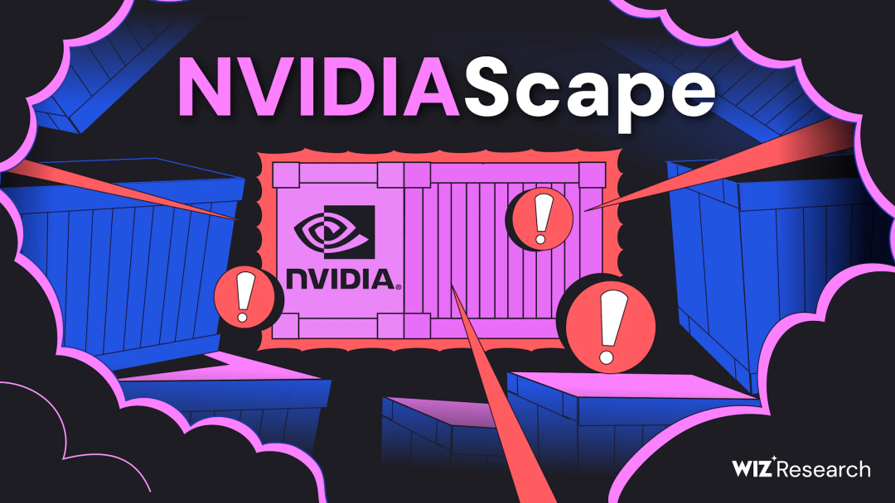
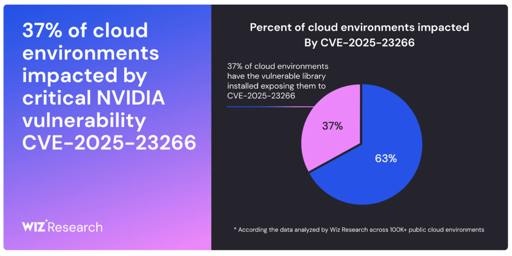
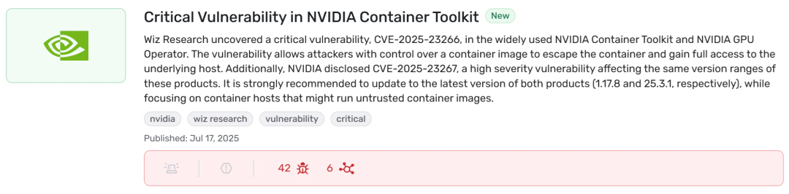
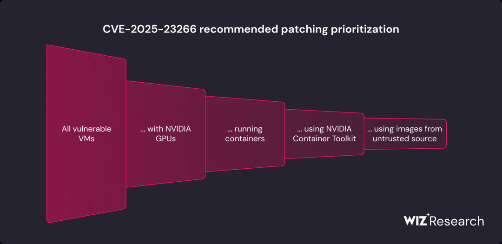
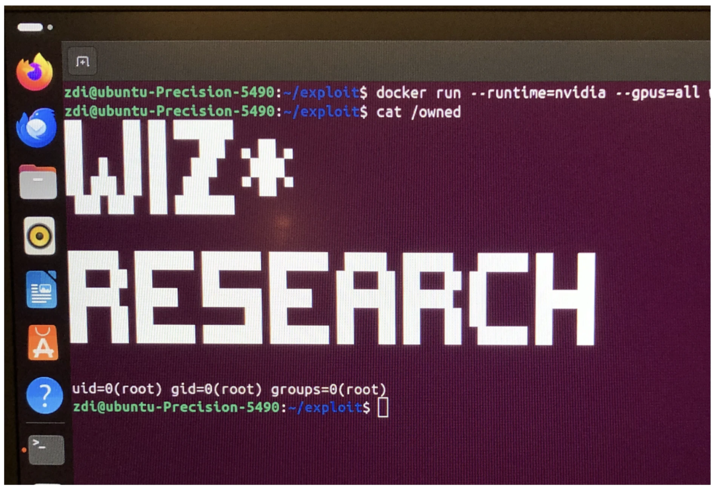

# 【翻译】严重 NVIDIA AI 漏洞：NVIDIA 容器工具包中的三行容器逃逸 (CVE-2025-23266)

<!-- vulwiki-editorial:start -->
## 校订与适用边界

### 本次正文校订

- 移除 6 组不含任何正文的空代码围栏；保留全部非空代码。

### 尚未解决的证据缺口

以下限制仍适用于后文历史材料；相关版本、结果或修复结论不能据此视为已验证：

- 六处关键代码围栏为空，包含缓解命令和三行Dockerfile，属抽取缺失
- 仅引用名称缺Wiz原文/NVIDIA公告/OCI规范链接
- GPU Operator被翻译成操作员
- 1.17.7影响与1.17.8修复及CDI条件未结构化
- 0132属背景不是主漏洞
- 继承环境变量是否OCI必然属性需核验不可从引文直接推定
- Wiz查询残缺，不可复制

本页为文本校订，未执行代码、PoC 或目标请求；原图仅保留引用，未据此确认复现成功。
<!-- vulwiki-editorial:end -->

## 技术正文与历史材料

Wiz Research  安全视安   2025-07-19 16:53  
  
**声明**  
**：该公众号分享的安全工具和项目均来源于网络，仅供安全研究与学习之用，如用于其他用途，由使用者承担全部法律及连带责任，与工具作者和本公众号无关。**  
#   
  
  
# 执行摘要  
  
Wiz Research 在 NVIDIA 容器工具包 (NCT) 中发现了一个严重的容器逃逸漏洞，我们将其命名为  
**#NVIDIAScape**  
。该工具包为云和 SaaS 提供商提供的许多 AI 服务提供支持，该漏洞目前被追踪为  
**CVE-2025-23266 ，**  
  
**CVSS 评分为 9.0（严重） 。该漏洞允许恶意容器绕过隔离措施并获得对主机的完全 root 访问权限。该漏洞源于工具包处理 OCI 钩子时的一个细微配置错误，只需一个极其简单的***  
*三行 Dockerfile**即可利用该漏洞。  
  
由于 NVIDIA Container Toolkit 是所有主要云提供商的许多托管 AI 和 GPU 服务的支柱，因此此漏洞对 AI 生态系统构成了系统性风险，可能使攻击者能够摧毁不同客户之间的壁垒，从而影响数千个组织。  
  
**此漏洞的危险性在托管 AI 云服务**  
中最为严重，这些服务允许客户在共享 GPU 基础架构上运行自己的 AI 容器。在这种情况下，恶意客户可以利用此漏洞运行特制容器，突破其预设边界，并获得对主机的完全 root 控制权。由此，攻击者可以访问、窃取或操纵在同一共享硬件上运行的  
**所有其他客户的敏感数据和专有模型。**  
  
这类漏洞已被证明是整个AI云系统性风险。几个月前，Wiz Research  
就曾演示过  
类似的容器逃逸漏洞如何导致  
  
Replicate和DigitalOcean等主流服务中敏感客户数据的访问。这些根本性问题的反复出现，凸显了在全球竞相采用核心AI基础设施之际，对其安全性进行严格审查的迫切性。  
  
  
  
  
# 缓解措施和建议  
## 受影响的组件：  
- NVIDIA Container Toolkit：所有版本，包括 v1.17.7（CDI 模式仅适用于 1.17.5 之前的版本）   
  
- NVIDIA GPU 操作员：所有版本（包括 25.3.1）   
  
主要建议是按照  
NVIDIA 安全公告  
中的建议  
**升级到最新版本的 NVIDIA Container Toolkit**  
。  
# 使用 Wiz 查找易受攻击的实例  
  
Wiz 客户可以使用  
Wiz Threat Intel Center  
中  
预先构建的查询  
~vulnerabilityExternalId~(equals~(~'CVE-2025-23266)))))来查找其环境中 NVIDIA Container Toolkit 的易受攻击实例。  
  
  
  
 优先级和背景  
  
强烈建议所有运行该工具包易受攻击版本的容器主机都进行修补。由于漏洞利用代码在容器镜像内部传递，我们建议优先考虑那些可能运行基于不受信任或公共镜像构建的容器的主机**。**可以通过运行时验证进一步确定优先级，将修补工作重点放在正在使用易受攻击工具包的实例上。  
  
需要注意的是，互联网暴露与此漏洞的分类无关**。**受影响的主机无需公开暴露。相反，初始访问向量可能包括针对开发人员的社会工程攻击、攻击者事先访问容器镜像存储库的供应链场景，或任何允许用户加载任意镜像的环境。  
  
  
# 技术缓解措施  
  
对于无法立即升级的系统，NVIDIA 提供了几种缓解措施。主要方法是选择不使用  
enable-cuda-compat  
挂钩，因为挂钩是暴露的根源。  
## 对于 NVIDIA 容器运行时  
  
在传统模式下使用 NVIDIA 容器运行时时，您可以通过编辑  
/etc/nvidia-container-toolkit/config.toml  
文件并将  
features.disable-cuda-compat-lib-hook  
标志设置为来禁用该钩子  
true  
：  
  
## 对于 NVIDIA GPU 操作员  
  
使用 NVIDIA GPU Operator 时，可以通过添加  
disable-cuda-compat-lib-hook  
到  
NVIDIA_CONTAINER_TOOLKIT_OPT_IN_FEATURES  
环境变量来禁用该钩子。这可以通过在使用 Helm 安装或升级 GPU Operator 时包含以下参数来实现：  
  
  
注意：任何其他功能标志都应以逗号分隔的列表形式添加到该  
*value*  
字段。  
  
**对于使用 25.3.1 之前版本的 GPU Operator**  
的用户，您可以  
1.17.8  
通过在 Helm 命令中包含以下参数来部署修补后的 NVIDIA Container Toolkit 版本：  
  
  
注意：对于 Red Hat Enterprise Linux 或 Red Hat OpenShift，您必须指定  
*v1.17.8-ubi8*  
标签。  
## 为什么要研究 NVIDIA Container Toolkit？  
  
整个 AI 革命都建立在 NVIDIA GPU 的强大功能之上。在云端，将容器化应用程序安全地连接到这些 GPU 的关键组件是 NVIDIA 容器工具包。  
  
这并非我们首次发现该核心组件的严重漏洞。去年，Wiz Research 披露了  
CVE-2024-0132  
，这是一个类似的容器逃逸漏洞，可导致主机完全接管。这些发现是我们持续研究 AI 供应链安全性的一部分。我们正在调查 AI 堆栈的每一层，从基础设施（  
Hugging Face  
、  
Replicate  
、  
SAP AI Core  
）到模型本身以及用于运行模型的软件（  
Ollama  
），以了解在全球竞相采用这项新技术之际，现实风险。  
## 技术分析  
  
此次容器逃逸的路径并非在于复杂的内存损坏漏洞，而是在于容器规范、受信任的主机组件和经典 Linux 技巧之间的微妙相互作用。理解该漏洞利用需要关注三个关键部分：OCI 钩子机制、NVIDIA 实现中的具体缺陷以及该缺陷的武器化。  
# 了解 OCI Hooks 和 NVIDIA 容器工具包  
  
开放容器倡议 (OCI) 规范定义了容器运行时的标准。该标准的一部分是“钩子”系统，它允许工具在容器生命周期的特定时间点运行脚本。NVIDIA  
**容器工具包 (NCT)**  
使用这些钩子来执行其主要功能：配置容器使其能够与主机的 NVIDIA 驱动程序和 GPU 通信。  
  
当使用 NVIDIA 运行时启动容器时，NCT 会注册几个钩子，包括以下  
createContainer  
钩子：  
  
  
该钩子作为主机上的特权进程运行，为容器设置必要的环境。   
  
OCI 规范定义了不同类型的钩子。虽然  
prestart  
钩子在干净、隔离的上下文中运行，  
createContainer  
但它们有一个关键属性：  
**除非明确配置不继承容器镜像的环境变量，否则它们会从容器镜像中继承环境变量。**  
  
根据  
Github  
上的 OCI 规范：  
  
“…在 Linux 上，这会在  
pivot_root  
操作执行之前但在挂载命名空间创建和设置之后发生。”  
# 利用环境变量  
  
有了控制特权钩子环境的能力，攻击者就有了多种选择。最直接的方法之一是滥用  
LD_PRELOAD  
一个众所周知且功能强大的 Linux 环境变量，  
LD_PRELOAD  
强制进程加载特定的用户定义共享库（  
.so  
文件）。  
  
通过  
LD_PRELOAD  
在 Dockerfile 中设置，攻击者可以指示  
nvidia-ctk  
钩子加载恶意库。更糟糕的是，  
createContainer  
钩子执行时会将其工作目录设置为容器的根文件系统。这意味着攻击者可以通过简单的路径直接从容器镜像加载恶意库，从而完成漏洞利用链。  
## 漏洞利用：一个三行 Docker 文件  
  
该漏洞最令人担忧的一点是其简单性。攻击者只需构建一个包含恶意payload的容器镜像以及以下三行Dockerfile即可。  
## 恶意Dockerfile：  
  
  
当此容器在易受攻击的系统上运行时，  
nvidia-ctk createContainer  
钩子会继承该  
LD_PRELOAD  
变量。由于钩子的工作目录是容器的文件系统，它会将攻击者的  
poc.so  
文件加载到自己的特权进程中，从而立即实现容器逃逸。  
  
为了证明这一点，我们的  
poc.so  
有效载荷只是运行 id 命令并将输出写入  
/owned  
主机。  
## 运行漏洞利用程序：  
  
## 结果：主机上的 Root  
  
  
  
  
## 负责任的披露时间表  
- **2025 年 5 月 17 日：**  
在 Pwn2Own Berlin 中向 NVIDIA 发送初始漏洞报告。  
  
- **2025 年 7 月 15 日：**  
 NVIDIA 发布安全公告并分配 CVE-2025-23266。  
  
- **2025 年 7 月 17 日：**  
 Wiz Research 发布这篇博文。  
  
# 结论  
  
在讨论人工智能安全时，此漏洞再次凸显了当今人工智能应用面临的最现实、最紧迫的风险来自其底层基础设施和工具。尽管围绕人工智能安全风险的炒作往往侧重于未来基于人工智能的攻击，但不断发展的人工智能技术栈中“老派”基础设施漏洞仍然是安全团队应优先考虑的直接威胁。  
  
这种实际的攻击面是快速引入新的AI工具和服务的结果。因此，安全团队必须与AI工程师密切合作，以深入了解所使用的架构、工具和AI模型。具体而言，正如此漏洞所表明的那样，构建一个成熟的AI模型运行管道，并完全控制其来源和完整性至关重要。  
#   
#   
  
  

---

> 来源：gelusus/wxvl（微信公众号漏洞文章自动归档，原文见文首链接）
