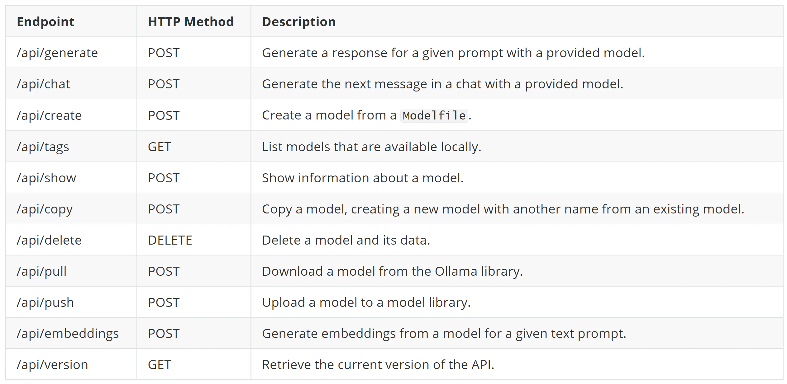
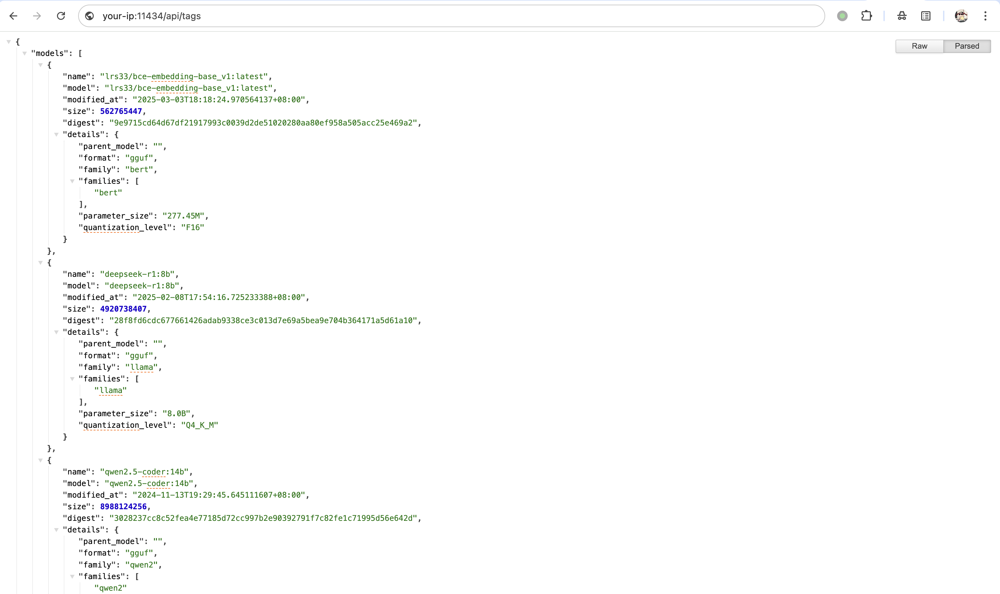

# Ollama 未授权访问漏洞 CNVD-2025-04094

<!-- vulwiki-editorial:start -->
## 校订与适用边界


### 本次正文校订

- 修正正文中的 Ollma → Ollama 转录错误，资源路径保持原样。
- 按实际内容修正 1 处代码围栏语言标记，保留其中方法与请求内容。

### 尚未解决的证据缺口

以下限制仍适用于后文历史材料；相关版本、结果或修复结论不能据此视为已验证：

- 与SourByte来源文章相同CNVD、相同api/tags检查，属同漏洞多来源
- 保留本篇compose和CNVD原始链接，合并另一篇有价值接口列表
- 配置暴露问题不能无条件映射到所有本地Ollama
- Ollma拼写错误；source仓库级，需原文件commit

### 操作风险与资料使用

- 含资源消耗、延时或崩溃验证：可能影响服务可用性；限制请求次数、并发与超时，保留无攻击负载的对照结果。

本页为文本校订，未执行代码、PoC 或目标请求；原图仅保留引用，未据此确认复现成功。
<!-- vulwiki-editorial:end -->

## 技术正文与历史材料

## 漏洞描述

Ollama 是一个本地私有化部署大语言模型（LLM，如 DeepSeek 等）的运行环境和平台，简化了大语言模型在本地的部署、运行和管理过程，具有简化部署、轻量级可扩展、API 支持、跨平台等特点，在 AI 领域得到了较为广泛的应用。

Ollama 存在未授权访问漏洞。由于 Ollama 默认未设置身份验证和访问控制功能，未经授权的攻击者可在远程条件下调用 Ollama 服务接口，执行包括但不限于敏感模型资产窃取、虚假信息投喂、模型计算资源滥用和拒绝服务、系统配置篡改和扩大利用等恶意操作。

参考链接：

- https://www.cnvd.org.cn/flaw/show/CNVD-2025-04094

## 漏洞影响

```
未设置身份验证和访问控制功能且暴露在公共互联网上的 Ollama 易受此漏洞攻击影响
```

## 环境搭建

docker-compose.yml

```
services:
  ollama:
    image: ollama/ollama:0.3.14
    container_name: ollama
    volumes:
      - ollama:/root/.ollama
    ports:
      - "11434:11434"

volumes:
  ollama:
```

执行如下命令启动 Ollama 0.3.14 服务:

```shell
docker compose up -d
```

环境启动后，访问 `http://your-ip:11434/`，此时 Ollama 0.3.14 已经成功运行。


## 漏洞复现

Ollama 公开了多个执行各种操作的 [API endpoints](https://github.com/ollama/ollama/blob/main/docs/api.md)：



 通过 `/api/tags` 列出所有模型：

```
http://your-ip:11434/api/tags
```



## 漏洞修复

- 限制公网访问：避免直接将 Ollama 服务端口（默认 11434）暴露在公网，仅允许内网或通过 VPN 访问。
- 配置网络访问控制：通过云安全组、防火墙等手段限制对 Ollama 服务端口的访问来源，仅允许可信的源 IP 地址连接。
- 启用身份认证保护：通过反向代理（如 Nginx）启用 HTTP Basic Authentication 或基于 OAuth 的认证机制。

---

> 来源：Threekiii/Vulnerability-Wiki（https://github.com/Threekiii/Vulnerability-Wiki）
