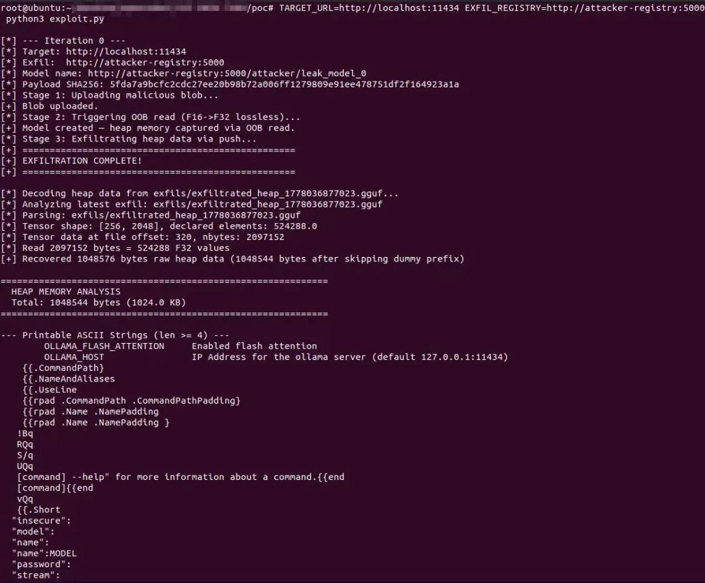
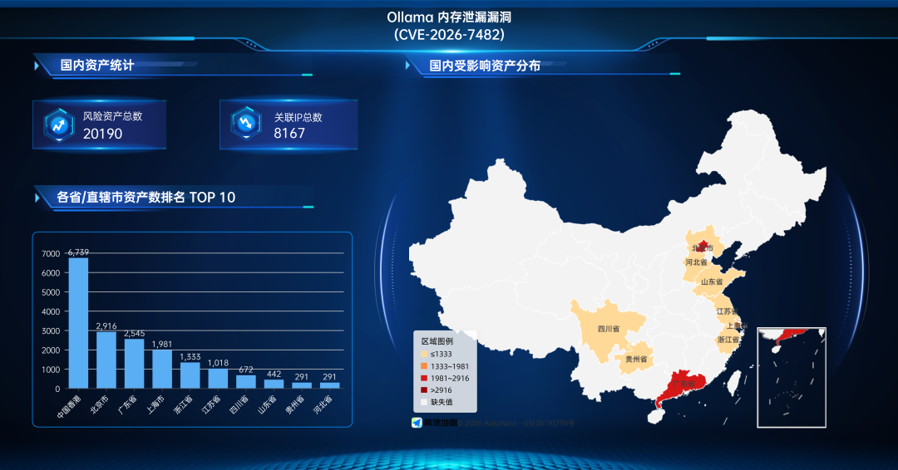
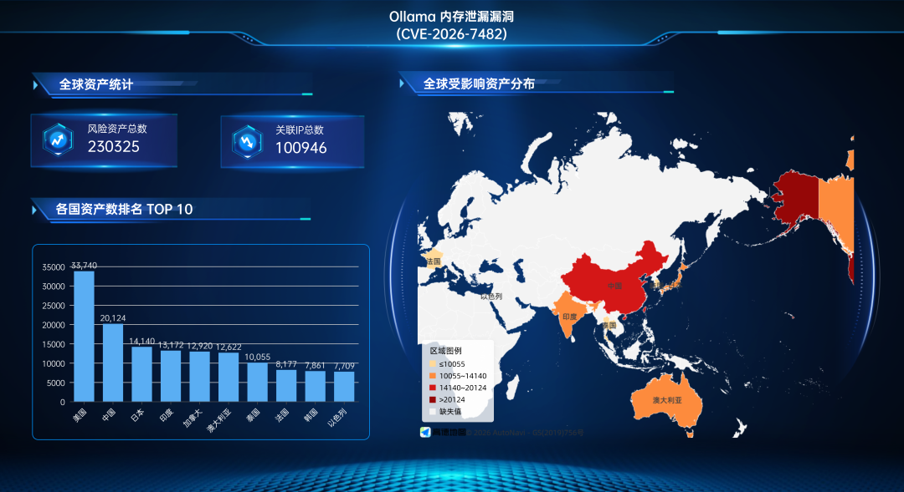
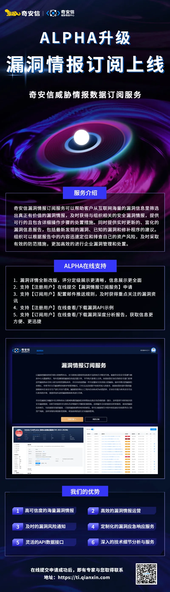
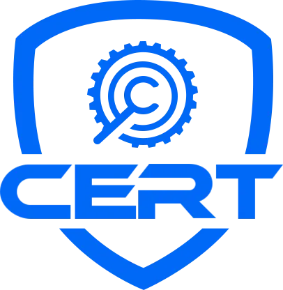

# 【已复现】Ollama 内存泄漏漏洞(CVE-2026-7482)安全风险通告

<!-- vulwiki-editorial:start -->
## 校订与适用边界

### 尚未解决的证据缺口

以下限制仍适用于后文历史材料；相关版本、结果或修复结论不能据此视为已验证：

- 内存泄漏标题可歧义为未释放内存，应注明越界读取导致信息泄露/DoS
- QVD及<0.17.1/修复版本未结构化
- 三次API调用未列端点/请求，复现仅截图
- 资产统计为来源测绘风险资产不等确认漏洞实例，须日期方法
- 0.17.1固定发布与补丁/原研究链接有价值
- 4万余字符大部为单表样式，应转简洁元数据
- 已复现为原作者声明

### 操作风险与资料使用

- 含资源消耗、延时或崩溃验证：可能影响服务可用性；限制请求次数、并发与超时，保留无攻击负载的对照结果。

本页为文本校订，未执行代码、PoC 或目标请求；原图仅保留引用，未据此确认复现成功。
<!-- vulwiki-editorial:end -->

## 技术正文与历史材料

 奇安信 CERT   2026-05-06 04:40  
  
●   
点击↑蓝字关注我们，获取更多安全风险通告  
  
  
<table><tbody><tr style="-webkit-tap-highlight-color: transparent;margin: 0px;padding: 0px;outline: 0px;max-width: 100%;box-sizing: border-box !important;overflow-wrap: break-word !important;visibility: visible;"><td colspan="4" data-colwidth="136,157,166,98" valign="middle" align="center" style="-webkit-tap-highlight-color: transparent;margin: 0px;padding: 5px 10px;outline: 0px;overflow-wrap: break-word !important;word-break: break-all;hyphens: auto;border: 1px solid rgb(70, 118, 217);max-width: 100%;box-sizing: border-box !important;background-color: rgb(70, 118, 217);visibility: visible;">
<strong style="-webkit-tap-highlight-color: transparent;margin: 0px;padding: 0px;outline: 0px;max-width: 100%;box-sizing: border-box !important;overflow-wrap: break-word !important;visibility: visible;">漏洞概述</strong> 
</td></tr><tr style="-webkit-tap-highlight-color: transparent;margin: 0px;padding: 0px;outline: 0px;max-width: 100%;box-sizing: border-box !important;overflow-wrap: break-word !important;visibility: visible;"><td data-colwidth="136" width="136" valign="middle" align="left" style="-webkit-tap-highlight-color: transparent;margin: 0px;padding: 5px 10px;outline: 0px;overflow-wrap: break-word !important;word-break: break-all;hyphens: auto;border: 1px solid rgb(70, 118, 217);max-width: 100%;box-sizing: border-box !important;visibility: visible;">
<strong style="-webkit-tap-highlight-color: transparent;margin: 0px;padding: 0px;outline: 0px;max-width: 100%;box-sizing: border-box !important;overflow-wrap: break-word !important;visibility: visible;">漏洞名称</strong>
</td><td colspan="3" data-colwidth="157,166,98" valign="middle" align="left" style="-webkit-tap-highlight-color: transparent;margin: 0px;padding: 5px 10px;outline: 0px;overflow-wrap: break-word !important;word-break: break-all;hyphens: auto;border: 1px solid rgb(70, 118, 217);max-width: 100%;box-sizing: border-box !important;visibility: visible;">
Ollama 内存泄漏漏洞
</td></tr><tr style="-webkit-tap-highlight-color: transparent;margin: 0px;padding: 0px;outline: 0px;max-width: 100%;box-sizing: border-box !important;overflow-wrap: break-word !important;visibility: visible;"><td data-colwidth="136" width="136" valign="middle" align="left" style="-webkit-tap-highlight-color: transparent;margin: 0px;padding: 5px 10px;outline: 0px;overflow-wrap: break-word !important;word-break: break-all;hyphens: auto;border: 1px solid rgb(70, 118, 217);max-width: 100%;box-sizing: border-box !important;visibility: visible;">
<strong style="-webkit-tap-highlight-color: transparent;margin: 0px;padding: 0px;outline: 0px;max-width: 100%;box-sizing: border-box !important;overflow-wrap: break-word !important;visibility: visible;">漏洞编号</strong>
</td><td colspan="3" data-colwidth="157,166,98" valign="middle" align="left" style="-webkit-tap-highlight-color: transparent;margin: 0px;padding: 5px 10px;outline: 0px;overflow-wrap: break-word !important;word-break: break-all;hyphens: auto;border: 1px solid rgb(70, 118, 217);max-width: 100%;box-sizing: border-box !important;visibility: visible;">
QVD-2026-23849，CVE-2026-7482
</td></tr><tr style="-webkit-tap-highlight-color: transparent;margin: 0px;padding: 0px;outline: 0px;max-width: 100%;box-sizing: border-box !important;overflow-wrap: break-word !important;visibility: visible;"><td data-colwidth="136" width="136" valign="middle" align="left" style="-webkit-tap-highlight-color: transparent;margin: 0px;padding: 5px 10px;outline: 0px;overflow-wrap: break-word !important;word-break: break-all;hyphens: auto;border: 1px solid rgb(70, 118, 217);max-width: 100%;box-sizing: border-box !important;visibility: visible;">
<strong style="-webkit-tap-highlight-color: transparent;margin: 0px;padding: 0px;outline: 0px;max-width: 100%;box-sizing: border-box !important;overflow-wrap: break-word !important;visibility: visible;"><strong style="-webkit-tap-highlight-color: transparent;margin: 0px;padding: 0px;outline: none 0px !important;box-sizing: border-box !important;overflow-wrap: break-word !important;cursor: text;color: rgb(0, 0, 0);caret-color: rgb(255, 0, 0);font-family: 微软雅黑, &#34;Microsoft YaHei&#34;, sans-serif;visibility: visible;max-width: 100%;max-inline-size: 100%;">公开时间</strong></strong>
</td><td data-colwidth="157" width="157" valign="middle" align="left" style="-webkit-tap-highlight-color: transparent;margin: 0px;padding: 5px 10px;outline: 0px;overflow-wrap: break-word !important;word-break: break-all;hyphens: auto;border: 1px solid rgb(70, 118, 217);max-width: 100%;box-sizing: border-box !important;visibility: visible;">
2026-05-04
</td><td data-colwidth="166" width="166" valign="middle" align="left" style="-webkit-tap-highlight-color: transparent;margin: 0px;padding: 5px 10px;outline: 0px;overflow-wrap: break-word !important;word-break: break-all;hyphens: auto;border: 1px solid rgb(70, 118, 217);max-width: 100%;box-sizing: border-box !important;visibility: visible;">
<strong style="-webkit-tap-highlight-color: transparent;margin: 0px;padding: 0px;outline: 0px;max-width: 100%;box-sizing: border-box !important;overflow-wrap: break-word !important;visibility: visible;"><strong style="-webkit-tap-highlight-color: transparent;margin: 0px;padding: 0px;outline: none 0px !important;box-sizing: border-box !important;overflow-wrap: break-word !important;cursor: text;color: rgb(0, 0, 0);caret-color: rgb(255, 0, 0);font-family: 微软雅黑, &#34;Microsoft YaHei&#34;, sans-serif;visibility: visible;max-width: 100%;max-inline-size: 100%;">影响量级</strong></strong>
</td><td data-colwidth="98" width="98" valign="middle" align="left" style="-webkit-tap-highlight-color: transparent;margin: 0px;padding: 5px 10px;outline: 0px;overflow-wrap: break-word !important;word-break: break-all;hyphens: auto;border: 1px solid rgb(70, 118, 217);max-width: 100%;box-sizing: border-box !important;visibility: visible;">
十万级
</td></tr><tr style="-webkit-tap-highlight-color: transparent;margin: 0px;padding: 0px;outline: 0px;max-width: 100%;box-sizing: border-box !important;overflow-wrap: break-word !important;visibility: visible;"><td data-colwidth="136" width="136" valign="middle" align="left" style="-webkit-tap-highlight-color: transparent;margin: 0px;padding: 5px 10px;outline: 0px;overflow-wrap: break-word !important;word-break: break-all;hyphens: auto;border: 1px solid rgb(70, 118, 217);max-width: 100%;box-sizing: border-box !important;visibility: visible;">
<strong style="-webkit-tap-highlight-color: transparent;margin: 0px;padding: 0px;outline: none 0px !important;box-sizing: border-box !important;overflow-wrap: break-word !important;cursor: text;color: rgb(0, 0, 0);font-size: 17px;caret-color: rgb(255, 0, 0);font-family: 微软雅黑, &#34;Microsoft YaHei&#34;, sans-serif;visibility: visible;max-width: 100%;max-inline-size: 100%;">奇安信评级</strong>
</td><td data-colwidth="157" width="157" valign="middle" align="left" style="-webkit-tap-highlight-color: transparent;margin: 0px;padding: 5px 10px;outline: 0px;overflow-wrap: break-word !important;word-break: break-all;hyphens: auto;border: 1px solid rgb(70, 118, 217);max-width: 100%;box-sizing: border-box !important;visibility: visible;">
<strong style="-webkit-tap-highlight-color: transparent;margin: 0px;padding: 0px;outline: none 0px !important;box-sizing: border-box !important;overflow-wrap: break-word !important;cursor: text;color: rgb(255, 0, 0);caret-color: rgb(255, 0, 0);font-family: 微软雅黑, &#34;Microsoft YaHei&#34;, sans-serif;visibility: visible;max-width: 100%;max-inline-size: 100%;">高危</strong>
</td><td data-colwidth="166" width="166" valign="middle" align="left" style="-webkit-tap-highlight-color: transparent;margin: 0px;padding: 5px 10px;outline: 0px;overflow-wrap: break-word !important;word-break: break-all;hyphens: auto;border: 1px solid rgb(70, 118, 217);max-width: 100%;box-sizing: border-box !important;visibility: visible;">
<strong style="-webkit-tap-highlight-color: transparent;margin: 0px;padding: 0px;outline: 0px;max-width: 100%;box-sizing: border-box !important;overflow-wrap: break-word !important;visibility: visible;">CVSS 3.1分数</strong>
</td><td data-colwidth="98" width="98" valign="middle" align="left" style="-webkit-tap-highlight-color: transparent;margin: 0px;padding: 5px 10px;outline: 0px;overflow-wrap: break-word !important;word-break: break-all;hyphens: auto;border: 1px solid rgb(70, 118, 217);max-width: 100%;box-sizing: border-box !important;visibility: visible;">
<strong style="-webkit-tap-highlight-color: transparent;margin: 0px;padding: 0px;outline: 0px;max-width: 100%;box-sizing: border-box !important;overflow-wrap: break-word !important;visibility: visible;">9.1</strong>
</td></tr><tr style="-webkit-tap-highlight-color: transparent;margin: 0px;padding: 0px;outline: 0px;max-width: 100%;box-sizing: border-box !important;overflow-wrap: break-word !important;visibility: visible;"><td data-colwidth="136" width="136" valign="middle" align="left" style="-webkit-tap-highlight-color: transparent;margin: 0px;padding: 5px 10px;outline: 0px;overflow-wrap: break-word !important;word-break: break-all;hyphens: auto;border: 1px solid rgb(70, 118, 217);max-width: 100%;box-sizing: border-box !important;visibility: visible;">
<strong style="-webkit-tap-highlight-color: transparent;margin: 0px;padding: 0px;outline: 0px;max-width: 100%;box-sizing: border-box !important;overflow-wrap: break-word !important;visibility: visible;">威胁类型</strong>
</td><td data-colwidth="157" width="157" valign="middle" align="left" style="-webkit-tap-highlight-color: transparent;margin: 0px;padding: 5px 10px;outline: 0px;overflow-wrap: break-word !important;word-break: break-all;hyphens: auto;border: 1px solid rgb(70, 118, 217);max-width: 100%;box-sizing: border-box !important;visibility: visible;">
信息泄露、拒绝服务
</td><td data-colwidth="166" width="166" valign="middle" align="left" style="-webkit-tap-highlight-color: transparent;margin: 0px;padding: 5px 10px;outline: 0px;overflow-wrap: break-word !important;word-break: break-all;hyphens: auto;border: 1px solid rgb(70, 118, 217);max-width: 100%;box-sizing: border-box !important;visibility: visible;">
<strong style="-webkit-tap-highlight-color: transparent;margin: 0px;padding: 0px;outline: none 0px !important;box-sizing: border-box !important;overflow-wrap: break-word !important;cursor: text;color: rgb(0, 0, 0);caret-color: rgb(255, 0, 0);font-family: 微软雅黑, &#34;Microsoft YaHei&#34;, sans-serif;visibility: visible;max-width: 100%;max-inline-size: 100%;">利用可能性</strong>
</td><td data-colwidth="98" width="98" valign="middle" align="left" style="-webkit-tap-highlight-color: transparent;margin: 0px;padding: 5px 10px;outline: 0px;overflow-wrap: break-word !important;word-break: break-all;hyphens: auto;border: 1px solid rgb(70, 118, 217);max-width: 100%;box-sizing: border-box !important;visibility: visible;">
<strong style="-webkit-tap-highlight-color: transparent;margin: 0px;padding: 0px;outline: none 0px !important;box-sizing: border-box !important;overflow-wrap: break-word !important;cursor: text;caret-color: rgb(255, 0, 0);color: rgb(255, 0, 0);font-family: 微软雅黑, &#34;Microsoft YaHei&#34;, sans-serif;visibility: visible;max-width: 100%;max-inline-size: 100%;"><strong style="-webkit-tap-highlight-color: transparent;margin: 0px;padding: 0px;outline: 0px;max-width: 100%;box-sizing: border-box !important;overflow-wrap: break-word !important;font-family: system-ui, -apple-system, BlinkMacSystemFont, &#34;Helvetica Neue&#34;, &#34;PingFang SC&#34;, &#34;Hiragino Sans GB&#34;, &#34;Microsoft YaHei UI&#34;, &#34;Microsoft YaHei&#34;, Arial, sans-serif;letter-spacing: 0.544px;visibility: visible;">高</strong></strong>
</td></tr><tr style="-webkit-tap-highlight-color: transparent;margin: 0px;padding: 0px;outline: 0px;max-width: 100%;box-sizing: border-box !important;overflow-wrap: break-word !important;visibility: visible;"><td data-colwidth="136" width="136" valign="middle" align="left" style="-webkit-tap-highlight-color: transparent;margin: 0px;padding: 5px 10px;outline: 0px;overflow-wrap: break-word !important;word-break: break-all;hyphens: auto;border: 1px solid rgb(70, 118, 217);max-width: 100%;box-sizing: border-box !important;visibility: visible;">
<strong style="-webkit-tap-highlight-color: transparent;margin: 0px;padding: 0px;outline: 0px;max-width: 100%;box-sizing: border-box !important;overflow-wrap: break-word !important;visibility: visible;">POC状态</strong>
</td><td data-colwidth="157" width="157" valign="middle" align="left" style="-webkit-tap-highlight-color: transparent;margin: 0px;padding: 5px 10px;outline: 0px;overflow-wrap: break-word !important;word-break: break-all;hyphens: auto;border: 1px solid rgb(70, 118, 217);max-width: 100%;box-sizing: border-box !important;visibility: visible;">
<strong style="-webkit-tap-highlight-color: transparent;margin: 0px;padding: 0px;outline: 0px;max-width: 100%;box-sizing: border-box !important;overflow-wrap: break-word !important;letter-spacing: 0.544px;font-family: system-ui, -apple-system, BlinkMacSystemFont, &#34;Helvetica Neue&#34;, &#34;PingFang SC&#34;, &#34;Hiragino Sans GB&#34;, &#34;Microsoft YaHei UI&#34;, &#34;Microsoft YaHei&#34;, Arial, sans-serif;visibility: visible;">已公开</strong>
</td><td data-colwidth="166" width="166" valign="middle" align="left" style="-webkit-tap-highlight-color: transparent;margin: 0px;padding: 5px 10px;outline: 0px;overflow-wrap: break-word !important;word-break: break-all;hyphens: auto;border: 1px solid rgb(70, 118, 217);max-width: 100%;box-sizing: border-box !important;visibility: visible;">
<strong style="-webkit-tap-highlight-color: transparent;margin: 0px;padding: 0px;outline: 0px;max-width: 100%;box-sizing: border-box !important;overflow-wrap: break-word !important;visibility: visible;">在野利用状态</strong>
</td><td data-colwidth="98" width="98" valign="middle" align="left" style="-webkit-tap-highlight-color: transparent;margin: 0px;padding: 5px 10px;outline: 0px;overflow-wrap: break-word !important;word-break: break-all;hyphens: auto;border: 1px solid rgb(70, 118, 217);max-width: 100%;box-sizing: border-box !important;visibility: visible;">
未发现
</td></tr><tr style="-webkit-tap-highlight-color: transparent;margin: 0px;padding: 0px;outline: 0px;max-width: 100%;box-sizing: border-box !important;overflow-wrap: break-word !important;visibility: visible;"><td data-colwidth="136" width="136" valign="middle" align="left" style="-webkit-tap-highlight-color: transparent;margin: 0px;padding: 5px 10px;outline: 0px;overflow-wrap: break-word !important;word-break: break-all;hyphens: auto;border: 1px solid rgb(70, 118, 217);max-width: 100%;box-sizing: border-box !important;visibility: visible;">
<strong style="-webkit-tap-highlight-color: transparent;margin: 0px;padding: 0px;outline: 0px;max-width: 100%;box-sizing: border-box !important;overflow-wrap: break-word !important;visibility: visible;">EXP状态</strong>
</td><td data-colwidth="157" width="157" valign="middle" align="left" style="-webkit-tap-highlight-color: transparent;margin: 0px;padding: 5px 10px;outline: 0px;overflow-wrap: break-word !important;word-break: break-all;hyphens: auto;border: 1px solid rgb(70, 118, 217);max-width: 100%;box-sizing: border-box !important;visibility: visible;">
<strong style="-webkit-tap-highlight-color: transparent;margin: 0px;padding: 0px;outline: 0px;max-width: 100%;box-sizing: border-box !important;overflow-wrap: break-word !important;color: rgb(0, 0, 0);letter-spacing: 0.544px;font-family: system-ui, -apple-system, BlinkMacSystemFont, &#34;Helvetica Neue&#34;, &#34;PingFang SC&#34;, &#34;Hiragino Sans GB&#34;, &#34;Microsoft YaHei UI&#34;, &#34;Microsoft YaHei&#34;, Arial, sans-serif;visibility: visible;">已公开</strong>
</td><td data-colwidth="166" width="166" valign="middle" align="left" style="-webkit-tap-highlight-color: transparent;margin: 0px;padding: 5px 10px;outline: 0px;overflow-wrap: break-word !important;word-break: break-all;hyphens: auto;border: 1px solid rgb(70, 118, 217);max-width: 100%;box-sizing: border-box !important;visibility: visible;">
<strong style="-webkit-tap-highlight-color: transparent;margin: 0px;padding: 0px;outline: 0px;max-width: 100%;box-sizing: border-box !important;overflow-wrap: break-word !important;visibility: visible;">技术细节状态</strong>
</td><td data-colwidth="98" width="98" valign="middle" align="left" style="-webkit-tap-highlight-color: transparent;margin: 0px;padding: 5px 10px;outline: 0px;overflow-wrap: break-word !important;word-break: break-all;hyphens: auto;border: 1px solid rgb(70, 118, 217);max-width: 100%;box-sizing: border-box !important;visibility: visible;">
<strong style="-webkit-tap-highlight-color: transparent;margin: 0px;padding: 0px;outline: 0px;max-width: 100%;box-sizing: border-box !important;overflow-wrap: break-word !important;letter-spacing: 0.544px;font-family: system-ui, -apple-system, BlinkMacSystemFont, &#34;Helvetica Neue&#34;, &#34;PingFang SC&#34;, &#34;Hiragino Sans GB&#34;, &#34;Microsoft YaHei UI&#34;, &#34;Microsoft YaHei&#34;, Arial, sans-serif;visibility: visible;">已公开</strong>
</td></tr><tr style="-webkit-tap-highlight-color: transparent;margin: 0px;padding: 0px;outline: 0px;max-width: 100%;box-sizing: border-box !important;overflow-wrap: break-word !important;visibility: visible;"><td colspan="4" data-colwidth="136,157,166,98" valign="middle" align="left" style="-webkit-tap-highlight-color: transparent;margin: 0px;padding: 5px 10px;outline: 0px;overflow-wrap: break-word !important;word-break: break-all;hyphens: auto;border: 1px solid rgb(70, 118, 217);max-width: 100%;box-sizing: border-box !important;visibility: visible;">
<strong style="-webkit-tap-highlight-color: transparent;margin: 0px;padding: 0px;outline: 0px;max-width: 100%;box-sizing: border-box !important;overflow-wrap: break-word !important;visibility: visible;">危害描述：</strong>攻击者可通过三次未认证API调用，远程窃取API密钥、环境变量等敏感数据，还可引发服务崩溃。
</td></tr></tbody></table>  
  
  
**0****1**  
  
**漏洞详情**  
  
**>**  
**>**  
**>**  
**>**  
  
**影响组件**  
  
Ollama 是一款开源跨平台大模型运行与管理框架，支持快速本地 / 私有化部署 LLaMA、DeepSeek、Qwen 等主流大模型，提供模型加载、量化、推理、API 服务等核心能力，可通过简单命令完成模型拉取、启动与调用，广泛用于个人 AI 应用开发、企业内部知识库搭建、私有化 AI 服务部署等场景，默认开放 11434 端口提供 API 接口，支持多平台环境运行，是轻量化大模型落地的主流工具之一。  
  
**>**  
**>**  
**>**  
**>**  
  
**漏洞描述**  
  
近日，奇安信CERT监测到官方修复  
Ollama 内存泄漏漏洞(CVE-2026-7482)，该漏洞源于处理用户上传的恶意 GGUF 文件时，未对张量偏移量与大小进行边界校验，导致服务器进程读取越界堆内存。攻击者可通过三次未认证API调用，远程窃取API密钥、环境变量等敏感数据，还可引发服务崩溃。  
目前该漏洞PoC和技术细节已公开。  
鉴于该漏洞影响范围较大，建议客户尽快做好自查及防护。  
  
  
**02**  
  
**影响范围**  
  
**>**  
**>**  
**>**  
**>**  
  
**影响版本**  
  
Ollama < 0.17.1  
  
**>**  
**>**  
**>**  
**>**  
  
**其他受影响组件**  
  
无  
  
  
**03**  
  
**复现情况**  
  
目前，奇安信威胁情报中心安全研究员已成功复现  
Ollama 内存泄漏漏洞(CVE-2026-7482)  
，截图如下：  
  
  
  
  
  
  
  
**04**  
  
**受影响资产情况**  
  
奇安信鹰图资产测绘平台数据显示，  
Ollama 内存泄漏漏洞(CVE-2026-7482)  
关联的国内风险资产总数为20190个，关联IP总数为8167个。国内风险资产分布情况如下：  
  
  
  
Ollama 内存泄漏漏洞(CVE-2026-7482)  
关联的全球风险资产总数为230325个，关联IP总数为100946个。全球风险资产分布情况如下：  
  
  
  
  
  
**05**  
  
**处置建议**  
  
**>**  
**>**  
**>**  
**>**  
  
**安全更新**  
  
官方已发布安全补丁，请及时更新至最新版本：  
Ollama >= 0.17.1  
  
下载地址：  
  
https://github.com/ollama/ollama/releases/tag/v0.17.1  
  
  
  
**06**  
  
**参考资料**  
  
[1]  
https://github.com/ollama/ollama/commit/88d57d0483cca907e0b23a968c83627a20b21047  
  
[2]https://github.com/ollama/ollama/pull/14406  
  
[3]  
https://www.cyera.com/research/bleeding-llama-critical-unauthenticated-memory-leak-in-ollama  
  
  
  
**07**  
  
**时间线**  
  
2026年05月06日，奇安信 CERT发布安全风险通告。  
  
  
  
**08**  
  
**漏洞情报服务**  
  
  
奇安信ALPH  
A  
威胁分析平台已支持漏洞情报订阅服务：  
  
  
  
  
  
  
  
  
  
  
**奇安信 CERT**  
  
**致力于**  
第一时间为企业级用户提供**权威**  
漏洞情报和**有效**  
解决方案。  
  
  
  
点击↓**阅读原文**  
，到**ALPHA威胁分析平台**  
订阅更多漏洞信息。  
  

---

> 来源：gelusus/wxvl（微信公众号漏洞文章自动归档，原文见文首链接）
