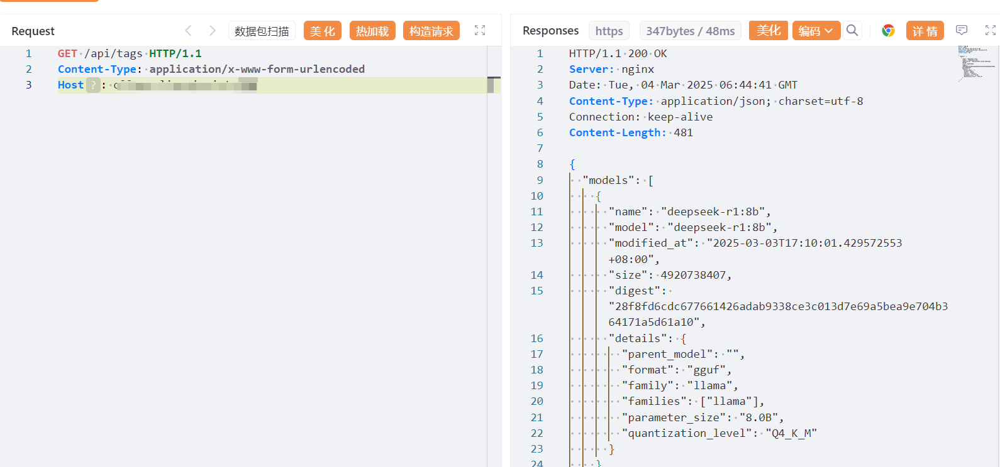
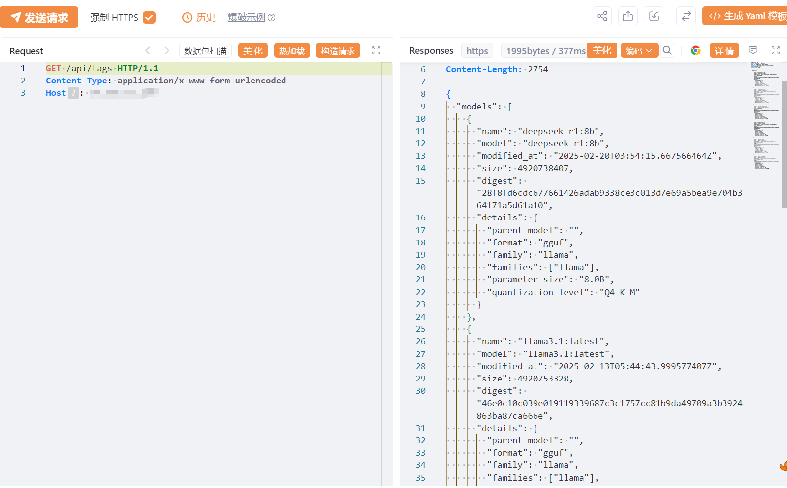

# 大语言模型（如DeepSeek）OLLAMA 未授权访问（CNVD-2025-04094）

<!-- vulwiki-editorial:start -->
## 校订与适用边界


### 尚未解决的证据缺口

以下限制仍适用于后文历史材料；相关版本、结果或修复结论不能据此视为已验证：

- 已知在野利用无证据链接/观察日期
- 影响所有版本需要暴露且未设认证的限定，应建配置条件
- config.yaml/settings.json限定IP说法无对应Ollama配置依据，需核对，不应给出无效修复命令
- 请求未代码块化，JSON混注释；max_tokens参数需按API版本核实
- 保留FOFA和额外接口，主条目关联两来源

### 操作风险与资料使用

- 含资源消耗、延时或崩溃验证：可能影响服务可用性；限制请求次数、并发与超时，保留无攻击负载的对照结果。

本页为文本校订，未执行代码、PoC 或目标请求；原图仅保留引用，未据此确认复现成功。
<!-- vulwiki-editorial:end -->

## 技术正文与历史材料

# 漏洞描述

Ollama存在未授权访问漏洞。由于Ollama默认未设置身份验证和访问控制功能，未经授权的攻击者可在远程条件下调用Ollama服务接口，执行包括但不限于敏感模型资产窃取、虚假信息投喂、模型计算资源滥用和拒绝服务、系统配置篡改和扩大利用等恶意操作。未设置身份验证和访问控制功能且暴露在公共互联网上的Ollama易受此漏洞攻击影响。

# 影响版本

Ollama所有版本（未设置访问认证的情况下）

# **漏洞状态**

| 漏洞细节 | 漏洞POC | 漏洞EXP | 在野利用 |
|------|-------|-------|------|
| 是 | 已公开 | 已公开 | 已知 |

## 风险等级

| 维度 | 评价 |
|----|----|
| 威胁等级 | 高危 |
| 影响面 | 广 |
| 攻击者价值 | 高 |
| 利用难度 | 低 |

# 漏洞复现

FOFA：app="Ollama"

POC/EXP：

GET /api/tags HTTP/1.1
Content-Type: application/x-www-form-urlencoded
Host: 127.0.0.1







未授权接口包含下列：

```
//1.生成文本接口
POST /api/generate
{
  "model": "<model-name>",  //模型名称
  "prompt": "<input-text>", //输入内容
  "stream": false,
  "options": {
    "temperature": 0.7,
    "max_tokens": 100
  }
}


//2.交谈接口
POST /api/chat
{
  "model": "<model-name>",  //模型名称
  "messages": [
    {
      "role": "user",
      "content": "<input-text>"  //输入内容
    }
  ],
  "stream": false,
  "options": {
    "temperature": 0.7,
    "max_tokens": 100
  }
}


//3.显示有关模型的详细信息，包括模型文件、模板、参数等
POST /api/show
{
  "model": "<model-name>", //模型名如:deepseek-r1:32b
  "verbose": true
}

//4.拉取模型接口
POST /api/pull
{
  "name": "<model-name>"
}
```

# 漏洞修复

请使用Ollama部署大模型的单位和用户立即采取以下措施进行漏洞修复：

1、若Ollama只提供本地服务，设置环境变量Environment="OLLAMA_HOST=127.0.0.1"，仅允许本地访问。

2、若Ollama需提供公网服务，选择以下方法添加认证机制：

1）修改config.yaml、settings.json 配置文件，限定可访问Ollama 服务的IP地址；

2）通过防火墙等设备配置IP白名单，阻止非授权IP的访问请求；

3）通过反向代理进行身份验证和授权（如使用OAuth2.0协议），防止未经授权用户访问。


---

> 来源：SourByte05/Vulnerability-Wiki-PoC（https://github.com/SourByte05/Vulnerability-Wiki-PoC）
