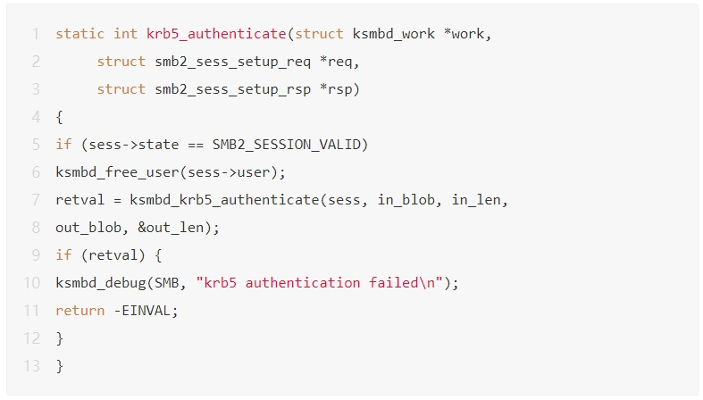
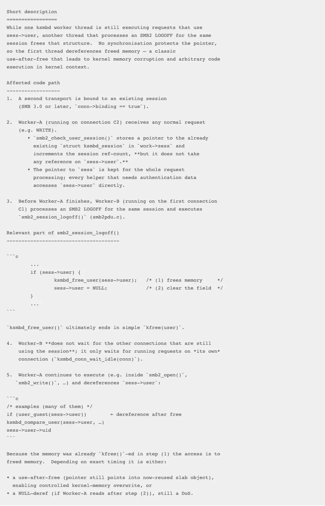

# OpenAI大语言模型漏洞挖掘

<!-- vulwiki-editorial:start -->
## 校订与适用边界

受影响组件是 Linux ksmbd，OpenAI 模型是用于发现问题的工具。CVE-2025-37778 属先前背景，不能把研究工具品牌归为漏洞产品。

### 本次正文校订

- 按该篇完整正文及逐篇审阅区分主问题与背景编号，补全结构化主标识；不把标识归属校订等同运行复现。

### 尚未解决的证据缺口

以下限制仍适用于后文历史材料；相关版本、结果或修复结论不能据此视为已验证：

- 受影响对象为ksmbd而非OpenAI
- 37778为先前背景不可与37899混合
- 列举内核版本未区分受影响快照和修复版本
- EPSS无时间
- 声称公开PoC却无原始链接
- ROP和完整RCE等叙述缺直接证据

本页为文本校订，未执行代码、PoC 或目标请求；原图仅保留引用，未据此确认复现成功。
<!-- vulwiki-editorial:end -->

## 技术正文与历史材料

点击关注→  智探AI应用   2025-05-26 10:15  
  
该事件引发了业内广泛关注，标志着AI在漏洞挖掘领域的实用能力正从理论走向现实。  
  
  
  
**来源****｜安全客**  
  
  
  
**以下为全文**  
  
  
  
近日，一个编号为CVE-2025-37899的Linux内核0Day漏洞被披露。不同于传统由人类安全研究员或自动化工具挖掘，本次漏洞的发现者是OpenAI最新发布的大语言模型ChatGPT o3。该事件引发了业内广泛关注，标志着AI在漏洞挖掘领域的实用能力正从理论走向现实。  
  
  
漏洞概述  
  
  
CVE-2025-37899是一个影响Linux内核ksmbd模块的高危漏洞。ksmbd是内核中用于实现SMB协议（Server Message Block）的服务端组件，支持SMBv3版本，主要用于文件共享服务。  
  
  
该漏洞被官方确认为一处use-after-free（释放后使用）类型内存管理缺陷。受影响的版本包括：  
  
- Linux 6.12.27  
  
- Linux 6.14.5  
  
- Linux 6.15-rc4  
  
虽然根据EPSS（Exploit Prediction Scoring System）的评估，该漏洞的利用概率暂为0.02%，但由于其位于Linux内核通信协议栈中，具备较高利用潜力。一旦被利用，可能导致内存破坏，甚至实现内核权限下的远程代码执行，安全风险不容忽视。  
  
  
  
技术  
分析  
  
  
  
从漏洞成因来看，CVE-2025-37899涉及SMB协议中logoff命令的并发处理逻辑问题，属于典型的多线程资源竞争下的use-after-free漏洞  
。  
  
  
触发流程简要说明如下：  
  
   
  
1 线程A处理客户端的logoff请求，在处理过程中会释放sess->user对象；   
  
2 线程B同时处理另一个连接的session setup请求，试图绑定至刚刚释放的会话；   
  
3 此时另一个线程访问已被释放的sess->user指针，形成典型use-after-free情况；   
  
4 攻击者可构造竞态条件，实现内核级内存破坏甚至控制执行流。   
  
  
该漏洞可能导致内核崩溃或服务拒绝，严重影响系统的稳定性，攻击者还可利用内存破坏漏洞构建ROP链，实现任意代码执行，最终可能导致权限提升，甚至实现远程持久化控制，对系统安全构成重大威胁。目前研究人员已公开漏洞PoC，建议相关用户及时关注并做好防护  
。  
  
  
发现路径  
  
  
本次漏洞由安全研究人员Sean通过OpenAI o3模型API调用独立发现。值得注意的是，他在整个过程中未借助任何模糊测试（Fuzzing）、符号执行框架或静态分析平台，仅依靠语言模型的自然语言交互能力，完成了漏洞的定位与成因分析。   
  
  
具体使用流程如下：   
  
- Sean向o3模型提供了约3.3k行与ksmbd模块相关的源代码（约合27k tokens），涵盖了会话管理、命令解析及资源回收等关键路径；   
  
- 随后，o3模型深入分析了logoff命令与session setup命令在并发执行时的状态共享逻辑；  
  
- 模型准确指出了sess->user对象存在生命周期管理错误，潜藏use-after-free风险；   
  
- 最后，Sean亲自验证并成功复现该问题，确认其为真实的0Day漏洞。   
  
在此之前，Sean以他人工发现的另一个漏洞 CVE-2025-37778（Kerberos认证路径的use-after-free）作为基准，利用该漏洞测试o3模型的分析能力。相关代码片段如下：  
  
  
  
  
  
  
基于该案例，o3 展现出优秀的跨路径推理能力，能够识别资源释放与并发访问间的复杂依赖关系。  
  
  
Sean表示：  
“我没有用任何辅助框架，仅通过o3 API对代码进行分析，就准确地发现了潜在的逻辑漏洞。就我所知，这是首例由大语言模型自主识别并被确认的内核级0Day。”  
  
  
  
  
o3模型作出详细解释  
  
  
这一发现意味着语言模型不仅能理解应用层逻辑，也已具备识别系统级漏洞的能力，突破了以往LLM只能“改代码、写脚本”的能力边界。  
  
  
行业影响  
  
  
此次事件标志着LLM在安全研究中的作用已从“辅助分析”跃升为“独立发现者”，其带来的深远影响包括：   
  
  
1. AI在漏洞研究中的角色变化   
  
从“辅助代码审计”到“主动发现漏洞”，AI已初步具备独立完成部分漏洞发现任务的能力，研究范式正在发生根本变化。   
  
  
2. 人机协同成为主流模式   
  
未来漏洞研究可能将更多采用“研究员+AI”协同模式。人类专注于策略与链路设计，AI负责代码路径遍历与模式识别，将大幅提升研究效率。   
  
  
3. 安全行业工具链升级   
  
安全厂商和研究机构需加快构建基于LLM的审计平台或插件系统，将大语言模型嵌入审计、测试、自动化挖掘等流程中，形成高效漏洞挖掘闭环。   
  
  
Sean强调：“AI不会取代人类研究员，反而将成为我们效率倍增的工具。未来的漏洞研究，将是你与模型并肩作战。”   
  
  
CVE-2025-37899的发现不仅是一项漏洞披露，更是AI参与网络安全攻防实践的里程碑事件。未来，AI与安全研究人员的深度协同或将成为抵御高级威胁的重要力量。   
  
  
消息来源：https://cybersecuritynews.com/linux-kernel-smb-0-day-vulnerability/  
  
  
  
  
****  
****  
**智探AI应用交流群，有兴趣的朋友请添加群主：cosmic-walker 备注：公司+姓名+职务+AI入群。**  
  

---

> 来源：gelusus/wxvl（微信公众号漏洞文章自动归档，原文见文首链接）
