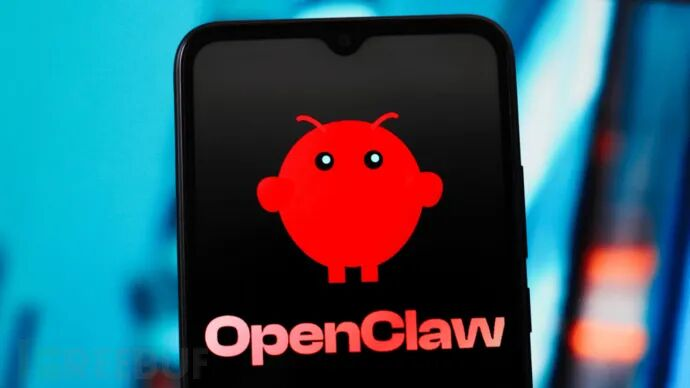

# OpenClaw AI框架曝出六大高危漏洞，含SSRF与认证绕过风险

<!-- vulwiki-editorial:start -->
## 校订与适用边界

### 尚未解决的证据缺口

以下限制仍适用于后文历史材料；相关版本、结果或修复结论不能据此视为已验证：

- 六漏洞缺独立ID、受影响/修复版本及PoC链接
- 只指向CSO二手报道，声称研究者PoC全部公开但未给入口
- 标题全部高危而正文含6.5及未评分，应核对分级和来源
- 大量空标题/推荐阅读/宣传图污染
- 产品社交媒体平台描述需查原产品定位

本页为文本校订，未执行代码、PoC 或目标请求；原图仅保留引用，未据此确认复现成功。
<!-- vulwiki-editorial:end -->

## 技术正文与历史材料

 FreeBuf   2026-02-21 04:31  
  
  
  
  
##   
## 安全研究人员在开源AI Agent框架OpenClaw中发现六个高危漏洞，该框架被业界称为"AI Agent的社交媒体平台"。Endor Labs团队通过AI驱动的静态应用安全测试（SAST）引擎，追踪了不可信数据在框架各层的流转路径，最终暴露出包括服务端请求伪造（SSRF）、认证绕过和路径遍历在内的可被利用缺陷。  
##   
  
**Part01**  
## 漏洞类型与危害分析  
  
  
这些漏洞横跨多个Web安全领域，影响结合了大型语言模型（LLMs）、工具执行与外部集成的复杂Agent系统。研究人员已发布所有漏洞的可用PoC，证实其实际可被利用。OpenClaw官方随后发布补丁和安全公告。  
  
Endor Labs按漏洞类型和单独严重性（而非CVE编号）对六大漏洞进行分类披露：  
  
  
SSRF类漏洞  
  
  
涉及三个不同组件：网关组件（CVSS 7.6）允许用户提供URL建立出站WebSocket连接；Urbit认证模块SSRF（CVSS 6.5）；图像工具SSRF（CVSS 7.6）。这些漏洞可能暴露内部服务或云元数据端点，危害程度取决于具体部署环境。  
  
  
访问控制缺陷  
  
  
包括Telnyx webhook处理器缺乏有效验证机制（CVSS 7.5），允许来自不可信源的伪造请求；Twilio功能存在认证绕过漏洞（CVSS 6.5），未授权用户可调用受保护接口。  
  
  
路径遍历漏洞  
  
  
浏览器文件上传处理中存在路径净化不足问题（未分配CVSS评分），可能导致文件写入非预期目录。  
  
  
**Part02**  
## AI驱动的漏洞挖掘方法  
  
  
为突破传统静态分析工具在现代软件栈中的局限性（输入数据需经多重转换才到达危险操作），Endor Labs采用AI SAST方案保持跨转换过程的上下文关联。测试引擎完整映射了"不可信数据"从HTTP参数、配置值等入口点到网络请求/文件操作等安全敏感"汇聚点"的完整路径。  
  
  
研究人员表示："AI分析与系统性人工验证的结合，为保护AI基础设施提供了可行方案。随着AI Agent框架在企业环境普及，安全分析必须同时应对传统漏洞和AI特有攻击面。"  
  
  
Endor Labs已向OpenClaw维护团队披露漏洞，相关修复措施已在受影响组件中实施。  
  
  
**参考来源：**  
  
Six flaws found hiding in OpenClaw’s plumbing  
  
https://www.csoonline.com/article/4134540/six-flaws-found-hiding-in-openclaws-plumbing.html  
  
  
###   
###   
###   
  
**推荐阅读**  
  
  
  
  
### 电台讨论  
  
  
  
  
****  
  
  
  
  

---

> 来源：gelusus/wxvl（微信公众号漏洞文章自动归档，原文见文首链接）
