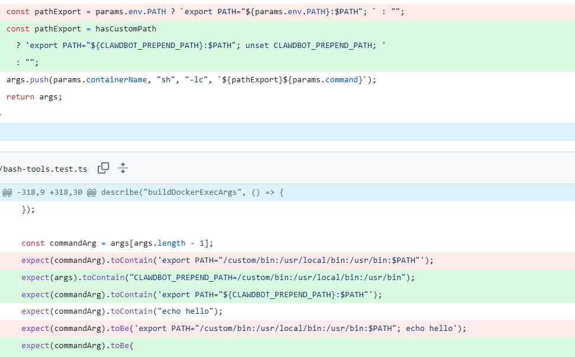

# 【AI高危漏洞预警】OpenClaw PATH命令注入漏洞CVE-2026-24763

<!-- vulwiki-editorial:start -->
## 校订与适用边界

### 尚未解决的证据缺口

以下限制仍适用于后文历史材料；相关版本、结果或修复结论不能据此视为已验证：

- 无具体PoC/验证方法，图片像素未检视
- 多个产品/代码词含形似Unicode
- 最低修复2026.1.29与推荐2026.2.3未结构区分
- 已认证且可控环境变量是核心前提，需明确
- 无原公告/CVE链接和文章源URL

本页为文本校订，未执行代码、PoC 或目标请求；原图仅保留引用，未据此确认复现成功。
<!-- vulwiki-editorial:end -->

## 技术正文与历史材料

cexlife
                    cexlife  飓风网络安全   2026-02-09 08:14  
  
  
  
漏洞描述:  
  
OреnClаԝ（前身为 Clаԝdbоt）是一款你可以在自己设备上运行的个人AI助手,在2026.1.29之前,由于在构建ѕhеll命令时对PATH环境变量处理不当,OреnClаԝ的 Dосkеr沙箱执行机制中存在命令注入漏洞能够控制环境变量的已认证用户可能会影响容器环境中的命令执行,此漏洞已在2026.1.29版本中修复  
  
  
  
攻击场景:  
  
攻击者在已认证的前提下通过操控PATH环境变量,诱导系统在构建shell命令时执行恶意指令,从而实现容器沙箱环境中的任意命令执行  
  
影响产品:  
  
Open Source OpenClaw Clawdbot <2026.1.29  
  
修复建议:  
  
补丁名称:  
  
OреnClаԝ PATH命令注入漏洞的补丁-更新至最新版本2026.2.3  
  
文件链接:  
  
https://github.com/openclaw/openclaw/releases/tag/v2026.2.3  
  
目前官方已有可更新版本建议,受影响用户升级至最新版本  
  
建议措施:  
  
立即升级：所有使用 OpenClaw 的用户应尽快升级至 v2026.1.29 或更高版本，以获取官方修复补丁  
  
限制权限：对非必要用户禁用对环境变量的修改权限，尤其在多用户共享的沙箱环境中  
  
输入验证与过滤：在代码中对 PATH 等关键环境变量进行白名单校验，避免直接拼接用户输入至shell命令  
  
日志监控：加强容器运行时日志审计，关注异常 shell 调用行为（如 sh -c、exec 等指令的异常参数）  
  
镜像安全扫描：对 OpenClaw 的 Docker 镜像进行定期安全扫描，确保未包含已知漏洞版本  
  
  

---

> 来源：gelusus/wxvl（微信公众号漏洞文章自动归档，原文见文首链接）
