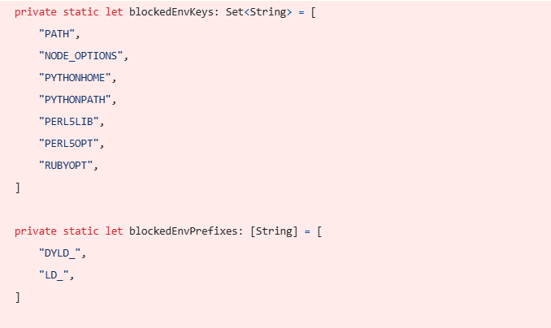
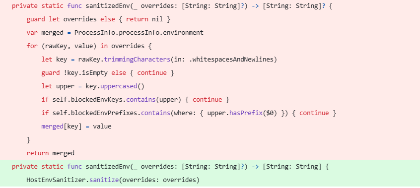
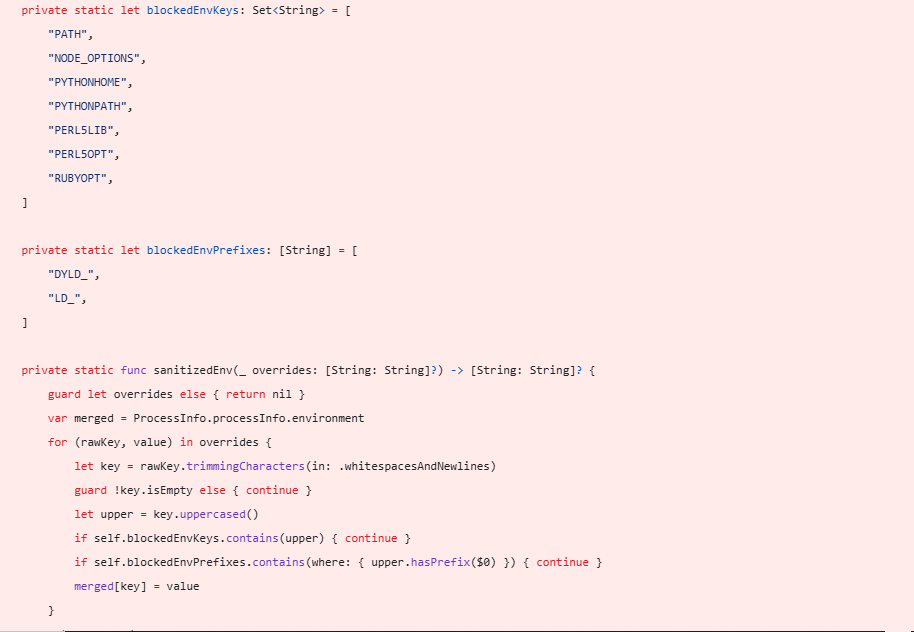

# 【高危AI漏洞预警】OpenClaw环境变量注入漏洞 (CVE-2026-22177)

<!-- vulwiki-editorial:start -->
## 校订与适用边界

### 尚未解决的证据缺口

以下限制仍适用于后文历史材料；相关版本、结果或修复结论不能据此视为已验证：

- 缺明确PoC/命令和官方公告链接，截图依赖未验证
- 配置写权限与更低权限边界没有解释，不能把可改进程配置等同无需授权RCE
- 版本<2026.2.21未进metadata
- Unicode混淆产品/配置字段，泛化安全建议较多
- 缺上游原文URL

本页为文本校订，未执行代码、PoC 或目标请求；原图仅保留引用，未据此确认复现成功。
<!-- vulwiki-editorial:end -->

## 技术正文与历史材料

jufeng
                    jufeng  飓风网络安全   2026-03-25 09:49  
  
  
  
漏洞描述:  
  
OреnClаԝ版本早于2026.2.21未能过滤соnfiɡ еnv.vаrѕ 中的危险进程控制环境变量,从而允许启动时代码执行,攻击者可以通过配置注入如NODE_OPTIONS或LD_*等变量,在OреnClаԝ 网关服务运行时上下文中执行任意代码  
  
  
  
  
  
  
  
攻击场景:  
  
攻击者可能利用OpenClaw网关服务在启动或运行过程中读取配置文件（如.env或 config.env.vars）的机制通过向这些配置文件中注入恶意环境变量（例如 NODE_OPTIONS、LD_PRELOAD 等）,攻击者可在服务启动时劫持进程控制从而在目标系统的上下文环境中执行任意系统命令  
  
影响产品:  
  
Openclaw < 2026.2.21  
  
目前官方已有可更新版本,建议受影响用户升级至最新版本  
  
建议措施:  
  
立即升级补丁：这是最直接的缓解方案,请立即将OpenClaw升级至 2026.2.21或更高版本,该版本已修复了环境变量过滤逻辑。  
  
加强输入验证：如果暂时无法升级，需检查所有允许用户配置的入口点，严格限制环境变量名称和值的格式，禁止包含 Shell 特殊字符或已知的危险库加载标识符。  
  
最小权限原则：确保运行 OpenClaw 服务的系统账户仅拥有完成业务功能所需的最小权限，避免使用 root 或管理员权限直接运行服务进程。  
  
配置审计：定期扫描生产环境中的配置文件，检测是否存在异常的 NODE_OPTIONS、PYTHONPATH 或 LD_* 变量设置。  
  
隔离运行：建议在容器化环境（如 Docker/Kubernetes）中部署 OpenClaw，并通过安全组策略限制其对宿主机的网络访问和文件挂载权限。  
  
  

---

> 来源：gelusus/wxvl（微信公众号漏洞文章自动归档，原文见文首链接）
