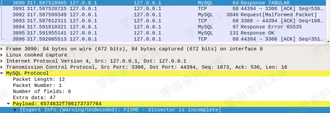
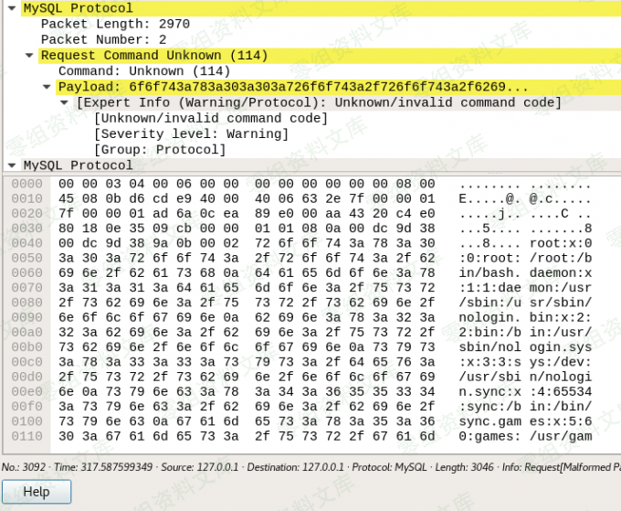
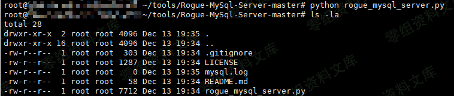
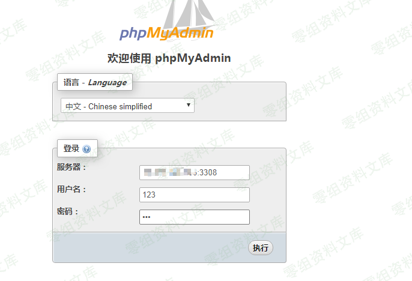

Adminer 任意文件读取漏洞
========================

一、漏洞简介
------------

准确的说该漏洞源于MySQL LOAD DATA 读取客户端任意文件

Mysql可以使用`LOAD DATA INFILE`来读取文件，通常有两种用法，分别是：

    load data infile "/data/data.csv" into table test;
    load data local infile "/data/data.csv" into table test;

-   第一种用法是从mysql自己的服务器上读取data.csv文件.

-   第二种用法是客户端把客户端电脑上的data.csv发给mysql服务器的表中.

而mysql客户端读取漏洞利用的语句即第二条语句.

### 前提

-   phpmyadmin 开启了远程连接选项，adminer是默认开启的.

```{=html}
<!-- -->
```
    $cfg['AllowArbitraryServer'] = true; //false改为true libraries下面的config.default.php

-   mysql中secure\_file\_priv为空，即支持load infile的使用

-   未开启open\_basedir(开启情况需要拿shell，否则只能读到指定目录下的文件)

二、漏洞影响
------------

三、复现过程
------------

### 漏洞分析

正常流程来说当客户端向服务端发起load data infile "/etc/passwd"的时候.

-   1、客户端会对服务器说：我要把我的etc/passwd文件插入到你的表中

(客户端-\>\>服务端: Load data infile '/etc/passwd'... )


-   2、服务器对客户端说：好啊，读取你本地的/etc/passwd文件
    (服务端-\>\>客户端: Response TABULAR)



-   3、客户端将data文件的内容发给服务器 (客户端-\>\>服务端:
    etc/passwd的内容)



而这里存在逻辑错误，即服务端可以不管客户端的请求，直接向客户端发送一个Response
TABULAR，

这样逻辑就变成了：

-   1、客户端会对服务端说：NULL

-   2、服务端对客户端说：好啊，读取你本地的/etc/passwd文件
    (服务端-\>\>客户端: Response TABULAR)

-   3、客户端将/etc/passwd文件的内容发给服务器 (客户端-\>\>服务端:
    testtest)

那么设想一种场景：

这样服务端就可以读取客户端机器上的任意文件.

    有一台靶机存在PHPmyadmin或者adminer(可以远程连接其他服务器)
    攻击者在攻击机器上假装一个mysql服务器包含读取任意文件的poc
    靶机上的任意文件被攻击机读取

这里用到的脚本是`https://doanload.0-sec.org/Web安全/Adminer/Rogue-MySql-Server-master.zip`


这里我们将端口改成了3308 读取目标机器上的test.php.

注意这里文件一定要按照他给的格式写，然后后面要有逗号，不然会读取失败.

然后在服务器上运行这个脚本，最坑的地方来了。。

这个脚本运行后会一直在后台运行，如果要读其他的文件需要把进程杀掉

    netstat -tln | grep 3308
    lsof -i:3308
    kill

监听后会生成一个mysql.log文件



接着我们用phpmyadmin和adminer访问一下



登陆进去的状态，报错不用管


在log文件里可以读到test.php的文件内容


adminer也一样，不过adminer默认开启远程连接，所以挖src的时候碰到adminer就等于碰到金矿hh


明显发现adminer比phpmyadmin的数据量要少.

再有就是拿到shell后绕过open\_basedir读取文件可以用这个漏洞.

参考链接
--------

> https://comicalt.github.io/contents/mysql-fileread/
>
> https://www.anquanke.com/post/id/173039
