## 核对与使用边界

本文已按保存的全文审阅记录进行文字校订；本轮仅静态核对，未运行 PoC、请求目标或逐图验证。

适用条件与版本记录（来源主张，未列为明确更正的部分仍待权威资料核对）：4.2.126; registration cookie path controls; reg_type/utype=2 and ucenter=bind

- **结论使用边界（1）**：Explains copy sink and uid/time-derived avatar filename clearly。此项限制直接适用于下文对应结论；现有正文不足以作更宽泛推论，所列方法和原始证据均保留。

- **证据待核（2）**：Full retrieval depends on external helper and screenshots; text should specify final filename/time handling。保留原引用、截图位置和实验叙述；本项所缺材料未被补造，截图存在或作者宣称成功都不等于已核验其内容。

- **证据待核（3）**：Old upgrade instructions run together; image reference crosses into password-reset article。保留原引用、截图位置和实验叙述；本项所缺材料未被补造，截图存在或作者宣称成功都不等于已核验其内容。

历史原文标识：下文原技术材料按来源保留；仅本节明确确认的更正替代相应旧说法，标为待核的观察仍不是事实确认。

# 74cms v4.2.126-任意文件读取漏洞

0x00 前言
---------

厂商：74cms下载地址：http://www.74cms.com/download/index.html关于版本：新版的74cms采用了tp3.2.3重构了，所以可知底层是tp，74cms新版升级是后台升级的，所以先将将升级方法。注：此漏洞不用升级至最新版本也可使用。

0x01 74cms升级到最新版
----------------------

1， 先去官网下载 骑士人才系统基础版(安装包)2， 将下载好的包进行安装3， 进入后台点击查看如果不是最新版的话，请点击升级！4， 如果是本地环境的话，会提示 域名不合法升级失败，这个问题很好解决5，
搜索文件74cms\\upload\\Application\\Admin\\Controller\\ApplyController.class.php6， 查找所有\$\_SERVER\[\'HTTP\_HOST\'\] 改为 http://baidu.com 即可

0x02 任意文件读取漏洞演示
-------------------------

    url: http://74cms.test/index.php?m=Home&c=Members&a=register

    post: 
    reg_type=2&utype=2&org=bind&ucenter=bind
    cookie: members_bind_info[temp_avatar]=../../../../Application/Common/Conf/db.php;members_bind_info[type]=qq;members_uc_info[password]=123456;members_uc_info[uid]=1;members_uc_info[username]=tttttt;
    headers:
    Content-Type: application/x-www-form-urlencoded
    X-Requested-With: XMLHttpRequest

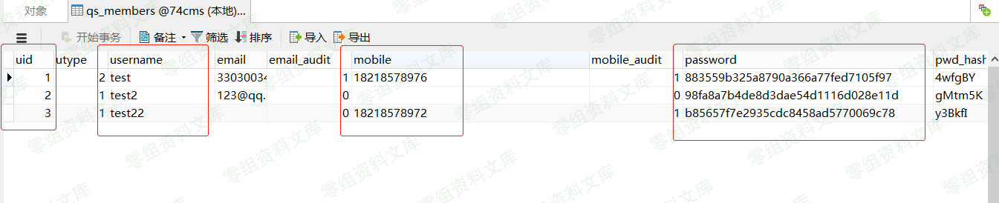

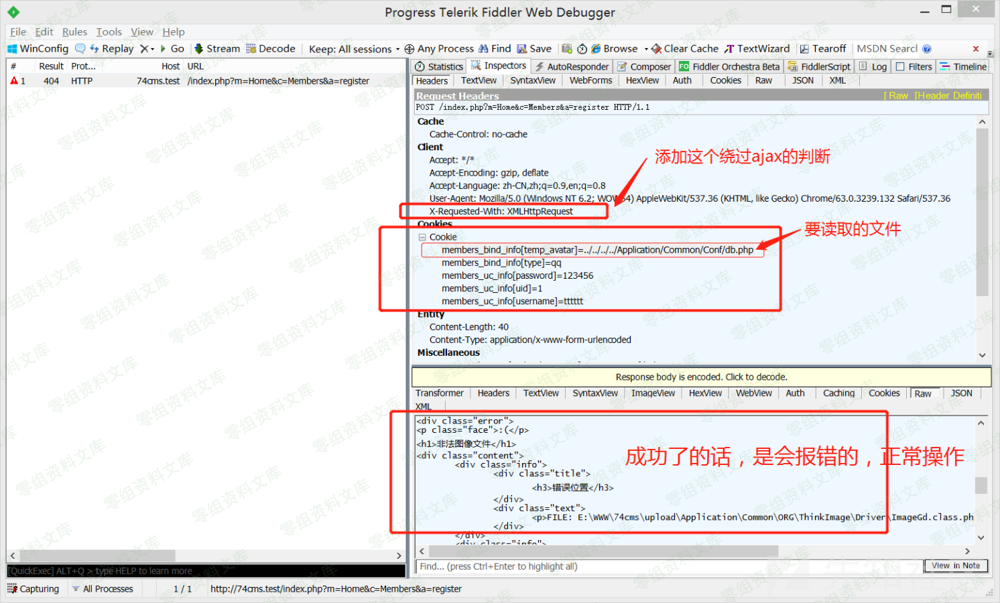

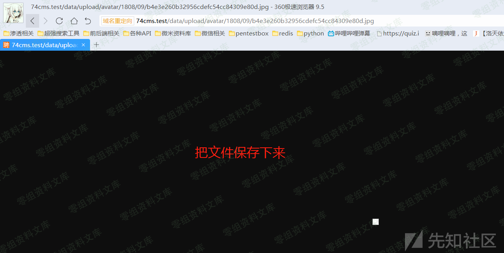

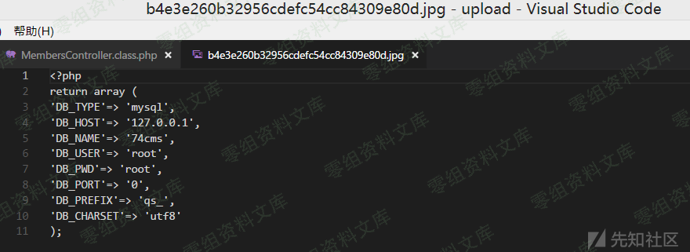

问题一：漏洞原理？我下面会讲问题二：你如何知道文件名称的？我下面会讲问题三：能不能写个简单的工具，自动利用此漏洞？哦，好的，我下面会提供 : )

0x03 漏洞讲解
-------------

打开文件：74cms\\upload\\Application\\Home\\Controller\\MembersController.class.php函数：\_save\_avatar(\$avatar, \$uid)

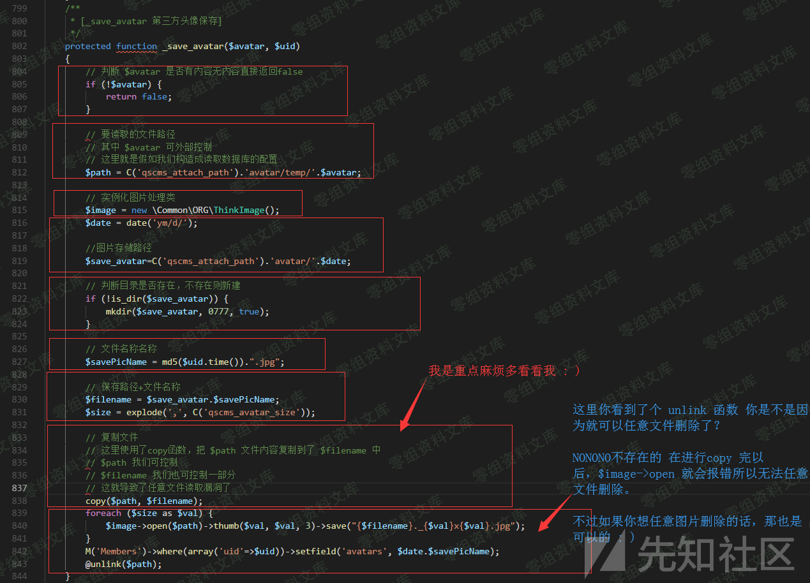

如果不想看图片注释的话，我这里简单的说一下。812行使用\$avatar拼接形成\$path830行使用了\$save\_avatar+\$savePicName; 生成了\$filename838行，使用了copy函数，把\$path文件内容复制到了\$filename中。而 \$avatar 和 \$uid 都是我们刚好可以控制的变量并且生成的文件名称是\$uid+time() 然后md5 一下 拼接 .jpg这个情况就很舒服了。写个小工具跑一下就好了，小工具会在结尾的时候放出来的。好了，让我们继续看下去 : )我们现在既然已经知道了\_save\_avatar
函数是有可能造成此漏洞的那么这时，我们就需要去找调用它的地方了。经过一顿的搜索我们得出了两个地方是调用了他地方一：register() 方法 会员注册方法地方二：oauth\_reg() 方法 第三方登录注册方法论此漏洞的利用当然是register() 方法利用起来比较简单 因为 方法二
需要搭建第三方登录，我本地的话。。。还是算了，这里掩饰我使用 方法一打开文件：74cms\\upload\\Application\\Home\\Controller\\MembersController.class.php函数：register()

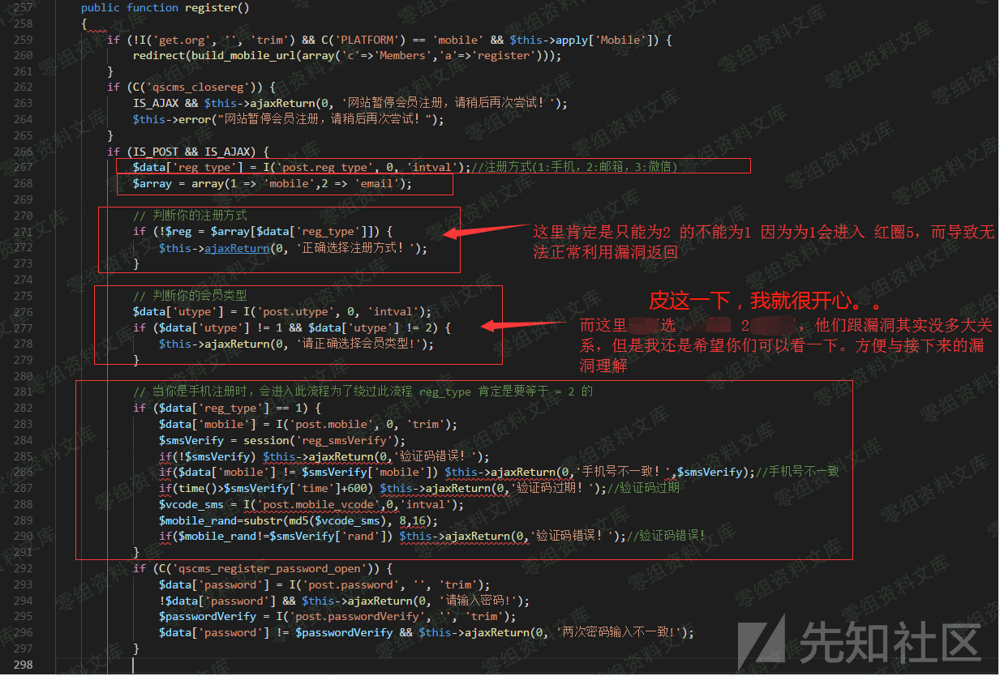

上面的马赛克是因为我写错了几个字，又不想重新写，所以我就把他擦掉了。皮这一下，我就很开心

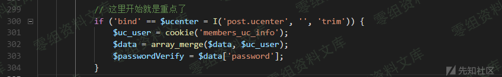

这里我们讲解一下如果
post的变量ucenter为bind时，则通过cookie获取数组\$uc\_user接着会进行数组合并而members\_uc\_info的cookie值是可控的，所以\$data也是可控的。

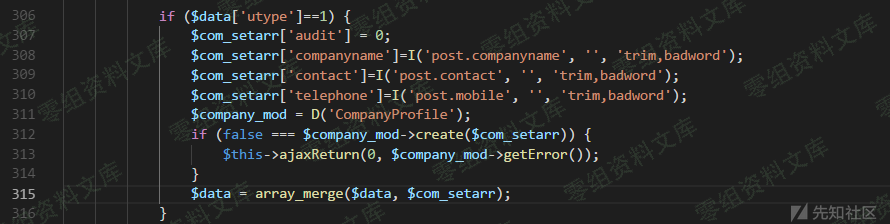

这里写着 当 \$data\[utype\] = 1
会进行用户注册，而\$data\[utype\]是我们可以控制的所以我们为2绕过此判断这里我又跳过了前面一些无关紧要的内容，来到了最后的漏洞触发点。因为真的无关紧要,所以就跳过了

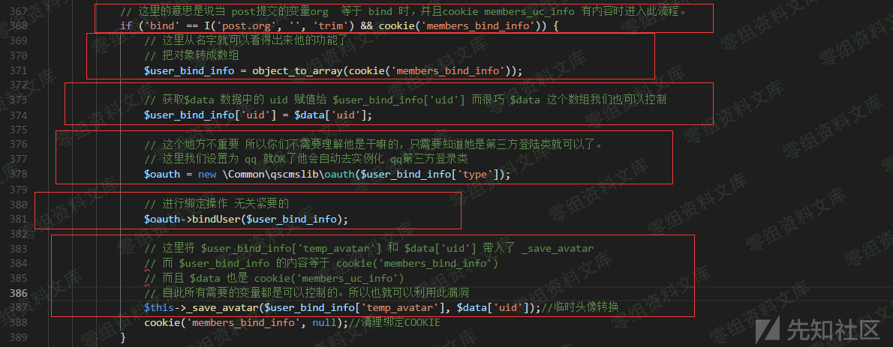

0x04 漏洞利用小工具
-------------------

https://github.com/ianxtianxt/74cms-upload

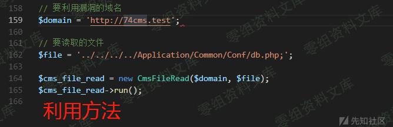

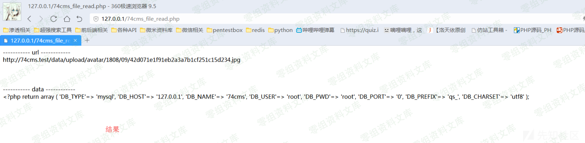

四、参考链接
------------

> https://www.yuque.com/pmiaowu/bfgkkh/dr895b
