## 核对与使用边界

本文已按保存的全文审阅记录进行文字校订；本轮仅静态核对，未运行 PoC、请求目标或逐图验证。

适用条件与版本记录（来源主张，未列为明确更正的部分仍待权威资料核对）：4.2.126; prior arbitrary file read exposes PWDHASH; forge token for Api/members_edit

- **适用与权限边界（1）**：Conditional chain depends on obtaining installation-specific PWDHASH; not standalone unauthenticated password-reset proof。按此限制解释本文结论，版本相同不足以证明所需角色、入口、配置、依赖或可控参数均已满足；原操作和失败记录一并保留。

- **证据待核（2）**：Actual token construction and mutation requests only in screenshots。保留原引用、截图位置和实验叙述；本项所缺材料未被补造，截图存在或作者宣称成功都不等于已核验其内容。

- **操作与副作用边界（3）**：Calls lifecycle function a destructor without source text; verify original code。保留原步骤及请求方法。执行条件包括隔离且获授权的可恢复环境、预先记录相关文件/账号/配置/业务记录状态；响应完成不能等同无副作用，恢复时须核对该操作涉及的实际对象。

- **结论使用边界（4）**：Run-on installation text and vague section heading impede understanding。此项限制直接适用于下文对应结论；现有正文不足以作更宽泛推论，所列方法和原始证据均保留。

历史原文标识：下文原技术材料按来源保留；仅本节明确确认的更正替代相应旧说法，标为待核的观察仍不是事实确认。

# 74cms v4.2.126-因任意文件读取漏洞导致的任意用户密码修改漏洞

0x00 前言
---------

厂商：74cms下载地址：http://www.74cms.com/download/index.html关于版本：新版的74cms采用了tp3.2.3重构了，所以可知底层是tp，74cms新版升级是后台升级的，所以先将将升级方法。注：此漏洞不用升级至最新版本也可使用。0x01 74cms升级到最新版1， 先去官网下载 骑士人才系统基础版(安装包)2， 将下载好的包进行安装3， 进入后台点击查看如果不是最新版的话，请点击升级！4， 如果是本地环境的话，会提示 域名不合法升级失败，这个问题很好解决5，
搜索文件74cms\\upload\\Application\\Admin\\Controller\\ApplyController.class.php6， 查找所有\$\_SERVER\[\'HTTP\_HOST\'\] 改为 http://baidu.com 即可

0x02
----

突突突突突突突文件：74cms\\upload\\Application\\Home\\Controller\\ApiController.class.php方法：members\_edit(

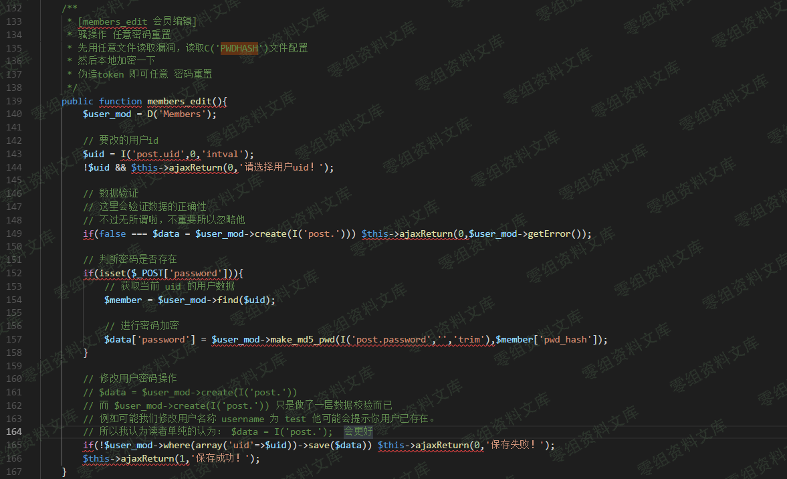

从这里看漏洞整体都很简单。没有过多的套路的，有的只是中规中矩。那么就让我们直接利用试试。

先看看数据库现在的数据

接着让我们来调接口看看

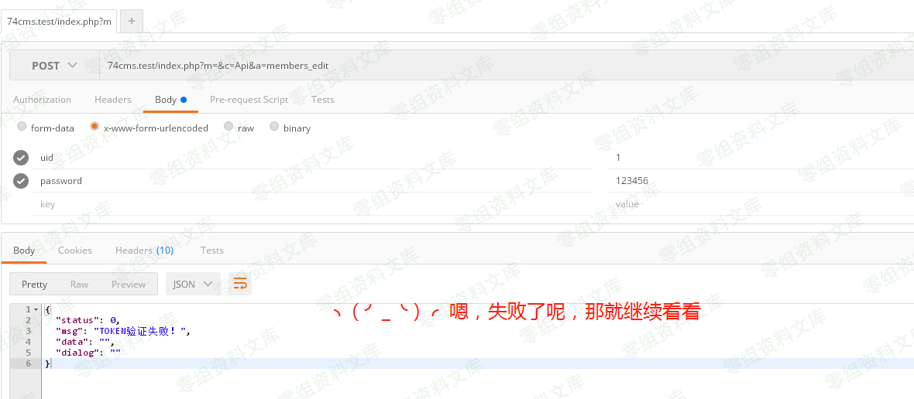

文件：
74cms\\upload\\Application\\Home\\Controller\\ApiController.class.php方法：check\_token(

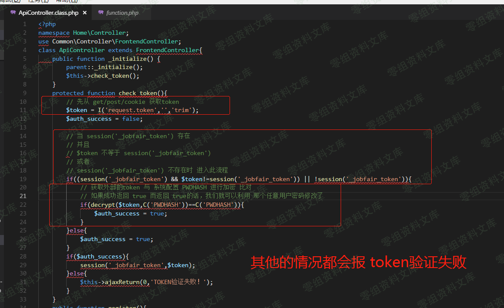

接口调用失败的原因是因为，上图的析构函数调用了方法 check\_token 进行了token验证

这些都没有问题，\$token 也是我们可以操控的。

现在的问题就是C(\'PWDHASH\') 我们现在无法得到。

好在，我们还可以通过组合漏洞的形式来获取。

想要利用此漏洞，我的想法是先通过，任意读取漏洞，先把C(\'PWDHASH\')
的值读取出来，然后在加密验证一下即可

而加密的代码其实我们不需要去看，因为这是全局通用的代码，所以我们正式环境中复制出来加密一下就可以利用了。

思路：先下载此源码然后本地把此加密函数保存下来即可。（因为没人会没事去改加密函数）然后在通过 "任意文件读取漏洞" 读取目标站点的C(\'PWDHASH\')
的值，接着本地加密成token这样漏洞就可以使用了

任意文件读取的小脚本下载

https://github.com/ianxtianxt/74cms\_file\_read

下载此文件以后

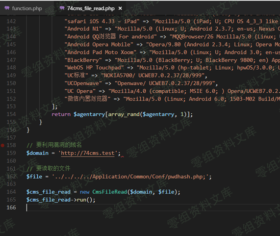

设置成这样，然后执行一下

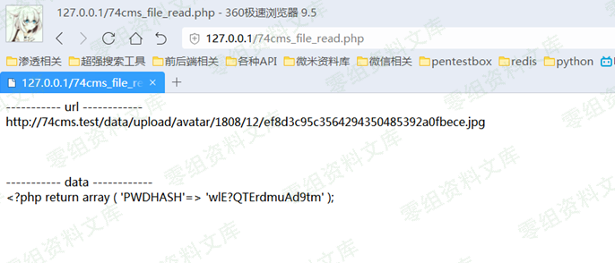

接着把 PWDHASH 复制出来

我们这里看看加密的代码：文件：74cms\\upload\\Application\\Common\\Common\\function.php函数：encrypt(

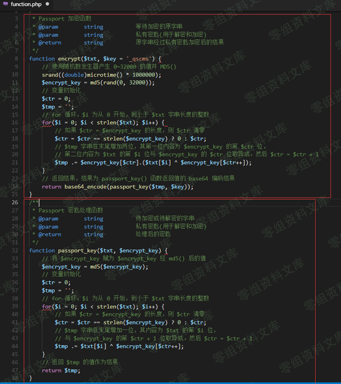

然后加密一下

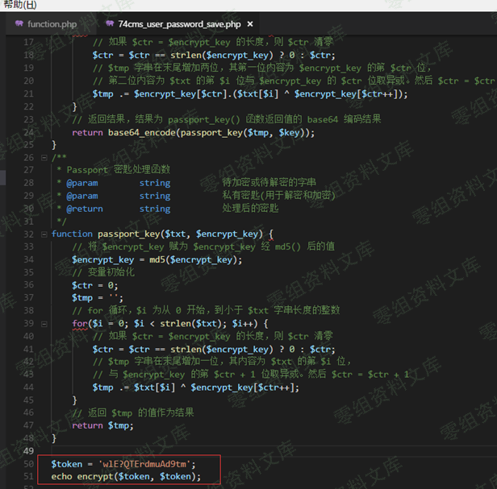

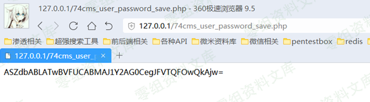

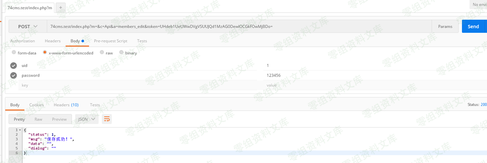

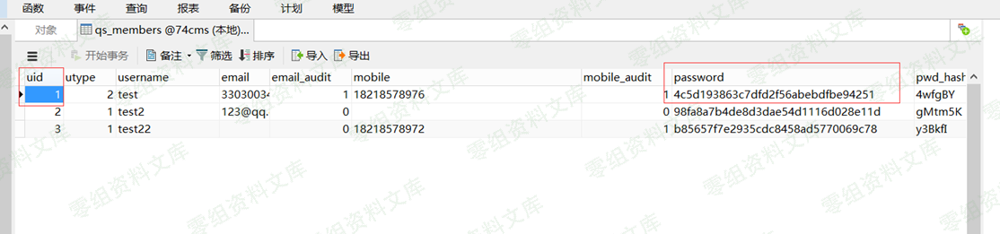

这时你就会发现虽然我们密码改了但是不知道用户名怎么办？

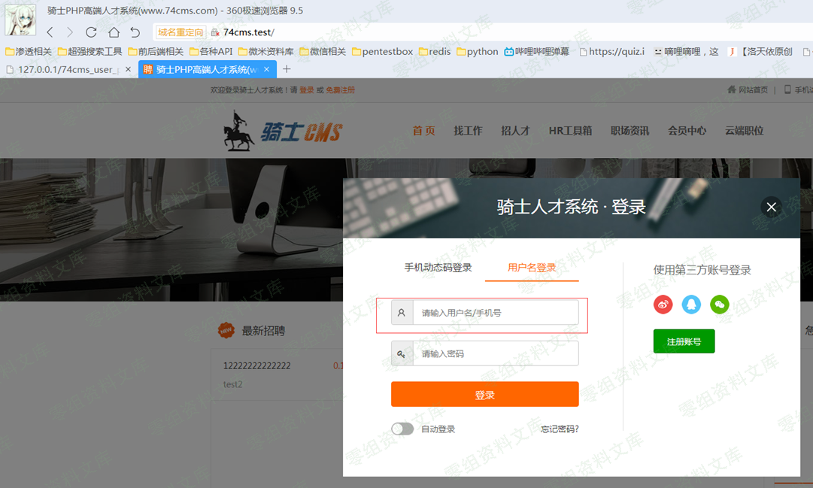

好在我们可以这样利用！人家登录是可以用户名，手机号登录的，所以我们就

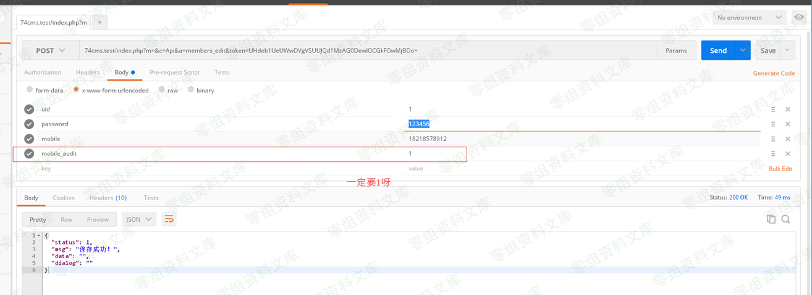

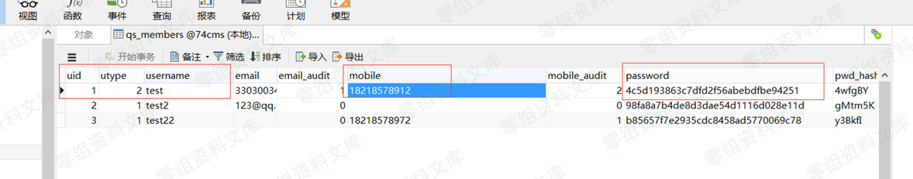

当然如果你要修改用户名登录的话，也可以，看你自己喜欢了

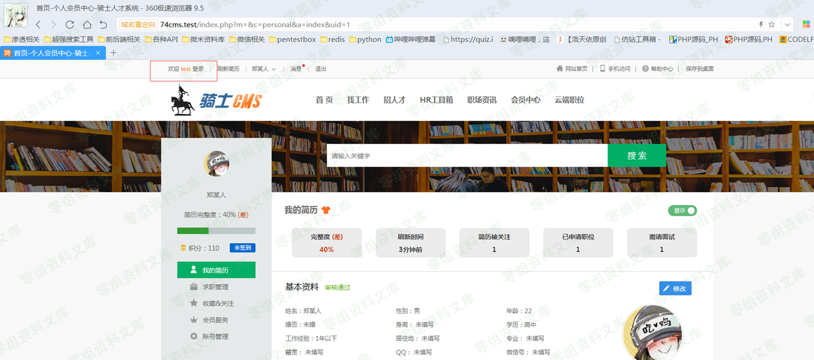

0x03 利用小工具
---------------

为了方便大家，手工做这种事情是很累的，所以还是要写个小工具，可以方便的去利用。利用工具:

https://github.com/ianxtianxt/74cms\_file\_read

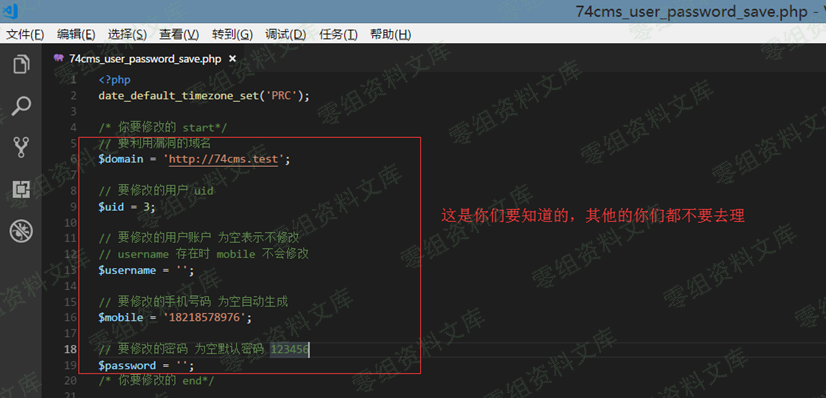

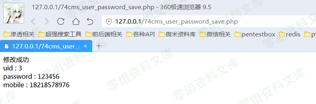

四、参考链接
------------

> https://www.yuque.com/pmiaowu/bfgkkh/rymscc
