## 核对与使用边界

本文已按保存的全文审阅记录进行文字校订；本轮仅静态核对，未运行 PoC、请求目标或逐图验证。

适用条件与版本记录（来源主张，未列为明确更正的部分仍待权威资料核对）：Version omitted; pagination variant v2 suspected; author modifies source to v1 to reach sink

- **证据待核（1）**：Shows only deserialization entry reachability after modifying source, not exploitability of stock installation。保留原引用、截图位置和实验叙述；本项所缺材料未被补造，截图存在或作者宣称成功都不等于已核验其内容。

- **适用与权限边界（2）**：Premium requirement explicitly speculative and must remain so。按此限制解释本文结论，版本相同不足以证明所需角色、入口、配置、依赖或可控参数均已满足；原操作和失败记录一并保留。

- **证据待核（3）**：Auth, gadget chain, impact and payload/request text missing; images carry critical evidence。保留原引用、截图位置和实验叙述；本项所缺材料未被补造，截图存在或作者宣称成功都不等于已核验其内容。

- **结论使用边界（4）**：Empty code fence and absent original URL。此项限制直接适用于下文对应结论；现有正文不足以作更宽泛推论，所列方法和原始证据均保留。

历史原文标识：下文原技术材料按来源保留；仅本节明确确认的更正替代相应旧说法，标为待核的观察仍不是事实确认。

#  DMC Airin Blog Plugin 反序列化 CVE-2024-52413分析   
原创 韭菜  fraud安全   2024-12-12 00:30  
  
# 漏洞文件定位  
  
根据漏洞通告提示问题点在反序列化  
  
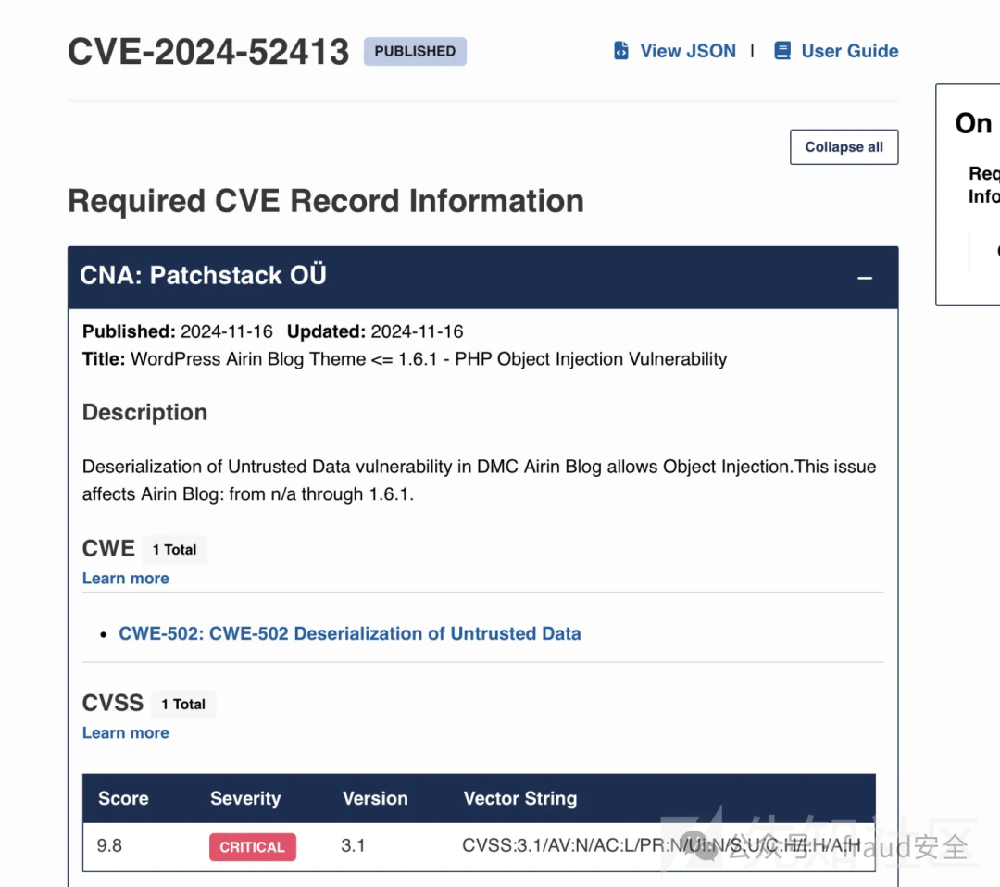  
  
全局查找反序列化关键字  
  
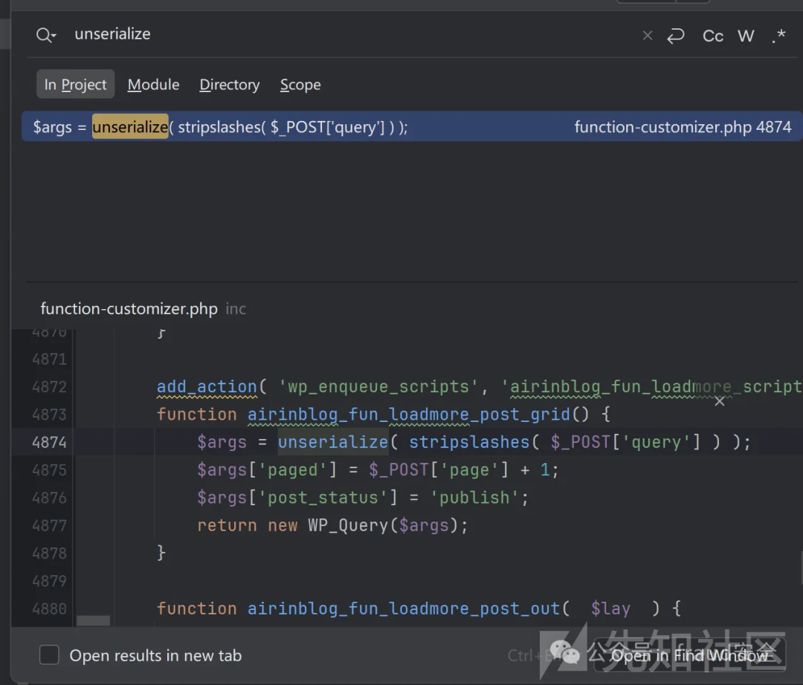  
# 漏洞分析  
  
构造反序列化payload通过POST  
请求query  
参数直接获取  
  
反向追踪，发现airinblog_fun_loadmore_post_cat  
和airinblog_fun_loadmore_cat_home  
方法都可以进入airinblog_fun_loadmore_post_grid  
  
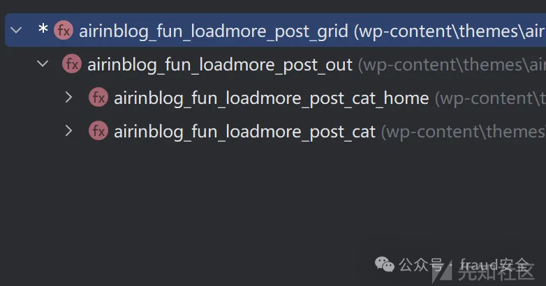  
  
那么思路就比较简单了，post请求携带query参数，即可触发反序列化。  
  
但是在调试的过程中get_theme_mod( 'airinblog_cus_pagination_variant', 'v1' )  
值为v1  
  
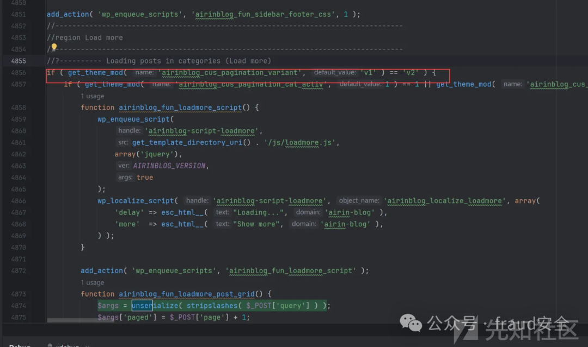  
  
推测可能是需要购买Premium  
版才能出发漏洞  
  
ps：个人也不是很熟悉这个模块，如果推测错误，请各位大佬吾喷，谢谢  
  
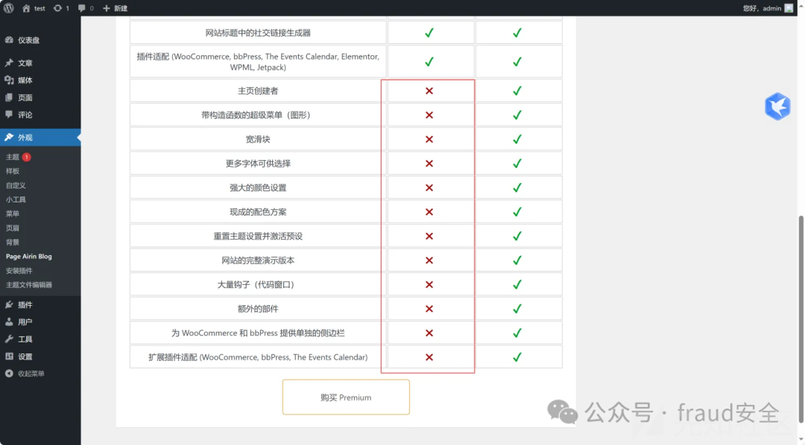  
  
那么修改代码将v2  
修改为v1  
测试反序列漏洞  
  
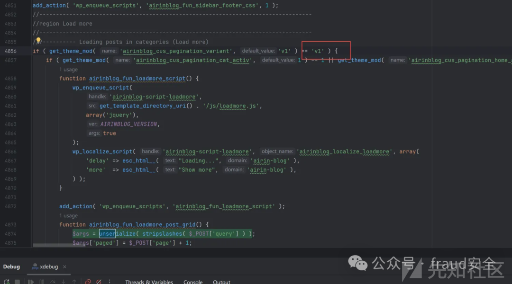  
  
要想触发airinblog_fun_loadmore_post_cat  
或airinblog_fun_loadmore_cat_home  
方法需要使用使用ajax请求  
  
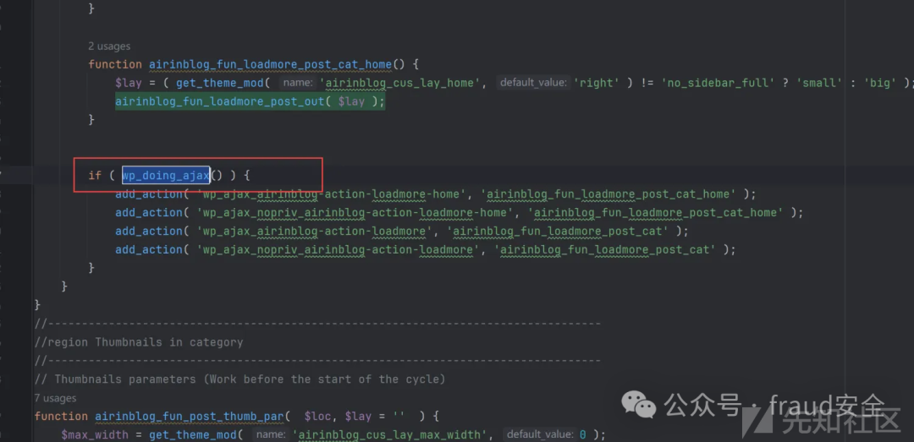  
  
在if里进行标记，查看是否进入if结构体里  
  
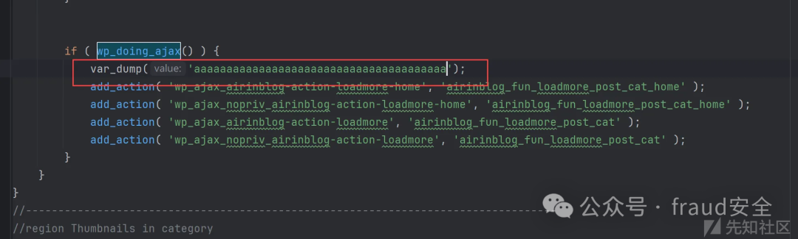  
  
成功进入if结构体  
  
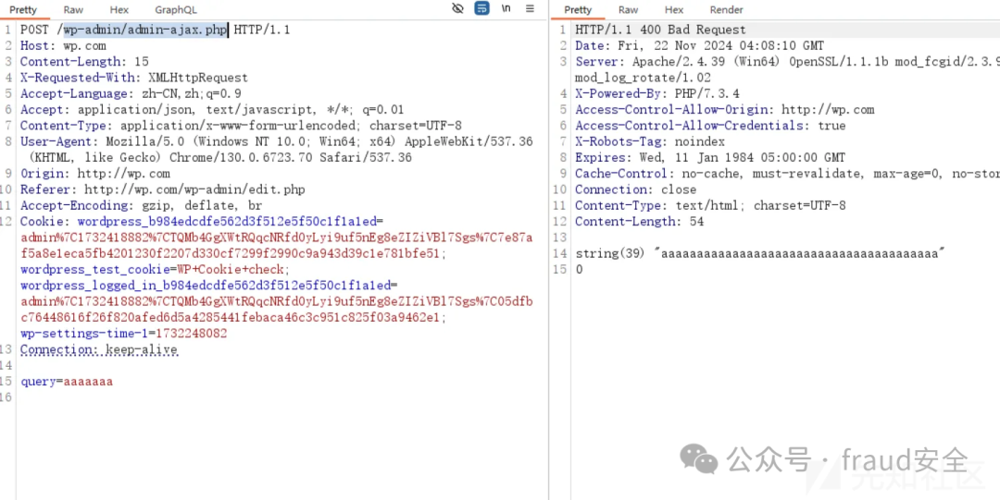  
  
进入airinblog_fun_loadmore_post_cat_home函数  
  
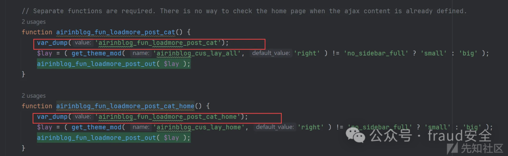  

> 资料补充（非原文复原）：Wordfence 将 CVE-2024-52413 记录为 Airin Blog <=1.6.2 的非认证 PHP Object Injection，1.6.3 修复；其记录称该主题自身没有已知 POP chain，影响扩展取决于站点另装组件。此处原截图/代码缺失，不能据此补造调用代码。 参考：[公开资料 1](https://www.wordfence.com/threat-intel/vulnerabilities/wordpress-themes/airin-blog/airin-blog-161-unauthenticated-php-object-injection)。

  
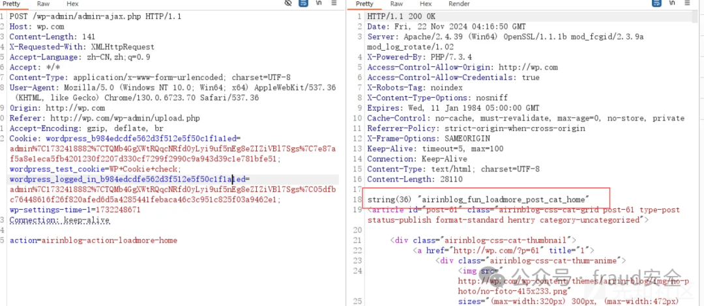  
  
确认是否进入airinblog_fun_loadmore_post_grid  
  
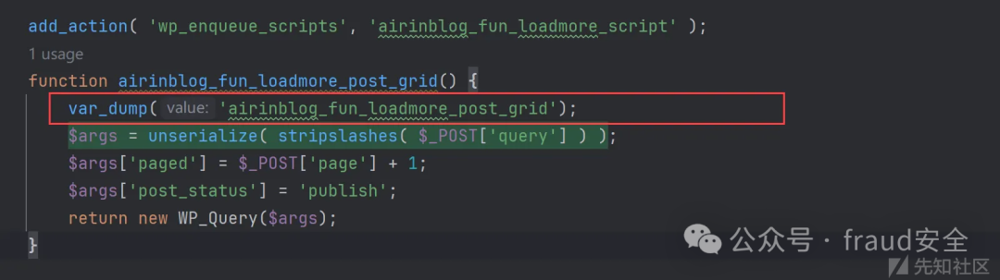  
  
成功进入反序列化入口。  
  
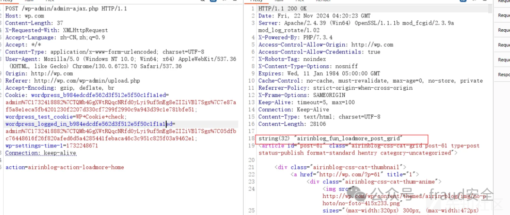  
  
  

---

> 来源：gelusus/wxvl（微信公众号漏洞文章自动归档，原文见文首链接）
