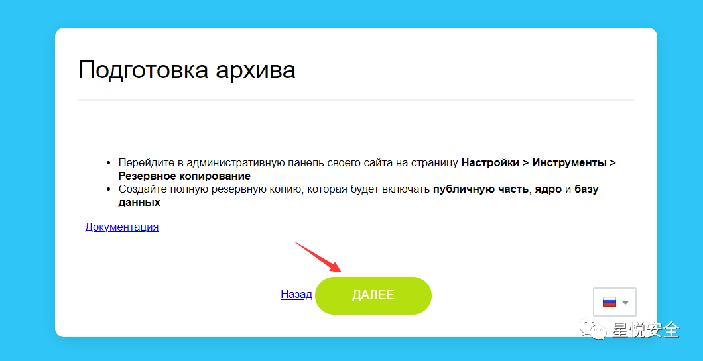
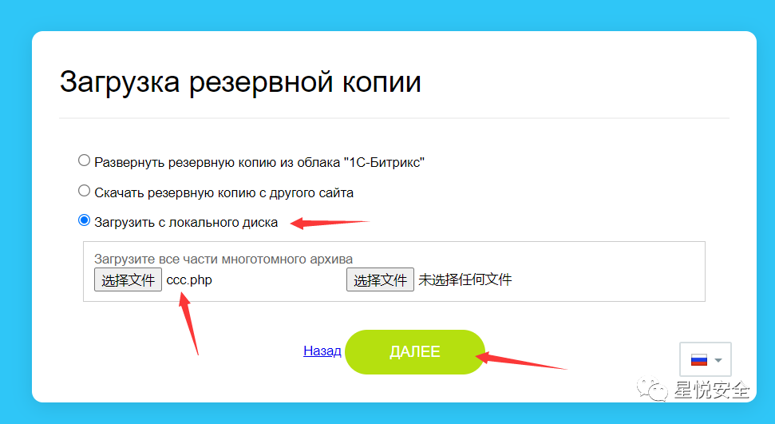
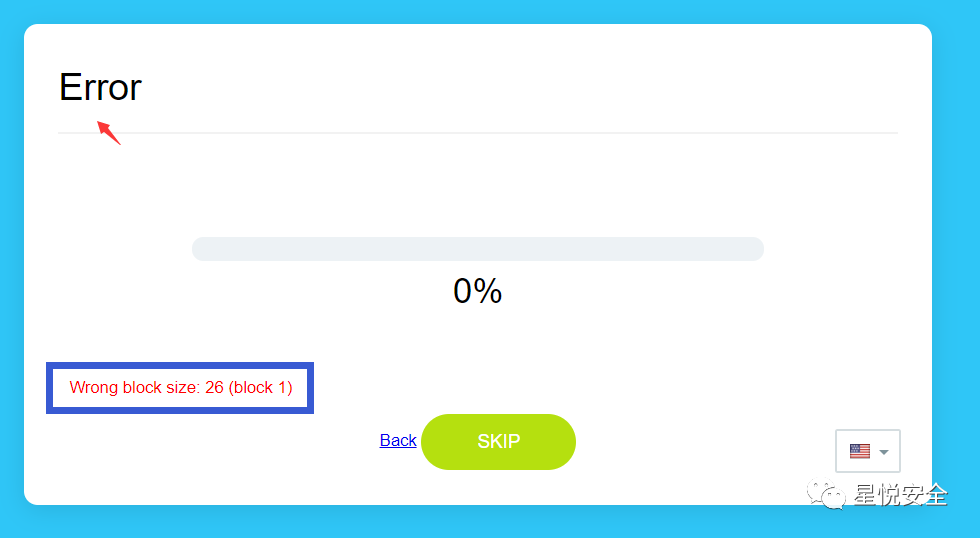
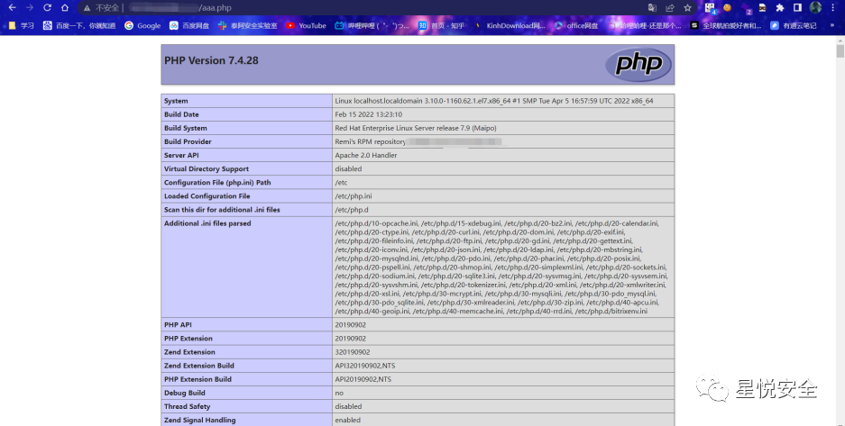

## 核对与使用边界

- 测绘字段处置：原 fofa 字段为残缺表达式、错误平台语法或当前解析器不支持的形式，原值完整保留到 fofa_unverified，不把它当作已校验查询或受影响资产证据。正文检索方法保留；具体问题见下列原审阅项。

本文已按保存的全文审阅记录进行文字校订；本轮仅静态核对，未运行 PoC、请求目标或逐图验证。

适用条件与版本记录（来源主张，未列为明确更正的部分仍待权威资料核对）：&lt;=7.5.0 asserted; exposed installation/restore upload interface; webroot PHP execution

- **代码与转录边界（1）**：Frontmatter fofa body= is truncated while body has complete query。相应原代码作为存在此问题的历史样本保留，不能直接当作可运行、成功复现的 PoC；缺失内容需回原稿核对，不据此补造可执行攻击链。

- **事实待核（2）**：Unclear whether7.5.0 refers to appliance or CMS product version。该项尚不能从转载本身确定外部事实；下文相应编号、版本或修复说法只作为来源记录，不能据此判定部署受影响或已修复。明确更正另列于本节。

- **结论使用边界（3）**：No explanation of restore-interface accessibility/auth; cannot generalize to all installed sites。此项限制直接适用于下文对应结论；现有正文不足以作更宽泛推论，所列方法和原始证据均保留。

- **结论使用边界（4）**：Displayed move_uploaded_file sink is coherent; UI error alone not success proof。此项限制直接适用于下文对应结论；现有正文不足以作更宽泛推论，所列方法和原始证据均保留。

历史原文标识：下文原技术材料按来源保留；仅本节明确确认的更正替代相应旧说法，标为待核的观察仍不是事实确认。

# Bitrix 小于等于 v7.5.0 安装文件上传漏洞

> 指纹字段校订（2026-10-04）：本文原归档明确标为 FOFA 的完整表达式已记入 `fofa`；原残缺 `fofa_unverified` 值逐字保存在 `previous_fofa_unverified`。后文关于该字段残缺的旧说明只描述校订前状态。查询用于产品检索，不证明资产受影响。

<meta name="referrer" content="no-referrer"/>

> 本文由 [简悦 SimpRead](http://ksria.com/simpread/) 转码， 原文地址 [mp.weixin.qq.com](https://mp.weixin.qq.com/s/YELZB900vbbnrkeDgBToDg)

**0x00 前言**
-----------

**fofa : body="Bitrix Virtual Appliance"** **影响: 3k**


**Bitrix 是俄罗斯的一套 cms 系统，在 <=7.5.0 版本时存在安装时任意文件上传漏洞.**

**0x01 复现**
-----------

**首先点开左下角的链接 => Восстановить копию**


  
点继续.  



  
选择第三个选项并上传 Webshell 文件  



  
当出现红色字体时说明存在漏洞，shell 已经成功上传在根目录.  



  


**实际上就是 move_uploaded_file** **直接能传****.**

```
  elseif ($source == 'upload')
  {
    if (!count($_FILES['archive']['tmp_name']))
    {
      $ar = array(
        'TITLE' => getMsg('ERR_EXTRACT'),
        'TEXT' => getMsg('ERR_UPLOAD'),
        'BOTTOM' => '<a href="/restore.php?Step=1&lang='.LANG.'">'.getMsg('BUT_TEXT_BACK').'</a>'
      );
      html($ar);
      die();
    }
    foreach ($_FILES['archive']['tmp_name'] as $k => $v)
    {
      if (!$v)
      {
        continue;
      }
      $arc_name = $_FILES['archive']['name'][$k];
      if (!@move_uploaded_file($v, $_SERVER['DOCUMENT_ROOT'].'/'.$arc_name))
      {
        $ar = array(
          'TITLE' => getMsg('ERR_EXTRACT'),
          'TEXT' => getMsg('ERR_UPLOAD'),
          'BOTTOM' => '<a href="/restore.php?Step=1&lang='.LANG.'">'.getMsg('BUT_TEXT_BACK').'</a>'
        );
        html($ar);
        die();
      }
    }
    $text =
    '<input type=hidden name=Step value=2>'.
    '<input type=hidden >';
    showMsg(getMsg('LOADER_SUBTITLE1'), $text);
    ?><script>reloadPage(2, 1);</script><?
    die();
  }

``` 

**免责声明：****文章中涉及的程序 (方法) 可能带有攻击性，仅供安全研究与教学之用，读者将其信息做其他用途，由读者承担全部法律及连带责任，文章作者和本公众号不承担任何法律及连带责任，望周知！！！**
======================================================================================================

---

> 来源：MrWQ/vulnerability-paper（https://github.com/MrWQ/vulnerability-paper）
