## 核对与使用边界

本文已按保存的全文审阅记录进行文字校订；本轮仅静态核对，未运行 PoC、请求目标或逐图验证。

适用条件与版本记录（来源主张，未列为明确更正的部分仍待权威资料核对）：Admin setting_save; writable dance/rewrite.php; registered member music-page inclusion; PHP7.0.9 tested

- **事实待核（1）**：Good explicit version/auth uncertainty and separate secondary SSRF entity。该项尚不能从转载本身确定外部事实；下文相应编号、版本或修复说法只作为来源记录，不能据此判定部署受影响或已修复。明确更正另列于本节。

- **事实待核（2）**：Critical raw request intentionally disclosed as lost in PDF conversion; dynamic bypass only screenshots。该项尚不能从转载本身确定外部事实；下文相应编号、版本或修复说法只作为来源记录，不能据此判定部署受影响或已修复。明确更正另列于本节。

- **证据待核（3）**：Original source URL lost; PDF mirror provided, CNVD identifiers unknown。保留原引用、截图位置和实验叙述；本项所缺材料未被补造，截图存在或作者宣称成功都不等于已核验其内容。

- **结论使用边界（4）**：Mitigation relying on filtering PHP fragments should be replaced with safe serialization/avoiding executable generated input。此项限制直接适用于下文对应结论；现有正文不足以作更宽泛推论，所列方法和原始证据均保留。

历史原文标识：下文原技术材料按来源保留；仅本节明确确认的更正替代相应旧说法，标为待核的观察仍不是事实确认。

# （CSCMS 4.2）文件覆盖导致 GETSHELL

一、漏洞简介
------------

CSCMS 4.2 的代码审计发现两个漏洞：后台采集功能的 SSRF 与文件覆盖导致的 GETSHELL，以下漏洞均被 CNVD 收录。本文聚焦文件覆盖 GETSHELL 链。

攻击者通过后台 `upload/plugins/sys/admin/Plugins.php` 的 `setting_save` 方法将可控的 `$note` 值传入 `_route_file`，`_route_file` 调用 `upload/cscms/app/helpers/common_helper.php` 的 `write_file` 敏感函数写文件。`$note[$key]['name']` 和 `$note[$key]['url']` 以字符串方式拼接到文件内容中（该内容是注释），使用 `%0a` 换行即可绕过注释，将构造的代码写入 `upload/cscms/config/dance/rewrite.php`。该文件在个人中心的音乐页面被引用，注册一个会员用户访问即可触发。写入时 `eval`、`shell_exec` 等会被转义，原作者利用 PHP 的动态特性绕过转义完成 RCE。

原文环境：PHP 7.0.9。

二、漏洞影响
------------

-   产品：CSCMS
-   版本：4.2（原文仅验证该版本，其他版本影响情况未确认）
-   组件：`plugins/sys/admin/Plugins.php`（`_route_file` / `setting_save`）、`app/helpers/common_helper.php`（`write_file`）
-   前提条件：需后台管理员权限触发写入；触发执行需注册会员用户访问个人中心音乐页面
-   漏洞编号 / CVSS / 补丁状态：未确认（原文称漏洞均被 CNVD 收录，但未给出编号）

三、复现过程
------------

### 漏洞分析

通过敏感函数回溯参数过程的方式找到该漏洞。在 `upload/cscms/app/helpers/common_helper.php` 的 `write_file` 使用了文件写入的敏感函数：

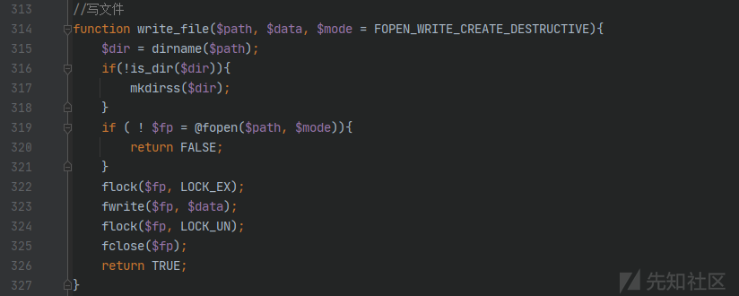

使用 Ctrl+Shift+F 查找哪些位置调用了 `write_file`，在 `upload/plugins/sys/admin/Plugins.php` 的 `Plugins->_route_file` 调用了 `write_file` 函数，并且 `$note[$key]['name']` 和 `$note[$key]['url']` 的值是以字符串方式拼接到文件内容的，该内容是注释，可以使用换行绕过：

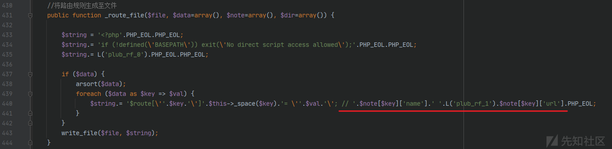

查找哪些位置调用了 `_route_file`，跟踪 `$note` 的值是否可控，调用该函数的位置有很多，最终找到一处可利用。在 `upload/plugins/sys/admin/Plugins.php` 的 `Plugins->setting_save` 调用了 `_route_file`，分析到这里可以开始复现了：

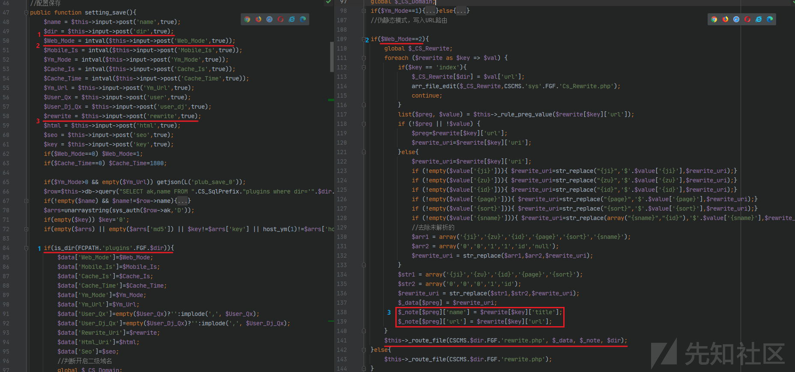

### PoC

使用 burpsuite 抓取请求包（原文该处截图在 PDF 转换中丢失，仅保留文字描述）。

修改请求包内容写入构造好的代码，可以看到使用了 `%0a` 换行去绕过注释：

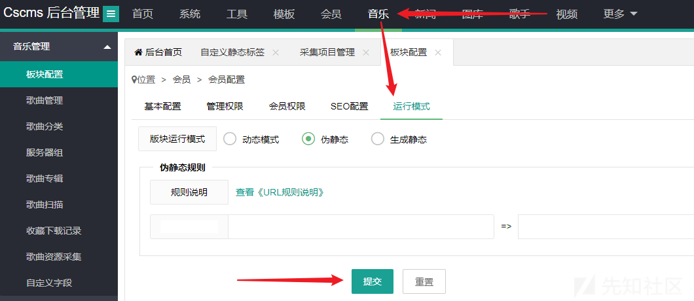

在 `upload/cscms/config/dance/rewrite.php` 可以看到成功写入：

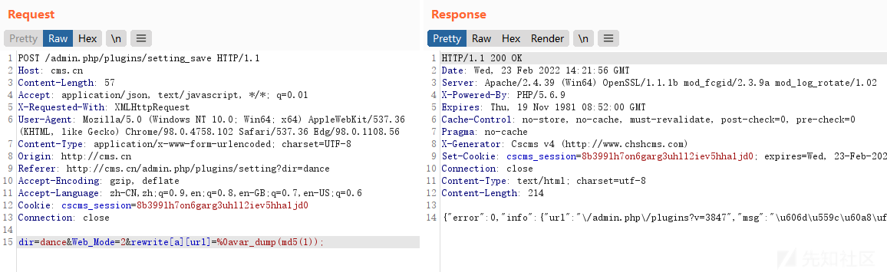

寻找引用 `rewrite.php` 的位置，通过点击各个页面，最终在个人中心的音乐页面找到，所以需要注册一个会员用户：

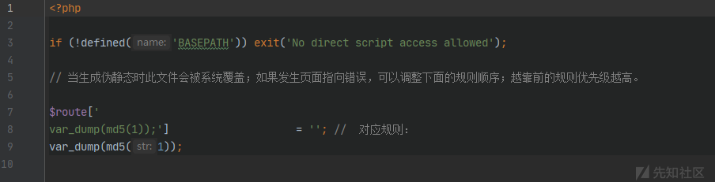

重放 burpsuite 抓到的请求包，成功输出内容：

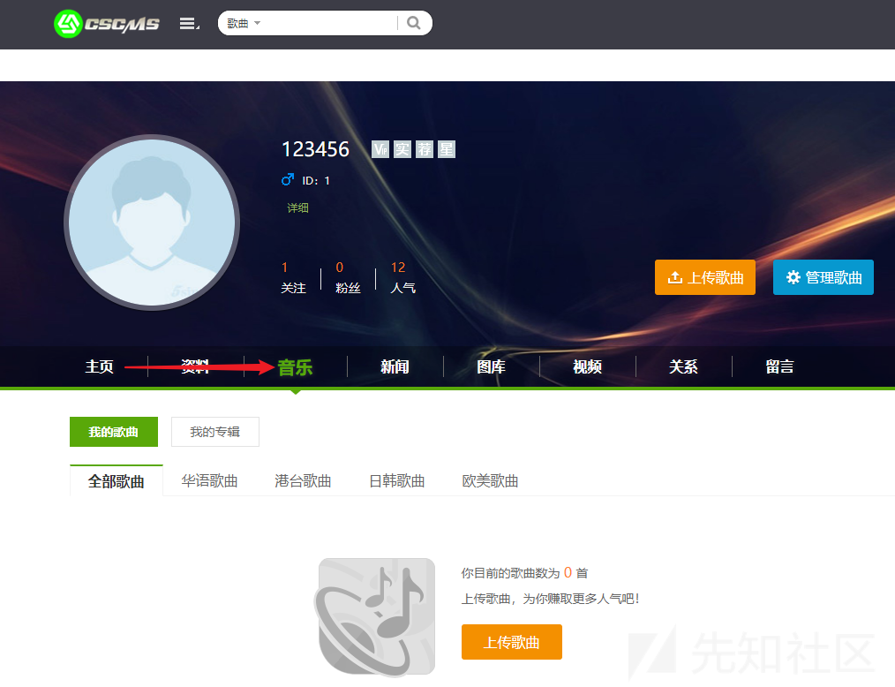

到这里其实事情还没有结束，当尝试写入恶意内容发现被转义了：

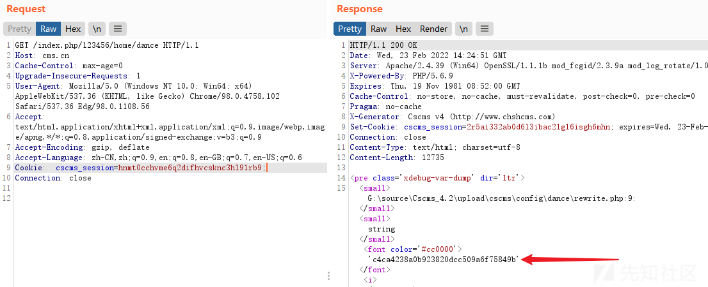

试了 `eval`、`shell_exec` 等均被转义，但是 `assert` 没有被转义，考虑到 `assert` 在 PHP7 版本之后的问题，原作者没有继续跟转义代码，而是根据 PHP 的动态特性使用以下方法成功 RCE：

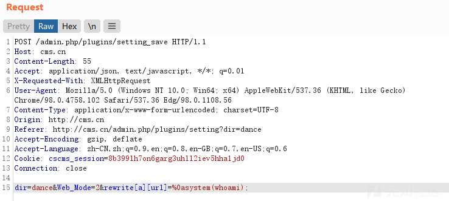

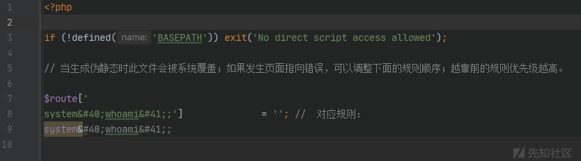

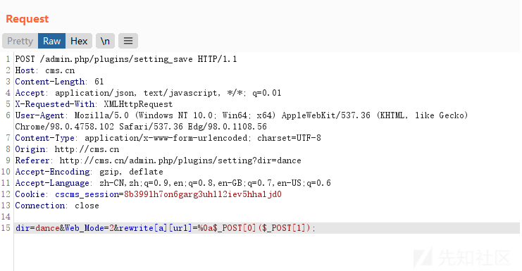

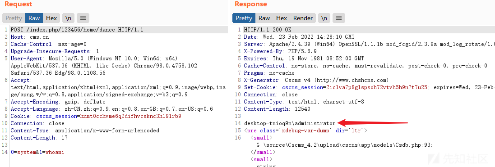

备注：同一篇文章还报告了后台工具栏采集功能（`Collect.php#Collect->add`，POST 参数 `cjurl` 未做安全处理传入 `$this->caiji->str` → `htmlall` 的 curl 请求）的 SSRF 漏洞，同样被 CNVD 收录，本文从略。

四、修复建议
------------

1.  对拼入配置文件注释的 `$note['name']`、`$note['url']` 等外部输入做严格过滤，拦截换行符（`%0a` / `\n`）与 PHP 代码片段；
2.  `write_file` 写入前对内容做转义或完整性校验，避免注释逃逸；
3.  限制 `rewrite.php` 等配置文件的写入权限与访问范围；
4.  关注厂商是否发布官方补丁（截至成稿未确认补丁状态），及时升级。

### 附录

参考链接：

-   先知社区原文：《某 scms 代码审计》（先知社区 PHP 板块，2022 年 2 月发布；原文链接未保留，以 PDF 镜像为准）
-   PDF 镜像：https://github.com/odjsm/Penetration_Testing_POC/raw/refs/heads/master/books/cscms%E4%BB%A3%E7%A0%81%E5%AE%A1%E8%AE%A1-SSRF%E5%92%8C%E6%96%87%E4%BB%B6%E8%A6%86%E7%9B%96%20GETSHELL.pdf
