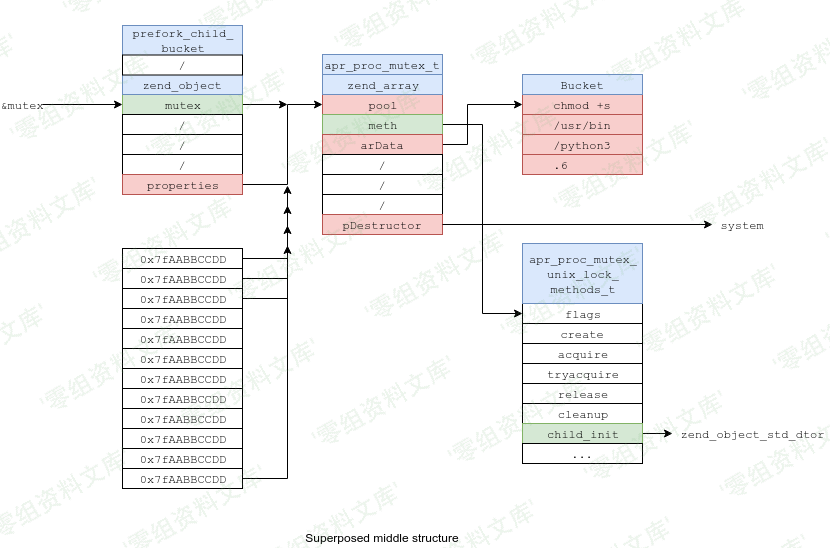
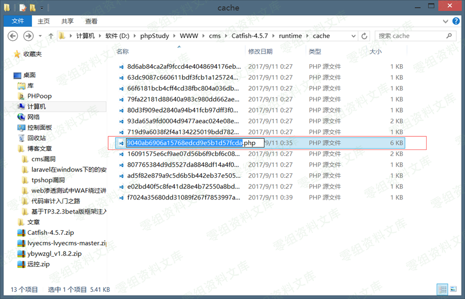

## 核对与使用边界

本文已按保存的全文审阅记录进行文字校订；本轮仅静态核对，未运行 PoC、请求目标或逐图验证。

适用条件与版本记录（来源主张，未列为明确更正的部分仍待权威资料核对）：4.5.7 title vs4.5 body; registered commenter; admin renders comment; executable reachable cache directory

- **适用与权限边界（1）**：Chain requires stored XSS/admin session and is not standalone CSRF。按此限制解释本文结论，版本相同不足以证明所需角色、入口、配置、依赖或可控参数均已满足；原操作和失败记录一并保留。

- **证据待核（2）**：Essential script only in images。保留原引用、截图位置和实验叙述；本项所缺材料未被补造，截图存在或作者宣称成功都不等于已核验其内容。

- **结论使用边界（3）**：Computed cache hash9040... differs from hardcoded8d6... probe without explanation。此项限制直接适用于下文对应结论；现有正文不足以作更宽泛推论，所列方法和原始证据均保留。

- **结论使用边界（4）**：Runtime directory access condition is useful but403/200 heuristic alone cannot establish exploitability。此项限制直接适用于下文对应结论；现有正文不足以作更宽泛推论，所列方法和原始证据均保留。

- **证据待核（5）**：No precise source。保留原引用、截图位置和实验叙述；本项所缺材料未被补造，截图存在或作者宣称成功都不等于已核验其内容。

历史原文标识：下文原技术材料按来源保留；仅本节明确确认的更正替代相应旧说法，标为待核的观察仍不是事实确认。

# CatfishCMS 4.5.7 csrf getshell

一、漏洞简介
------------

二、漏洞影响
------------

CatfishCMS 4.5

三、复现过程
------------

思路：

前台评论出插入xss代码-\>诱骗后台管理员访问网站-内容管理-评论管理-自动执行xss代码-\>通过csrf插入一条新文章-\>通过csrf清除缓存-\>在通过js访问前端任意页面生成缓存建立shell大概的想法就是这样做了。

后台创建文章方法

地址：application\\admin\\controller\\Index.php

方法：write();

这个方法没有什么可以讲的只是后面的组合漏洞要使用到他

后台清除缓存方法

地址：application\\admin\\controller\\Index.php

方法：clearcache()

这个方法没有什么可以讲的只是后面的组合漏洞要使用到他

例子：

1， 准备好脚本

2，利用前面的xss漏洞，配合这个脚本形成xsrf漏洞

这样我们在前端的事情就完事了。接着我们模拟后台管理员进入后台的操作

模拟的后端管理员操作：

### 漏洞原理与流程：

1,后台创建文章方法地址：application\\admin\\controller\\Index.php方法：write();这个方法没有什么可以讲只是单纯的从前端获取数据然后写入数据库罢了

2,后台清除缓存方法地址：application\\admin\\controller\\Index.php方法：clearcache()这个方法没有什么可以讲的。只是单纯的删除缓存数据

3,访问前端重新生成缓存地址： application\\index\\controller\\Index.php方法：index()

缓存的名字由来缓存的名字组成就是比较简单的了。

这上面几幅图就是缓存的名字了什么意思呢？很简单

首先是从index目录里面的index模块下面的index方法调用了一个方法\$template= \$this-\>receive(\'index\'); = index

然后是ndex目录里面的Common模块里面的receive 方法获取了变量\$source 值 = index获取了变量\$page 值 = 1

Cache::set(\'hunhe\_\'.\$source.\$page,\$hunhe,3600); 缓存方法最后就是

MD5(hunhe\_index1) = 9040ab6906a15768edcd9e5b1d57fcda

### 后记：

使用此方法的话，尝试一下在url中输入

    http://www.xxxxxxx.com/runtime
    http://www.xxxxxxx.com/runtime/cache
    http://www.xxxxxxx.com/runtime/cache/8d6ab84ca2af9fccd4e4048694176ebf.php
    按顺序输入如果前两个访问得到的结果是403  最后的结果不是403或是404 而是返回正常的页面，那么说明站点的缓存目录是可以访问的，这个时候可以使用此漏洞。配合xss+csrf 获取getshell
