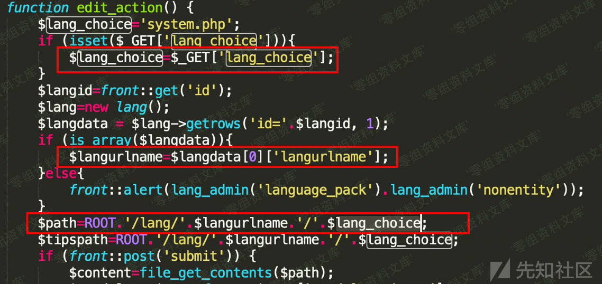
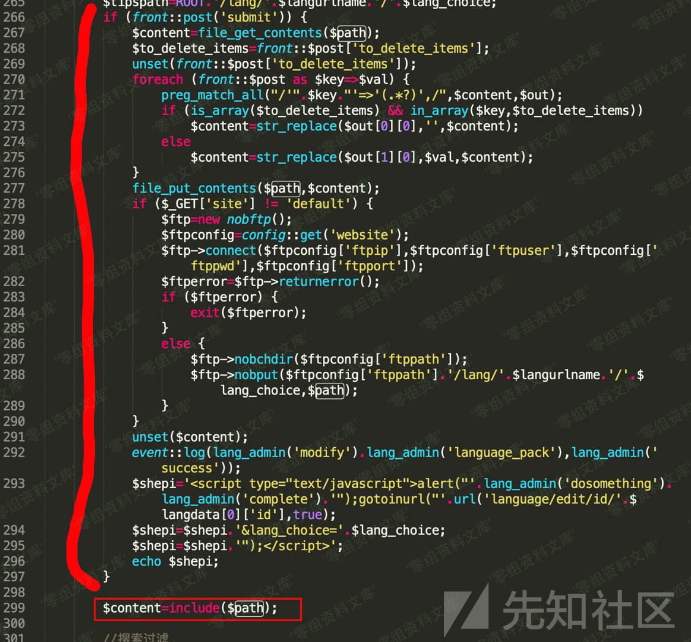
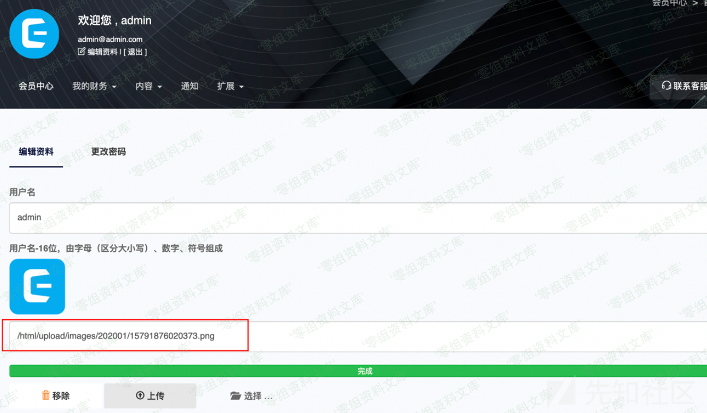
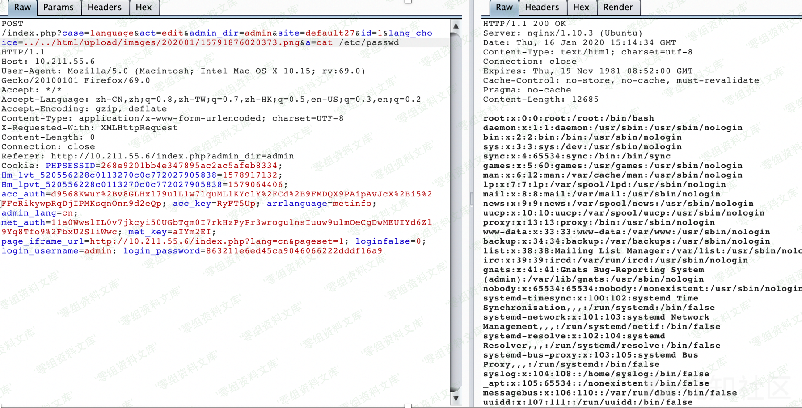

## 核对与使用边界

本文已按保存的全文审阅记录进行文字校订；本轮仅静态核对，未运行 PoC、请求目标或逐图验证。

适用条件与版本记录（来源主张，未列为明确更正的部分仍待权威资料核对）：7.3.8 build20191230; backend language edit; lang_choice traversal; omit submit; pre-uploaded PHP-bearing image

- **证据待核（1）**：Text adequately explains include flow but lacks HTTP path/payload and source excerpts。保留原引用、截图位置和实验叙述；本项所缺材料未被补造，截图存在或作者宣称成功都不等于已核验其内容。

- **适用与权限边界（2）**：Any-user upload availability does not remove admin requirement on inclusion endpoint。按此限制解释本文结论，版本相同不足以证明所需角色、入口、配置、依赖或可控参数均已满足；原操作和失败记录一并保留。

- **证据待核（3）**：Shares source and language module with SQLi but is separate sink/impact。保留原引用、截图位置和实验叙述；本项所缺材料未被补造，截图存在或作者宣称成功都不等于已核验其内容。

历史原文标识：下文原技术材料按来源保留；仅本节明确确认的更正替代相应旧说法，标为待核的观察仍不是事实确认。

# CmsEasy 7.3.8 本地文件包含漏洞

一、漏洞简介
------------

二、漏洞影响
------------

CmsEasy 7.3.8

三、复现过程
------------

CmsEasy
V7.3.8框架后端的语言编辑功能函数接口对include的文件路径没有做安全性校验，攻击者可以通过该接口包含上传的带有PHP代码内容的任意后缀（合法）文件，导致远程代码执行

漏洞代码位置是位于CmsEasy\_7.3.8\_UTF-8\_20191230/lib/admin/language\_admin.php文件中的edit\_action函数

\$lang\_choice是从用户的GET请求参数中直接获取的，\$langurlname是从数据库中获取的langurlname字段。后面将这两个参数直接拼接路劲赋值给\$path，这里的\$lang\_choice拼接在最后，可以任意赋值（为后面文件包含导致命令执行奠定基础）。

接着由于266行判断POST参数是否有submit，我们可以直接不传这个参数来绕开这一段的代码执行，到299行直接通过inlcude函数包含我们任意传递的值，导致文件包含

CmsEasy对于任何用户存在文件和图片上传功能，虽然我们不能直接上传php文件（默认禁止），但是可以上传内容为php代码的图片后缀文件，因此可以通过这一处文件包含达到最后高危的命令执行问题

参考链接
--------

> https://xz.aliyun.com/t/7273
