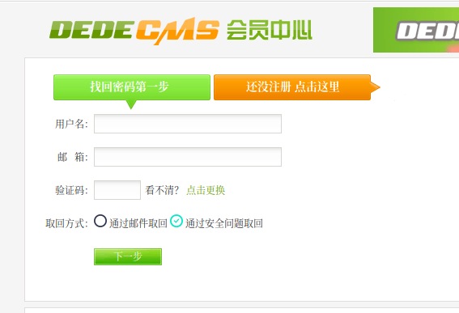
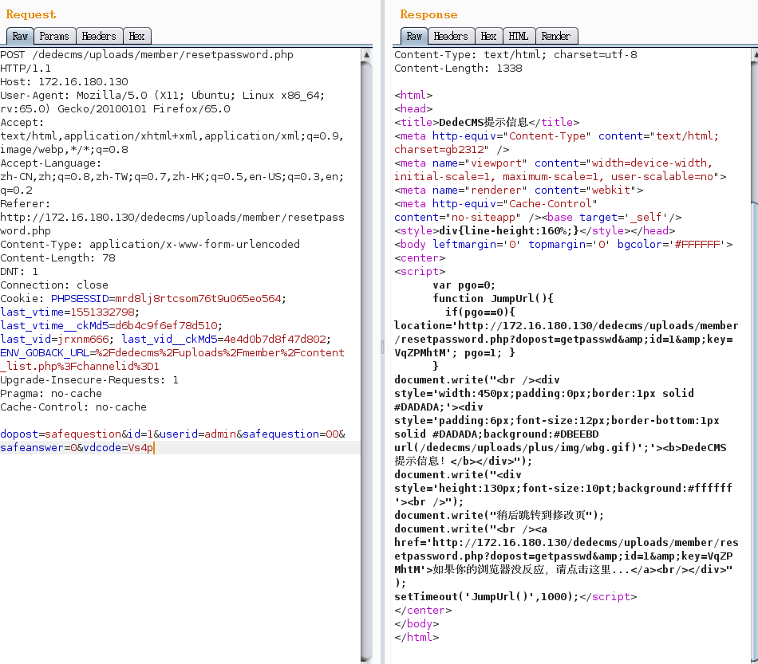
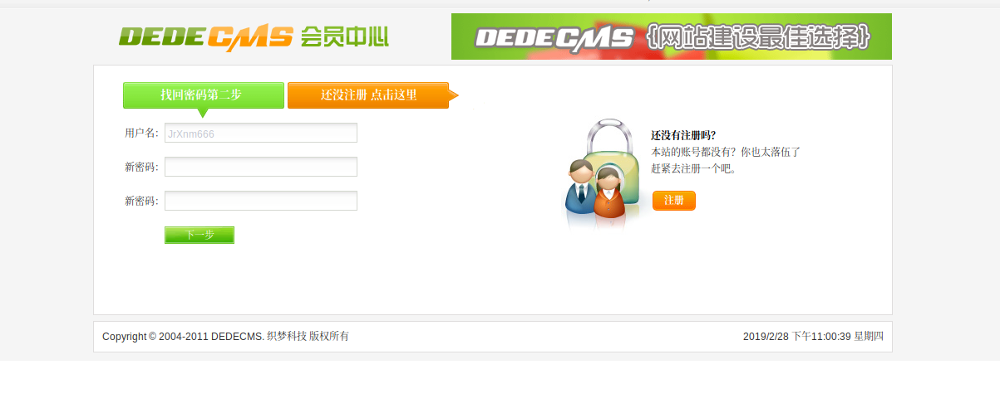

## 核对与使用边界

本文已按保存的全文审阅记录进行文字校订；本轮仅静态核对，未运行 PoC、请求目标或逐图验证。

适用条件与版本记录（来源主张，未列为明确更正的部分仍待权威资料核对）：5.7SP2; no security question; member account reset only

- **证据待核（1）**：Clean local-image duplicate of70。保留原引用、截图位置和实验叙述；本项所缺材料未被补造，截图存在或作者宣称成功都不等于已核验其内容。

- **证据待核（2）**：Missing exact request/weak-comparison input; no direct original advisory。保留原引用、截图位置和实验叙述；本项所缺材料未被补造，截图存在或作者宣称成功都不等于已核验其内容。

- **适用与权限边界（3）**：Good member-vs-admin distinction must survive merging。按此限制解释本文结论，版本相同不足以证明所需角色、入口、配置、依赖或可控参数均已满足；原操作和失败记录一并保留。

历史原文标识：下文原技术材料按来源保留；仅本节明确确认的更正替代相应旧说法，标为待核的观察仍不是事实确认。

# Dedecms 前台任意用户密码修改

## 影响版本

dedecmsV5.7 SP2

## 漏洞成因

在用户密码重置功能处，php 存在弱类型比较，导致如果用户没有设置密保问题的情况下可以绕过验证密保问题，直接修改密码(管理员账户默认不设置密保问题)。值得注意的是修改的密码是 member 表中的密码，即使修改了管理员密码也是 member 表中的管理员密码，仍是无法进入管理。

## 复现

在找回密码处，点击通过安全问题取回

填写信息并抓包，修改 id 和 userid 为想要重置密码的对象，再加上以上分析内容，发包即可得到修改密码 url进入该url，修改密码。

## 修复意见

改为强类型比较

---

> 来源：白阁文库 BaizeSec/bylibrary
