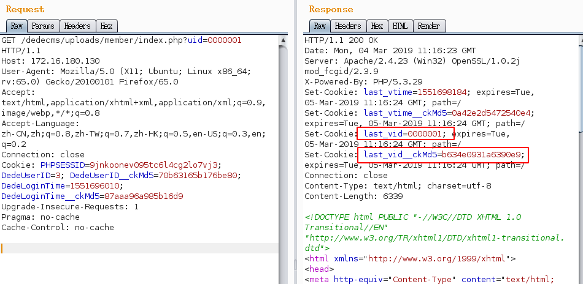
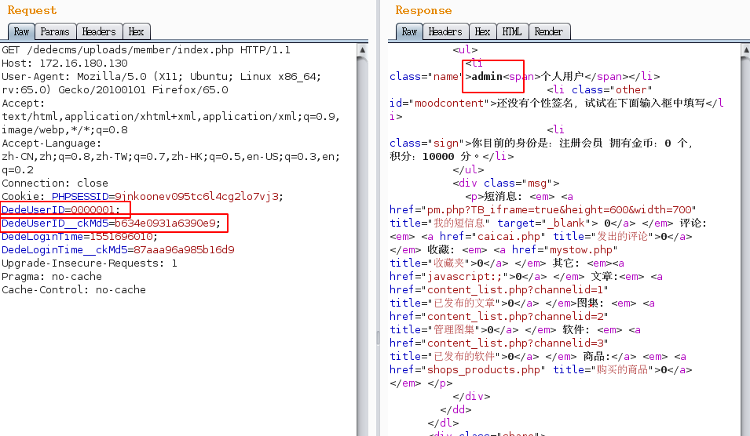

## 核对与使用边界

- 编号说明：保留原文明确使用的 SSV 条目编号作为文章主引用标识，SSV 与 CVE/CNVD 为不同编号体系；来源归属仍未独立核验。

本文已按保存的全文审阅记录进行文字校订；本轮仅静态核对，未运行 PoC、请求目标或逐图验证。

适用条件与版本记录（来源主张，未列为明确更正的部分仍待权威资料核对）：5.7SP2; member subsystem and numeric-looking username; empty last_vid; registration/approval not stated

- **证据待核（1）**：Clean duplicate of69 with local images; no new analysis。保留原引用、截图位置和实验叙述；本项所缺材料未被补造，截图存在或作者宣称成功都不等于已核验其内容。

- **适用与权限边界（2）**：Admin member login confused with backend rights unless explicitly bounded。按此限制解释本文结论，版本相同不足以证明所需角色、入口、配置、依赖或可控参数均已满足；原操作和失败记录一并保留。

- **凭据与会话边界（3）**：No raw cookie response or registration step。抓包中的会话不能视为未认证访问证明。需重新取得授权测试会话，不能复用文中值。

历史原文标识：下文原技术材料按来源保留；仅本节明确确认的更正替代相应旧说法，标为待核的观察仍不是事实确认。

# Dedecms任意用户登录SSV-97087

#### 影响版本

dedecmsV5.7 SP2

#### 漏洞成因

dedecms 的会员模块的身份认证使用的是客户端 session，在 Cookie 中写入用户 ID 并且附上 ID\_\_ckMd5，用做签名。主页存在逻辑漏洞，导致可以返回指定 uid 的 ID 的 Md5 散列值。原理上可以伪造任意用户登录。

#### 复现

现在我们的思路就是 先从 `member/index.php` 中获取伪造的 DedeUserID 和它对于的 md5 使用它登录 访问 member/index.php?uid=0000001 并抓包(注意 cookie 中 last\_vid 值应该为空)。可以看到已经获取到了，拿去当做DeDeUserID可以看到，登陆了 admin 用户。

#### 修复意见

M\_ID 被 intval 后还要判断是否与未 intval 之前相同。

---

> 来源：白阁文库 BaizeSec/bylibrary
