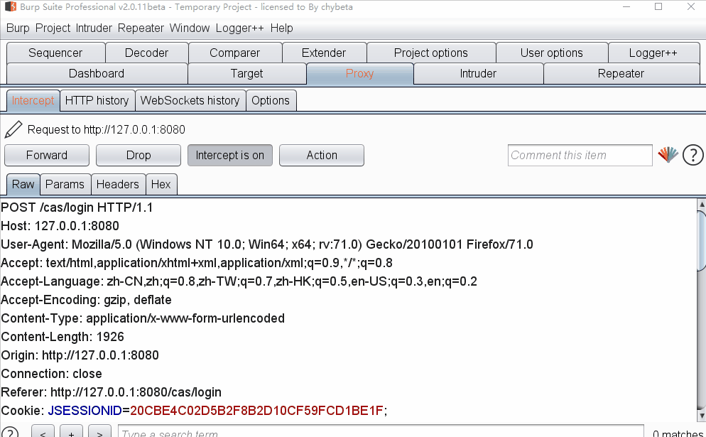

## 核对与使用边界

本文已按保存的全文审阅记录进行文字校订；本轮仅静态核对，未运行 PoC、请求目标或逐图验证。

适用条件与版本记录（来源主张，未列为明确更正的部分仍待权威资料核对）：5.7SP2 title; admin file manager and album ZIP import; PHP-served extracted files

- **证据待核（1）**：Regex lacks end anchor, double extension reasoning coherent。保留原引用、截图位置和实验叙述；本项所缺材料未被补造，截图存在或作者宣称成功都不等于已核验其内容。

- **结论使用边界（2）**：Step1 'content is' has no content; no upload/import HTTP or resultant path text。此项限制直接适用于下文对应结论；现有正文不足以作更宽泛推论，所列方法和原始证据均保留。

- **证据待核（3）**：Impact empty, all image links trailing duplicated text, primary advisory absent。保留原引用、截图位置和实验叙述；本项所缺材料未被补造，截图存在或作者宣称成功都不等于已核验其内容。

历史原文标识：下文原技术材料按来源保留；仅本节明确确认的更正替代相应旧说法，标为待核的观察仍不是事实确认。

（CVE-2019-8362）Dedecms v5.7 sp2 后台文件上传 getshell
=======================================================

一、漏洞简介
------------

上传zip文件解压缩对于文件名过滤不周，导致getshell

二、漏洞影响
------------

三、复现过程
------------

### 代码分析

/dede/album\_add.php 175行验证后缀

\$fm-\>GetMatchFiles(\$tmpzipdir,\"jpg\|png\|gif\",\$imgs);

进入函数：

    function GetMatchFiles($indir, $fileexp, &$filearr)
       {
           $dh = dir($indir);
           while($filename = $dh->read())
           {
               $truefile = $indir.'/'.$filename;
               if($filename == "." || $filename == "..")
               {
                   continue;
               }
               else if(is_dir($truefile))
               {
                   $this->GetMatchFiles($truefile, $fileexp, $filearr);
               }
               else if(preg_match("/\.(".$fileexp.")/i",$filename))
               {
                   $filearr[] = $truefile;
               }
           }
           $dh->close();
       }

可以确定preg\_match(\"/.(\".\$fileexp.\")/i\",\$filename)只是判断了文件名中是否存在.jpg、.png、.gif中的一个，只要构造1.jpg.php就可以绕过。

### 复现

#### 1、首先构造一个文件名为1.jpg.php的文件，内容为

#### 2、将该文件进行压缩

#### 3、在常用操作-文件式管理器处上传压缩文件到soft目录下

Dedecmsv5.7sp2后台文件上传getshell/media/rId29.png)

Dedecmsv5.7sp2后台文件上传getshell/media/rId30.png)

#### 4、访问dede/album\_add.php，选择从 从ZIP压缩包中解压图片

Dedecmsv5.7sp2后台文件上传getshell/media/rId32.png)

#### 5、发布预览

Dedecmsv5.7sp2后台文件上传getshell/media/rId34.png)

Dedecmsv5.7sp2后台文件上传getshell/media/rId35.png)

Dedecmsv5.7sp2后台文件上传getshell/media/rId36.png)

Dedecmsv5.7sp2后台文件上传getshell/media/rId37.gif)
